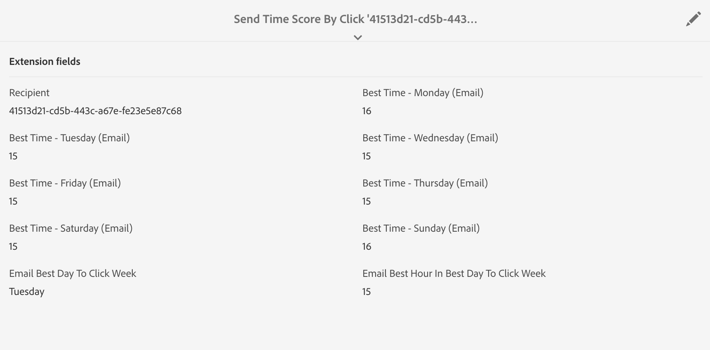

# 予測ユーザーエンゲージメント機能 {#journey-ai}

Adobe Campaign を使用すると、カスタマージャーニーの設計と配信を最適化して、各ユーザーのエンゲージメントの傾向を予測できます。 AI と機械学習を活用した、Adobe Campaign の送信時間最適化と予測エンゲージメントスコアリングでは、過去のエンゲージメント指標に基づいて、開封率、最適な送信時間および予想されるチャーンを分析して予測できます。

>[!IMPORTANT]
>
>この機能は、製品の一部として標準搭載はされていません。 実装するには、アドビのコンサルティングサービス部門に依頼する必要があります。 詳しくは、アドビ担当者にお問い合わせください。

Adobe Campaign は、**予測送信時間最適化**&#x200B;および&#x200B;**予測エンゲージメントスコアリング**&#x200B;の 2 つの新しい機械学習モデルを備えています。 これら 2 つのモデルは、より良いカスタマージャーニーの設計と提供に特化した機械学習モデルです。

* **予測送信時間の最適化**&#x200B;は、電子メールの開封数またはクリック数、プッシュメッセージの開封数に対して、各受信者プロファイルに最適な送信時間を予測します。 受信者プロファイルごとに、平日ごとの最適な送信時間と、最良の結果を得るうえで送信に最適な平日がスコアからわかります。

* **予測エンゲージメントスコアリング**：受信者がメッセージにエンゲージする確率と、次のメール送信から7日以内にオプトアウト（購読解除）する可能性を予測します。 これらの確率は、コンテンツとの予想されるエンゲージメントレベル（高、中、低）に応じて、さらにグループ分けされます また、これらのモデルは、顧客の登録解除リスクパーセンタイルランクも提供するので、特定の顧客のランクが他の顧客と比較してどの程度であるかを把握できます。

## 予測送信時間最適化{#predictive-send-time}

予測送信時間最適化では、メールの開封やクリックおよびプッシュメッセージの開封に最適な送信時間を受信者プロファイルごとに予測します。 受信者プロファイルごとに、平日ごとの最適な送信時間と、最良の結果を得るうえで送信に最適な平日がスコアからわかります。

予測送信時間最適化モデルには、次の 2 つのサブモデルがあります。

* **開封率**&#x200B;の予測送信時間は、開封率を最大化するために顧客にコミュニケーションを送信するのに最適な時間です

* **クリックの予測送信時間**&#x200B;は、クリック数を最大化するために顧客にコミュニケーションを送信するのに最適な時間です

**モデル入力**：配信ログ、トラッキングログおよびプロファイル属性（PII 以外）

**モデル出力**：メッセージの送信に最適な時間（開封数およびクリック数）

出力の詳細

* 1時間の間隔で週7日間にメールを送信するのに最適な時間帯を計算します（例：午前9:00、午前10:00、午前11:00）。
* 該当する週の最適な曜日と時間が示されます
* 最適な時間は、開封率とクリック率を最大化するために各 1 回ずつ、合計 2 回計算されます
* 16 個のフィールドが表示されます（曜日ごとは 14 個、週全体は 2 個）。

* 月曜日のクリック数を最適化するためにメールを送信する最適なタイミング（0 ～ 23の値）

* 月曜日の開封数を最適化するためにメールを送信するのに最適な時間（0 ～ 23の値）
* ...
* 日曜日のクリック数を最適化するためにメールを送信する最適なタイミング（0 ～ 23の値）
* 日曜日の開封数を最適化するためにメールを送信する最適なタイミング（0 ～ 23の値）
* ...
* 月曜日から日曜日まで、1週間の開封数を最適化するためにメールを送信するのに最適な日
* メールを送信する最適なタイミングは、1週間の開封数を最適化します（0 ～ 23の値）

>[!NOTE]
>
>有意な結果を得るには、モデルに 1 か月以上のデータが必要です。
>
>これらの予測機能は、メールチャネルとプッシュチャネルにのみ適用されます。

Adobe Campaign に機械学習機能を実装すると、開封数およびクリック数の最大スコアを表示する新しいタブにアクセスできるようになり、プロファイルデータを強化できます。 指標は計算され、テクニカルワークフローを使用してCampaignに取り込まれます。

これらの指標にアクセスするには、次の操作が必要です。

1. プロファイルを開き、「編集」ボタンをクリックします。

1. 「**クリック数ごとの送信時間スコア**」または「**開封数ごとの送信時間スコア**」タブをクリックします。

デフォルトでは、プロファイルスコアは、各曜日の最適な送信時間と、週全体における最適な送信時間を提示します。



### 最適なタイミングでメッセージを送信{#use-predictive-send-time}

プロファイルごとに最適な時間に電子メールを送信するには、オプション **[!UICONTROL Send at a custom date defined by a formula]**&#x200B;を使用して配信をスケジュールする必要があります。

送信日の計算方法について詳しくは、[この節](../../sending/using/computing-the-sending-date.md)を参照してください。

数式には、特定の日における最適な送信時間を入力する必要があります。


数式の例：

```
AddHours([currentDelivery/scheduling/@contactDate],
[cusSendTimeScoreByClickprofile_link/@EMAIL_BEST_TIME_TO_CLICK_WEDNESDAY])
```


>[!NOTE]
>
>データモデルは、実装によって異なる場合があります。

## 予測エンゲージメントスコアリング {#predictive-scoring}

予測エンゲージメントスコアリングでは、次回のメール送信後 7 日以内に受信者がメッセージにエンゲージする確率とオプトアウト（購読解除）する確率を予測します。

これらの確率は、コンテンツとの予想されるエンゲージメントレベル（高、中、低）に応じて、さらにグループ分けされます また、これらのモデルは、顧客の登録解除リスクパーセンタイルランクも提供するので、特定の顧客のランクが他の顧客と比較してどの程度であるかを把握できます。

予測エンゲージメントスコアリングにより、次のことが可能になります。

* **オーディエンスを選択**：クエリアクティビティを使用すると、特定のメッセージにエンゲージするオーディエンスを選択できます
* **オーディエンスを除外**：クエリアクティビティを使用すると、購読を解除する可能性が高いオーディエンスを削除できます
* **パーソナライズ**：エンゲージメントレベルに基づいてメッセージをパーソナライズします（エンゲージメントの高いユーザーは、エンゲージメントしていないユーザーとは異なるメッセージを受け取ります）

このモデルでは、複数のスコアを使用して、次の項目を提示します。

* **開封エンゲージメントスコア／クリックエンゲージメントスコア**：この値は、購読者が特定のメッセージにエンゲージ（開封またはクリック）する確率と一致します。 値の範囲は 0.0 ～ 1.0 です。
* **購読解除の確率**：この値は、1 件のメールが開封された場合に、受信者がメールチャネルから登録解除する確率を一致します。 値の範囲は 0.0 ～ 1.0 です。
* **リテンションレベル**：この値では、ユーザーが「低」、「中」、「高」の 3 つのレベルにランク付けされます。 「高」はサービスを利用し続ける可能性が最も高く、「低」は購読を解除する可能性が最も高くなります。
* **リテンションのパーセンタイルランク**：購読解除の確率に関するプロファイルランク。 値の範囲は 0.0 ～ 1.0 です。 例えば、顧客維持率が0.953の場合、全受信者の95.3%を上回ると、その受信者は企業との関係を維持する可能性が高くなり、登録解除する可能性は低くなります。

>[!NOTE]
>
>これらの予測機能は、メール配信にのみ適用されます。
>
>有意な結果を得るには、モデルに 1 か月以上のデータが必要です。

**モデル入力**：配信ログ、トラッキングログおよび特定のプロファイル属性

**モデル出力**：プロファイルのスコアとカテゴリを説明するプロファイル属性

これらの指標にアクセスするには、次の操作が必要です。

1. プロファイルを開き、「編集」ボタンをクリックします。

1. 「**メールチャネルのエンゲージメントスコア**」タブをクリックします。

ワークフローでクエリアクティビティを使用すると、スコアを使用してオーディエンスを最適化できます。 例として、**リテンションレベル**&#x200B;の基準を次に示します。

