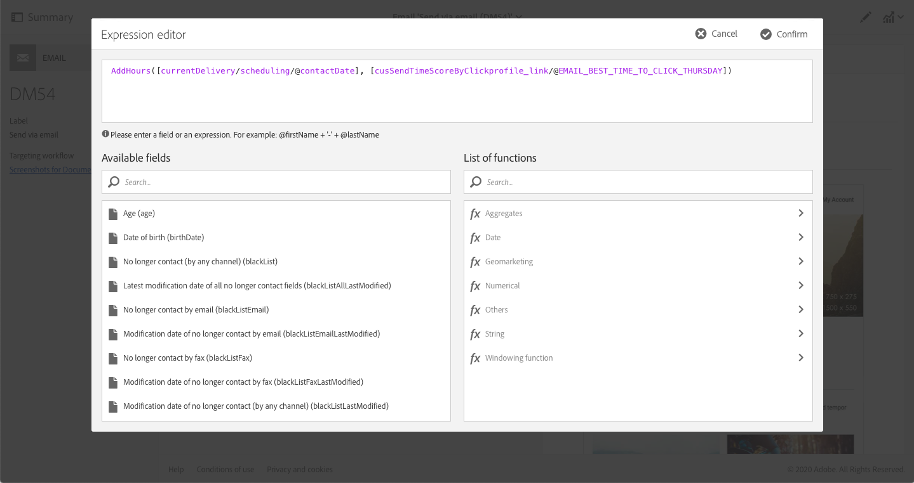
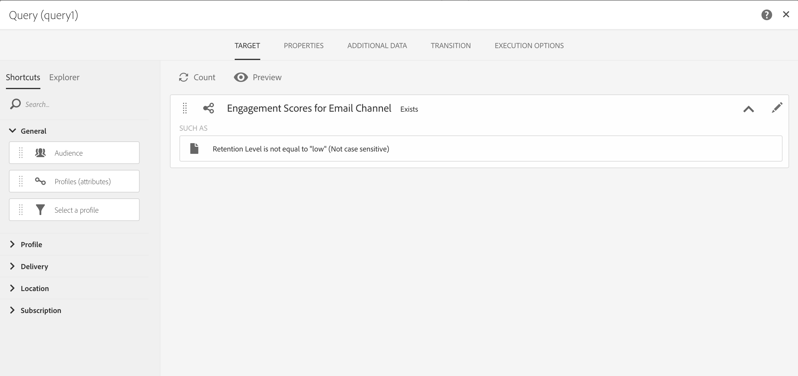

# AIを利用した電子メールによるデザインと配信の最適化{#journey-ai}

## AIを利用した電子メールの概要{#journey-ai-ovv}

キャンペーンを使用すると、顧客の遍歴の設計と配信を最適化して、各個人のエンゲージメントの好みを予測できます。 Adobe Campaignは、遍歴AIを基にして、過去の関与指標に基づいて、オープン率、最適な送信時間および確率変化を分析し、予測できます。

**機械学習モデル**

Adobe Campaign Standardオファーは、2つの新しい機械学習モデルを導入しました。 **予測送信時間の最適化** 、 **予測エンゲージメントスコアリング**。 この2つのモデルをまとめてJeurney AIと呼びます。これは、より良いカスタマージャーニーを設計および提供するための、機械学習モデルのクラスです。

* **予測送信時間の最適化**:電子メールの開放またはクリックに対して、各受信者プロファイルの送信時間として最適な予測送信時間を設定します。 各受信者プロファイルのスコアは、各曜日に最も良い送信時間を示し、最良の結果を得るにはどの曜日が最も良い送信時間かを示します。

* **予測エンゲージメントスコアリング**:予測エンゲージメントスコアリングは、受信者がメッセージに関与する確率と、次の電子メール送信後7日以内にオプトアウト（登録解除）する確率を予測します。 確度は、離脱の具体的なリスク、中程度または低度に従って、さらにバケツに分割される。 これらのモデルに従って、顧客が他の顧客との関連で特定の顧客のランクがどこにあるかを把握できるように、リスクのパーセンタイルランクも提供します。

>[!CAUTION]
>この機能は、製品の一部として初期状態では使用できません。 導入には、Adobeコンサルティングが関与している必要があります。 詳細については、Adobeの担当者にお問い合わせください。
>
>この機能を使用するには、お客様が提供する必要のあるAzureストレージを使用する必要があります。

## 予測送信時間の最適化{#predictive-send-time}

### クリック数とオープン数の最適化{#about-predictive-send-time}

電子メールの開放およびクリックに対して、各受信者プロファイルの送信時間として最適な予測送信時間を設定します。 各受信者プロファイルのスコアは、各曜日に最も良い送信時間を示し、最良の結果を得るにはどの曜日が最も良い送信時間かを示します。

予測送信時間最適化モデルには、2つのサブモデルがあります。
* オープンの予測送信時間は、顧客に通信を送信して開きを最大化するのに最適な時間です。
* クリックの予測送信時間は、クリック数を最大限に抑えるために、顧客に通信を送信する必要がある最適な時間です。

**モデル入力**:配信ログ、トラッキングログおよびプロファイル属性（PII以外）

**モデル出力**:メッセージの送信に最適な時間（開いたメッセージおよびクリックメッセージの場合）


出力の詳細

* 1日のうち、1時間間隔で7日間の電子メールの送信に最適な時間帯を計算します(例：9:00 am、10:00 am、11:00 am)
* モデルは、その週の中で最も良い日とその日の最も良い時間を示します。
* 最適な時間はそれぞれ2回計算されます。オープン率を最大化するために1回、クリック率を最大化するために1回
* 16個のフィールドが表示されます（曜日は14個、週全体は2個）。
   * 月曜日のクリック数を最適化するための電子メールの送信に最適な時間（0 ～ 23の値）
   * 月曜日の開封を最適化するための電子メールの送信に最適な時間（0 ～ 23の値）
   * 火曜日のクリック数を最適化するための電子メールの送信に最適な時間(0 ～ 23)
   * ...
   * 日曜日のクリック数を最適化するために電子メールを送信するのに最適な時間（0 ～ 23の値）
   * 日曜日の開封を最適化するために電子メールを送信するのに最適な時間（0 ～ 23の値）
   * ...
   * 週全体（月～日）の開封を最適化するための電子メールの送信に最適な日
   * 週全体の開封を最適化するための電子メールの送信に最適な時間（0 ～ 23の値）

>[!NOTE]
>
>これらの予測機能は、電子メール配信にのみ適用されます。
>
>モデルが有意な結果を得るには、1か月以上のデータが必要です。


### プロファイルスコアへのアクセス{#access-predictive-send-time-scores}

キャンペーンに実装された機械学習機能は、プロファイルデータを最高のオープンスコア/クリックスコアの新しいタブで強化します。 指標はJeurney AIによって計算され、テクニカルワークフローを使用してキャンペーンに取り込まれます。

これらの指標にアクセスするには、次の操作が必要です。

1. プロファイルを開き、「編集」ボタンをクリックします。

1. 「クリックごとの **時間スコアの** 送信 **」または「開く** 」タブで時間スコアの送信をクリックします。

デフォルトでは、プロファイルスコアは、各曜日の最良の時間帯と、その週で最も良い全体的な時間を提供します。


### 最適なタイミングでメッセージを送信する{#use-predictive-send-time}

プロファイルごとの最適な時間に電子メールが配信されるようにするには、このオプションを使用して配信をスケジュールする必要があり **[!UICONTROL Send at a custom date defined by a formula]**ます。
この節で送信日を計算する方法 [を説明します](../../sending/using/computing-the-sending-date.md)。

数式には、配信が出発する特定の日の最良の時間を入力する必要があります。


数式の例：

```
AddHours([currentDelivery/scheduling/@contactDate], 
[cusSendTimeScoreByClickprofile_link/@EMAIL_BEST_TIME_TO_CLICK_WEDNESDAY])
```



>[!NOTE]
>
>データモデルは、実装によって異なる場合があります。


## 予測エンゲージメントスコアリング {#predictive-scoring}

予測エンゲージメントスコアリングでは、次のことができます。

* **オーディエンスの選択**:クエリアクティビティを使用すると、特定のメッセージに関与するオーディエンスを選択できます
* **オーディエンスの除外**:クエリアクティビティを使用して、登録を解除するオーディエンスを削除できます
* **パーソナライズ**:アクションのレベルに基づいてメッセージをパーソナライズ（関与の高いユーザーは、関与していないユーザーとは異なるメッセージを受け取る）

このモデルでは、複数のスコアを使用して、次のことを示します。

* **エンゲージメントスコアを開く/エンゲージメントスコアをクリック**:この値は、サブスクライバが特定のメッセージ（開くかクリック）を受け取る確率と一致します。 値の範囲は0.0 ～ 1.0です。
* **購読解除の確率**:この値は、1つの電子メールが開かれている場合に、受信者が電子メールチャネルから登録解除する確率を一致します。 値の範囲は0.0 ～ 1.0です。
* **リテンションレベル**: この値では、ユーザーが3つのレベルにランク付けされます。低、中、高 「高」はブランドにとどまる可能性が最も高く、「低」は購読を取り消す可能性が最も高くなります。
* **保持のパーセンタイルランク**:購読解除の確率に関するプロファイルランク。 値の範囲は0.0 ～ 1.0です。たとえば、定着率のランクが0.953の場合、この受信者はブランドにとどまり、すべての受信者の95.3%を購読解除する可能性が低くなります。

>[!NOTE]
>
>これらの予測機能は、電子メール配信にのみ適用されます。
>
>モデルが有意な結果を得るには、1か月以上のデータが必要です。


**モデル入力**:配信ログ、トラッキングログおよび特定のプロファイル属性

**モデル出力**:プロファイルのスコアとカテゴリを説明するプロファイル属性。


### 電子メールチャネルに対するエンゲージメントスコアの使用

これらの指標にアクセスするには、次の操作が必要です。

1. プロファイルを開き、「編集」ボタンをクリックします。

1. 「電子メールチャネルの **エンゲージメントスコア** 」タブをクリックします。

ワークフローでクエリアクティビティを使用すると、スコアを使用してオーディエンスを最適化できます。

たとえば、 **保持レベルの基準の場合** :




