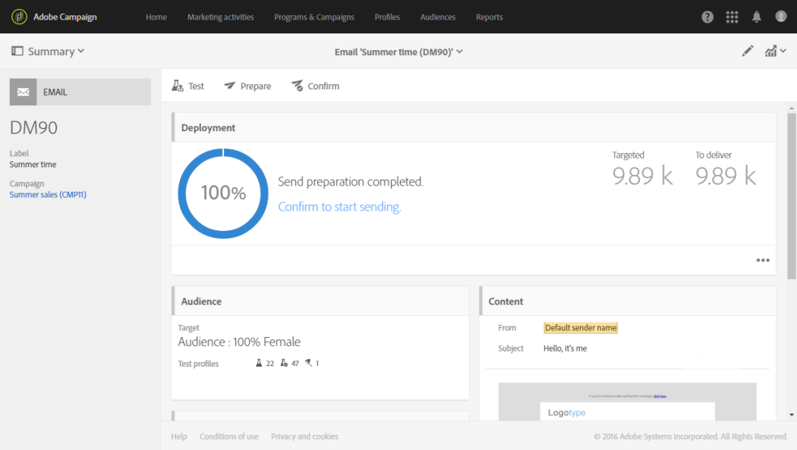
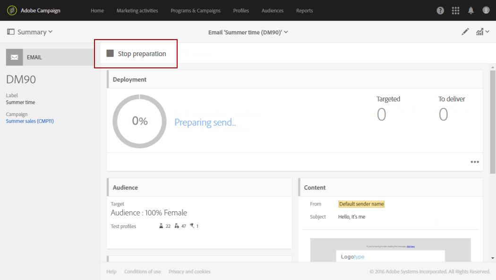
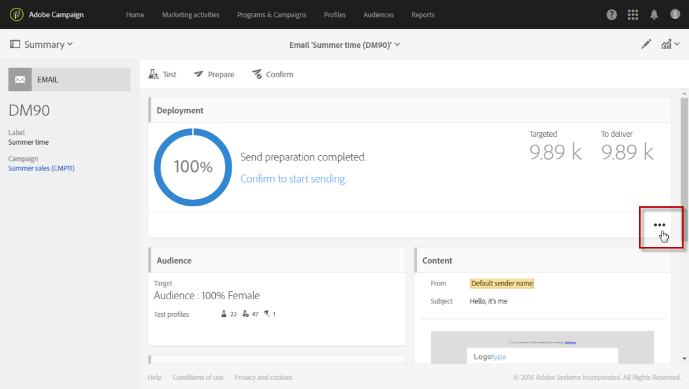

# 送信の準備{#preparing-the-send}

準備は、ターゲット母集団を計算し、ターゲットに含まれる各プロファイルに対してメッセージコンテンツを生成する手順に対応します。 準備が完了したら、メッセージは即座に、または[スケジュールされた日時](../../sending/using/about-scheduling-messages.md)に送信できる状態になります。

1. 送信の準備を開始するには、アクションバーにある「**準備**」ボタンをクリックします。

   

1. **[!UICONTROL Deployment]**&#x200B;ブロックは、準備の進行状況を示し、次に準備の統計を示します。ターゲットメッセージ数、送信するメッセージ数など

   ターゲット母集団のサイズによっては、この操作に時間がかかる場合があります。

   

1. アクションバーにある「**停止**」ボタンを使用して、いつでも準備を停止できます。

   準備段階では、メッセージは送信されません。 したがって、何かに影響を与えるリスクを発生させずに、これを開始または停止できます。

   

1. 配信の準備段階で、メッセージが自動的に保存されます。 準備手順の後にメッセージのスケジュールに変更を加える必要がある場合は、変更を反映するために、「**[!UICONTROL Prepare]**」ボタンを再度クリックする必要があります。 メッセージのスケジュール方法について詳しくは、[ページ](../../sending/using/about-scheduling-messages.md)を参照してください。

   

1. 準備ログを表示するには、ブロックの右下にある「 」ボタンをクリックします。

   

1. **[!UICONTROL Deployment]**&#x200B;ウィンドウが開き、エラーを修正してから準備を再開します。

   最後のログメッセージには、エラーメッセージとエラー件数が表示されます。発生したエラーの種類を示す特定のアイコン：黄色のアイコンは致命的でない処理エラーを示し、赤色のアイコンは配信を開始できない重大なエラーを示します。

   

1. メッセージの送信を確認する前に、準備の統計を確認します。 送信するメッセージの数が設定と一致しない場合は、ターゲット母集団を編集し（[メッセージ内のオーディエンスの選択](../../audiences/using/selecting-an-audience-in-a-message.md)を参照）、準備を再開します。

準備が完了したら、メッセージを送信する準備が整います。 詳しくは、[送信の確認](../../sending/using/confirming-the-send.md)を参照してください。

**タイポロジルール**

Adobe Campaignには、メッセージの準備中に適用される一連の組み込みタイポロジルールが付属しています。 メッセージが有効で品質の基準を満たしているかどうかを確認するために使用されます。 [タイポロジ](../../sending/using/about-typology-rules.md)を参照してください。 独自のタイポロジルールを定義できます。例えば、過剰に配信を受けているプロファイルをキャンペーンから自動的に除外する、グローバルなクロスチャネル疲労ルールを設定できます。 [疲労ルール](../../sending/using/fatigue-rules.md)を参照してください。

**SMSメッセージの確認**

SMSメッセージのコンテンツにパーソナライゼーションフィールドや条件付きテキストを挿入した場合、GSMエンコーディングで考慮されない文字が含まれる可能性があります。 準備が実行されると、メッセージの長さが監視され、制限を超えると警告メッセージが表示されます。

詳しくは、[SMSのエンコード、長さ、表記変換](../../administration/using/configuring-sms-channel.md#sms-encoding--length-and-transliteration)および[SMSメッセージのパーソナライズ](../../channels/using/personalizing-sms-messages.md)の節を参照してください。
