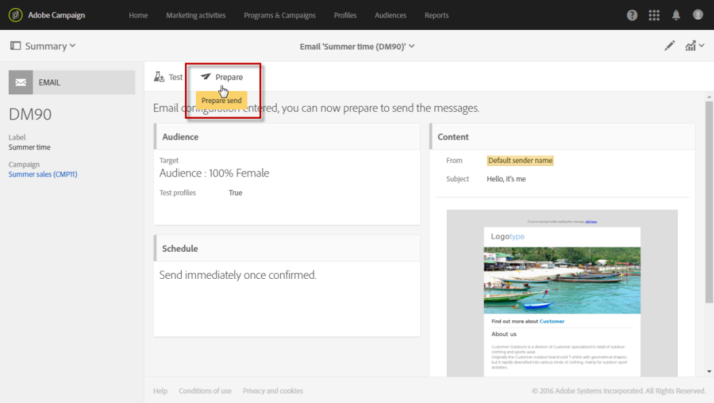

# 送信の準備{#preparing-the-send}

準備は、ターゲット母集団を計算し、ターゲットに含まれる各プロファイルに対してメッセージコンテンツを生成する手順に対応します。 準備が完了すると、メッセージはすぐに、または [予定日時](../../sending/using/about-scheduling-messages.md).

1. 送信の準備を開始するには、 **準備** ボタンをクリックします。

   

1. The **[!UICONTROL Deployment]** 「ブロック」には、準備の進行状況が表示され、準備の統計（ターゲットメッセージ数、送信するメッセージ数など）が表示されます。

   ターゲット母集団のサイズによっては、この操作に時間がかかる場合があります。

   

1. を使用して、いつでも準備を停止できます。 **停止** ボタン（アクションバーにあります）

   準備段階では、メッセージは送信されません。そのため、何かに影響を与えるリスクなく、準備を開始または停止できます。

   

1. 配信の準備中、メッセージは自動的に保存されます。 準備手順の後で、メッセージのスケジュールを変更する必要がある場合は、必ず **[!UICONTROL Prepare]** 」ボタンを再度クリックして、変更内容を反映させます。 メッセージのスケジュール方法について詳しくは、次を参照してください。 [ページ](../../sending/using/about-scheduling-messages.md).

   

1. 準備ログを表示するには、ブロックの右下にある「 」ボタンをクリックします。

   

1. The **[!UICONTROL Deployment]** ウィンドウが開き、エラーが修正されたら、準備を再開します。

   最後のログメッセージには、エラーメッセージとエラー件数が表示されます。発生したエラーのタイプは特定のアイコンで表示されます。黄色のアイコンは致命的でない処理エラーを示し、赤のアイコンは配信を開始できない致命的なエラーを示します。

   

1. メッセージの送信を確認する前に、準備の統計を確認してください。 送信するメッセージの数が設定と一致しない場合は、ターゲット母集団を編集します ( [メッセージ内のオーディエンスの選択](../../audiences/using/selecting-an-audience-in-a-message.md)) をクリックし、準備を再開します。

準備が完了したら、メッセージを送信する準備が整います。 詳しくは、 [送信の確認](../../sending/using/confirming-the-send.md).

**タイポロジルール**

Adobe Campaignには、メッセージの準備中に適用される一連の組み込みタイポロジルールが付属しています。 メッセージが有効で品質の基準を満たしているかどうかを確認するために使用されます。 詳しくは、 [タイポロジ](../../sending/using/about-typology-rules.md). 独自のタイポロジルールを定義できます。例えば、過剰に配信を受けているプロファイルをキャンペーンから自動的に除外するグローバルなクロスチャネル疲労ルールを設定できます。 [疲労ルール](../../sending/using/fatigue-rules.md)を参照してください。

**SMS メッセージチェック**

SMS メッセージのコンテンツにパーソナライゼーションフィールドや条件付きテキストを挿入した場合、GSM エンコーディングで考慮されない文字が含まれる可能性があります。 準備を実行する際には、メッセージの長さが監視され、制限を超えると警告メッセージが表示されます。

詳しくは、 [SMS のエンコーディング、長さ、および変換](../../administration/using/configuring-sms-channel.md#sms-encoding--length-and-transliteration) および [SMS メッセージのパーソナライズ](../../channels/using/personalizing-sms-messages.md) セクション。
