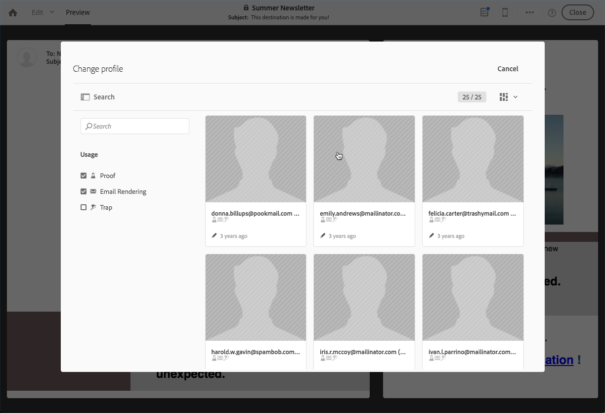

# 配信メッセージのプレビュー {#previewing-messages}

## 電子メールのプレビュー {#previewing-emails}

Campaign Standardを使用すると、メッセージを送信する前にプレビューでき、受信者の個人設定とメッセージの表示方法を確認できます。

メッセージプレビューは、メッセージの **ターゲットに追加する** テストプロファイル(Test Messages)を使用して実行されます。

電子 **メールメッセージの場合** 、Campaign Standardを使用すると、テストプロファイルではなく、対象プロファイルを使用してメッセージをプレビューできます。 これにより、特定のプロファイルが受け取るメッセージを正確に表示できます。 詳しくは、[ターゲットプロファイルを使用した電子メールメッセージのテスト](../../sending/using/testing-messages-using-target.md)を参照してください。

テストプロファイルを使用してプレビューを行うには、次の手順に従います。

1. 電子 [メールデザイナで](../../designing/using/designing-content-in-adobe-campaign.md)、 **[!UICONTROL Preview]** ボタンをクリックします。

   

   デスクトップ表示と電子メールのレスポンシブモバイル表示が並べて表示されます。

1. 各プレビュー中にスパム対策チェックが自動的に実行されます。Click the **[!UICONTROL Anti-spam analysis]** button to find out more about the warning.

   

1. この **[!UICONTROL Change profile]** ボタンを選択して、パーソナライゼーション要素をテストするテストプロファイルを選択します。

   

1. モードを終了するには、画面の左上にある **[!UICONTROL Preview]****[!UICONTROL Edit]** ボタンをクリックします。

   

**関連トピック**

* [テストプロファイルの管理](../../audiences/using/managing-test-profiles.md)
* [ターゲットプロファイルを使用した E メールメッセージのテスト](../../sending/using/testing-messages-using-target.md)
* [配達確認の送信](../../sending/using/sending-proofs.md)

## SMSメッセージのプレビュー {#previewing-sms}

**SMS** メッセージの場合、Campaign Standardでは、テストプロファイルを使用してメッセージをプレビューできます。 これにより、特定のプロファイルが受け取るメッセージを正確に表示できます。 詳しくは、[テストプロファイルの管理](../../audiences/using/managing-test-profiles.md)を参照してください。

テストプロファイルを使用してSMSメッセージをプレビューするには、次の手順に従います。

1. SMSメッセージ **[!UICONTROL Properties]** の内容を入力し、オーディエンスを選択すると、配信を個人設定できます。 For more information, refer to [section](../../channels/using/personalizing-sms-messages.md).

   

1. コンテンツを個人設定したら、をクリック **[!UICONTROL Create]** して **[!UICONTROL Summary]** ウィンドウにアクセスします。

1. ウィンドウで、をクリックして、配信 **[!UICONTROL Summary]****[!UICONTROL Content]** をプレビューする開始を表示します。

   

1. ツールバー **[!UICONTROL Preview]** のをクリックします。

   

1. をクリック **[!UICONTROL Change profile]** して、テストプロファイルを選択し **[!UICONTROL Confirm]**&#x200B;ます。

   

選択したテストプロファイルに応じて、メッセージが正確に表示されます。

**関連トピック**

* [SMS メッセージについて](../../channels/using/about-sms-messages.md)
* [SMS メッセージの作成](../../channels/using/creating-an-sms-message.md)
* [SMS メッセージのパーソナライズ](../../channels/using/personalizing-sms-messages.md)

## プッシュ通知のプレビュー {#previewing-push}

プ **ッシュ通知の場合**、Campaign Standardでは、テストプロファイルを使用してメッセージをプレビューできます。 これにより、特定のプロファイルが受け取るメッセージを正確に表示できます。 詳しくは、[テストプロファイルの管理](../../audiences/using/managing-test-profiles.md)を参照してください。

テストプロファイルを使用してプッシュ通知をプレビューするには、次の手順に従います。

1. プッシュ通知の内容を入力し、オーディエンスを選択す **[!UICONTROL Properties]** ると、配信をパーソナライズできます。 詳しくは、プッシュ通知の [カスタマイズを参照してください](../../channels/using/customizing-a-push-notification.md)。

1. コンテンツを個人設定した後、プレビューーウィンドウのデバイスやOSに応じて、プッシュ通知のレンダリングを直接確認できます。

   

1. テストプロファイルを使用してプッシュ通知をプレビューするには、をクリックし **[!UICONTROL Preview with test profile]**&#x200B;ます。

   

1. テストプロファイルを選択してから、選択し **[!UICONTROL Confirm]**&#x200B;ます。

選択したテストプロファイルに応じて、メッセージが正確に表示されます。

**関連トピック**

* [プッシュ通知について](../../channels/using/about-push-notifications.md)
* [プッシュ通知の準備と送信](../../channels/using/preparing-and-sending-a-push-notification.md)
* [プッシュ通知のカスタマイズ](../../channels/using/customizing-a-push-notification.md)

## アプリ内メッセージのプレビュー {#previewing-in-app}

アプリ **内の場合**、Campaign Standardではテストプロファイルを使用してメッセージをプレビューできます。 これにより、特定のプロファイルが受け取るメッセージを正確に表示できます。 詳しくは、[テストプロファイルの管理](../../audiences/using/managing-test-profiles.md)を参照してください。

テストプロファイルを使用してアプリ内メッセージをプレビューするには、次の手順に従います。

1. アプリ内メッセージ **[!UICONTROL Properties]** の内容を入力し、オーディエンスを選択して設定したら、配信をパーソナライズでき **[!UICONTROL Triggers]**&#x200B;ます。 詳しくは、「アプリ内メッセージの [カスタマイズ](../../channels/using/customizing-an-in-app-message.md)」を参照してください。

1. コンテンツを個人化した後、プレビューーウィンドウでデバイスやOSに応じて、アプリ内メッセージのレンダリングを直接確認できます。

   

1. テストプロファイルを使用してアプリ内メッセージをプレビューするには、をクリックし **[!UICONTROL Preview]**&#x200B;ます。

   

1. テストプロファイルを選択してから、選択し **[!UICONTROL Confirm]**&#x200B;ます。

選択したテストプロファイルに応じて、メッセージが正確に表示されます。

**関連トピック**

* [アプリ内メッセージについて](../../channels/using/about-in-app-messaging.md)
* [アプリ内メッセージの準備と送信](../../channels/using/preparing-and-sending-an-in-app-message.md)
* [アプリ内メッセージのカスタマイズ](../../channels/using/customizing-an-in-app-message.md)