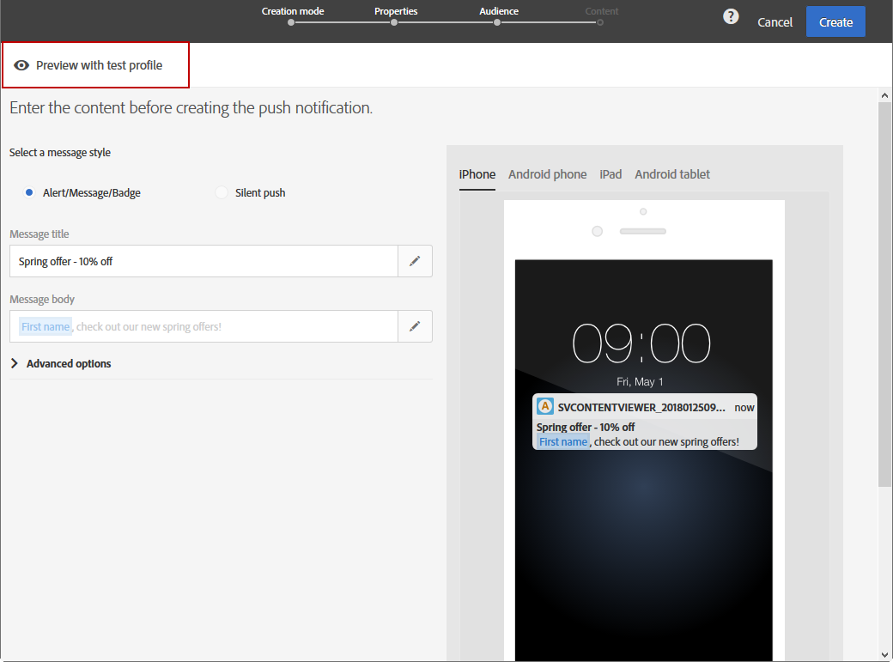

# 配信のプレビュー {#previewing-messages}

## E メールのプレビュー {#previewing-emails}

Campaign Standardでは、メッセージを送信する前にプレビューし、メッセージのパーソナライゼーションと受信者へのメッセージの表示方法を確認できます。

メッセージのプレビューは、 **テストプロファイル** メッセージのターゲットに追加する

の場合 **電子メール** メッセージ、Campaign Standardを使用すると、テストプロファイルではなく、ターゲットプロファイルを使用してメッセージをプレビューできます。 これにより、特定のプロファイルが受け取るメッセージの正確な内容を取得できます。 詳しくは、[ターゲットプロファイルを使用した電子メールメッセージのテスト](../../sending/using/testing-messages-using-target.md)を参照してください。

テストプロファイルを使用してメッセージをプレビューするには、次の手順に従います。

1. Adobe Analytics の [E メールデザイナー](../../designing/using/designing-content-in-adobe-campaign.md)をクリックし、 **[!UICONTROL Preview]** 」ボタンをクリックします。

   

   デスクトップビューと電子メールのレスポンシブモバイルビューが並べて表示されます。

1. 各プレビュー中にスパム対策チェックが自動的に実行されます。次をクリック： **[!UICONTROL Anti-spam analysis]** ボタンをクリックして、警告の詳細を確認します。

   

1. を選択します。 **[!UICONTROL Change profile]** ボタンをクリックして、パーソナライゼーション要素をテストするテストプロファイルを選択します。

   

1. を終了するには、 **[!UICONTROL Preview]** モードで、 **[!UICONTROL Edit]** ボタンをクリックします。

   

**関連トピック**

* [テストプロファイルの管理](../../audiences/using/managing-test-profiles.md)
* [ターゲットプロファイルを使用した E メールメッセージのテスト](../../sending/using/testing-messages-using-target.md)
* [配達確認の送信](../../sending/using/sending-proofs.md)

## SMS メッセージのプレビュー {#previewing-sms}

の場合 **SMS** メッセージ、Campaign Standardを使用すると、テストプロファイルを使用してメッセージをプレビューできます。 これにより、特定のプロファイルが受け取るメッセージの正確な内容を取得できます。 詳しくは、[テストプロファイルの管理](../../audiences/using/managing-test-profiles.md)を参照してください。

テストプロファイルを使用して SMS メッセージをプレビューするには、次の手順に従います。

1. 次に、 **[!UICONTROL Properties]** SMS メッセージの中から選択したオーディエンスを使用して、配信をパーソナライズできます。 詳しくは、 [セクション](../../channels/using/personalizing-sms-messages.md).

   

1. コンテンツをパーソナライズした後、 **[!UICONTROL Create]** にアクセスするには **[!UICONTROL Summary]** ウィンドウ

1. 次から： **[!UICONTROL Summary]** ウィンドウ、クリック **[!UICONTROL Content]** をクリックして、配信のプレビューを開始します。

   

1. クリック **[!UICONTROL Preview]** 」と入力します。

   

1. クリック **[!UICONTROL Change profile]** テストプロファイルを選択してから、 **[!UICONTROL Confirm]**.

   

これで、選択したテストプロファイルに応じて、メッセージの正確な表示を確認できます。

**関連トピック**

* [SMS メッセージについて](../../channels/using/about-sms-messages.md)
* [SMS メッセージの作成](../../channels/using/creating-an-sms-message.md)
* [SMS メッセージのパーソナライズ](../../channels/using/personalizing-sms-messages.md)

## プッシュ通知のプレビュー {#previewing-push}

の場合 **プッシュ通知**「 」Campaign Standardを使用すると、テストプロファイルを使用してメッセージをプレビューできます。 これにより、特定のプロファイルが受け取るメッセージの正確な内容を取得できます。 詳しくは、[テストプロファイルの管理](../../audiences/using/managing-test-profiles.md)を参照してください。

テストプロファイルを使用してプッシュ通知をプレビューするには、次の手順に従います。

1. 次に、 **[!UICONTROL Properties]** プッシュ通知を選択し、オーディエンスを選択して、配信をパーソナライズできます。 詳しくは、 [プッシュ通知のカスタマイズ](../../channels/using/customizing-a-push-notification.md).

1. コンテンツをパーソナライズした後、プレビューウィンドウでデバイスと OS に応じて、プッシュ通知のレンダリングを直接確認できます。

   

1. テストプロファイルを使用してプッシュ通知をプレビューするには、 **[!UICONTROL Preview with test profile]**.

   

1. テストプロファイルを選択してから、 **[!UICONTROL Confirm]**.

これで、選択したテストプロファイルに応じて、メッセージの正確な表示を確認できます。

**関連トピック**

* [プッシュ通知について](../../channels/using/about-push-notifications.md)
* [プッシュ通知の準備と送信](../../channels/using/preparing-and-sending-a-push-notification.md)
* [プッシュ通知のカスタマイズ](../../channels/using/customizing-a-push-notification.md)

## アプリ内メッセージのプレビュー {#previewing-in-app}

の場合 **アプリ内**「 」Campaign Standardを使用すると、テストプロファイルを使用してメッセージをプレビューできます。 これにより、特定のプロファイルが受け取るメッセージの正確な内容を取得できます。 詳しくは、[テストプロファイルの管理](../../audiences/using/managing-test-profiles.md)を参照してください。

テストプロファイルを使用してアプリ内メッセージをプレビューするには、次の手順に従います。

1. 次に、 **[!UICONTROL Properties]** 」で、オーディエンスを選択し、 **[!UICONTROL Triggers]**&#x200B;を使用すると、配信をパーソナライズできます。 詳しくは、 [アプリ内メッセージのカスタマイズ](../../channels/using/customizing-an-in-app-message.md).

1. コンテンツをパーソナライズした後、プレビューウィンドウでデバイスと OS に応じて、アプリ内メッセージのレンダリングを直接確認できます。

   

1. テストプロファイルを使用してアプリ内メッセージをプレビューするには、 **[!UICONTROL Preview]**.

   

1. テストプロファイルを選択してから、 **[!UICONTROL Confirm]**.

これで、選択したテストプロファイルに応じて、メッセージの正確な表示を確認できます。

**関連トピック**

* [アプリ内メッセージについて](../../channels/using/about-in-app-messaging.md)
* [アプリ内メッセージの準備と送信](../../channels/using/preparing-and-sending-an-in-app-message.md)
* [アプリ内メッセージのカスタマイズ](../../channels/using/customizing-an-in-app-message.md)
