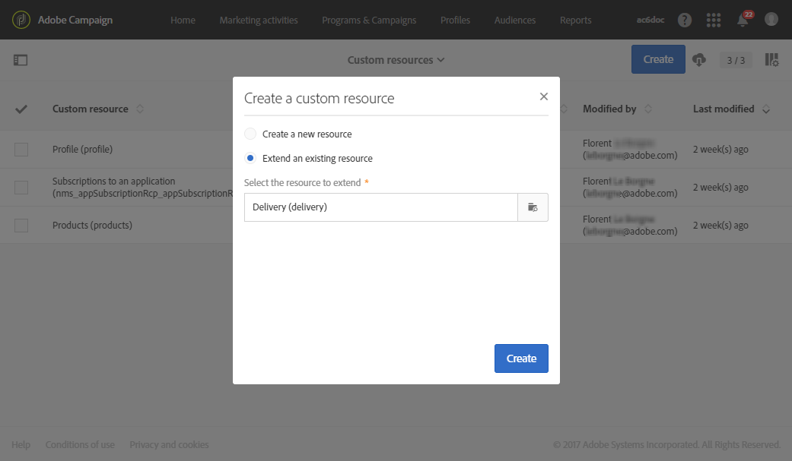
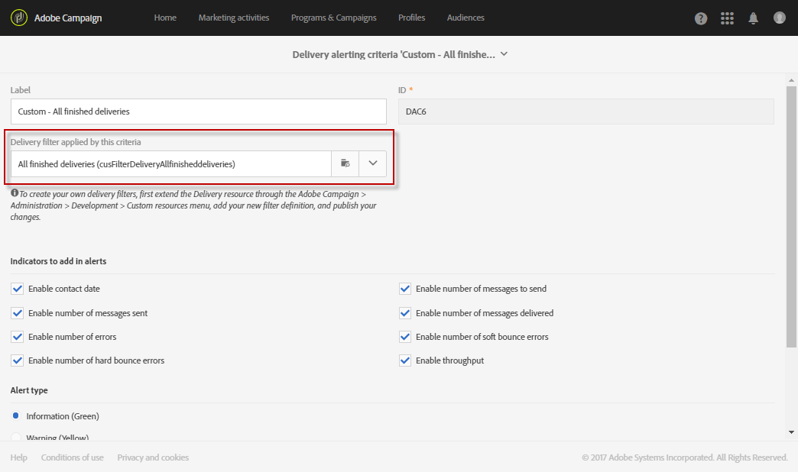

# エラー発生時のアラートの受信{#receiving-alerts-when-failures-happen}

## 配信アラートについて {#about-delivery-alerting}

この **配信アラート** 機能は、配信の実行に関する情報を含む通知を、ユーザーのグループが自動的に受け取れるようにするアラート管理システムです。

送信される通知には、次の条件に基づくデフォルトのレポートが含まれます。

* 失敗した配信
* 準備に失敗した配信
* ソフトバウンスエラー率が正しくない配信
* ハードバウンスのエラー率が悪い配信
* 保留中ステータスが通常より長い配信
* スループットの低い配信
* 配信を処理中

アラートの受信者は、Adobe Campaignが処理している配信を監視し、実行に問題がある場合に適切な対応を取ることができます。

これらのアラート通知は、Adobe Campaignインターフェイスのダッシュボードで定義される特定のアラート条件に応じて、カスタマイズできます。

>[!NOTE]
>
>アラート通知は E メールでのみ配信されます。

送信される通知には、次の内容が含まれます。

* A **[!UICONTROL Summary]** 定義した条件に一致する配信の数と、各条件で選択したラベル/色を表示する。
* A **[!UICONTROL Details]** 「 」セクションには、対応するダッシュボードに定義されたすべての配信条件と、各条件に対するすべての配信が一覧表示されます。

## 配信アラートダッシュボード {#delivery-alerting-dashboards}

### 配信アラートダッシュボードについて {#about-delivery-alerting-dashboards}

通知の受信者を管理するには、ダッシュボードを使用して、アラート条件を定義し、アラートの履歴にアクセスする必要があります。

>[!NOTE]
>
>ダッシュボードと警告条件にアクセスして設定するには、管理権限を持っているか、 **配信スーパーバイザー** セキュリティグループ。 標準ユーザーは、Adobe Campaignインターフェイスでダッシュボードにアクセスできません。 通知を受け取ることはできるのは、警告通知のみです。 Adobe Campaignのユーザーとセキュリティについて詳しくは、 [ユーザーのタイプ](../../administration/using/users-management.md) および [セキュリティグループについて](../../administration/using/managing-groups-and-users.md#about-security-groups).

Adobe Campaignインターフェイスから、次の操作を実行できます。

* 配信アラートダッシュボードを作成および管理します。 詳しくは、 [配信アラートダッシュボードの作成](#creating-a-delivery-alerting-dashboard).
* 各ダッシュボードの配信アラート条件を定義および管理します。 例えば、準備が失敗した配信や、スループットが低い配信のみに基づいてアラートを作成できます。 詳しくは、 [アラート条件について](#about-alerting-criteria).
* 各ダッシュボードの条件パラメータを変更します。 詳しくは、 [条件パラメーター](#criteria-parameters).
* 各ダッシュボードで受信者のグループを定義します。

   例えば、失敗した配信の管理権限を持つユーザーにのみ通知するとします。 ただし、ソフトバウンスのエラー率が悪い配信に関する情報をマーケティングユーザーに受け取ってもらいたい場合があります。 したがって、2 つの異なるダッシュボードを作成し、受信者の各グループに必要な条件を定義する必要があります。

* 各ダッシュボードの送信済みアラートの履歴にアクセスします。

   ダッシュボードを選択すると、デフォルトでは、このダッシュボードに対して最後に送信されたアラートが表示されます。 すべての送信済みアラートが画面の左側に表示されます。 次の項目をクリックします： **[!UICONTROL History]** 対応するアラートにアクセスするリスト。

### 配信アラートダッシュボードの作成 {#creating-a-delivery-alerting-dashboard}

特定の条件に基づいて通知を様々なユーザーグループに送信する場合は、複数のダッシュボードを使用する必要があります。 新しいダッシュボードを作成するには：

1. **[!UICONTROL Administration]** > **[!UICONTROL Channels]** > **[!UICONTROL Delivery alerting]**&#x200B;に移動してください。
1. 「**[!UICONTROL Delivery alerting dashboards]**」を選択し、「**[!UICONTROL Create]**」をクリックします。
1. 次を確認します。 **[!UICONTROL Enabled]** ボックスをクリックして、現在のダッシュボードをアクティブにします。

   このオプションを無効にした場合、このダッシュボードにリンクされた通知は送信されなくなります。 このオプションはデフォルトでは無効です。

   

1. 通知する受信者のグループを「 **[!UICONTROL Alert group]** 」ドロップダウンリストから選択できます。 グループを変更または作成するには、 [セキュリティグループの作成とユーザーの割り当て](../../administration/using/managing-groups-and-users.md#creating-a-security-group-and-assigning-users).
1. 次の **[!UICONTROL Delivery alerting criteria]** セクションで、 **[!UICONTROL Create element]** をクリックして条件を追加します。 詳しくは、 [アラート条件について](#about-alerting-criteria).
1. 「**[!UICONTROL Edit properties]**」ボタンをクリックします。内 **[!UICONTROL Criteria parameters]** タブで、条件の適用方法を定義します。 詳しくは、 [条件パラメーター](#criteria-parameters).
1. クリック **[!UICONTROL Create]** をクリックしてダッシュボードを保存します。

これで、配信がこのダッシュボードで定義した条件を満たすたびに、指定したユーザーグループに警告通知が送信されます。

## 配信アラート条件 {#delivery-alerting-criteria}

### アラート条件について {#about-alerting-criteria}

配信アラート条件にアクセスするには、に移動します。 **[!UICONTROL Administration]** > **[!UICONTROL Channels]** > **[!UICONTROL Delivery alerting]** を選択し、 **[!UICONTROL Delivery alerting criteria]**.

配信アラートダッシュボードでは、次の条件を使用できます。

* **[!UICONTROL Deliveries failed]**:定義した範囲内でスケジュールされた、ステータスがエラーのある配信。
* **[!UICONTROL Deliveries with preparation failed]**:定義済みの範囲内で変更された配信のうち、準備手順（ターゲットの計算とコンテンツの生成）が失敗したもの。 詳しくは、 [送信の準備](../../sending/using/preparing-the-send.md).
* **[!UICONTROL Delivery with bad error ratio for soft bounces]**:定義した範囲内でスケジュールされた、少なくともステータスを持つすべての配信 **[!UICONTROL In progress]**（ソフトバウンスのエラー率が、定義された割合を超えている場合）
* **[!UICONTROL Delivery with bad error ratio for hard bounces]**:定義した範囲内でスケジュールされた、少なくともステータスを持つすべての配信 **[!UICONTROL In progress]**&#x200B;ハードバウンスのエラー率が、定義された割合を超えています。
* **[!UICONTROL Deliveries with long start pending]**:定義された範囲内でスケジュールされた配信 ( **[!UICONTROL Start pending]** 定義された期間を超える長いステータス **[!UICONTROL Start pending]** ステータスとは、メッセージがまだシステムで考慮されていないことを意味します。
* **[!UICONTROL Deliveries with low throughput]**:すべての配信は、定義された期間を超えて開始され、定義された処理済みメッセージの割合未満で、スループットは定義された値未満です。
* **[!UICONTROL Deliveries in progress]**:定義された範囲内でスケジュールされた配信 ( **[!UICONTROL In progress]** ステータス。

>[!NOTE]
>
>上記の条件に適用されるすべてのパラメータには、デフォルト値が設定されています。 これらの値は、 **[!UICONTROL Criteria parameters]** 配信警告ダッシュボードのタブ 詳しくは、 [条件パラメーター](#criteria-parameters).

任意の項目を **[!UICONTROL Delivery alerting criteria]** リストをクリックして、詳細にアクセスします。

各条件に対して、次の設定を定義できます。

* **[!UICONTROL Indicators to add in alerts]**( 通知の **[!UICONTROL Details]** 」セクションに表示されます。

   

* **[!UICONTROL Alert type]**：つまり、通知の概要で配信条件の横に表示されるラベルと色を意味します。

   

* **[!UICONTROL Criteria frequency]**:1 つの配信に対する条件が満たされた場合、監視期間内に送信される各通知で同じ条件が繰り返されます。 そうしないと、1 回の配信に関するアラート条件で、1 日（最初の発生時）だけアラートが送信されます。

   デフォルトでは、すべての条件に対して、このオプションは 1 日 1 回に設定されています。

**関連トピック：**

* [ログの送信](../../sending/using/monitoring-a-delivery.md#sending-logs)
* [アラート頻度](#alerting-frequency)
* [マーケティングアクティビティのアイコンとステータス](../../start/using/marketing-activities.md#marketing-activity-icons-and-statuses)

### 配信アラート条件の作成 {#creating-a-delivery-alerting-criterion}

ニーズに合わせて新しい配信アラート条件を作成できます。

例えば、すべての配信を一覧表示する通知を **[!UICONTROL Finished]** ステータス。

これをおこなうには、まず **配信** リソースを選択し、新しいフィルターを追加して、 **[!UICONTROL Finished]** ステータス。

1. に移動します。 **Adobe Campaign** > **管理** > **開発** > **カスタムリソース** をクリックし、 **[!UICONTROL Create]**.
1. 選択 **[!UICONTROL Extend an existing resource]**&#x200B;を選択し、 **[!UICONTROL Delivery]** リソースをドロップダウンリストから選択し、「 **[!UICONTROL Create]** をクリックして編集します。

   

   既存のリソースの拡張について詳しくは、 [リソースの定義](../../developing/using/creating-or-extending-the-resource.md).

1. 内 **[!UICONTROL Delivery]** リソース、に移動します。 **[!UICONTROL Filter definition]** タブをクリックし、 **[!UICONTROL Add an element]** をクリックして、フィルターを作成します。

   

1. 新しいフィルター定義を編集します。内 **[!UICONTROL Filter definition]** ウィンドウで、 **[!UICONTROL Status]** ワークスペースに項目を追加して、 **[!UICONTROL Finished]** をフィルター条件として使用します。

   

   カスタムフィルターの作成と編集について詳しくは、 [フィルターの定義](../../developing/using/configuring-filter-definition.md).

1. 変更を保存し、リソースを公開します。 詳しくは、 [カスタムリソースの公開](../../developing/using/updating-the-database-structure.md#publishing-a-custom-resource).

   フィルターが作成され、新しい配信アラート条件で選択できるようになりました。

1. に移動します。 **[!UICONTROL Administration]** > **[!UICONTROL Channels]** > **[!UICONTROL Delivery alerting]**&#x200B;を選択します。 **[!UICONTROL Delivery alerting criteria]** をクリックし、 **[!UICONTROL Create]**.
1. 内 **[!UICONTROL Delivery filter applied by this criterion]** 」ドロップダウンリストから、作成したフィルターを選択します。

   

   デフォルトの条件と同じ方法で条件の設定を定義できます。 詳しくは、 [アラート条件について](#about-alerting-criteria).

作成した条件は、配信アラートダッシュボードや他の条件に追加できます。 詳しくは、 [配信アラートダッシュボードについて](#about-delivery-alerting-dashboards).

**関連トピック：**

[リソースの追加または拡張](../../developing/using/key-steps-to-add-a-resource.md)

## 配信アラートパラメーター {#delivery-alerting-parameters}

### 条件パラメーター {#criteria-parameters}

内 **[!UICONTROL Criteria parameters]** タブ [配信アラートダッシュボード](#creating-a-delivery-alerting-dashboard)の場合は、このダッシュボードで選択した条件に適用する設定を定義できます。

* **[!UICONTROL Delivery target minimum size]**:例えば、このフィールドに 100 と入力した場合、ターゲットが 100 人以上の受信者を持つ配信に対してのみ通知が送信されます。 このパラメーターは、すべての条件に適用されます。
* **[!UICONTROL Monitoring period before and after the contact date (in hours)]**:現在の時刻の前後の時間数。 この期間でコンタクト日を持つ配信のみが考慮されます。 このパラメーターは、すべての条件に適用されます。 デフォルトでは、このフィールドの値は 24 時間に設定されています。

   コンタクト日について詳しくは、 [スケジュールについて](../../sending/using/about-scheduling-messages.md).

* **[!UICONTROL Maximum ratio of soft bounce errors]**:ソフトバウンスエラー率が指定値を超えるすべての配信に対して通知が送信されます。 デフォルトでは、このフィールドの値は 0.05 (5%) に設定されています。

   ソフトバウンスエラーについて詳しくは、 [バウンスメールの選定](../../sending/using/understanding-delivery-failures.md#bounce-mail-qualification) および [配信エラータイプのリスト](../../sending/using/understanding-delivery-failures.md#delivery-failure-types-and-reasons).

* **[!UICONTROL Maximum ratio of hard bounce errors]**:ハードバウンスのエラー率が指定値を超えるすべての配信に対して通知が送信されます。 デフォルトでは、このフィールドの値は 0.05 (5%) に設定されています。

   ハードバウンスエラーについて詳しくは、 [バウンスメールの選定](../../sending/using/understanding-delivery-failures.md#bounce-mail-qualification) および [配信エラータイプのリスト](../../sending/using/understanding-delivery-failures.md#delivery-failure-types-and-reasons).

* **[!UICONTROL Minimum time threshold for delivery in 'Start pending' status (in minutes)]**:が設定されているすべての配信に対して通知が送信されます。 **[!UICONTROL Start pending]** このフィールドで指定した期間より長いステータス **[!UICONTROL Start pending]** ステータスとは、メッセージがまだシステムで考慮されていないことを意味します。
* **[!UICONTROL Minimum time required for the computation of the throughput (in minutes)]**:配信のみが ( **[!UICONTROL In progress]** ステータス ) が指定された期間を超える場合、 **[!UICONTROL Deliveries with low throughput]** 条件
* **[!UICONTROL Maximum percentage of processed messages for the computation of the throughput]**:処理されたメッセージの割合が指定の割合より低い配信のみが、 **[!UICONTROL Deliveries with low throughput]** 条件
* **[!UICONTROL Minimum expected throughput (in sent messages per hour)]**:指定した値よりも低いスループットを持つ配信のみが **[!UICONTROL Deliveries with low throughput]** 条件
* **[!UICONTROL Minimum processed ratio required for 'Deliveries in progress' criterion]**:処理されたメッセージの割合が、指定した割合よりも高い配信のみが考慮されます。

### アラート頻度 {#alerting-frequency}

この **[!UICONTROL Frequency of delivery alerting]** 「 」オプションを使用すると、2 つのアラート送信の間の遅延を定義できます。 デフォルトでは 10 分に設定されています。

この設定は、 **[!UICONTROL Administration]** > **[!UICONTROL Application settings]** > **[!UICONTROL Options]** メニュー

>[!NOTE]
>
>このオプションは、Adobe Campaignで定義されているすべてのダッシュボードに適用されます。 各ダッシュボードに特定の頻度を設定することはできません。

## 配信アラートの理由 {#delivery-alerting-reasons}

この **配信アラート** 機能を使用すると、関係するすべてのAdobe Campaignユーザーが、配信の実行ステータスを電子メールおよびダッシュボードで自動的に通知できます。

配信アラート通知を受け取った際に実行できる操作に関するヒントを以下に示します。

まず、配信の **ログ** タブをクリックし、配信と配達確認に関するすべての情報を表示します。 赤と黄色のアイコンを使用して、エラーや警告を識別できます。 赤いアイコンは、配信が開始されるのを防ぐ重大なエラーを示します。

配信のすべての発生履歴を表示するには、 **[!UICONTROL Sending logs]** タブをクリックします。 このリストには、送信されたメッセージとそのステータスのリストが含まれます。 各受信者の配信ステータスを確認できます ( **[!UICONTROL Sent]**, **[!UICONTROL Pending]**, **[!UICONTROL Failed]**&#x200B;など ) 詳しくは、 [ログの送信](../../sending/using/monitoring-a-delivery.md#sending-logs).

配信で満たされた条件に従ってアラート通知を受信する理由は、次のとおりです。

* **[!UICONTROL Deliveries failed]**:この条件では、ステータスが誤っているすべての配信が通知されます。 次の原因が考えられます。

   * 配信サーバー（MTA、メッセージ転送エージェント）に問題があります
   * Adobe Campaign配信サーバーと受信サーバー間の接続がタイムアウトした場合
   * 配信品質の問題
   * 誤ったワークフロー

   配信がワークフローでトリガーされる場合は、そのワークフローが正しく開始されたかどうかを確認します。 詳しくは、 [ワークフローの実行](../../automating/using/about-workflow-execution.md). それ以外の場合は、Adobe Campaign管理者に問い合わせて、問題を解決してください。

* **[!UICONTROL Deliveries with preparation failed]**:次の場合、配信の準備中にエラーが発生する可能性があります。

   * 配信に件名がありません。
   * パーソナライゼーションフィールドの構文が正しくありません。
   * ターゲットが見つかりません。
   * 配信がサイズ制限を超えています。

   詳しくは、 [送信の準備](../../sending/using/preparing-the-send.md). ただし、通常、これらのエラーはメッセージの分析中に発生します。 詳しくは、 [コントロールルール](../../sending/using/control-rules.md).

* 考えられる原因は、 **[!UICONTROL Delivery with bad error ratio for soft bounces]** アラートは次のように設定できます。

   * 受信者のサーバーがダウンしています。
   * 受信者のメールボックスがいっぱいです。

   詳しくは、 **[!UICONTROL Exclusion logs]** および **[!UICONTROL Exclusion causes]** 配信ログのタブ 詳しくは、 [除外ログ](../../sending/using/monitoring-a-delivery.md#exclusion-logs).

   考えられる原因は、 **[!UICONTROL Delivery with bad error ratio for hard bounces]** アラートは次のように設定できます。

   * 受信者が「 」に追ブロックリスト加され、今後連絡を希望しなくなります。
   * 受信者の E メールアドレスが存在しません。
   * 受信者のドメインが存在しません。
   * 受信者のサーバーが配信をブロックしています。

   ソフトバウンスエラーとハードバウンスエラーを回避するには、次のベストプラクティスに従います。

   * 配信分析中に、メッセージターゲットの一部を除外するフィルタータイポロジルール（強制隔離された受信者など）を作成します。 詳しくは、 [フィルタールールの作成](../../sending/using/filtering-rules.md).
   * 強制隔離の管理プロセスを適切に維持するために、顧客データベースを定期的に更新します。 [強制隔離について](../../sending/using/understanding-quarantine-management.md#about-quarantines)を参照してください。
   * 一般に、配信品質はできる限り最高に向上します。 Adobe Campaign [配信品質](../../sending/using/about-deliverability.md) 詳細なドキュメントを参照し、Adobe Campaign管理者にお問い合わせください。

* **[!UICONTROL Deliveries with long start pending]**:通常、これは、MTA(Message Transfer Agent) レベルに問題があることを意味します。 実行プロセスが、リソースが使用可能になるのを待っています。MTA が開始されていない可能性があります。

   **[!UICONTROL Deliveries with low throughput]**:これも、配信品質の問題で、MTA が遅すぎるという意味です。

   これらの問題について詳しくは、Adobe Campaign管理者にお問い合わせください。

**関連トピック：**

* [配信エラーについて](../../sending/using/understanding-delivery-failures.md)
* [強制隔離管理について](../../sending/using/understanding-quarantine-management.md)
* [Campaign のオプトインとオプトアウトについて](../../audiences/using/about-opt-in-and-opt-out-in-campaign.md)
