# エラー発生時のアラートの受信{#receiving-alerts-when-failures-happen}

## 配信アラートについて {#about-delivery-alerting}

**配信アラート**&#x200B;機能は、ユーザーのグループが配信の実行に関する情報を含む通知を自動的に受信できるようにするアラート管理システムです。

送信される通知には、次の条件に基づいてデフォルトでレポートが含まれます。

* 失敗した配信
* 準備に失敗した配信
* ソフトバウンスのエラー率が低い配信
* 不良なハードバウンス率の配信
* 通常よりも長い保留中ステータスの配信
* スループットの低い配信
* 配信中

アラートの受信者は、Adobe Campaignで処理されている配信を監視し、実行に問題がある場合に適切なアクションを実行できます。

これらのアラート通知は、Adobe Campaign インターフェイスのダッシュボードで定義される特定のアラート基準に応じてカスタマイズできます。

>[!NOTE]
>
>アラート通知は電子メールでのみ配信されます。

送信される通知には次のものが含まれます。

* 定義した基準を満たす配信の数と、各基準に対して選択したラベルまたは色を表示する&#x200B;**[!UICONTROL Summary]**&#x200B;です。
* 対応するダッシュボードに定義されているすべての配信条件と、各条件のすべての配信を一覧表示する&#x200B;**[!UICONTROL Details]** セクション。

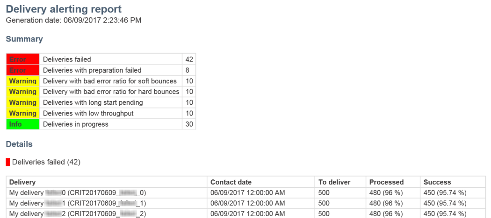

## 配信アラートダッシュボード {#delivery-alerting-dashboards}

### 配信アラートダッシュボードについて {#about-delivery-alerting-dashboards}

通知の受信者を管理し、アラート条件を定義し、アラートの履歴にアクセスするには、ダッシュボードを使用する必要があります。

>[!NOTE]
>
>ダッシュボードとアラート条件にアクセスして設定するには、管理者権限を持っているか、**配信スーパーバイザー** セキュリティグループに表示されている必要があります。 標準ユーザーは、Adobe Campaign インターフェイスのダッシュボードにアクセスできません。 アラート通知のみを受信できます。 Adobe Campaignのユーザーとセキュリティについて詳しくは、[ ユーザーの種類](../../administration/using/users-management.md)および[ セキュリティグループについて](../../administration/using/managing-groups-and-users.md#about-security-groups)を参照してください。

Adobe Campaignのインターフェイスでは、次のことができます。

* 配信アラートダッシュボードの作成と管理。 [配信アラートダッシュボードの作成](#creating-a-delivery-alerting-dashboard)を参照してください。
* 各ダッシュボードの配信アラート基準を定義して管理します。 例えば、準備に失敗した配信や、スループットが低い配信のみに基づいてアラートを作成できます。 アラート条件について[を参照](#about-alerting-criteria)。
* 各ダッシュボードの基準パラメーターを変更します。 [条件パラメーター](#criteria-parameters)を参照してください。
* 各ダッシュボードの受信者のグループを定義します。

  例えば、失敗した配信の管理者権限のみを持つユーザーに通知する場合などです。 ただし、ソフトバウンスのエラー率の低い配信に関する情報をマーケティングユーザーに受け取ってもらう必要があります。 そのため、2つの異なるダッシュボードを作成し、受信者のグループごとに必要な条件を定義する必要があります。

* 各ダッシュボードに送信されたすべてのアラートの履歴にアクセスします。

  ダッシュボードを選択すると、このダッシュボードの最後に送信されたアラートがデフォルトで表示されます。 送信されたすべてのアラートは、画面の左側に一覧表示されます。 **[!UICONTROL History]** リストの項目をクリックして、対応するアラートにアクセスします。

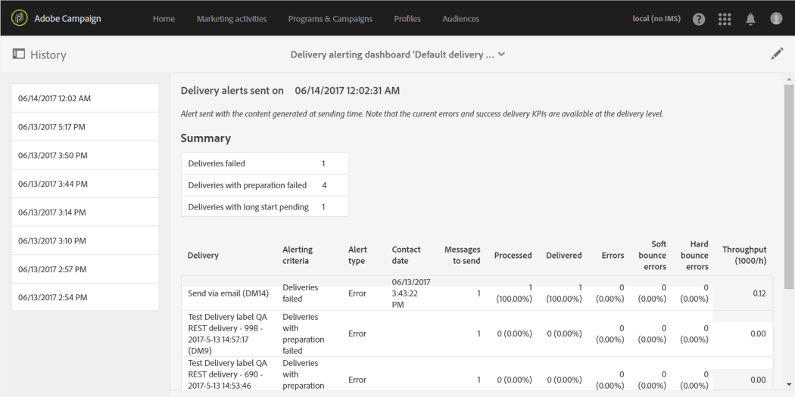

### 配信アラートダッシュボードの作成 {#creating-a-delivery-alerting-dashboard}

特定の基準にもとづいて通知を異なるユーザーグループに送信する場合は、複数のダッシュボードを使用する必要があります。 新しいダッシュボードを作成するには：

1. **[!UICONTROL Administration]** > **[!UICONTROL Channels]** > **[!UICONTROL Delivery alerting]**&#x200B;に移動してください。
1. 「**[!UICONTROL Delivery alerting dashboards]**」を選択し、「**[!UICONTROL Create]**」をクリックします。
1. 現在のダッシュボードをアクティブ化するには、**[!UICONTROL Enabled]** ボックスをオンにします。

   このオプションを無効にすると、このダッシュボードにリンクされた通知は送信されなくなります。 このオプションはデフォルトでは無効です。

   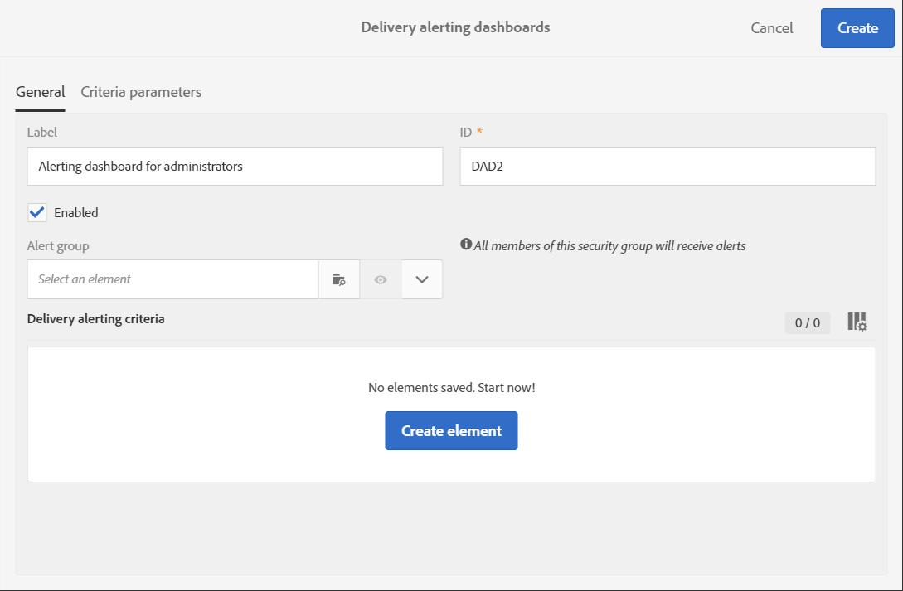

1. **[!UICONTROL Alert group]** ドロップダウンリストから通知する受信者のグループを選択します。 グループを変更または作成するには、[ セキュリティグループの作成とユーザーの割り当て](../../administration/using/managing-groups-and-users.md#creating-a-security-group-and-assigning-users)を参照してください。
1. **[!UICONTROL Delivery alerting criteria]** セクションで、**[!UICONTROL Create element]**&#x200B;をクリックして条件を追加します。 アラート条件について[を参照](#about-alerting-criteria)。
1. 「**[!UICONTROL Edit properties]**」ボタンをクリックします。 「**[!UICONTROL Criteria parameters]**」タブで、基準の適用方法を定義します。 [条件パラメーター](#criteria-parameters)を参照してください。
1. **[!UICONTROL Create]**&#x200B;をクリックしてダッシュボードを保存します。

これで、配信がこのダッシュボードで定義した基準を満たすたびに、指定したユーザーグループにアラート通知が送信されます。

## 配信アラート条件 {#delivery-alerting-criteria}

### アラート基準について {#about-alerting-criteria}

配信アラート条件にアクセスするには、**[!UICONTROL Administration]** > **[!UICONTROL Channels]** > **[!UICONTROL Delivery alerting]**&#x200B;に移動し、**[!UICONTROL Delivery alerting criteria]**&#x200B;を選択します。

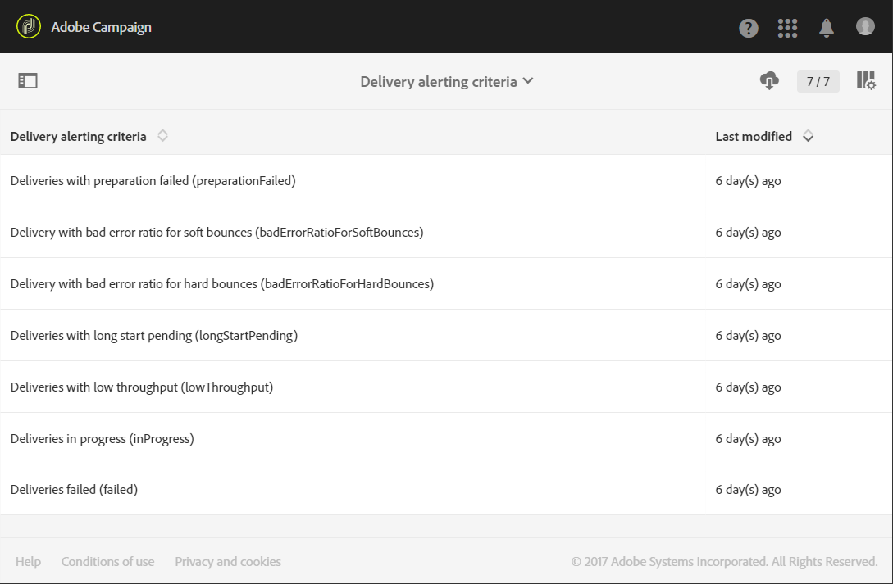

配信アラートダッシュボードでは、次の条件を使用できます。

* **[!UICONTROL Deliveries failed]**：定義された範囲内でスケジュールされた配信のうち、ステータスが誤っている配信。
* **[!UICONTROL Deliveries with preparation failed]**：定義済みの範囲内で変更された配信。準備手順（ターゲット計算とコンテンツ生成）が失敗しました。 詳しくは、[送信の準備](../../sending/using/preparing-the-send.md)を参照してください。
* **[!UICONTROL Delivery with bad error ratio for soft bounces]**：定義された範囲内でスケジュールされた配信のうち、少なくとも&#x200B;**[!UICONTROL In progress]**&#x200B;のステータスを持ち、ソフトバウンスのエラー率が定義された割合を超えている配信。
* **[!UICONTROL Delivery with bad error ratio for hard bounces]**：定義された範囲内でスケジュールされた配信のうち、ステータスが&#x200B;**[!UICONTROL In progress]**&#x200B;以上で、ハードバウンスのエラー率が定義された割合を超えている配信。
* **[!UICONTROL Deliveries with long start pending]**：定義された範囲内でスケジュールされた配信。定義された期間を超える&#x200B;**[!UICONTROL Start pending]** ステータスが&#x200B;**[!UICONTROL Start pending]** ステータスの場合、メッセージがまだシステムで考慮されていません。
* **[!UICONTROL Deliveries with low throughput]**：定義された期間を超えて開始された配信。処理済みメッセージの定義された割合を下回り、スループットが定義された値を下回った。
* **[!UICONTROL Deliveries in progress]**：定義された範囲内でスケジュールされた配信で、ステータスが&#x200B;**[!UICONTROL In progress]**&#x200B;の場合。

>[!NOTE]
>
>上記の条件に適用されるすべてのパラメーターには、デフォルト値が設定されています。 これらの値は、配信アラートダッシュボードの「**[!UICONTROL Criteria parameters]**」タブで変更できます。 [条件パラメーター](#criteria-parameters)を参照してください。

**[!UICONTROL Delivery alerting criteria]** リストから任意の項目を選択して、その詳細にアクセスできます。

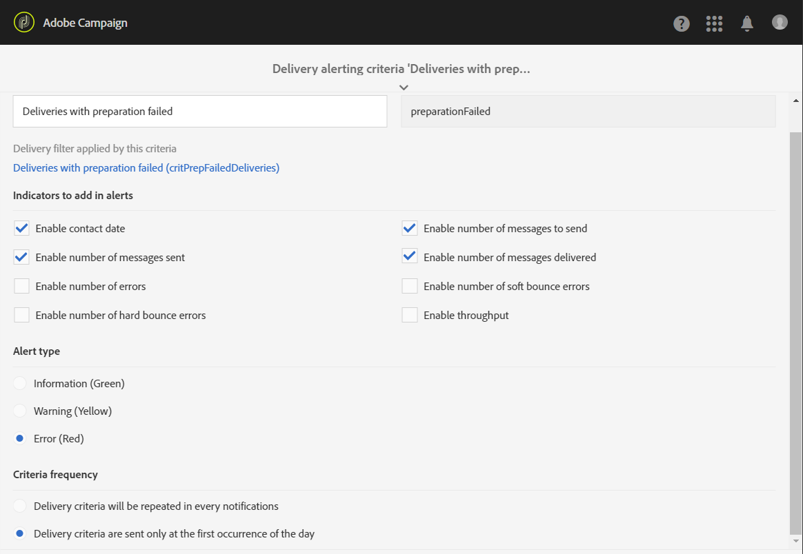

各基準について、次の設定を定義できます。

* **[!UICONTROL Indicators to add in alerts]**。選択した条件に対応する配信の通知の&#x200B;**[!UICONTROL Details]** セクションに表示される列を意味します。

  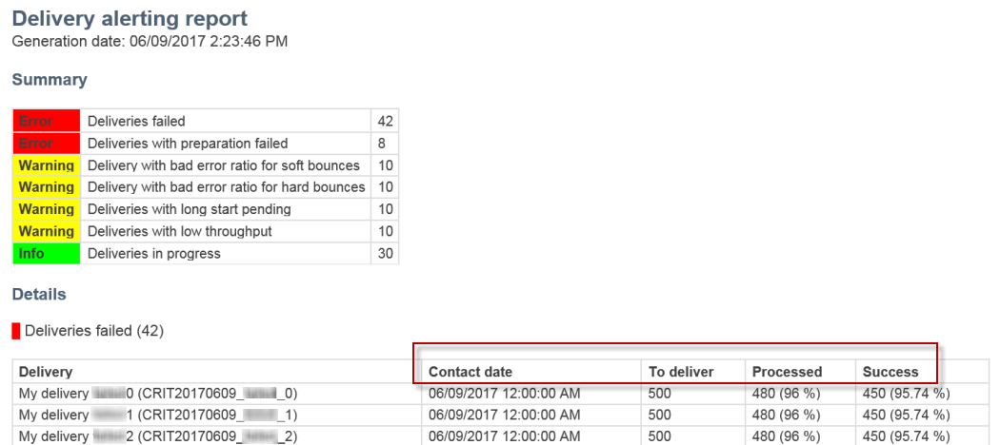

* **[!UICONTROL Alert type]**。通知の概要で配信基準の横に表示されるラベルと色を意味します。

  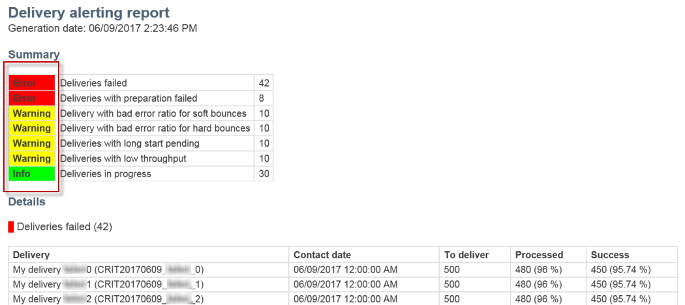

* **[!UICONTROL Criteria frequency]**：条件が1回の配信で満たされた場合、監視期間内に送信された各通知で繰り返されます。 それ以外の場合は、1日に1回の配信に対してアラート基準で（最初の発生時に） 1つのアラートのみが送信されます。

  デフォルトでは、このオプションは、すべての基準に対して1日1回に設定されます。

**関連トピック：**

* [送信ログ](../../sending/using/monitoring-a-delivery.md#sending-logs)
* [アラート頻度](#alerting-frequency)
* [マーケティング活動のアイコンとステータス](../../start/using/marketing-activities.md#marketing-activity-icons-and-statuses)

### 配信アラート基準の作成 {#creating-a-delivery-alerting-criterion}

ニーズに合わせて、新しい配信アラート基準を作成できます。

例えば、**[!UICONTROL Finished]**&#x200B;のステータスを持つすべての配信を一覧表示する通知を送信できるように、新しい条件を作成できます。

これを行うには、まず&#x200B;**配信** リソースを拡張し、**[!UICONTROL Finished]** ステータスの配信のみを選択できる新しいフィルターを追加する必要があります。

1. **Adobe Campaign** > **管理** > **開発** > **カスタムリソース**&#x200B;に移動し、**[!UICONTROL Create]**&#x200B;をクリックします。
1. **[!UICONTROL Extend an existing resource]**&#x200B;を選択し、ドロップダウンリストから&#x200B;**[!UICONTROL Delivery]** リソースを選択し、**[!UICONTROL Create]**&#x200B;をクリックして編集します。

   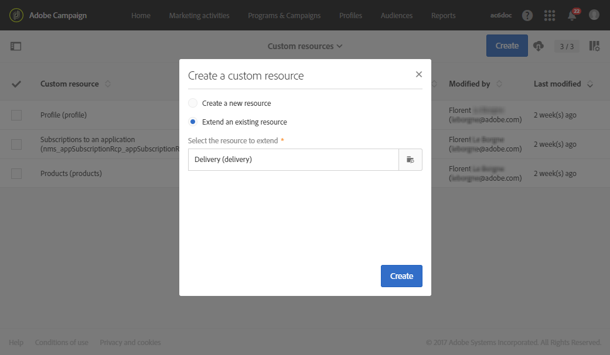

   既存のリソースの拡張について詳しくは、[ リソースの定義](../../developing/using/creating-or-extending-the-resource.md)を参照してください。

1. **[!UICONTROL Delivery]** リソースで、**[!UICONTROL Filter definition]** タブに移動し、**[!UICONTROL Add an element]**&#x200B;をクリックしてフィルターを作成します。

   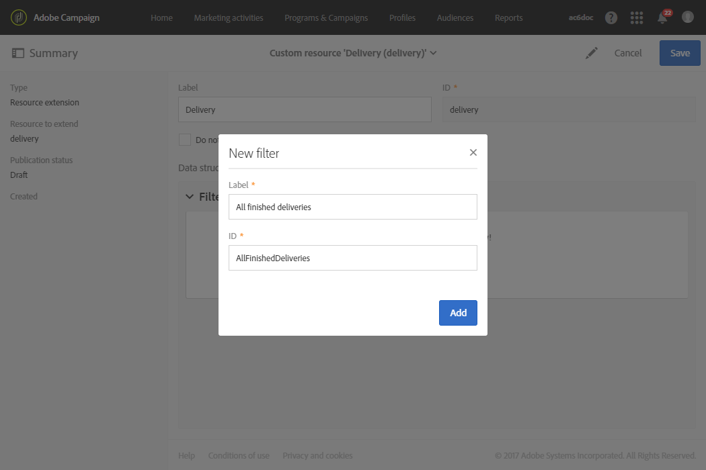

1. 新しいフィルター定義を編集します。**[!UICONTROL Filter definition]** ウィンドウで、**[!UICONTROL Status]**&#x200B;項目をワークスペースにドラッグ&amp;ドロップし、フィルター条件として&#x200B;**[!UICONTROL Finished]**&#x200B;を選択します。

   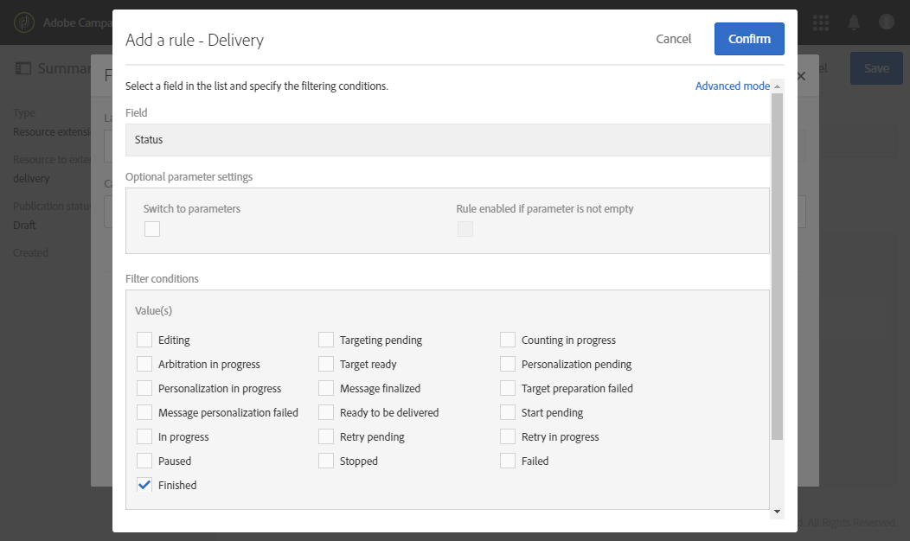

   カスタムフィルターの作成と編集について詳しくは、[ フィルターの定義](../../developing/using/configuring-filter-definition.md)を参照してください。

1. 変更を保存し、リソースを公開します。 詳しくは、[ カスタムリソースの公開](../../developing/using/updating-the-database-structure.md#publishing-a-custom-resource)を参照してください。

   フィルターが作成され、新しい配信アラート基準で選択できるようになります。

1. **[!UICONTROL Administration]** > **[!UICONTROL Channels]** > **[!UICONTROL Delivery alerting]**&#x200B;に移動し、**[!UICONTROL Delivery alerting criteria]**&#x200B;を選択して&#x200B;**[!UICONTROL Create]**&#x200B;をクリックします。
1. **[!UICONTROL Delivery filter applied by this criterion]** ドロップダウンリストで、作成したフィルターを選択します。

   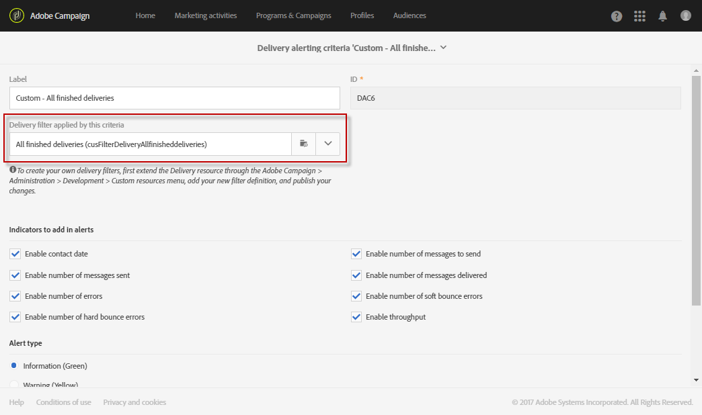

   基準の設定は、デフォルトの基準と同じように定義できます。 アラート条件について[を参照](#about-alerting-criteria)。

作成した条件は、他の条件と同様に、配信アラートダッシュボードに追加できます。 [配信アラートダッシュボードについて](#about-delivery-alerting-dashboards)を参照してください。

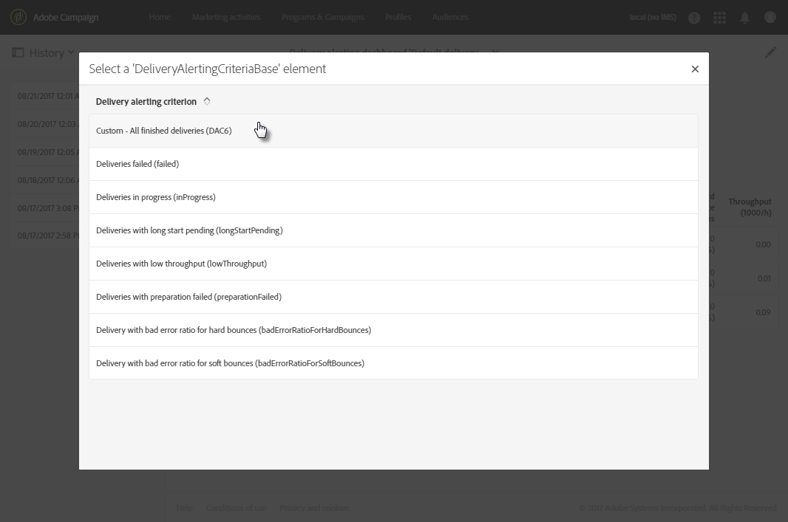

**関連トピック：**

[リソースの追加または拡張](../../developing/using/key-steps-to-add-a-resource.md)

## 配信アラートパラメーター {#delivery-alerting-parameters}

### 条件パラメーター {#criteria-parameters}

[配信アラートダッシュボード ](#creating-a-delivery-alerting-dashboard)の「**[!UICONTROL Criteria parameters]**」タブで、このダッシュボードで選択した条件に適用される設定を定義できます。

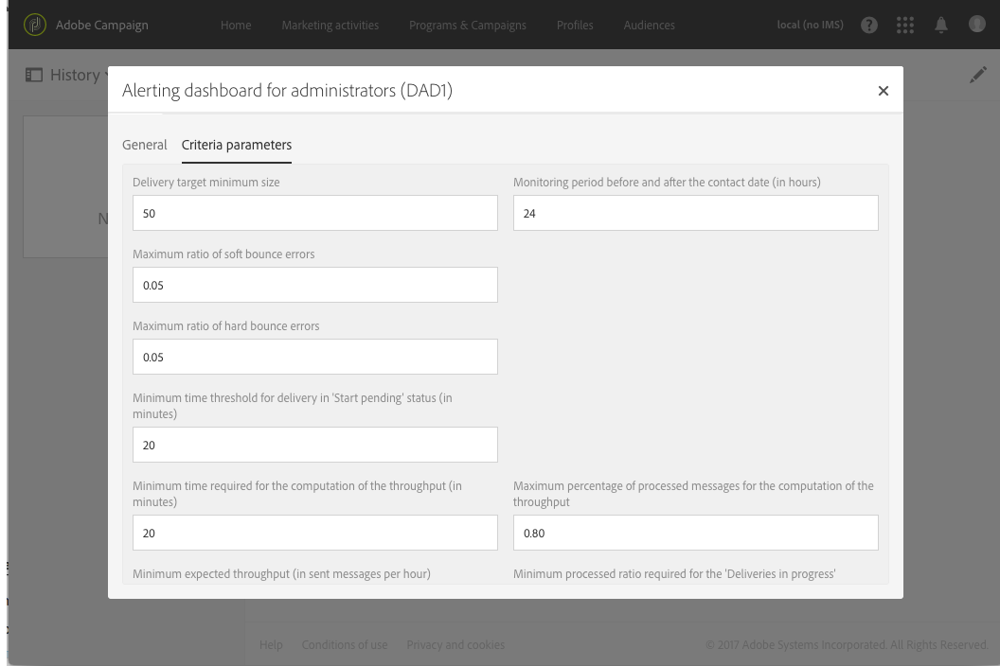

* **[!UICONTROL Delivery target minimum size]**：例えば、このフィールドに100と入力すると、ターゲットが100人以上の受信者の配信に対してのみ通知が送信されます。 このパラメーターは、すべての条件に適用されます。
* **[!UICONTROL Monitoring period before and after the contact date (in hours)]**：現在の時刻の前後の時間数。 この時間範囲内に連絡日がある配信のみが考慮されます。 このパラメーターは、すべての条件に適用されます。 デフォルトでは、このフィールドの値は 24 時間に設定されています。

  連絡日について詳しくは、[ スケジュールについて](../../sending/using/about-scheduling-messages.md)を参照してください。

* **[!UICONTROL Maximum ratio of soft bounce errors]**: ソフトバウンスのエラー率が指定された値を超えるすべての配信に対して通知が送信されます。 デフォルトでは、このフィールドの値は 0.05（5%）に設定されます。

  ソフトバウンスエラーについて詳しくは、[ バウンスメールの選定](../../sending/using/understanding-delivery-failures.md#bounce-mail-qualification)および[配信エラーの種類の一覧](../../sending/using/understanding-delivery-failures.md#delivery-failure-types-and-reasons)を参照してください。

* **[!UICONTROL Maximum ratio of hard bounce errors]**: ハードバウンスのエラー率が指定された値を超えるすべての配信に対して通知が送信されます。 デフォルトでは、このフィールドの値は 0.05（5%）に設定されます。

  ハードバウンスのエラーについて詳しくは、[ バウンスメールの選定](../../sending/using/understanding-delivery-failures.md#bounce-mail-qualification)および[配信エラーの種類の一覧](../../sending/using/understanding-delivery-failures.md#delivery-failure-types-and-reasons)を参照してください。

* **[!UICONTROL Minimum time threshold for delivery in 'Start pending' status (in minutes)]**：このフィールドで指定された期間より長い&#x200B;**[!UICONTROL Start pending]** ステータスの配信すべてに対して通知が送信されます。**[!UICONTROL Start pending]** ステータスは、メッセージがまだシステムで考慮されていないことを意味します。
* **[!UICONTROL Minimum time required for the computation of the throughput (in minutes)]**：指定された期間を超える配信のみが開始されました（**[!UICONTROL In progress]** ステータス）が、**[!UICONTROL Deliveries with low throughput]**&#x200B;条件に考慮されます。
* **[!UICONTROL Maximum percentage of processed messages for the computation of the throughput]**：処理済みメッセージの割合が指定された割合より低い配信のみが、**[!UICONTROL Deliveries with low throughput]**&#x200B;条件に考慮されます。
* **[!UICONTROL Minimum expected throughput (in sent messages per hour)]**: スループットが指定された値より低い配信のみが、**[!UICONTROL Deliveries with low throughput]**&#x200B;条件に考慮されます。
* **[!UICONTROL Minimum processed ratio required for 'Deliveries in progress' criterion]**：処理済みメッセージの割合が指定された割合を超える配信のみが考慮されます。

### アラート頻度 {#alerting-frequency}

**[!UICONTROL Frequency of delivery alerting]** オプションを使用すると、2つのアラート送信間の遅延を定義できます。 デフォルトでは、10分に設定されています。

この設定は、**[!UICONTROL Administration]** > **[!UICONTROL Application settings]** > **[!UICONTROL Options]** メニューから変更できます。

>[!NOTE]
>
>このオプションは、Adobe Campaignで定義されているすべてのダッシュボードに適用されます。 ダッシュボードごとに特定の頻度を設定することはできません。

## 配信アラート理由 {#delivery-alerting-reasons}

**配信アラート**&#x200B;機能は、関連するすべてのAdobe Campaign ユーザーにメールとダッシュボードを介して、配信の実行ステータスに関する情報を自動的に通知します。

配信アラート通知を受け取ったら、次に実行できる操作に関するヒントをいくつか紹介します。

まず、配信の「**ログ**」タブを確認して、配信とプルーフに関連するすべての情報を表示します。 赤と黄色のアイコンを使用すると、エラーや警告を識別できます。 赤いアイコンは、配信の開始を妨げる重大なエラーを示します。

配信が発生するたびに履歴を表示するには、「**[!UICONTROL Sending logs]**」タブを選択します。 送信されたメッセージとそのステータスのリストが含まれます。 そこで、各受信者の配信ステータスを確認できます（**[!UICONTROL Sent]**、**[!UICONTROL Pending]**、**[!UICONTROL Failed]**&#x200B;など）。 詳しくは、「[ ログの送信](../../sending/using/monitoring-a-delivery.md#sending-logs)」を参照してください。

配信に対して満たされる基準に従ってアラート通知を受信する理由を、いくつか示します。

* **[!UICONTROL Deliveries failed]**：この条件は、間違ったステータスを持つすべての配信を通知します。 それは次のことが原因である可能性があります。

   * 配信サーバー（MTA、Message Transfer Agent）の問題
   * Adobe Campaign配信サーバーと受信サーバー間の接続タイムアウト
   * 配信品質の問題
   * 誤ったワークフロー

  配信がワークフローでトリガーされた場合は、そのワークフローが正しく開始されたかどうかを確認します。 詳しくは、「[ ワークフローの実行](../../automating/using/about-workflow-execution.md)」を参照してください。 それ以外の場合は、Adobe Campaign管理者に連絡して問題を解決してください。

* **[!UICONTROL Deliveries with preparation failed]**：次の場合、配信準備中にエラーが発生する可能性があります。

   * 配信に件名がありません。
   * パーソナライゼーションフィールドの構文が間違っています。
   * ターゲットがありません。
   * 配信がサイズ制限を超えています。

  詳しくは、[送信の準備](../../sending/using/preparing-the-send.md)を参照してください。 ただし、これらのエラーは一般的に、メッセージの分析中に検出されます。 [ コントロールルール ](../../sending/using/control-rules.md)を参照してください。

* **[!UICONTROL Delivery with bad error ratio for soft bounces]** アラートの考えられる原因は次のとおりです。

   * 受信者のサーバーが停止しています。
   * 受信者のメールボックスがいっぱいです。

  詳細については、配信ログの&#x200B;**[!UICONTROL Exclusion logs]**&#x200B;および&#x200B;**[!UICONTROL Exclusion causes]** タブを確認してください。 [除外ログ ](../../sending/using/monitoring-a-delivery.md#exclusion-logs)を参照してください。

  **[!UICONTROL Delivery with bad error ratio for hard bounces]** アラートの考えられる原因は次のとおりです。

   * 受信者はメールの受信者ブロックリストに追加されます。つまり、受信者に連絡する必要がなくなります。
   * 受信者の電子メールアドレスが存在しません。
   * 受信者のドメインが存在しません。
   * 受信者のサーバーが配信をブロックしています。

  ソフトエラーとハードバウンスのエラーを回避するには、次のベストプラクティスに従います。

   * フィルターのタイポロジルールを作成して、配信分析中にメッセージターゲットの一部（強制隔離された受信者など）を除外します。 [ フィルタリングルールの作成](../../sending/using/filtering-rules.md)を参照してください。
   * 適切な隔離管理プロセスを維持するために、顧客データベースを定期的に更新します。 [強制隔離について](../../sending/using/understanding-quarantine-management.md#about-quarantines)を参照してください。
   * 一般的に、配信品質は可能な限り向上させましょう。 詳しくは、Adobe Campaign [配信品質](../../sending/using/about-deliverability.md)の詳細ドキュメントを参照し、Adobe Campaign管理者にお問い合わせください。

* **[!UICONTROL Deliveries with long start pending]**：通常、これは、MTA （Message Transfer Agent）レベルで問題が発生していることを意味します。 実行プロセスが、リソースが使用可能になるのを待っています。 MTA が開始されていない可能性があります。

  **[!UICONTROL Deliveries with low throughput]**：繰り返しますが、これはMTAが低速すぎることを意味する配信品質の問題です。

  これらの問題について詳しくは、Adobe Campaign管理者にお問い合わせください。

**関連トピック：**

* [配信エラーについて](../../sending/using/understanding-delivery-failures.md)
* [強制隔離管理について](../../sending/using/understanding-quarantine-management.md)
* [Campaign のオプトインとオプトアウトについて](../../audiences/using/about-opt-in-and-opt-out-in-campaign.md)
