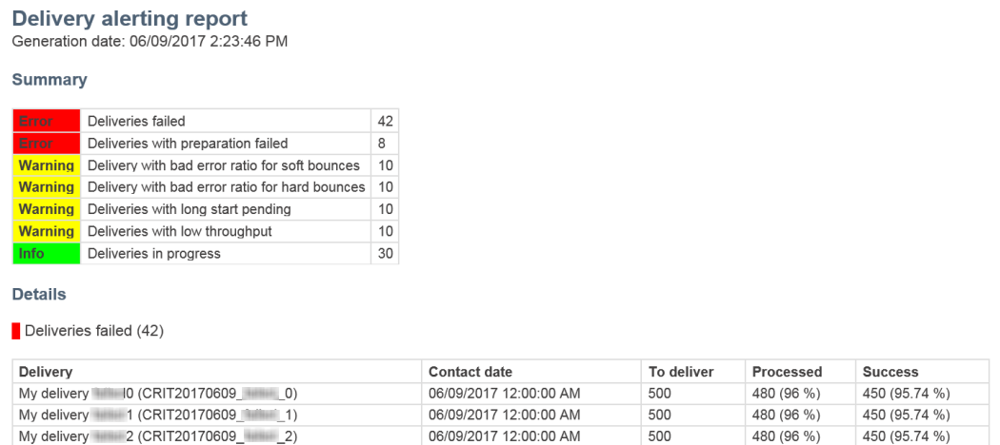

# エラー発生時のアラートの受信{#receiving-alerts-when-failures-happen}

## 配信アラート{#about-delivery-alerting}について

**配信アラート**&#x200B;機能は、配信の実行に関する情報を含む通知を、ユーザーのグループが自動的に受け取れるようにするアラート管理システムです。

送信される通知には、デフォルトで次の条件に基づくレポートが含まれます。

* 失敗した配信
* 準備に失敗した配信
* ソフトバウンス誤差率が悪い配信
* ハードバウンスエラーの割合が悪い配信
* 配信のステータスが通常より長い
* 低スループットの配信
* 進行中の配信

アラートの受信者は、Adobe Campaignが処理している配信を監視し、実行に問題がある場合に適切な処理を行うことができます。

これらのアラート通知は、Adobe Campaign・インタフェースのダッシュボードを通じて定義される特定のアラート基準に応じてカスタマイズできます。

>[!NOTE]
>
>警告通知は電子メールでのみ配信されます。

送信される通知には、次の内容が含まれます。

* 定義した条件に一致する配信数と、各条件に選択したラベル/色を表示する&#x200B;**[!UICONTROL Summary]**。
* 対応するダッシュボードに定義されたすべての配信条件と、各条件のすべての配信を一覧表示する&#x200B;**[!UICONTROL Details]**&#x200B;セクション。

## 配信警告ダッシュボード{#delivery-alerting-dashboards}

### 配信警告ダッシュボードについて{#about-delivery-alerting-dashboards}

通知の受信者を管理するには、アラート条件を定義し、アラートの履歴にアクセスする必要があります。ダッシュボードを使用する必要があります。

>[!NOTE]
>
>ダッシュボードと警告条件にアクセスして設定するには、管理権限があるか、**配信スーパーバイザ**&#x200B;セキュリティグループに表示される必要があります。 標準ユーザーは、Adobe Campaignインターフェイスのダッシュボードにアクセスできません。 通知を受け取ることは、通知を受け取ることだけが可能です。 Adobe Campaign内のユーザーとセキュリティについて詳しくは、[ユーザーの種類](../../administration/using/users-management.md)および[セキュリティグループ](../../administration/using/managing-groups-and-users.md#about-security-groups)を参照してください。

Adobe Campaignインターフェイスから、次の操作を実行できます。

* 配信の警告ダッシュボードを作成および管理します。 「[配信警告ダッシュボードの作成](#creating-a-delivery-alerting-dashboard)」を参照してください。
* 各ダッシュボードの配信アラート条件を定義し、管理します。 例えば、準備に失敗した配信や、スループットが低い配信に基づいたアラートを作成できます。 [アラート条件](#about-alerting-criteria)についてを参照してください。
* 各ダッシュボードの条件パラメーターを変更します。 「[条件のパラメーター](#criteria-parameters)」を参照してください。
* 各ダッシュボードの受信者のグループを定義します。

   例えば、失敗した配信のみの管理権限を持つユーザーに通知するとします。 ただし、マーケティングユーザーに、ソフトバウンスの不良エラー率の配信に関する情報を受け取ってもらいたい場合。 したがって、2つの異なるダッシュボードを作成し、受信者の各グループに対して必要な条件を定義する必要があります。

* 各ダッシュボードのすべての送信済みアラートの履歴にアクセスします。

   ダッシュボードを選択すると、デフォルトでは、このダッシュボードに対する最後の送信警告が表示されます。 送信されたすべてのアラートが画面の左側に表示されます。 **[!UICONTROL History]**&#x200B;リスト内のアイテムをクリックして、対応するアラートにアクセスします。

### 配信警告ダッシュボードの作成{#creating-a-delivery-alerting-dashboard}

特定の条件に基づいて異なるユーザーグループに通知を送信する場合は、複数のダッシュボードを使用する必要があります。 新しいダッシュボードを作成するには：

1. **[!UICONTROL Administration]** > **[!UICONTROL Channels]** > **[!UICONTROL Delivery alerting]**&#x200B;に移動してください。
1. 「**[!UICONTROL Delivery alerting dashboards]**」を選択し、「**[!UICONTROL Create]**」をクリックします。
1. **[!UICONTROL Enabled]**&#x200B;ボックスをオンにして、現在のダッシュボードをアクティブにします。

   このオプションを無効にすると、このダッシュボードにリンクされている通知は送信されなくなります。 このオプションはデフォルトでは無効です。

   

1. **[!UICONTROL Alert group]**&#x200B;ドロップダウンリストから通知する受信者のグループを選択します。 グループを変更または作成する方法については、[セキュリティグループの作成とユーザーの割り当て](../../administration/using/managing-groups-and-users.md#creating-a-security-group-and-assigning-users)を参照してください。
1. 「**[!UICONTROL Delivery alerting criteria]**」セクションで、「**[!UICONTROL Create element]**」をクリックして条件を追加します。 [アラート条件](#about-alerting-criteria)についてを参照してください。
1. 「**[!UICONTROL Edit properties]**」ボタンをクリックします。**[!UICONTROL Criteria parameters]**&#x200B;タブで、条件の適用方法を定義します。 「[条件のパラメーター](#criteria-parameters)」を参照してください。
1. **[!UICONTROL Create]**&#x200B;をクリックしてダッシュボードを保存します。

現在は、配信がこのダッシュボードで定義した基準を満たすたびに、指定したユーザーのグループに警告通知が送信されます。

## 配信警告条件{#delivery-alerting-criteria}

### アラート条件について{#about-alerting-criteria}

配信警告条件にアクセスするには、**[!UICONTROL Administration]** > **[!UICONTROL Channels]** > **[!UICONTROL Delivery alerting]**&#x200B;に移動し、**[!UICONTROL Delivery alerting criteria]**&#x200B;を選択します。

配信の警告ダッシュボードでは、次の基準を使用できます。

* **[!UICONTROL Deliveries failed]**:定義された範囲内でスケジュールされた配信。ステータスに誤りがあります。
* **[!UICONTROL Deliveries with preparation failed]**:定義された範囲内で変更された配信で、準備手順(ターゲットの計算とコンテンツの生成)が失敗した場合。詳しくは、[送信の準備](../../sending/using/preparing-the-send.md)を参照してください。
* **[!UICONTROL Delivery with bad error ratio for soft bounces]**:定義した範囲内にスケジュールされ、少なくともステータスが「ソフトバウンス誤差率」で、定義した割合 **[!UICONTROL In progress]**&#x200B;を超える配信。
* **[!UICONTROL Delivery with bad error ratio for hard bounces]**:定義した範囲内にスケジュールされた配信(少なくともステータス **[!UICONTROL In progress]**、ハードバウンス誤差率が定義した割合を超える)。
* **[!UICONTROL Deliveries with long start pending]**:定義された範囲内でスケジュールされた配信(定義された期間より長い **[!UICONTROL Start pending]** ステータスを持つ)。 **[!UICONTROL Start pending]** ステータスとは、メッセージがまだシステムによって考慮されていないことを意味します。
* **[!UICONTROL Deliveries with low throughput]**:配信が定義された長さを超えて開始され、処理されたメッセージの割合が定義された割合を下回り、定義された値より低いスループットを持ちます。
* **[!UICONTROL Deliveries in progress]**:定義した範囲内でスケジュールされた配信( **[!UICONTROL In progress]** ステータス)。

>[!NOTE]
>
>上記の条件に適用するすべてのパラメーターには、デフォルト値が設定されています。 これらの値は、配信警告ダッシュボードの&#x200B;**[!UICONTROL Criteria parameters]**&#x200B;タブで変更できます。 「[条件のパラメーター](#criteria-parameters)」を参照してください。

**[!UICONTROL Delivery alerting criteria]**&#x200B;リストから任意の項目を選択して、その詳細にアクセスできます。

各条件に対して、次の設定を定義できます。

* **[!UICONTROL Indicators to add in alerts]**&#x200B;を指定します。これは、選択した条件に対応する配信の通知の **[!UICONTROL Details]** セクションに表示される列を意味します。

   

* **[!UICONTROL Alert type]**(通知の概要内の配信条件の横に表示されるラベルと色)を指定します。

   

* **[!UICONTROL Criteria frequency]**:1つの配信に対して条件が満たされた場合、監視期間内に送信される各通知でその条件が繰り返されます。それ以外の場合は、1つの配信に対するアラート条件に基づき、1日（最初の発生時）に1つのアラートのみが送信されます。

   デフォルトでは、すべての条件に対して、このオプションは1日に1回に設定されています。

**関連トピック：**

* [ログの送信](../../sending/using/monitoring-a-delivery.md#sending-logs)
* [警告頻度](#alerting-frequency)
* [マーケティングアクティビティのアイコンとステータス](../../start/using/marketing-activities.md#marketing-activity-icons-and-statuses)

### 配信警告条件の作成{#creating-a-delivery-alerting-criterion}

ニーズに合わせて新しい配信アラート条件を作成できます。

例えば、新しい条件を作成して、**[!UICONTROL Finished]**&#x200B;ステータスのすべての配信を一覧表示する通知を送信できます。

これを行うには、まず&#x200B;**配信**&#x200B;リソースを拡張し、新しいフィルターを追加して、**[!UICONTROL Finished]**&#x200B;ステータスの配信のみを選択できるようにする必要があります。

1. **Adobe Campaign**/**管理**/**開発**/**カスタムリソース**&#x200B;に移動し、**[!UICONTROL Create]**&#x200B;をクリックします。
1. **[!UICONTROL Extend an existing resource]**&#x200B;を選択し、ドロップダウンリストから&#x200B;**[!UICONTROL Delivery]**&#x200B;リソースを選択して、**[!UICONTROL Create]**&#x200B;をクリックして編集します。

   

   既存のリソースの拡張について詳しくは、[リソース](../../developing/using/creating-or-extending-the-resource.md)の定義を参照してください。

1. **[!UICONTROL Delivery]**&#x200B;リソースで、**[!UICONTROL Filter definition]**&#x200B;タブに移動し、**[!UICONTROL Add an element]**&#x200B;をクリックしてフィルターを作成します。

   

1. 新しいフィルター定義を編集します。**[!UICONTROL Filter definition]**&#x200B;ウィンドウで、**[!UICONTROL Status]**&#x200B;アイテムをワークスペースにドラッグ&amp;ドロップし、フィルター条件として&#x200B;**[!UICONTROL Finished]**&#x200B;を選択します。

   

   カスタムフィルターの作成と編集について詳しくは、[フィルターの定義](../../developing/using/configuring-filter-definition.md)を参照してください。

1. 変更を保存し、リソースを発行します。 詳しくは、[カスタムリソースの発行](../../developing/using/updating-the-database-structure.md#publishing-a-custom-resource)を参照してください。

   フィルタが作成され、新しい配信アラート条件で選択できるようになります。

1. **[!UICONTROL Administration]** > **[!UICONTROL Channels]** > **[!UICONTROL Delivery alerting]**&#x200B;に移動し、**[!UICONTROL Delivery alerting criteria]**&#x200B;を選択して&#x200B;**[!UICONTROL Create]**&#x200B;をクリックします。
1. **[!UICONTROL Delivery filter applied by this criterion]**&#x200B;ドロップダウンリストで、作成したフィルターを選択します。

   

   既定の条件と同様に、条件の設定を定義できます。 [アラート条件](#about-alerting-criteria)についてを参照してください。

作成した条件は、配信の警告ダッシュボードに加え、他の条件にも追加できます。 [配信警告ダッシュボードについて](#about-delivery-alerting-dashboards)を参照してください。

**関連トピック：**

[リソースの追加または拡張](../../developing/using/key-steps-to-add-a-resource.md)

## 配信警告パラメータ{#delivery-alerting-parameters}

### 条件パラメーター{#criteria-parameters}

[配信警告ダッシュボード](#creating-a-delivery-alerting-dashboard)の&#x200B;**[!UICONTROL Criteria parameters]**&#x200B;タブで、このダッシュボードで選択した条件に適用する設定を定義できます。

* **[!UICONTROL Delivery target minimum size]**:例えば、このフィールドに100と入力した場合、100受信者以上のターゲットを持つ配信に対してのみ通知が送信されます。このパラメーターはすべての条件に適用されます。
* **[!UICONTROL Monitoring period before and after the contact date (in hours)]**:現在時刻の前後の時間数。この時間範囲の連絡日を持つ配信のみが考慮されます。 このパラメーターはすべての条件に適用されます。 デフォルトでは、このフィールドの値は24時間に設定されています。

   連絡先の日付について詳しくは、[スケジュール](../../sending/using/about-scheduling-messages.md)についてを参照してください。

* **[!UICONTROL Maximum ratio of soft bounce errors]**:指定した値より大きいソフトバウンスエラーの比率を持つすべての配信に対して通知が送信されます。デフォルトでは、このフィールドの値は0.05(5%)に設定されています。

   ソフトバウンスエラーの詳細については、[バウンスメールの資格](../../sending/using/understanding-delivery-failures.md#bounce-mail-qualification)と[配信障害のタイプのリスト](../../sending/using/understanding-delivery-failures.md#delivery-failure-types-and-reasons)を参照してください。

* **[!UICONTROL Maximum ratio of hard bounce errors]**:ハードバウンスエラーの割合が指定値より大きいすべての配信に対して通知が送信されます。デフォルトでは、このフィールドの値は0.05(5%)に設定されています。

   ハードバウンスのエラーについて詳しくは、[バウンスメールの資格](../../sending/using/understanding-delivery-failures.md#bounce-mail-qualification)と[配信の失敗タイプのリスト](../../sending/using/understanding-delivery-failures.md#delivery-failure-types-and-reasons)を参照してください。

* **[!UICONTROL Minimum time threshold for delivery in 'Start pending' status (in minutes)]**:このフィールドで指定した期間より長い **[!UICONTROL Start pending]** ステータスを持つすべての配信に対して、通知が送信されます。つまり、 **[!UICONTROL Start pending]** ステータスは、メッセージがまだシステムで考慮されていないことを意味します。
* **[!UICONTROL Minimum time required for the computation of the throughput (in minutes)]**:指定した期間より長い期間に対して開始された( **[!UICONTROL In progress]** ステータスの)配信のみが、 **[!UICONTROL Deliveries with low throughput]** 条件に考慮されます。
* **[!UICONTROL Maximum percentage of processed messages for the computation of the throughput]**:処理された配信の割合が指定した割合より低い場合のみ、 **[!UICONTROL Deliveries with low throughput]** 基準が考慮されます。
* **[!UICONTROL Minimum expected throughput (in sent messages per hour)]**:指定した値より低いスループットを持つ配信のみが **[!UICONTROL Deliveries with low throughput]** 基準となります。
* **[!UICONTROL Minimum processed ratio required for 'Deliveries in progress' criterion]**:処理済み配信の割合が指定した割合を超えるメッセージのみが考慮されます。

### 警告頻度{#alerting-frequency}

**[!UICONTROL Frequency of delivery alerting]**&#x200B;オプションを使用すると、2つのアラート送信間の遅延を定義できます。 デフォルトでは、10分に設定されています。

この設定は、**[!UICONTROL Administration]** > **[!UICONTROL Application settings]** > **[!UICONTROL Options]**&#x200B;メニューで変更できます。

>[!NOTE]
>
>このオプションは、Adobe Campaignで定義されているすべてのダッシュボードに適用されます。 各ダッシュボードに特定の頻度を設定することはできません。

## 配信警告理由{#delivery-alerting-reasons}

**配信警告**&#x200B;機能を使用すると、関連するすべてのAdobe Campaignユーザーに対し、配信の実行状況に関する情報が電子メールおよびダッシュボードで自動的に通知されます。

配信警告通知を受け取ったら、実行できる操作に関するヒントを以下に示します。

まず、配信の&#x200B;**Log**&#x200B;タブをチェックし、配信と配達確認に関するすべての情報を表示します。 赤と黄色のアイコンを使用すると、エラーや警告を識別できます。 赤いアイコンは、配信を起動できない重大なエラーを示します。

配信のすべてのオカレンスの履歴を表示するには、「**[!UICONTROL Sending logs]**」タブを選択します。 送信されたメッセージのリストと、そのステータスが含まれます。 各受信者（**[!UICONTROL Sent]**、**[!UICONTROL Pending]**、**[!UICONTROL Failed]**&#x200B;など）の配信ステータスを確認できます。 詳しくは、[ログの送信](../../sending/using/monitoring-a-delivery.md#sending-logs)を参照してください。

配信で満たされた基準に従ってアラート通知を受信する理由は、次のとおりです。

* **[!UICONTROL Deliveries failed]**:この条件は、誤ったステータスのすべての配信を通知します。次の原因が考えられます。

   * 配信サーバー(MTA、Message Transfer Agent)の問題
   * Adobe Campaign配信サーバと受信サーバとの接続タイムアウト
   * 配信品質の問題
   * 誤ったワークフロー

   ワークフローで配信がトリガーされる場合は、そのワークフローが正しく開始されているかどうかを確認します。 詳しくは、[ワークフローの実行](../../automating/using/about-workflow-execution.md)を参照してください。 それ以外の場合は、Adobe Campaign管理者に問い合わせて問題を解決してください。

* **[!UICONTROL Deliveries with preparation failed]**:次の場合、配信の準備中にエラーが発生する可能性があります。

   * 配信に件名がありません。
   * パーソナライゼーションフィールドに誤った構文があります。
   * ターゲットが見つかりません。
   * 配信がサイズ制限を超えています。

   詳しくは、[送信の準備](../../sending/using/preparing-the-send.md)を参照してください。 ただし、これらのエラーは通常、メッセージの分析中に発見されます。 [制御規則](../../sending/using/control-rules.md)を参照してください。

* **[!UICONTROL Delivery with bad error ratio for soft bounces]**&#x200B;アラートの原因として考えられるのは、次のような場合です。

   * 受信者のサーバーがダウンしています。
   * 受信者のメールボックスがいっぱいです。

   詳しくは、配信ログの&#x200B;**[!UICONTROL Exclusion logs]**&#x200B;タブと&#x200B;**[!UICONTROL Exclusion causes]**&#x200B;タブを確認してください。 「[除外ログ](../../sending/using/monitoring-a-delivery.md#exclusion-logs)」を参照してください。

   **[!UICONTROL Delivery with bad error ratio for hard bounces]**&#x200B;アラートの原因として考えられるのは、次のような場合です。

   * 受信者がブロックリストに追加されます。つまり、ユーザーに連絡を取りたくなくなります。
   * 受信者の電子メールアドレスが存在しません。
   * 受信者のドメインが存在しません。
   * 受信者のサーバーが配信をブロックしています。

   ソフトバウンスとハードバウンスのエラーを回避するには、次のベストプラクティスに従ってください。

   * 配信分析中にメッセージターゲットの一部(検疫済み受信者など)を除外するフィルタータイポロジルールを作成します。 「[フィルタリングルールの作成](../../sending/using/filtering-rules.md)」を参照してください。
   * 適切な強制隔離管理プロセスを維持するために、お客様のデータベースを定期的に更新します。 [強制隔離について](../../sending/using/understanding-quarantine-management.md#about-quarantines)を参照してください。
   * 一般的に、配信品質はできる限り向上します。 Adobe Campaign[配信品質](../../sending/using/about-deliverability.md)の詳細なドキュメントを参照し、Adobe Campaign管理者に問い合わせてください。

* **[!UICONTROL Deliveries with long start pending]**:通常、これは、MTA(Message Transfer Agent)レベルに問題があることを意味します。実行プロセスが、リソースが使用可能になるのを待っています。MTA が開始されていない可能性があります。

   **[!UICONTROL Deliveries with low throughput]**:繰り返しますが、これは配信品質の問題で、MTAの速度が遅すぎます。

   これらの問題の詳細については、Adobe Campaign管理者にお問い合わせください。

**関連トピック：**

* [配信エラーの理解](../../sending/using/understanding-delivery-failures.md)
* [強制隔離管理の理解](../../sending/using/understanding-quarantine-management.md)
* [Campaign のオプトインとオプトアウトについて](../../audiences/using/about-opt-in-and-opt-out-in-campaign.md)

