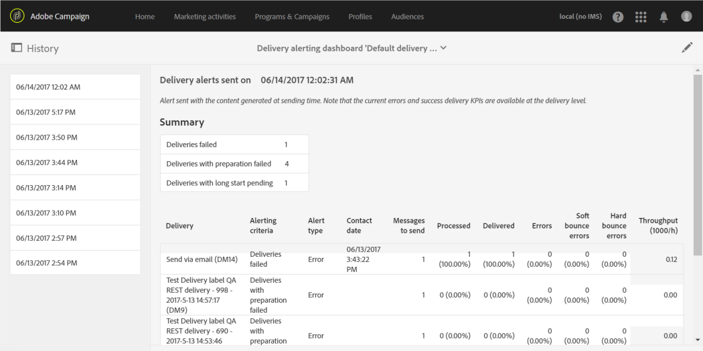

# エラー発生時のアラートの受信{#receiving-alerts-when-failures-happen}

## 配信アラートについて {#about-delivery-alerting}

**配信アラート**&#x200B;機能は、配信の実行に関する情報を含む通知をユーザーのグループが自動的に受け取れるようにするアラート管理システムです。

送信される通知には、次の条件に基づくデフォルトのレポートが含まれます。

* 失敗した配信
* 準備に失敗した配信
* ソフトバウンスエラー率が正しくない配信
* ハードバウンスのエラー率が悪い配信
* 保留中ステータスが通常より長い配信
* スループットの低い配信
* 処理中の配信

アラートの受信者は、Adobe Campaignが処理している配信を監視し、実行に問題がある場合は適切なアクションを実行できます。

これらのアラート通知は、Adobe Campaignインターフェイスのダッシュボードを通じて定義される特定のアラート条件に応じてカスタマイズできます。

>[!NOTE]
>
>アラート通知は、Eメールでのみ配信されます。

送信される通知には、次の内容が含まれます。

* 定義した条件に一致する配信の数と、各条件で選択したラベル/色を表示する&#x200B;**[!UICONTROL Summary]**。
* 対応するダッシュボードに定義されたすべての配信条件と、各条件のすべての配信のリストを示す&#x200B;**[!UICONTROL Details]**&#x200B;セクション。

## 配信アラートダッシュボード {#delivery-alerting-dashboards}

### 配信アラートダッシュボードについて {#about-delivery-alerting-dashboards}

通知の受信者を管理するには、アラート条件を定義し、アラートの履歴にアクセスするには、ダッシュボードを使用する必要があります。

>[!NOTE]
>
>ダッシュボードと警告条件にアクセスして設定するには、管理権限を持っているか、**配信スーパーバイザー**&#x200B;セキュリティグループに表示されている必要があります。 標準ユーザーは、Adobe Campaignインターフェイスでダッシュボードにアクセスできません。 アラート通知のみを受け取ることができます。 Adobe Campaignのユーザーとセキュリティについて詳しくは、[ユーザーのタイプ](../../administration/using/users-management.md)および[セキュリティグループ](../../administration/using/managing-groups-and-users.md#about-security-groups)を参照してください。

Adobe Campaignインターフェイスから、次の操作を実行できます。

* 配信アラートダッシュボードを作成および管理します。 [配信アラートダッシュボードの作成](#creating-a-delivery-alerting-dashboard)を参照してください。
* 各ダッシュボードの配信アラート条件を定義および管理します。 例えば、準備に失敗した配信や、スループットの低い配信のみに基づいてアラートを作成できます。 [アラート条件](#about-alerting-criteria)についてを参照してください。
* 各ダッシュボードの条件パラメーターを変更します。 [条件のパラメーター](#criteria-parameters)を参照してください。
* 各ダッシュボードに受信者のグループを定義します。

   例えば、失敗した配信の管理権限のみを持つユーザーに通知するとします。 ただし、誤り率がソフトバウンスでエラー率が悪い配信に関する情報をマーケティングユーザーに受け取ってもらいたい場合があります。 したがって、2つの異なるダッシュボードを作成し、受信者の各グループに必要な条件を定義する必要があります。

* 各ダッシュボードの送信済みアラートの履歴にアクセスする。

   ダッシュボードを選択すると、デフォルトでは、このダッシュボードに対して最後に送信されたアラートが表示されます。 すべての送信済みアラートが画面の左側に表示されます。 **[!UICONTROL History]**&#x200B;リスト内の項目をクリックして、対応するアラートにアクセスします。

### 配信アラートダッシュボードの作成 {#creating-a-delivery-alerting-dashboard}

特定の条件に基づいて通知を様々なユーザーグループに送信する場合は、複数のダッシュボードを使用する必要があります。 新しいダッシュボードを作成するには：

1. **[!UICONTROL Administration]** > **[!UICONTROL Channels]** > **[!UICONTROL Delivery alerting]**&#x200B;に移動してください。
1. 「**[!UICONTROL Delivery alerting dashboards]**」を選択し、「**[!UICONTROL Create]**」をクリックします。
1. **[!UICONTROL Enabled]**&#x200B;ボックスをオンにして、現在のダッシュボードをアクティブにします。

   このオプションを無効にすると、このダッシュボードにリンクされた通知は送信されなくなります。 このオプションはデフォルトでは無効です。

   

1. 通知する受信者のグループを「**[!UICONTROL Alert group]**」ドロップダウンリストから選択します。 グループを変更または作成するには、[セキュリティグループの作成とユーザーの割り当て](../../administration/using/managing-groups-and-users.md#creating-a-security-group-and-assigning-users)を参照してください。
1. 「**[!UICONTROL Delivery alerting criteria]**」セクションで、「**[!UICONTROL Create element]**」をクリックして条件を追加します。 [アラート条件](#about-alerting-criteria)についてを参照してください。
1. 「**[!UICONTROL Edit properties]**」ボタンをクリックします。「**[!UICONTROL Criteria parameters]**」タブで、条件の適用方法を定義します。 [条件のパラメーター](#criteria-parameters)を参照してください。
1. 「**[!UICONTROL Create]**」をクリックしてダッシュボードを保存します。

これで、配信がこのダッシュボードで定義した条件を満たすたびに、指定されたユーザーグループにアラート通知が送信されます。

## 配信アラート条件 {#delivery-alerting-criteria}

### アラート条件について {#about-alerting-criteria}

配信アラート条件にアクセスするには、**[!UICONTROL Administration]** / **[!UICONTROL Channels]** / **[!UICONTROL Delivery alerting]**&#x200B;に移動し、「**[!UICONTROL Delivery alerting criteria]**」を選択します。

配信アラートダッシュボードでは、次の条件を使用できます。

* **[!UICONTROL Deliveries failed]**:定義した範囲内でスケジュールされた、エラーのあるステータスを持つ配信。
* **[!UICONTROL Deliveries with preparation failed]**:定義済みの範囲内で変更された配信のうち、準備手順（ターゲットの計算とコンテンツの生成）が失敗したもの。詳しくは、[送信の準備](../../sending/using/preparing-the-send.md)を参照してください。
* **[!UICONTROL Delivery with bad error ratio for soft bounces]**:定義された範囲内でスケジュールされた配信で、少なくともステータスを持ち、ソフトバ **[!UICONTROL In progress]**&#x200B;ウンスエラー率が定義された割合を超えるもの。
* **[!UICONTROL Delivery with bad error ratio for hard bounces]**:定義された範囲内でスケジュールされた配信で、少なくともステータスを持ち、ハ **[!UICONTROL In progress]**&#x200B;ードバウンスエラー率が定義された割合を超えるもの。
* **[!UICONTROL Deliveries with long start pending]**:定義された範囲内でスケジュールされた配信で、ステータス **[!UICONTROL Start pending]** が定義された期間を超える場合 **[!UICONTROL Start pending]** は、ステータスはメッセージがシステムにまだ反映されていないことを意味します。
* **[!UICONTROL Deliveries with low throughput]**:スループットが定義済みの値より低い、定義された処理済みメッセージの割合未満で、定義された期間より長い間配信が開始された。
* **[!UICONTROL Deliveries in progress]**:定義した範囲内でスケジュールされた、ステータスを含 **[!UICONTROL In progress]** む配信。

>[!NOTE]
>
>上記の条件に適用されるすべてのパラメータは、デフォルト値を持ちます。 これらの値は、配信アラートダッシュボードの「**[!UICONTROL Criteria parameters]**」タブで変更できます。 [条件のパラメーター](#criteria-parameters)を参照してください。

**[!UICONTROL Delivery alerting criteria]**&#x200B;リストから任意の項目を選択して、その詳細にアクセスできます。

各条件に対して、次の設定を定義できます。

* **[!UICONTROL Indicators to add in alerts]**：選択した条件に対応する配信の通知 **[!UICONTROL Details]** のセクションに表示される列を意味します。

   

* **[!UICONTROL Alert type]**：通知の概要の配信条件の横に表示されるラベルと色を指します。

   

* **[!UICONTROL Criteria frequency]**:1つの配信に対して満たされた条件は、監視期間内に送信される各通知で繰り返されます。そうしないと、1回の配信に関するアラート条件別に、1日（最初の出現時）に1つのアラートのみ送信されます。

   デフォルトでは、すべての条件に対して、このオプションは1日に1回に設定されています。

**関連トピック：**

* [ログの送信](../../sending/using/monitoring-a-delivery.md#sending-logs)
* [アラート頻度](#alerting-frequency)
* [マーケティングアクティビティのアイコンとステータス](../../start/using/marketing-activities.md#marketing-activity-icons-and-statuses)

### 配信アラート条件の作成 {#creating-a-delivery-alerting-criterion}

ニーズに合わせて新しい配信アラート条件を作成できます。

例えば、ステータスが&#x200B;**[!UICONTROL Finished]**&#x200B;のすべての配信をリストした通知を送信できる新しい条件を作成できます。

そのためには、まず&#x200B;**配信**&#x200B;リソースを拡張し、新しいフィルターを追加して、ステータスが&#x200B;**[!UICONTROL Finished]**&#x200B;の配信のみを選択できるようにする必要があります。

1. **Adobe Campaign** / **管理** / **開発** / **カスタムリソース**&#x200B;に移動し、**[!UICONTROL Create]**&#x200B;をクリックします。
1. **[!UICONTROL Extend an existing resource]**&#x200B;を選択し、ドロップダウンリストから&#x200B;**[!UICONTROL Delivery]**&#x200B;リソースを選択して、「**[!UICONTROL Create]**」をクリックして編集します。

   

   既存のリソースの拡張について詳しくは、「[リソースの定義](../../developing/using/creating-or-extending-the-resource.md)」を参照してください。

1. **[!UICONTROL Delivery]**&#x200B;リソースで、「**[!UICONTROL Filter definition]**」タブに移動し、「**[!UICONTROL Add an element]**」をクリックしてフィルターを作成します。

   

1. 新しいフィルター定義を編集します。**[!UICONTROL Filter definition]**&#x200B;ウィンドウで、**[!UICONTROL Status]**&#x200B;項目をワークスペースにドラッグ&amp;ドロップし、フィルター条件として「**[!UICONTROL Finished]**」を選択します。

   

   カスタムフィルターの作成と編集について詳しくは、[フィルターの定義](../../developing/using/configuring-filter-definition.md)を参照してください。

1. 変更を保存し、リソースを公開します。 詳しくは、[カスタムリソースのパブリッシュ](../../developing/using/updating-the-database-structure.md#publishing-a-custom-resource)を参照してください。

   フィルターが作成され、新しい配信アラート条件で選択できるようになりました。

1. **[!UICONTROL Administration]** > **[!UICONTROL Channels]** > **[!UICONTROL Delivery alerting]**&#x200B;に移動し、「**[!UICONTROL Delivery alerting criteria]**」を選択して「**[!UICONTROL Create]**」をクリックします。
1. **[!UICONTROL Delivery filter applied by this criterion]**&#x200B;ドロップダウンリストで、作成したフィルターを選択します。

   

   デフォルトの条件と同じ方法で条件の設定を定義できます。 [アラート条件](#about-alerting-criteria)についてを参照してください。

作成した条件は、配信アラートダッシュボードやその他の条件に追加できます。 [配信アラートダッシュボード](#about-delivery-alerting-dashboards)についてを参照してください。

**関連トピック：**

[リソースの追加または拡張](../../developing/using/key-steps-to-add-a-resource.md)

## 配信アラートパラメーター {#delivery-alerting-parameters}

### 条件パラメーター {#criteria-parameters}

[配信アラートダッシュボード](#creating-a-delivery-alerting-dashboard)の「**[!UICONTROL Criteria parameters]**」タブで、このダッシュボードで選択した条件に適用する設定を定義できます。

* **[!UICONTROL Delivery target minimum size]**:例えば、このフィールドに100と入力した場合、ターゲットが100人以上の受信者を持つ配信に対してのみ通知が送信されます。このパラメーターは、すべての条件に適用されます。
* **[!UICONTROL Monitoring period before and after the contact date (in hours)]**:現在の時刻の前後の時間数。この期間にコンタクト日が設定された配信のみが考慮されます。 このパラメーターは、すべての条件に適用されます。 デフォルトでは、このフィールドの値は24時間に設定されています。

   コンタクト日の詳細については、[スケジュール](../../sending/using/about-scheduling-messages.md)についてを参照してください。

* **[!UICONTROL Maximum ratio of soft bounce errors]**:ソフトバウンスエラー率が指定値より大きいすべての配信に対して通知が送信されます。デフォルトでは、このフィールドの値は0.05(5%)に設定されています。

   ソフトバウンスエラーについて詳しくは、[バウンスメールの検証](../../sending/using/understanding-delivery-failures.md#bounce-mail-qualification)および[配信エラーのタイプのリスト](../../sending/using/understanding-delivery-failures.md#delivery-failure-types-and-reasons)を参照してください。

* **[!UICONTROL Maximum ratio of hard bounce errors]**:ハードバウンスエラー率が指定値より大きいすべての配信に対して通知が送信されます。デフォルトでは、このフィールドの値は0.05(5%)に設定されています。

   ハードバウンスエラーについて詳しくは、[バウンスメールの検証](../../sending/using/understanding-delivery-failures.md#bounce-mail-qualification)および[配信エラーのタイプのリスト](../../sending/using/understanding-delivery-failures.md#delivery-failure-types-and-reasons)を参照してください。

* **[!UICONTROL Minimum time threshold for delivery in 'Start pending' status (in minutes)]**:ステータスがこのフィールドで指定した期間を超えるすべての配信に対して通知が送信されま **[!UICONTROL Start pending]** す。つまり、ステータス **[!UICONTROL Start pending]** は、メッセージがシステムでまだ考慮されていないことを意味します。
* **[!UICONTROL Minimum time required for the computation of the throughput (in minutes)]**:指定された期間を超えて開 **[!UICONTROL In progress]** 始された（ステータスを持つ）配信のみが条件に含めら **[!UICONTROL Deliveries with low throughput]** れます。
* **[!UICONTROL Maximum percentage of processed messages for the computation of the throughput]**:処理されたメッセージの割合が、指定した割合より低い配信のみが、この条件に対して考慮さ **[!UICONTROL Deliveries with low throughput]** れます。
* **[!UICONTROL Minimum expected throughput (in sent messages per hour)]**:指定した値よりも低いスループットを持つ配信のみが基準に含ま **[!UICONTROL Deliveries with low throughput]** れます。
* **[!UICONTROL Minimum processed ratio required for 'Deliveries in progress' criterion]**:処理されたメッセージの割合が、指定した割合を超える配信のみが考慮されます。

### アラート頻度 {#alerting-frequency}

**[!UICONTROL Frequency of delivery alerting]**&#x200B;オプションを使用すると、2つのアラート送信の間の遅延を定義できます。 デフォルトでは10分に設定されています。

この設定は、**[!UICONTROL Administration]** > **[!UICONTROL Application settings]** > **[!UICONTROL Options]**&#x200B;メニューで変更できます。

>[!NOTE]
>
>このオプションは、Adobe Campaignで定義されているすべてのダッシュボードに適用されます。 各ダッシュボードに特定の頻度を設定することはできません。

## 配信アラート理由 {#delivery-alerting-reasons}

**配信警告**&#x200B;機能を使用すると、関係するすべてのAdobe Campaignユーザーに、Eメールとダッシュボードを通じて、配信実行ステータスが自動的に通知されます。

配信アラート通知を受け取ったら、次に何を行うかに関するヒントを示します。

まず、配信の「**ログ**」タブを確認して、配信と配達確認に関するすべての情報を表示します。 赤と黄色のアイコンを使用して、エラーや警告を識別できます。 赤いアイコンは、配信が開始されない重大なエラーを示します。

配信のすべての発生履歴を表示するには、「**[!UICONTROL Sending logs]**」タブを選択します。 送信されたメッセージとそのステータスのリストが含まれます。 各受信者の配信ステータスを確認できます（ **[!UICONTROL Sent]**、**[!UICONTROL Pending]**、**[!UICONTROL Failed]**&#x200B;など）。 詳しくは、[ログの送信](../../sending/using/monitoring-a-delivery.md#sending-logs)を参照してください。

配信で満たされた条件に従ってアラート通知を受信する理由は、次のとおりです。

* **[!UICONTROL Deliveries failed]**:この条件は、ステータスが誤っているすべての配信を通知します。次の原因が考えられます。

   * 配信サーバー（MTA、メッセージ転送エージェント）に関する問題
   * Adobe Campaign配信サーバーと受信サーバー間の接続タイムアウト
   * 配信品質の問題
   * 誤ったワークフロー

   配信がワークフローでトリガーされる場合は、そのワークフローが正しく開始されたかどうかを確認します。 詳しくは、[ワークフローの実行](../../automating/using/about-workflow-execution.md)を参照してください。 それ以外の場合は、Adobe Campaignの管理者に問い合わせて、問題を解決してください。

* **[!UICONTROL Deliveries with preparation failed]**:次の場合に、配信の準備中にエラーが発生する可能性があります。

   * 配信に件名がありません。
   * パーソナライゼーションフィールドの構文が正しくありません。
   * ターゲットが見つかりません。
   * 配信がサイズ制限を超えています。

   詳しくは、[送信の準備](../../sending/using/preparing-the-send.md)を参照してください。 ただし、通常、これらのエラーはメッセージの分析中に検出されます。 [コントロールルール](../../sending/using/control-rules.md)を参照してください。

* **[!UICONTROL Delivery with bad error ratio for soft bounces]**&#x200B;アラートの考えられる原因は次のとおりです。

   * 受信者のサーバーがダウンしている。
   * 受信者のメールボックスがいっぱいです。

   詳しくは、配信ログの「**[!UICONTROL Exclusion logs]**」タブと「**[!UICONTROL Exclusion causes]**」タブを確認してください。 [除外ログ](../../sending/using/monitoring-a-delivery.md#exclusion-logs)を参照してください。

   **[!UICONTROL Delivery with bad error ratio for hard bounces]**&#x200B;アラートの考えられる原因は次のとおりです。

   * 受信者が「 」に追ブロックリスト加され、今後連絡は希望されなくなります。
   * 受信者のEメールアドレスが存在しません。
   * 受信者のドメインが存在しません。
   * 受信者のサーバーが配信をブロックしています。

   ソフトバウンスおよびハードバウンスのエラーを回避するには、次のベストプラクティスに従います。

   * 強制隔離された受信者など、配信分析の際にメッセージターゲットの一部を除外するフィルタータイポロジルールを作成します。 [フィルタールールの作成](../../sending/using/filtering-rules.md)を参照してください。
   * 適切な強制隔離管理プロセスを維持するために、顧客データベースを定期的に更新します。 [強制隔離について](../../sending/using/understanding-quarantine-management.md#about-quarantines)を参照してください。
   * 一般に、配信品質はできる限り向上します。 Adobe Campaignの[配信品質](../../sending/using/about-deliverability.md)の詳細ドキュメントを参照し、Adobe Campaign管理者に問い合わせてください。

* **[!UICONTROL Deliveries with long start pending]**:通常、これは、MTA(Message Transfer Agent)レベルで問題があることを意味します。実行プロセスが、リソースが使用可能になるのを待っています。MTA が開始されていない可能性があります。

   **[!UICONTROL Deliveries with low throughput]**:繰り返しますが、これは配信品質の問題で、MTAが遅すぎるという意味です。

   これらの問題について詳しくは、Adobe Campaign管理者にお問い合わせください。

**関連トピック：**

* [配信エラーについて](../../sending/using/understanding-delivery-failures.md)
* [強制隔離管理について](../../sending/using/understanding-quarantine-management.md)
* [Campaign のオプトインとオプトアウトについて](../../audiences/using/about-opt-in-and-opt-out-in-campaign.md)
