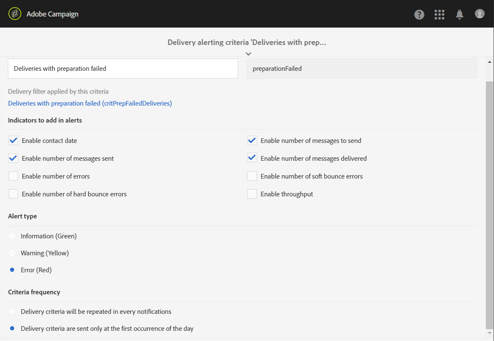

# エラー発生時のアラートの受信{#receiving-alerts-when-failures-happen}

## 配信アラートについて {#about-delivery-alerting}

**配信アラート** 機能は、ユーザーのグループが、配信の実行に関する情報を含んだ通知を自動的に受信できるようにするアラート管理システムです。

送信される通知には、次の条件に基づいたレポートがデフォルトで含まれています。

* 失敗した配信
* 準備に失敗した配信
* ソフトバウンスエラー率が悪い配信
* ハードバウンスエラー率が低い配信
* 保留中ステータスが通常より長い配信
* スループットの低い配信
* 配信中

アラートの受信者は、Adobe Campaignで処理中の配信を監視し、実行に問題がある場合は適切なアクションを実行できます。

これらのアラート通知は、Adobe Campaign インターフェイスのダッシュボードで定義された特定のアラート条件に応じてカスタマイズできます。

>[!NOTE]
>
>アラート通知は、メールでのみ配信されます。

送信される通知には、次のものが含まれます。

* 定義した条件を満たす配信の数、および各条件で選択したラベル/カラーを表示する **[!UICONTROL Summary]** ール。
* 対応するダッシュボードに定義されているすべての配信条件と、各条件のすべての配信をリストする **[!UICONTROL Details]** のセクション。

## 配信アラートダッシュボード {#delivery-alerting-dashboards}

### 配信アラートダッシュボードについて {#about-delivery-alerting-dashboards}

通知の受信者を管理し、アラート条件を定義して、アラートの履歴にアクセスするには、ダッシュボードを使用する必要があります。

>[!NOTE]
>
>ダッシュボードおよびアラート条件にアクセスして設定するには、管理権限があるか、**配信スーパーバイザー** セキュリティグループに表示されている必要があります。 標準ユーザーは、Adobe Campaign インターフェイスのダッシュボードにアクセスできません。 アラート通知のみを受信できます。 Adobe Campaignのユーザーとセキュリティについて詳しくは、[&#x200B; ユーザーの種類 &#x200B;](../../administration/using/users-management.md) および [&#x200B; セキュリティグループについて &#x200B;](../../administration/using/managing-groups-and-users.md#about-security-groups) を参照してください。

Adobe Campaignのインターフェイスから、次の操作を実行できます。

* 配信アラートダッシュボードを作成および管理します。 [&#x200B; 配信アラートダッシュボードの作成 &#x200B;](#creating-a-delivery-alerting-dashboard) を参照してください。
* 各ダッシュボードの配信アラート条件を定義および管理します。 例えば、準備が失敗した配信や、スループットの低い配信のみに基づいて、アラートを作成できます。 [&#x200B; アラート条件について &#x200B;](#about-alerting-criteria) を参照してください。
* 各ダッシュボードの条件パラメーターを変更します。 [&#x200B; 条件パラメーター &#x200B;](#criteria-parameters) を参照してください。
* 各ダッシュボードの受信者のグループを定義します。

  例えば、失敗した配信のみの管理権限を持つユーザーに通知するとします。 ただし、ソフトバウンスの無効エラー率が設定された配信に関する情報をマーケティングユーザーが受け取るようにしたい場合があります。 したがって、2 つの異なるダッシュボードを作成し、受信者のグループごとに必要な条件を定義する必要があります。

* 各ダッシュボードのすべての送信済みアラートの履歴にアクセスします。

  ダッシュボードを選択すると、デフォルトでは、このダッシュボードに対して最後に送信されたアラートが表示されます。 すべての送信済みアラートが画面の左側に一覧表示されます。 **[!UICONTROL History]** リストの項目をクリックして、対応するアラートにアクセスします。

### 配信アラートダッシュボードの作成 {#creating-a-delivery-alerting-dashboard}

特定の条件に基づいて様々なユーザーグループに通知を送信する場合は、複数のダッシュボードを使用する必要があります。 新しいダッシュボードを作成するには：

1. **[!UICONTROL Administration]**/**[!UICONTROL Channels]**/**[!UICONTROL Delivery alerting]** に移動します。
1. 「**[!UICONTROL Delivery alerting dashboards]**」を選択し、「**[!UICONTROL Create]**」をクリックします。
1. 現在のダッシュボ **[!UICONTROL Enabled]** ドをアクティブにするには、チェックボックスをオンにします。

   このオプションを無効にすると、このダッシュボードにリンクされている通知は送信されなくなります。 このオプションはデフォルトでは無効です。

   

1. 通知する受信者のグループを「**[!UICONTROL Alert group]**」ドロップダウンリストから選択します。 グループを変更または作成するには、[&#x200B; セキュリティ・グループの作成とユーザーの割り当て &#x200B;](../../administration/using/managing-groups-and-users.md#creating-a-security-group-and-assigning-users) を参照してください。
1. 「**[!UICONTROL Delivery alerting criteria]**」セクションで、「**[!UICONTROL Create element]**」をクリックして条件を追加します。 [&#x200B; アラート条件について &#x200B;](#about-alerting-criteria) を参照してください。
1. 「**[!UICONTROL Edit properties]**」ボタンを選択します。 「**[!UICONTROL Criteria parameters]**」タブで、条件の適用方法を定義します。 [&#x200B; 条件パラメーター &#x200B;](#criteria-parameters) を参照してください。
1. 「**[!UICONTROL Create]**」をクリックして、ダッシュボードを保存します。

配信がこのダッシュボードで定義した条件を満たすたびに、指定したユーザーグループにアラート通知が送信されます。

## 配信アラート条件 {#delivery-alerting-criteria}

### アラート条件について {#about-alerting-criteria}

配信アラート条件にアクセスするには、**[!UICONTROL Administration]**/**[!UICONTROL Channels]**/**[!UICONTROL Delivery alerting]** に移動し、「**[!UICONTROL Delivery alerting criteria]**」を選択します。

配信アラートダッシュボードでは、次の条件を使用できます。

* **[!UICONTROL Deliveries failed]**：定義された範囲内でスケジュールされた配信（ステータスがエラーあり）。
* **[!UICONTROL Deliveries with preparation failed]**：定義された範囲内で変更された配信で、準備手順（ターゲットの計算とコンテンツの生成）が失敗した場合。 詳しくは、[&#x200B; 送信の準備 &#x200B;](../../sending/using/preparing-the-send.md) を参照してください。
* **[!UICONTROL Delivery with bad error ratio for soft bounces]**：定義された範囲内にスケジュールされた配信で、ステータスが **[!UICONTROL In progress]** 以上で、ソフトバウンスエラー率が定義された割合を超えているもの。
* **[!UICONTROL Delivery with bad error ratio for hard bounces]**：定義された範囲内でスケジュールされた配信で、ステータスが **[!UICONTROL In progress]** 以上で、ハードバウンスエラー率が定義された割合を超えるもの。
* **[!UICONTROL Deliveries with long start pending]**：定義された範囲内でスケジュールされた配信、および定義された期間を超える **[!UICONTROL Start pending]** ステータス（**[!UICONTROL Start pending]** ステータス）。つまり、メッセージがまだシステムで考慮されていないことを意味します。
* **[!UICONTROL Deliveries with low throughput]**：定義された期間より長く開始され、処理されたメッセージの割合が定義されている値未満で、スループットが定義されている値より低い配信。
* **[!UICONTROL Deliveries in progress]**：定義された範囲内でスケジュールされた配信（**[!UICONTROL In progress]** ステータスのもの）。

>[!NOTE]
>
>上記の条件に適用するすべてのパラメーターには、デフォルト値が設定されています。 これらの値は、配信アラートダッシュボードの「**[!UICONTROL Criteria parameters]**」タブで変更できます。 [&#x200B; 条件パラメーター &#x200B;](#criteria-parameters) を参照してください。

**[!UICONTROL Delivery alerting criteria]** のリストから任意の項目を選択して、その詳細にアクセスできます。

条件ごとに、次の設定を定義できます。

* つま **[!UICONTROL Indicators to add in alerts]**、選択した条件に対応する配信の通知の「**[!UICONTROL Details]**」セクションに表示される列を意味します。

  

* **[!UICONTROL Alert type]** は、通知の概要の配信条件の横に表示されるラベルと色を意味します。

  

* **[!UICONTROL Criteria frequency]**:1 つの配信の条件が満たされた場合、監視期間内に送信される各通知で繰り返されます。 そうでない場合は、1 つの配信のアラート条件で、1 日（最初の発生時）に 1 つのアラートのみが送信されます。

  デフォルトでは、すべての条件に対して、このオプションは 1 日に 1 回に設定されています。

**関連トピック：**

* [送信ログ](../../sending/using/monitoring-a-delivery.md#sending-logs)
* [アラートの頻度](#alerting-frequency)
* [マーケティングアクティビティのアイコンとステータス](../../start/using/marketing-activities.md#marketing-activity-icons-and-statuses)

### 配信アラート条件の作成 {#creating-a-delivery-alerting-criterion}

ニーズに合わせて新しい配信アラート条件を作成できます。

例えば、**[!UICONTROL Finished]** しいステータスのすべての配信をリストした通知を送信できる新しい条件を作成できます。

これを行うには、まず **配信** リソースを拡張し、新しいフィルターを追加して、ステータスが **[!UICONTROL Finished]** しい配信のみを選択できるようにする必要があります。

1. **Adobe Campaign**/**管理**/**開発**/**カスタムリソース** に移動し、「**[!UICONTROL Create]**」をクリックします。
1. 「**[!UICONTROL Extend an existing resource]**」を選択し、ドロップダウンリストから **[!UICONTROL Delivery]** リソースを選択して、「**[!UICONTROL Create]**」をクリックして編集します。

   

   既存リソースの拡張について詳しくは、[&#x200B; リソースの定義 &#x200B;](../../developing/using/creating-or-extending-the-resource.md) を参照してください。

1. **[!UICONTROL Delivery]** リソースで、「**[!UICONTROL Filter definition]**」タブに移動し、「**[!UICONTROL Add an element]**」をクリックしてフィルターを作成します。

   

1. 新しいフィルター定義を編集します。**[!UICONTROL Filter definition]** ウィンドウで **[!UICONTROL Status]** 項目をワークスペースにドラッグ&amp;ドロップし、フィルター条件として「**[!UICONTROL Finished]**」を選択します。

   

   カスタムフィルターの作成と編集について詳しくは、「[&#x200B; フィルターの定義 &#x200B;](../../developing/using/configuring-filter-definition.md)」を参照してください。

1. 変更を保存し、リソースを公開します。 詳しくは、[&#x200B; カスタムリソースの公開 &#x200B;](../../developing/using/updating-the-database-structure.md#publishing-a-custom-resource) を参照してください。

   フィルターが作成され、新しい配信アラート条件で選択できるようになりました。

1. **[!UICONTROL Administration]**/**[!UICONTROL Channels]**/**[!UICONTROL Delivery alerting]** に移動し、「**[!UICONTROL Delivery alerting criteria]**」を選択して「**[!UICONTROL Create]**」をクリックします。
1. **[!UICONTROL Delivery filter applied by this criterion]** ドロップダウンリストで、作成したフィルターを選択します。

   

   条件の設定は、デフォルトの条件と同じ方法で定義できます。 [&#x200B; アラート条件について &#x200B;](#about-alerting-criteria) を参照してください。

作成した後は、これらの条件を配信アラートダッシュボードやその他の条件に追加できます。 詳しくは [&#x200B; 配信アラートダッシュボードについて &#x200B;](#about-delivery-alerting-dashboards) を参照してください。

**関連トピック：**

[リソースの追加または拡張](../../developing/using/key-steps-to-add-a-resource.md)

## 配信アラートパラメーター {#delivery-alerting-parameters}

### 条件パラメーター {#criteria-parameters}

[&#x200B; 配信アラートダッシュボード &#x200B;](#creating-a-delivery-alerting-dashboard) の「**[!UICONTROL Criteria parameters]**」タブで、このダッシュボードで選択した条件に適用する設定を定義できます。

* **[!UICONTROL Delivery target minimum size]**：例えば、このフィールドに 100 と入力すると、受信者の数が 100 以上のターゲットを持つ配信に対してのみ通知が送信されます。 このパラメーターは、すべての条件に適用されます。
* **[!UICONTROL Monitoring period before and after the contact date (in hours)]**：現在の時刻の前後の時間数。 この時間範囲内に連絡日がある配信のみが考慮されます。このパラメーターは、すべての条件に適用されます。デフォルトでは、このフィールドの値は 24 時間に設定されています。

  コンタクト日について詳しくは、[&#x200B; スケジュールについて &#x200B;](../../sending/using/about-scheduling-messages.md) を参照してください。

* **[!UICONTROL Maximum ratio of soft bounce errors]**：ソフトバウンスエラー率が指定値を超えるすべての配信に対して通知が送信されます。 デフォルトでは、このフィールドの値は 0.05（5%）に設定されます。

  ソフトバウンスエラーについて詳しくは、[&#x200B; バウンスメールの選定 &#x200B;](../../sending/using/understanding-delivery-failures.md#bounce-mail-qualification) および [&#x200B; 配信失敗タイプのリスト &#x200B;](../../sending/using/understanding-delivery-failures.md#delivery-failure-types-and-reasons) を参照してください。

* **[!UICONTROL Maximum ratio of hard bounce errors]**：ハードバウンスエラー率が指定値を超えるすべての配信に対して通知が送信されます。 デフォルトでは、このフィールドの値は 0.05（5%）に設定されます。

  ハードバウンスエラーについて詳しくは、[&#x200B; バウンスメールの選定 &#x200B;](../../sending/using/understanding-delivery-failures.md#bounce-mail-qualification) および [&#x200B; 配信失敗タイプのリスト &#x200B;](../../sending/using/understanding-delivery-failures.md#delivery-failure-types-and-reasons) を参照してください。

* **[!UICONTROL Minimum time threshold for delivery in 'Start pending' status (in minutes)]**：このフィールドで指定された期間を超えて **[!UICONTROL Start pending]** ステータスのすべての配信に通知が送信されます。**[!UICONTROL Start pending]** ステータスは、メッセージがまだシステムで考慮されていないことを意味します。
* **[!UICONTROL Minimum time required for the computation of the throughput (in minutes)]**：指定された期間を超えて開始された（**[!UICONTROL In progress]** ステータスの）配信のみが **[!UICONTROL Deliveries with low throughput]** 定条件で考慮されます。
* **[!UICONTROL Maximum percentage of processed messages for the computation of the throughput]**：処理済みメッセージの割合が指定の割合より低い配信のみが、**[!UICONTROL Deliveries with low throughput]** 定の条件で考慮されます。
* **[!UICONTROL Minimum expected throughput (in sent messages per hour)]**：指定した値よりスループットが低い配信のみが **[!UICONTROL Deliveries with low throughput]** 定条件に考慮されます。
* **[!UICONTROL Minimum processed ratio required for 'Deliveries in progress' criterion]**：処理されたメッセージの割合が指定の割合を超える配信のみが考慮されます。

### アラートの頻度 {#alerting-frequency}

**[!UICONTROL Frequency of delivery alerting]** オプションを使用すると、2 つのアラート送信間の遅延を定義できます。 デフォルトでは 10 分に設定されています。

この設定は、**[!UICONTROL Administration]** > **[!UICONTROL Application settings]** > **[!UICONTROL Options]** メニューから変更できます。

>[!NOTE]
>
>このオプションは、Adobe Campaignで定義されるすべてのダッシュボードに適用されます。 各ダッシュボードに特定の頻度を設定することはできません。

## 配信アラートの理由 {#delivery-alerting-reasons}

**配信アラート** 機能を使用すると、関連するすべてのAdobe Campaign ユーザーに対し、配信の実行ステータスがメールやダッシュボードで自動的に通知されます。

配信アラート通知を受け取ったら、次に、その方法に関するヒントを示します。

まず、配信の **ログ** タブを確認して、配信と配達確認に関するすべての情報を表示します。 赤と黄色のアイコンを使用すると、エラーや警告を識別できます。 赤いアイコンは、配信を開始できない重大なエラーを示しています。

配信のすべての発生履歴を表示するには、「**[!UICONTROL Sending logs]**」タブを選択します。 送信済みメッセージとそのステータスのリストが含まれます。 各受信者（**[!UICONTROL Sent]**、**[!UICONTROL Pending]**、**[!UICONTROL Failed]** など）の配信ステータスを確認できます。 詳しくは、[&#x200B; ログの送信 &#x200B;](../../sending/using/monitoring-a-delivery.md#sending-logs) を参照してください。

配信で満たされた条件に従ってアラート通知を受信する理由として考えられるものを次に示します。

* **[!UICONTROL Deliveries failed]**：この条件により、エラーステータスのすべての配信が通知されます。 次の原因が原因である可能性があります。

   * 配信サーバー（MTA、メッセージ転送エージェント）に問題があります
   * Adobe Campaign配信サーバーと受信サーバー間の接続タイムアウト
   * 配信品質の問題
   * エラーが発生したワークフロー

  配信がワークフローでトリガーされる場合は、そのワークフローが正しく開始されたかどうかを確認します。 詳しくは、[&#x200B; ワークフローの実行 &#x200B;](../../automating/using/about-workflow-execution.md) を参照してください。 それ以外の場合は、Adobe Campaign管理者に連絡して問題を解決してください。

* **[!UICONTROL Deliveries with preparation failed]**：配信の準備中に、次の場合にエラーが発生する可能性があります。

   * 配信に件名がありません。
   * パーソナライゼーションフィールドの構文が間違っている。
   * ターゲットがありません。
   * 配信がサイズ制限を超えています。

  詳しくは、[&#x200B; 送信の準備 &#x200B;](../../sending/using/preparing-the-send.md) を参照してください。 ただし、これらのエラーは通常、メッセージ分析中に見つかります。 [&#x200B; コントロールルール &#x200B;](../../sending/using/control-rules.md) を参照してください。

* **[!UICONTROL Delivery with bad error ratio for soft bounces]** アラートの考えられる原因は次のとおりです。

   * 受信者のサーバーがダウンしています。
   * 受信者のメールボックスがいっぱいです。

  詳しくは、配信ログの「**[!UICONTROL Exclusion logs]**」タブと「**[!UICONTROL Exclusion causes]**」タブを確認してください。 [&#x200B; 除外ログ &#x200B;](../../sending/using/monitoring-a-delivery.md#exclusion-logs) を参照してください。

  **[!UICONTROL Delivery with bad error ratio for hard bounces]** アラートの考えられる原因は次のとおりです。

   * 受信者がブロックリストに追加されます。つまり、連絡を望まなくなります。
   * 受信者のメールアドレスが存在しません。
   * 受信者のドメインが存在しません。
   * 受信者のサーバーが配信をブロックしています。

  ソフトバウンスエラーとハードバウンスエラーを回避するには、次のベストプラクティスに従います。

   * 強制隔離された受信者など、配信分析中にメッセージターゲットの一部を除外するフィルタータイポロジルールを作成します。 [&#x200B; フィルタールールの作成 &#x200B;](../../sending/using/filtering-rules.md) を参照してください。
   * 適切な強制隔離管理プロセスを維持するために、顧客データベースを定期的に更新します。 [&#x200B; 強制隔離について &#x200B;](../../sending/using/understanding-quarantine-management.md#about-quarantines) を参照してください。
   * 一般的に、配信品質は可能な限り向上させます。 詳細なドキュメントについてはAdobe Campaign [&#x200B; 配信品質 &#x200B;](../../sending/using/about-deliverability.md) を参照し、サポートについてはAdobe Campaign管理者にお問い合わせください。

* **[!UICONTROL Deliveries with long start pending]**：通常、これは MTA （メッセージ転送エージェント）レベルで問題があることを意味します。 実行プロセスが、リソースが使用可能になるのを待っています。MTA が開始されていない可能性があります。

  **[!UICONTROL Deliveries with low throughput]**：これも、MTA が遅すぎることを意味する配信品質の問題です。

  これらの問題について詳しくは、Adobe Campaign管理者にお問い合わせください。

**関連トピック：**

* [配信エラーについて](../../sending/using/understanding-delivery-failures.md)
* [強制隔離管理について](../../sending/using/understanding-quarantine-management.md)
* [Campaign のオプトインとオプトアウトについて](../../audiences/using/about-opt-in-and-opt-out-in-campaign.md)
