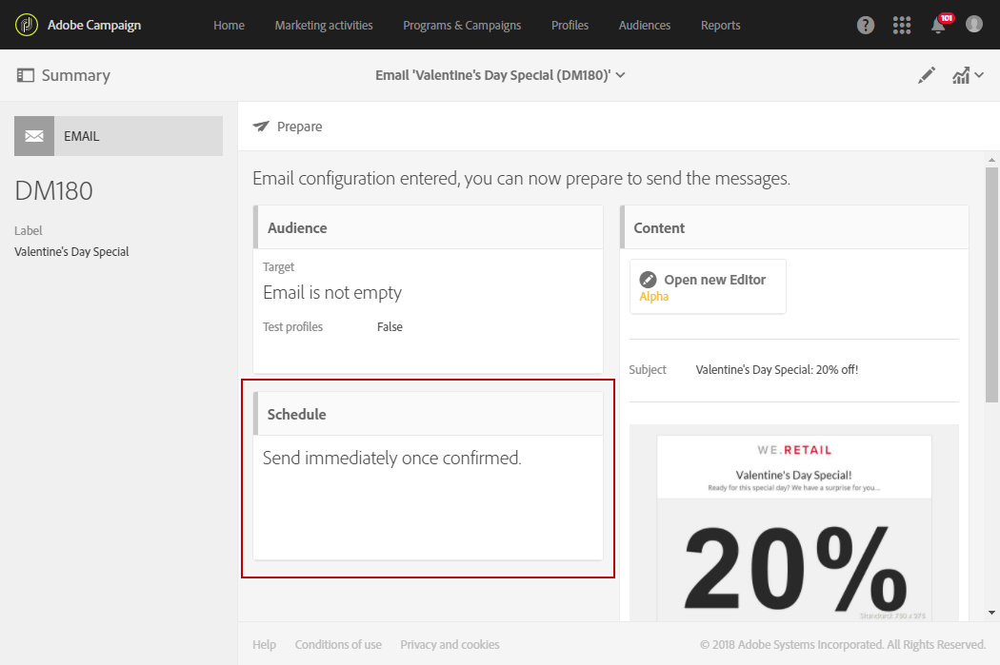

# 受信者のタイムゾーンでのメッセージの送信{#sending-messages-at-the-recipient-s-time-zone}

日時が重要なキャンペーンのために、各受信者のローカル時間を考慮に入れて配信をスケジュールできます。電子メールや SMS、またはプッシュ通知が、スケジュールした日時にそれぞれのタイムゾーンで受信されます。

>[!NOTE]
>
>この機能を使用するには、配信先となるすべてのプロファイルのタイムゾーンがプロパティの[**[!UICONTROL Address]**]セクションで指定されていることを確認してください。プロファイルプロパティへのアクセスについて詳しくは、[こちらの節](../../audiences/using/editing-profiles.md)を参照してください。

受信者のタイムゾーンで配信を送信する場合は、ワークフローで「**[!UICONTROL Scheduler]**」アクティビティを使用することもできます。詳しくは、この[ページ](../../automating/using/scheduler.md)を参照してください。

次の例では、バレンタインデーでのみ有効なプロモーションコードを世界中のすべての顧客に送信します。当日、時間的に余裕を持ってコードを利用できるように、すべての顧客が自分のタイムゾーンの 2 月 14 日午前 8 時にメッセージを受け取る必要があります。

1. 「**[!UICONTROL Marketing activities]**」タブで、配信（この例では E メール）の作成を開始します。配信の作成について詳しくは、[こちらの節](../../channels/using/creating-an-email.md)を参照してください。
1. バレンタインデーの E メールをデザインしたら、「**[!UICONTROL Create]**」をクリックして配信ダッシュボードにアクセスします。E メールのデザインについて詳しくは、[こちらのページ](../../designing/using/personalization.md#example-email-personalization)を参照してください。

   

1. 配信ダッシュボードで、「**[!UICONTROL Schedule]**」ブロックを選択します。

   

1. 以下に示した「**[!UICONTROL Messages to be sent automatically on the date]**」オプションを選択します。次に、「**[!UICONTROL Start sending from]**」フィールドで、コンタクト日を 2 月 14 日午前 8 時に設定して、すべての受信者がバレンタインデーに受信するようにします。

   

1. 「**[!UICONTROL Time zone of the contact date]**」フィールドで、デフォルトの送信タイムゾーンを選択します。

   プロファイルの「**[!UICONTROL Time zone]**」を「**[!UICONTROL Default]**」のままにしておくと、受信者はここで選択されたタイムゾーンで配信を受け取ります。

1. ドロップダウンメニュー&#x200B;**[!UICONTROL Optimize the sending time per recipient]**&#x200B;から、「**[!UICONTROL Send at the recipient's time zone]**」を選択します。これで、受信者は自分のタイムゾーンの 2 月 14 日にバレンタインデーの E メールを受け取ることができます。

   

1. 配信のスケジュールを確認したら、まず「**[!UICONTROL Prepare]**」ボタンをクリックし、次に「**[!UICONTROL Confirm]**」をクリックして配信を確定します。

   少なくとも 24 時間前に送信を確定してください。24 時間以前に送信を確定しないと、受信者の所在地によっては、実際のバレンタインデーイベントの前に配信が届く場合もあります。

   

受信者の所在地に関係なく、現地時間の 2 月 14 日午前 8 時にすべての受信者にメッセージが届きます。
