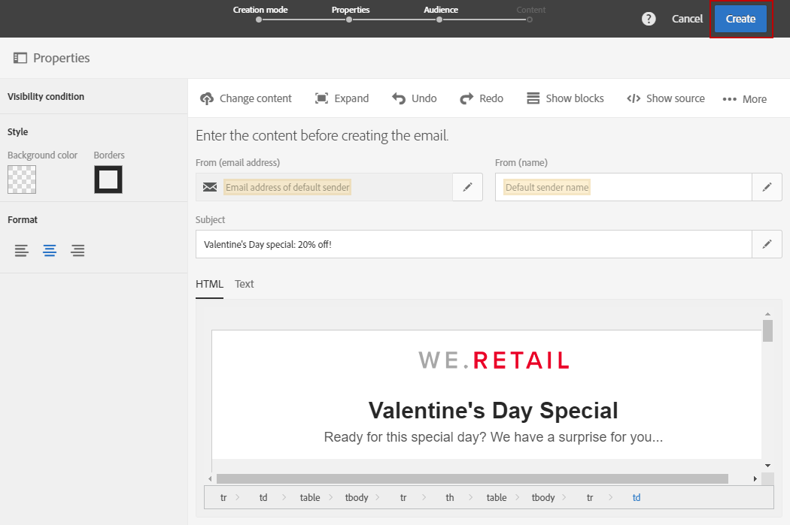

# Sending messages at the recipient's time zone{#sending-messages-at-the-recipient-s-time-zone}

日付と時間が重要なキャンペーンを管理する場合、各受信者のローカル時間を考慮する配信をスケジュールできます。電子メール、SMS、またはプッシュ通知は、スケジュールされた時点で、独自のタイムゾーンで送信されます。

>[!NOTE]
>
>To use this functionality, make sure that all profiles targeted by your delivery have a time zone specified in the **[!UICONTROL Address]** section of their properties. For more information on accessing profile properties, refer to this [section](../../audiences/using/editing-profiles.md).

To send a delivery at the recipient's time zone, you can also use the **[!UICONTROL Scheduler]** activity in a workflow. For more on this, refer to this [page](../../automating/using/scheduler.md).

次の例では、バレンタインデーで世界中のすべての顧客にのみ有効なプロモーションコードを送信します。その日の使用に十分な時間を確保するために、すべての顧客は、タイムゾーンに応じて午前8時14分にメッセージを受信する必要があります。

1. **[!UICONTROL Marketing activities]** タブで、配信の作成を開始します（例:電子メール）。To learn more on delivery creation, refer to this [section](../../channels/using/creating-an-email.md).
1. After designing your Valentine's Day email, click **[!UICONTROL Create]** to access the delivery dashboard. For more on email designing, refer to this [page](../../designing/using/example--email-personalization.md).

   

1. From the delivery dashboard, select the **[!UICONTROL Schedule]** block.

   

1. Select the **[!UICONTROL Messages to be sent automatically on the date]** option specified below. **[!UICONTROL Start sending from]** その後、このフィールドで連絡先日を設定します。この場合、2月14日の午前8時14分に、すべての受信者がバレンタインデーでそれを受信します。

   

1. **[!UICONTROL Time zone of the contact date]** フィールドで、デフォルトで配信するタイムゾーンを選択します。

   If a profile's **[!UICONTROL Time zone]** is left as **[!UICONTROL Default]**, the recipients will receive the delivery depending on the chosen time zone here.

1. **[!UICONTROL Optimize the sending time per recipient]** ドロップダウンメニューから、を選択 **[!UICONTROL Send at the recipient's time zone]**&#x200B;します。これにより、受信者は、タイムゾーンに応じて、2月14日にバレンタインデーの電子メールを受信できます。

   

1. After confirming your schedule for your delivery, click the **[!UICONTROL Prepare]** button then **[!UICONTROL Confirm]** your delivery.

   必ず24時間前に送信を確認してください。そうしないと、その場所によって、実際のバレンタインデーイベントの前に、一部の受信者が配信を受け取ることがあります。

   

すべての受信者がどこにいるかにかかわらず、すべての受信者は、午前8時14分の午前8時にメッセージを受信します。
