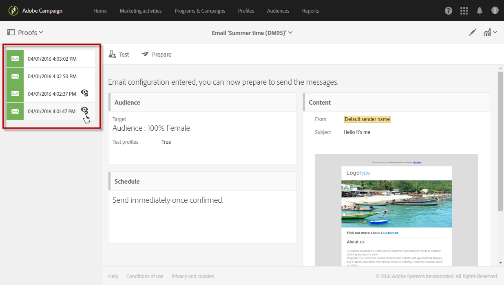
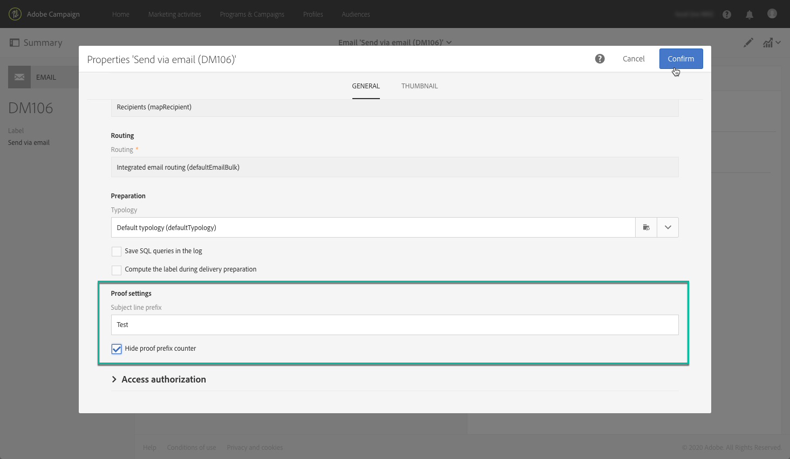

# 配達確認の送信 {#sending-proofs}

## 校正について {#about-proofs}

配達確認とは、メインターゲットにメッセージを送信する前に、メッセージをテストする特定のメッセージです。 証明の受信者は、メッセージ（内容とフォーム）の承認を担当します。

証明の受信者には、次の2種類があります。

* **テストプロファイルを使用すると** 、定義したターゲット条件に一致しない追加の受信者をターゲットに設定できます。

   メッセージのオーディエンスに追加して、受信者データベースの不正な使用を検出したり、電子メールが受信トレイに確実に届くようにしたりできます。 詳しくは、テストプロファイルの管 [理を参照してください](../../audiences/using/managing-test-profiles.md)。

   >[!NOTE]
   >
   >証明を送信するには、テストプロファイルをメッセージのオーディエンスに含める必要があります。

* **代替プロファイル** を使用すると、自分をターゲットプロファイルの1つの位置に配置し、そのプロファイルが受け取るメッセージを正確に表示できます。 詳しくは、ターゲットプロファイルを使用した [電子メールメッセージのテストを参照してくださ](../../sending/using/testing-messages-using-target.md)い。

   >[!NOTE]
   >
   >この機能は、電子メールチャネルでのみ使用できます。

## 配達確認の送信 {#sending-a-proof}

校正を送信するには、次の手順に従います。

1. 受信者に対する校正の設定が済んでいることを確認します。
   * **テストプロファイル** は、メッセージのオーディエンスに含める必要があります。
   * **メッセージの準備** が成功したら、置換プロファイルを追加する必要があります(この節 [を参照](../../sending/using/testing-messages-using-target.md))。

1. ボタンをクリッ **[!UICONTROL Send a test]** クします。

   

1. 使用する校正の種類を選択します。

   * **[!UICONTROL Email rendering]**:対象となるinboxに従ってメッセージを受信する方法をテストする場合は、このオプションを選択します。 詳しくは、電子メールのレンダリングを参照 [してください](../../sending/using/email-rendering.md)。
   * **[!UICONTROL Proof]**:メインターゲットに送信する前にメッセージをテストする場合は、このオプションを選択します。 配達確認の受信者は、その内容と形式の両方を確認することで、配信の承認を担当します。
   * **[!UICONTROL Proof + Email rendering]**:このオプションは、前の2つのオプションを組み合わせます。
   

   >[!NOTE]
   >
   >電子メールレンダリングは、テストプロファイルでのみ使用できます。 メッセージにテストプロファイルが追加されていない場合は、このオプ **[!UICONTROL Proof]** ションのみを選択できます。

1. 選択を確認します。

   設定済みの受信者に校正が送信されます。

   

1. ドロップダウンリストを使用して、自分の **[!UICONTROL Proofs]** 校正を表示できます。

   

1. 概要にアクセスする校正を選択します。 電子メールの場合、校正の種類として「電子メ **ールのレンダリング** 」オプションを選択した場合は **[!UICONTROL Access email rendering]** 、校正ラベルの右側にアイコンが表示されます。 電子メールの [レンダリングを参照](../../sending/using/email-rendering.md)。

   

配達確認を受け取った人からのコメントに応じて、配信のコンテンツを変更するように求められる場合があります。 変更が行われたら、電子メールの準備を再開し、証明を再送信する必要があります。 新しい校正には、ボタンを使用してアクセスで **[!UICONTROL Show proofs]** きます。

配信内容が完成するまで、必要な数の証明書を送信する必要があります。 この処理が完了したら、配信をメインターゲットに送信し、承認サイクルを閉じます。

## 校正の件名行の設定 {#configuring-proofs-subject-line}

配達確認が送信されると、その件名行には、デフォルトで「配達確認 **** 」プレフィックスと、配達確認の番号を示すカウンターが設定されます。

使用するデフォルトの件名行を変更するには、次の手順に従います。

1. メッセージダッシュボードで、ボタンをクリッ **[!UICONTROL Open properties]** クします。
1. セクション **[!UICONTROL Advanced parameters]** で、件名行のデフォルトで使用する接頭辞を定義します。

件名行で校正の番号を非表示にするには、このオプションを有効に **[!UICONTROL Hide proof prefix counter]** します。

>[!NOTE]
>
>校正プレフィックス全体を非表示にする場合は、フィールドを空白のま **[!UICONTROL Subject line prefix]** まにします。

1. クリック **[!UICONTROL Confirm]**. この設定は、デフォルトで、選択したメッセージに対して送信されたすべての校正に適用されます。

**関連トピック：**

* [テストの送信、電子メールの準備と送信](https://docs.adobe.com/content/help/en/campaign-learn/campaign-standard-tutorials/getting-started/sending-test-preparing-sending-email.html) 、
* [ターゲットプロファイルを使用した電子メールメッセージのテスト](../../sending/using/testing-messages-using-target.md)。
* [テストプロファイルの管理](../../audiences/using/managing-test-profiles.md)。
* [メッセージのプレビュー](../../sending/using/previewing-messages.md)
* [電子メールチャネルの設定](../../administration/using/configuring-email-channel.md)
