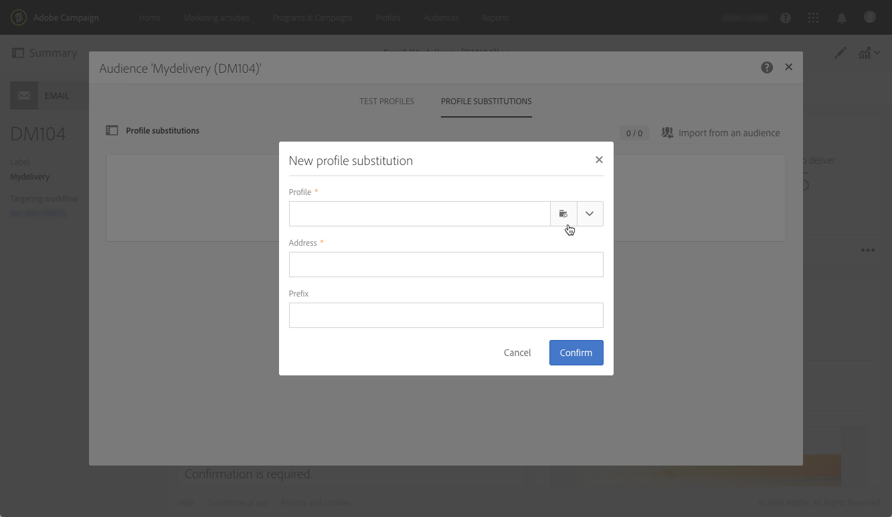
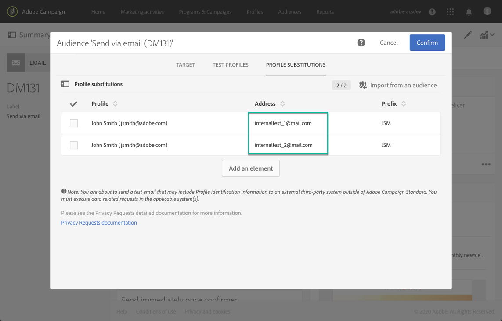
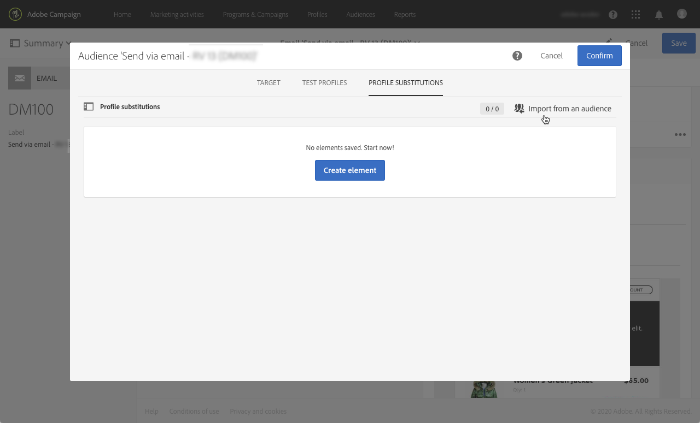
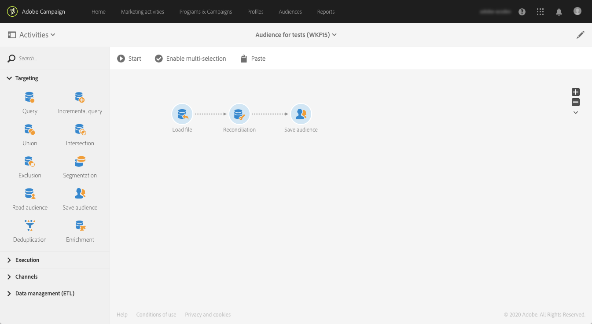
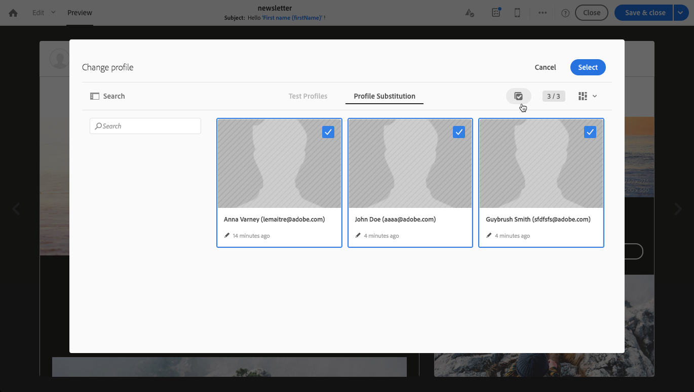

# ターゲットプロファイルを使用した E メールメッセージのテスト {#testing-message-profiles}

## 概要 {#overview}

さらに [テストプロファイル](../../audiences/using/managing-test-profiles.md)を使用すると、ターゲットプロファイルのいずれかの位置に自分を配置して、電子メールメッセージをテストできます。 これにより、プロファイルが受け取るメッセージ ( カスタムフィールド、動的情報、パーソナライズされた情報（ワークフローからの追加データを含む）が正確に表示されます。

>[!IMPORTANT]
>
>この機能を使用すると、プロファイルの個人情報を外部の E メールアドレスに送信できます。Campaign Standard でプライバシーリクエスト（GDPR および CCPA）を実行しても、リクエストは外部で実行されないことに注意してください。

主な手順は次のとおりです。

1. メッセージを設定し、 **準備** フェーズ。
1. **1 つまたは複数のプロファイルを選択** メッセージのターゲットとなるプロファイルに含めることができます。
1. 各プロファイル a に関連付け **代替アドレス** 配達確認の送信先となる
1. （オプション）各プロファイルに対して、 **prefix** 配達確認の件名行に追加します。
1. **プレビュー** E メールデザイナーで、プロファイルに対するメッセージの表示方法を指定します。
1. 配達確認を送信します。

   >[!IMPORTANT]
   >
   >配達確認は次の条件で処理されます： [!DNL Campaign Standard] を標準の配信として使用します。 その結果、プロファイルの置き換えを使用して配達確認を送信すると、選択したプロファイルの配信およびトラッキングログにレコードが追加されます。

 [ビデオでこの機能を確認する](#video)

## プロファイルと代替アドレスの選択 {#selecting-profiles}

ターゲットプロファイルをテストに使用するには、まずターゲットプロファイルを選択してから、配達確認を受け取る代用アドレスを定義する必要があります。 これをおこなうには、次のいずれかを実行します。 [特定のプロファイルを選択](#selecting-individual-profiles) ターゲットプロファイルの間、または [既存のオーディエンスからプロファイルをインポート](#importing-from-audience).

>[!NOTE]
>
>最大 100 個のプロファイルをテスト用に選択できます。

### 個々のプロファイルの選択 {#selecting-individual-profiles}

1. メッセージダッシュボードで、メッセージの準備が成功したことを確認し、「 **[!UICONTROL Audience]** ブロック

   

1. 内 **[!UICONTROL Profile substitutions]** タブで、 **[!UICONTROL Create element]** ボタンをクリックして、テストに使用するプロファイルを選択します。

   

1. 「プロファイルの選択」ボタンをクリックして、メッセージのターゲットとなるプロファイルのリストを表示します。

   

1. テストに使用するプロファイルを選択し、「 **[!UICONTROL Address]** をクリックし、 **[!UICONTROL Confirm]**. プロファイルをターゲティングするすべての配達確認は、このプロファイルのデータベースで定義された配達確認ではなく、この E メールアドレスに送信されます。

   配達確認の件名行に特定のプレフィックスを追加する場合は、 **[!UICONTROL Subject line prefix]** フィールドに入力します。

   >[!NOTE]
   >
   >件名行のプレフィックスには、500 文字まで含めることができます。

   

   プレフィックスは次のように表示されます。

   

1. プロファイルがリストに追加され、関連する代替アドレスとプレフィックスが追加されます。 テストに使用するすべてのプロファイルに対して上記の手順を繰り返し、 **[!UICONTROL Confirm]**.

   

   同じプロファイルの複数の代替アドレスに配達確認を送信する場合は、このプロファイルを必要な回数だけ追加する必要があります。

   次の例では、John Smith プロファイルに基づく配達確認は、2 つの異なる代替アドレスに送信されます。

   

1. すべてのプロファイルと代替アドレスを定義したら、配達確認を送信してメッセージをテストできます。 これをおこなうには、 **[!UICONTROL Test]** ボタンをクリックし、実行するテストのタイプを選択します。

   テストプロファイルがメッセージのターゲットに追加されていない場合、 **[!UICONTROL Email rendering]** および **[!UICONTROL Proof + Email rendering]** オプションは使用できません。  配達確認の送信について詳しくは、 [この節](../../sending/using/sending-proofs.md).

   

>[!IMPORTANT]
>
>メッセージに変更を加えた場合は、必ずメッセージの準備を再度開始してください。 そうしないと、変更は配達確認に反映されません。

### オーディエンスからのプロファイルのインポート {#importing-from-audience}

Campaign Standardを使用すると、テストに使用できるプロファイルのオーディエンスをインポートできます。 これにより、例えば、様々なプロファイルをターゲットとする一連のメッセージ全体を一意の E メールアドレスに送信できます。

さらに、オーディエンスに住所列とプレフィックス列が既に設定されている場合、これらの情報を **[!UICONTROL Profile substitutions]** タブをクリックします。 代替アドレスを使用したオーディエンスインポートの例について詳しくは、 [この節](#use-case).

>[!NOTE]
>
>オーディエンスをインポートする場合、メッセージのターゲットに対応するプロファイルのみが選択され、 **[!UICONTROL Profile substitutions]** タブをクリックします。

オーディエンスからのテストに使用するプロファイルをインポートするには、次の手順に従います。

1. メッセージダッシュボードで、メッセージの準備が完了したことを確認し、 **[!UICONTROL Audience]** ブロック

   

1. 「**[!UICONTROL Profile substitutions]**」タブで、「**[!UICONTROL Import from an audience]**」をクリックします。

   

1. 使用するオーディエンスを選択し、代替アドレスおよびオーディエンスに送信する配達確認に使用するプレフィックスを入力します。

   >[!NOTE]
   >
   >件名行のプレフィックスには、500 文字まで含めることができます。

   

   代用アドレスや、使用するプレフィックスがオーディエンスで既に定義されている場合は、 **[!UICONTROL From Audience]** 」オプションを選択し、これらの情報を取得するために使用する列を指定します。

   

1. 「**[!UICONTROL Import]**」ボタンをクリックします。メッセージのターゲットに対応するオーディエンスからのプロファイルが **[!UICONTROL Profile substitution]** 」タブに追加し、関連する代替アドレスとプレフィックスを追加します。

>[!NOTE]
>
>同じオーディエンスを再度インポートし、異なる代用アドレスやプレフィックスを付けると、前回のインポートのプロファイルに加えて、プロファイルがリストに追加されます。

## ターゲットプロファイルを使用したメッセージのプレビュー

>[!NOTE]
>
>プレビューは、E メールデザイナーでのみ使用できます。

ターゲットプロファイルを使用してメッセージをプレビューできるようにするには、次のプロファイルが **[!UICONTROL Profile substitution]** リスト ( [プロファイルと代替アドレスの定義](#selecting-profiles)) をクリックします。

メッセージでパーソナライゼーションフィールドを使用する場合は、フィールドを追加する必要があります **前** メッセージの準備を開始します。 そうしないと、プレビューで考慮されません。 その結果、パーソナライゼーションフィールドに変更が加えられた場合は、必ずメッセージの準備を再度開始してください。

プロファイルの置き換えを使用してメッセージをプレビューするには、次の手順に従います。

1. メッセージダッシュボードで、コンテンツのスナップショットをクリックして、E メールデザイナーでメッセージを開きます。

   

1. を選択します。 **[!UICONTROL Preview]** 「 」タブで、「 **[!UICONTROL Change profile]**.

   

1. 次をクリック： **[!UICONTROL Profile Substitution]** 「 」タブに、テスト用に追加された代替プロファイルを表示します。

   プレビューに使用するプロファイルを選択し、「 **[!UICONTROL Select]**.

   

1. メッセージのプレビューが表示されます。 矢印を使用して、選択したプロファイル間を移動します。

   

## ユースケース {#use-case}

この使用例では、パーソナライズされた E メールニュースレターを特定のプロファイルのセットに送信します。 ニュースレターを送信する前に、ターゲットとなるプロファイルの一部を使用してプレビューし、外部ファイルで定義されている内部 E メールアドレスに配達確認を送信します。

この使用例の主な手順を次に示します。

1. テストに使用するオーディエンスを作成します。
1. プロファイルをターゲットに設定するワークフローを作成し、ニュースレターを送信します。
1. メッセージのプロファイルの置き換えを設定します。
1. ターゲットプロファイルを使用してメッセージをプレビューします。
1. 配達確認の送信.

### 手順 1:テストに使用するオーディエンスを作成する

1. オーディエンスを作成するために、インポートするファイルを準備します。 この場合、配達確認に使用する代替アドレスと、配達確認の件名行に追加するプレフィックスを含める必要があります。

   この例では、「oliver.vaughan@internal.com」E メールアドレスは、「john.doe@mail.com」E メールアドレスを持つプロファイルをターゲットとするメッセージの配達確認を受け取ります。 「JD」というプレフィックスが配達確認の件名行に追加されます。

   

1. ワークフローを構築し、ファイルからオーディエンスを作成します。 これをおこなうには、以下のアクティビティを追加して設定します。

   * **[!UICONTROL Load file]** アクティビティ：CSV ファイルをインポートします ( このアクティビティについて詳しくは、 [この節](../../automating/using/load-file.md)) をクリックします。
   * **[!UICONTROL Reconciliation]** アクティビティ：ファイルの情報をデータベースの情報にリンクします。 この例では、プロファイルの E メールアドレスを紐付けフィールドとして使用します ( このアクティビティについて詳しくは、 [この節](../../automating/using/reconciliation.md)) をクリックします。
   * **[!UICONTROL Save audience]** アクティビティ：インポートしたファイルに基づいてオーディエンスを作成します ( このアクティビティについて詳しくは、 [この節](../../automating/using/save-audience.md)) をクリックします。

   

1. ワークフローを実行し、 **[!UICONTROL Audiences]** 」タブをクリックし、目的の情報でオーディエンスが作成されたことを確認します。

   この例では、オーディエンスは 3 つのプロファイルで構成されています。 各配達確認は、配達確認を受け取る代替 E メールアドレスにリンクされ、配達確認の件名行に使用するプレフィックスが付きます。

   

### 手順 2:プロファイルをターゲットに設定し、ニュースレターを送信するためのワークフローを作成する

1. 追加 **[!UICONTROL Query]** および **[!UICONTROL Email delivery]** アクティビティを選択してから、必要に応じて設定します ( [クエリ](../../automating/using/query.md) および [E メール配信](../../automating/using/email-delivery.md) セクション )。

   

1. ワークフローを実行し、メッセージの準備が成功したことを確認します。

### 手順 3:メッセージの「プロファイルの置き換え」タブの設定

1. を開きます。 **[!UICONTROL Email delivery]** アクティビティ。 メッセージダッシュボードで、 **[!UICONTROL Audience]** ブロック

   

1. を選択します。 **[!UICONTROL Profile substitutions]** 「 」タブで、「 **[!UICONTROL Import from an audience]**.

   

1. 内 **[!UICONTROL Audience]**  「 」フィールドで、ファイルから作成したオーディエンスを選択します。

   

1. 配達確認の送信時に使用する代替アドレスと件名行のプレフィックスを定義します。

   これをおこなうには、「 **[!UICONTROL From audience]** 」オプションを選択し、情報を含むオーディエンスから列を選択します。

   

1. 「**[!UICONTROL Import]**」ボタンをクリックします。オーディエンスからのプロファイルが、関連する代替アドレスと件名行のプレフィックスと共にリストに追加されます。

   

   >[!NOTE]
   >
   >この例では、オーディエンスからのすべてのプロファイルが **[!UICONTROL Query]** アクティビティ。 これらのプロファイルの 1 つがメッセージのターゲットに含まれていない場合、リストに追加されません。

### 手順 4:ターゲットプロファイルを使用したメッセージのプレビュー

1. メッセージダッシュボードで、コンテンツのスナップショットをクリックして、E メールデザイナーでメッセージを開きます。

   

1. を選択します。 **[!UICONTROL Preview]** 「 」タブで、「 **[!UICONTROL Change profile]**.

   

1. 次をクリック： **[!UICONTROL Profile Substitution]** 」タブに移動して、以前に追加した代替プロファイルを表示します。

   プレビューに使用するプロファイルを選択し、「 **[!UICONTROL Select]**.

   

1. メッセージのプレビューが表示されます。 矢印を使用して、選択したプロファイル間を移動します。

   

### 手順 5:配達確認を送信

1. メッセージダッシュボードで、 **[!UICONTROL Test]** ボタンをクリックして、確定します。

   

1. 配達確認は、 **[!UICONTROL Profile substitutions]** タブをクリックします。

   

## チュートリアルビデオ {#video}

このビデオでは、プロファイルの置き換えを使用して E メールメッセージをテストする方法を説明します。

>[!VIDEO](https://video.tv.adobe.com/v/32368?quality=12)

その他のCampaign Standardのハウツービデオも利用できます [ここ](https://experienceleague.adobe.com/docs/campaign-standard-learn/tutorials/overview.html?lang=ja).
