# ターゲットプロファイルを使用したメールメッセージのテスト {#testing-message-profiles}

## 概要 {#overview}

さらに、[&#x200B; プロファイルをテスト &#x200B;](../../audiences/using/managing-test-profiles.md)するには、ターゲットとなるプロファイルの1つに自分を配置して、電子メールメッセージをテストします。 これにより、プロファイルが受け取るメッセージ（カスタムフィールド、動的およびパーソナライズされた情報、ワークフローからの追加データなど）の正確な表現を取得できます。

>[!IMPORTANT]
>
>この機能を使用すると、プロファイルの個人情報を外部のメールアドレスに送信できます。 Campaign Standard でプライバシーリクエスト（GDPR および CCPA）を実行しても、リクエストは外部で実行されないことに注意してください。

主な手順は次のとおりです。

1. メッセージを設定し、**準備** フェーズを起動します。
1. **メッセージの対象となるプロファイルの中から1つまたは複数のプロファイル**&#x200B;を選択します。
1. 各プロファイルに、プルーフの送信先となる&#x200B;**代替アドレス**&#x200B;を関連付けます。
1. （オプション）各プロファイルについて、プルーフの件名に追加する&#x200B;**接頭辞**&#x200B;を定義します。
1. 電子メール Designerの&#x200B;**Preview**&#x200B;で、プロファイルに対するメッセージの表示方法が表示されます。
1. プルーフを送信します。

   >[!IMPORTANT]
   >
   >プルーフは、[!DNL Campaign Standard]によって標準配信として処理されます。 その結果、プロファイル置換を使用してプルーフを送信すると、選択したプロファイルの配信ログとトラッキングログにレコードが追加されます。

 [ビデオでこの機能を確認する](#video)

## プロファイルと代替アドレスの選択 {#selecting-profiles}

ターゲットプロファイルをテストに使用するには、まずそれらを選択し、プルーフを受け取る代替アドレスを定義する必要があります。 これを行うには、対象プロファイルの中から[特定のプロファイル &#x200B;](#selecting-individual-profiles)を選択するか、既存のオーディエンスから[&#x200B; プロファイルを読み込みます](#importing-from-audience)。

>[!NOTE]
>
>テスト用に最大100個のプロファイルを選択できます。

### 個々のプロファイルの選択 {#selecting-individual-profiles}

1. メッセージダッシュボードで、メッセージの準備が成功したことを確認し、**[!UICONTROL Audience]** ブロックをクリックします。

   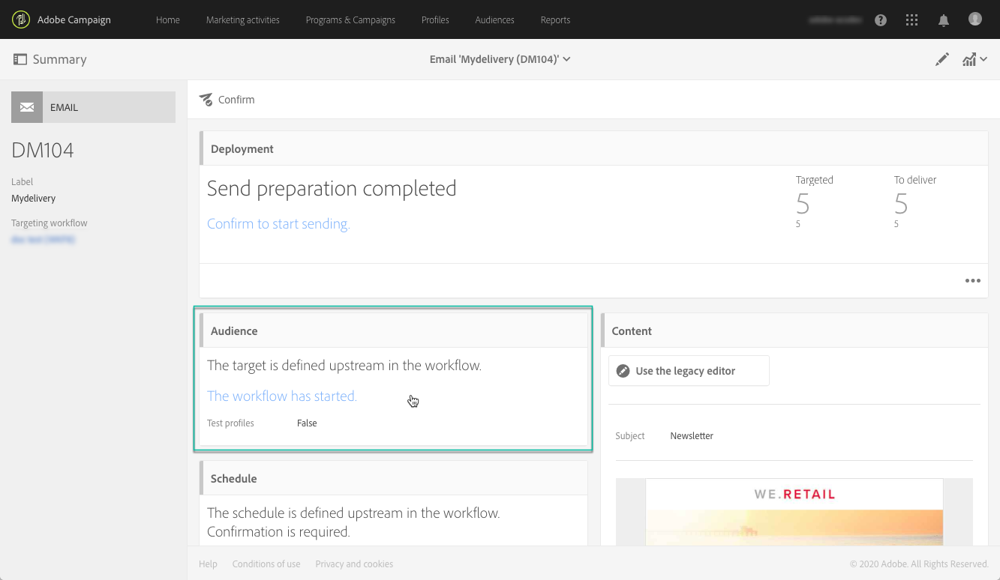

1. 「**[!UICONTROL Profile substitutions]**」タブで、「**[!UICONTROL Create element]**」ボタンをクリックして、テストに使用するプロファイルを選択します。

   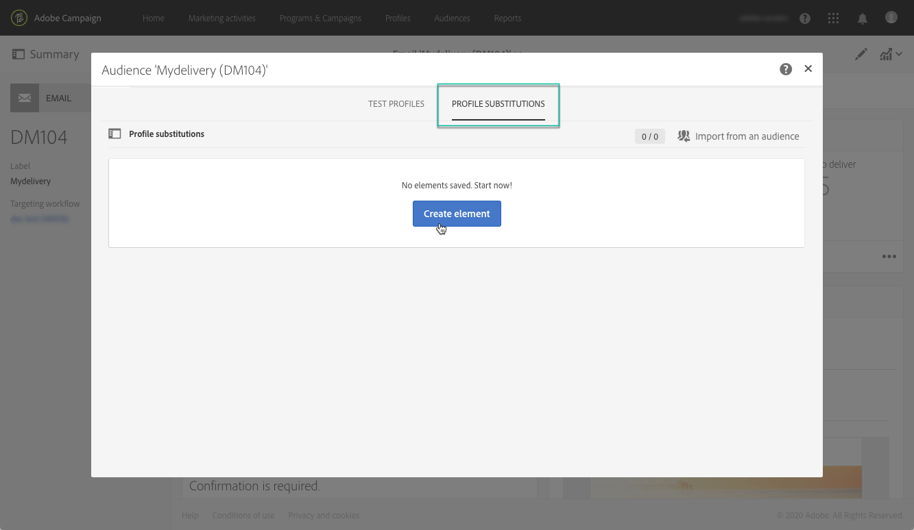

1. プロファイル選択ボタンをクリックして、メッセージのターゲットとなるプロファイルのリストを表示します。

   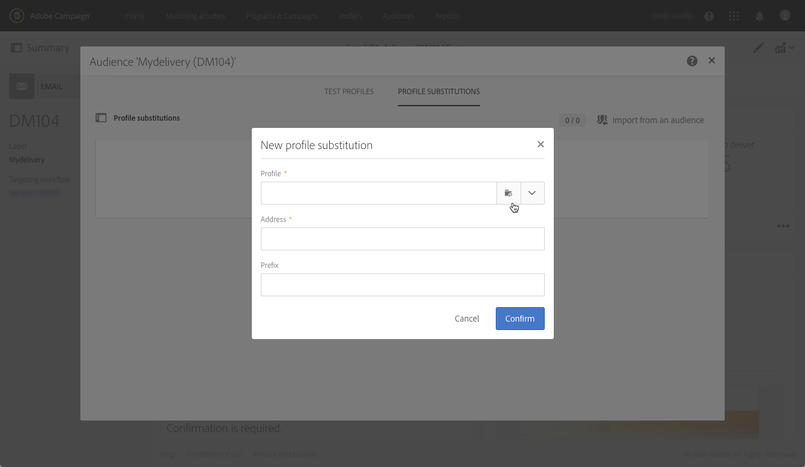

1. テストに使用するプロファイルを選択し、**[!UICONTROL Address]** フィールドに目的の代替アドレスを入力して、**[!UICONTROL Confirm]**&#x200B;をクリックします。 プロファイルをターゲットとするすべてのプルーフは、このプロファイルのデータベースで定義されているものではなく、このメールアドレスに送信されます。

   プルーフの件名に特定のプレフィックスを追加する場合は、**[!UICONTROL Subject line prefix]** フィールドに入力します。

   >[!NOTE]
   >
   >件名の接頭辞には、最大500文字を含めることができます。

   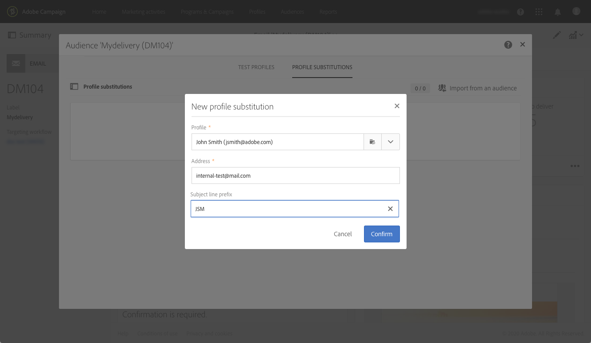

   接頭辞は次のように表示されます。

   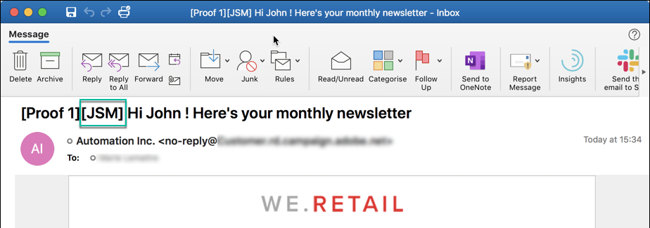

1. プロファイルがリストに追加され、関連する代替アドレスとプレフィックスが表示されます。 テストに使用するすべてのプロファイルに対して上記の手順を繰り返し、**[!UICONTROL Confirm]**&#x200B;をクリックします。

   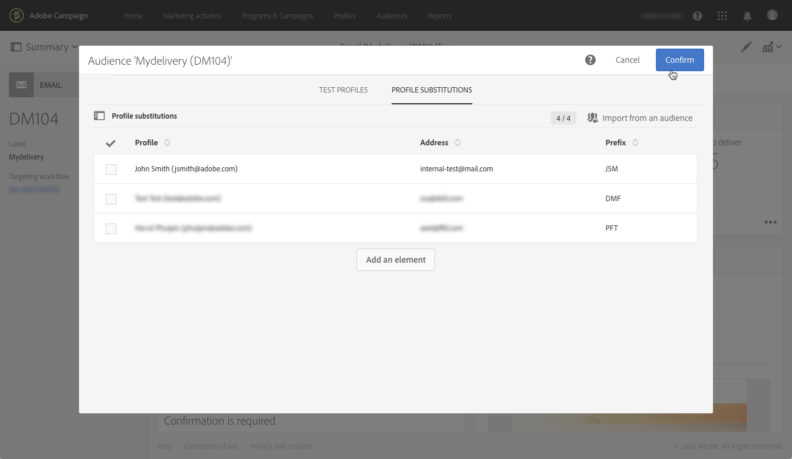

   同じプロファイルの複数の代替アドレスにプルーフを送信する場合は、このプロファイルを必要な回数だけ追加する必要があります。

   次の例では、プロファイル John Smithに基づくプルーフが、次の2つの異なる代替アドレスに送信されます。

   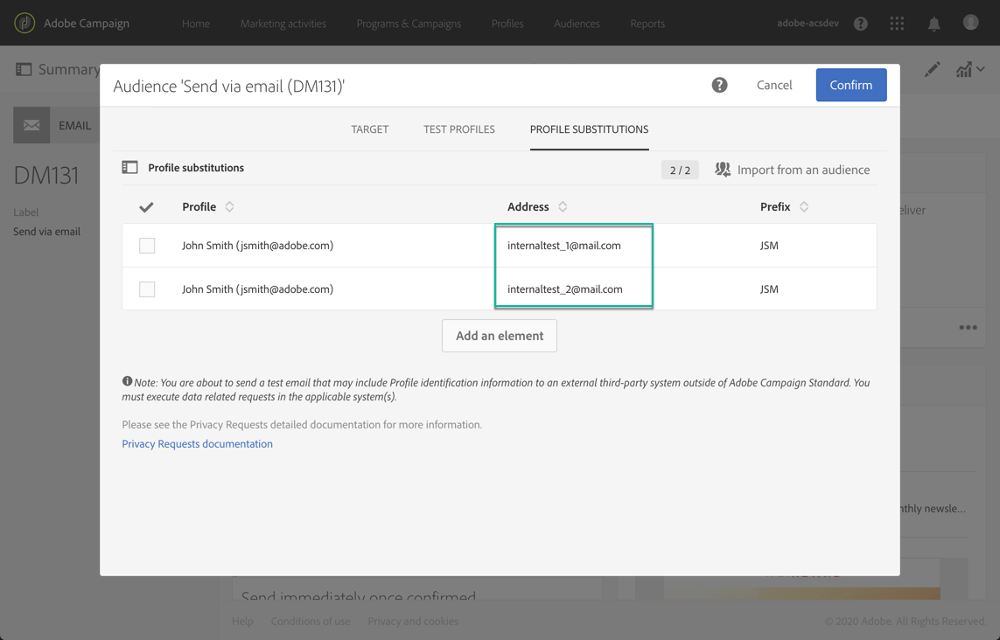

1. すべてのプロファイルと代替アドレスを定義したら、プルーフを送信してメッセージをテストできます。 これをおこなうには、**[!UICONTROL Test]** ボタンをクリックし、実行するテストのタイプを選択します。

   メッセージターゲットにテストプロファイルが追加されていない場合、**[!UICONTROL Email rendering]**&#x200B;および&#x200B;**[!UICONTROL Proof + Email rendering]** オプションは使用できません。  プルーフの送信について詳しくは、[この節](../../sending/using/sending-proofs.md)を参照してください。

   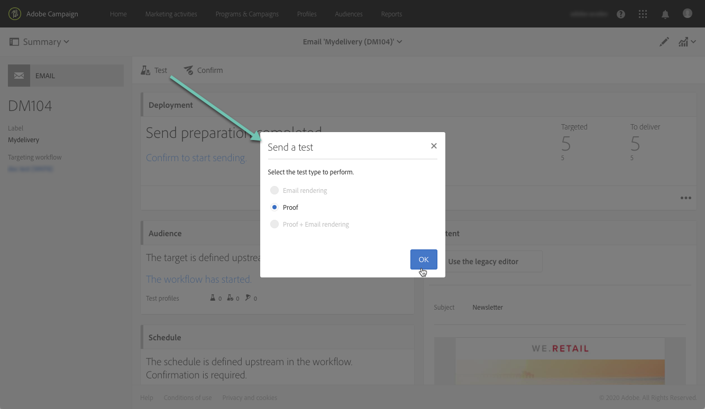

>[!IMPORTANT]
>
>メッセージに変更を加えた場合は、必ずメッセージの準備を再度開始してください。 そうでない場合、変更はプルーフに反映されません。

### オーディエンスからのプロファイルのインポート {#importing-from-audience}

Campaign Standardでは、テストに使用できるプロファイルのオーディエンスをインポートできます。 これにより、例えば、異なるプロファイルを対象とした一連のメッセージ全体を一意の電子メールアドレスに送信できます。

さらに、オーディエンスがアドレス列とプレフィックス列で既に設定されている場合は、**[!UICONTROL Profile substitutions]** タブにこれらの情報を読み込むことができます。 代替アドレスを使用したオーディエンスの読み込みの例については、[この節](#use-case)で詳しく説明しています。

>[!NOTE]
>
>オーディエンスを読み込むと、メッセージターゲットに対応するプロファイルのみが選択され、**[!UICONTROL Profile substitutions]** タブに追加されます。

オーディエンスからテストに使用するプロファイルを読み込むには、次の手順に従います。

1. メッセージダッシュボードで、メッセージの準備が正常に完了したことを確認し、**[!UICONTROL Audience]** ブロックをクリックします。

   

1. 「**[!UICONTROL Profile substitutions]**」タブで、「**[!UICONTROL Import from an audience]**」をクリックします。

   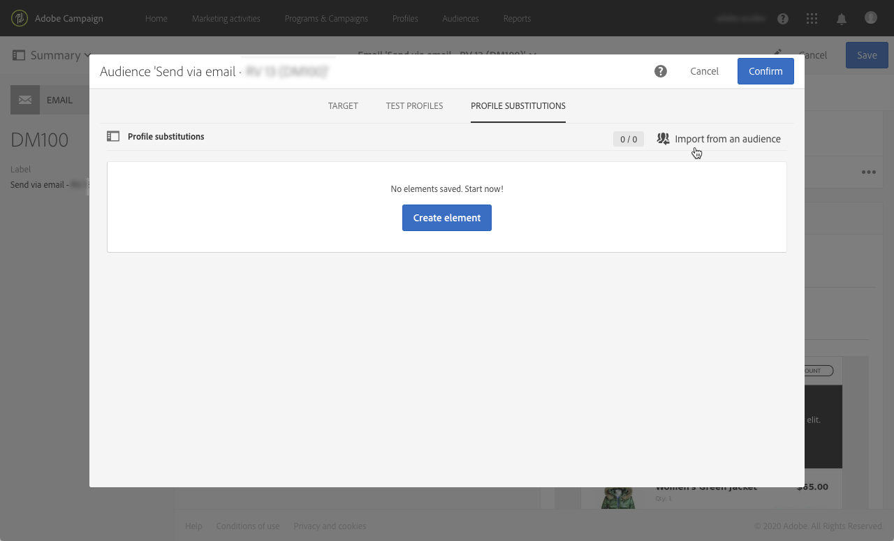

1. 使用するオーディエンスを選択し、オーディエンスに送信されるプルーフに使用する代替アドレスとプレフィックスを入力します。

   >[!NOTE]
   >
   >件名の接頭辞には、最大500文字を含めることができます。

   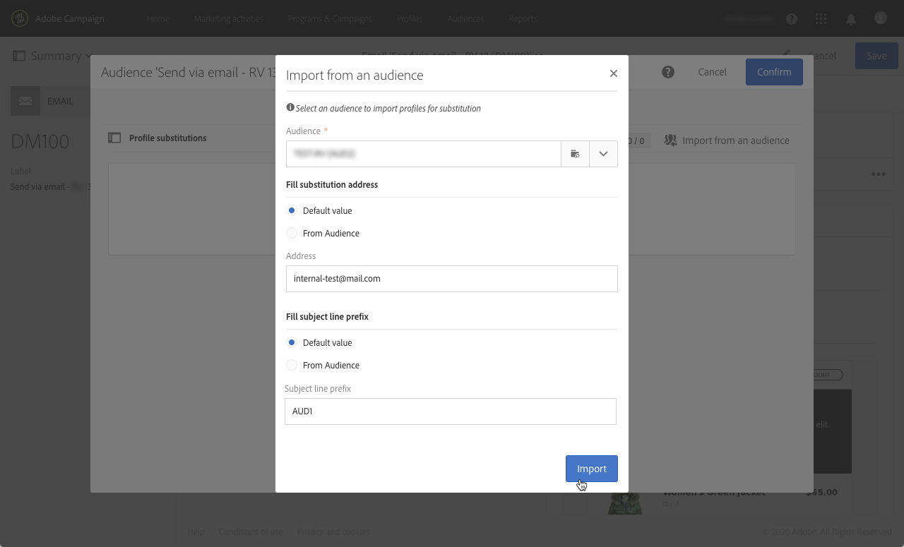

   使用する代替アドレスやプレフィックスがオーディエンスで既に定義されている場合は、**[!UICONTROL From Audience]** オプションを選択し、これらの情報を取得するために使用する列を指定します。

   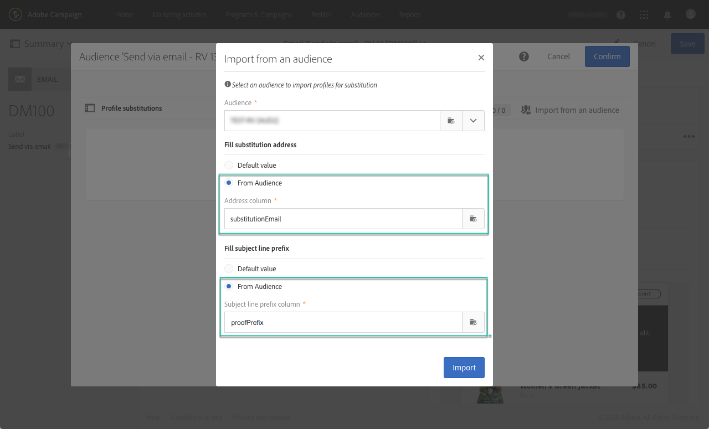

1. 「**[!UICONTROL Import]**」ボタンをクリックします。 メッセージターゲットに対応するオーディエンスのプロファイルが、**[!UICONTROL Profile substitution]** タブに追加され、関連する代替アドレスとプレフィックスも追加されます。

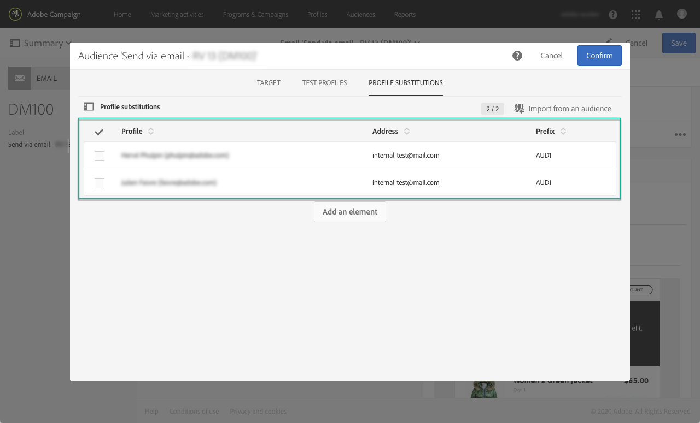

>[!NOTE]
>
>同じオーディエンスをもう一度読み込み、別の代替アドレスやプレフィックスを使用した場合、プロファイルは以前の読み込みのものに加えてリストに追加されます。

## ターゲット設定されたプロファイルを含むメッセージのプレビュー

>[!NOTE]
>
>プレビューは、電子メール Designerでのみ使用できます。

ターゲットプロファイルを使用してメッセージをプレビューするには、これらのプロファイルを&#x200B;**[!UICONTROL Profile substitution]** リストに追加していることを確認します（[&#x200B; プロファイルと代替アドレスの定義](#selecting-profiles)を参照）。

メッセージでパーソナライゼーションフィールドを使用する場合は、メッセージ準備を開始する前に&#x200B;**追加する必要があります。**&#x200B;それ以外の場合は、プレビューで考慮されません。 その結果、パーソナライゼーションフィールドに変更が加えられた場合は、必ずメッセージの準備を再度開始してください。

プロファイル置換を使用してメッセージをプレビューするには、次の手順に従います。

1. メッセージダッシュボードで、コンテンツスナップショットをクリックして、メールDesignerでメッセージを開きます。

   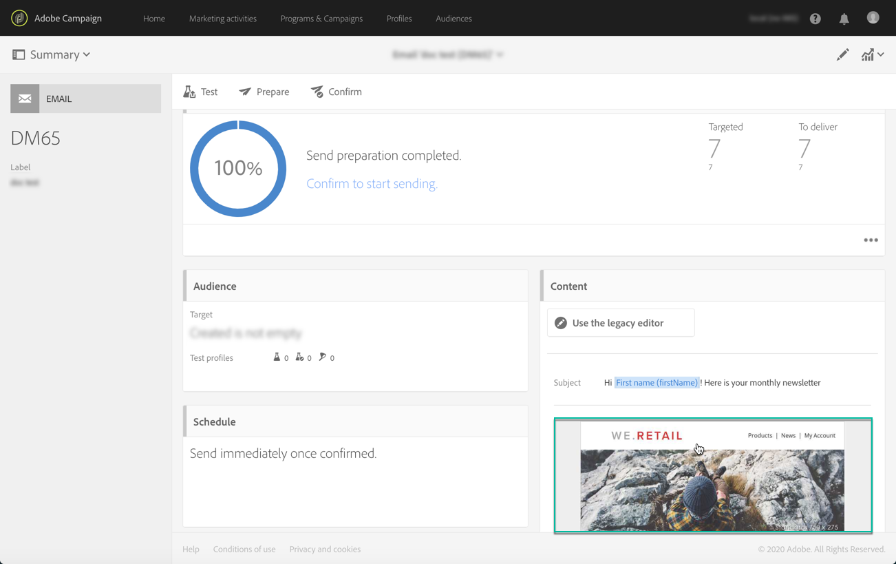

1. 「**[!UICONTROL Preview]**」タブを選択し、「**[!UICONTROL Change profile]**」をクリックします。

   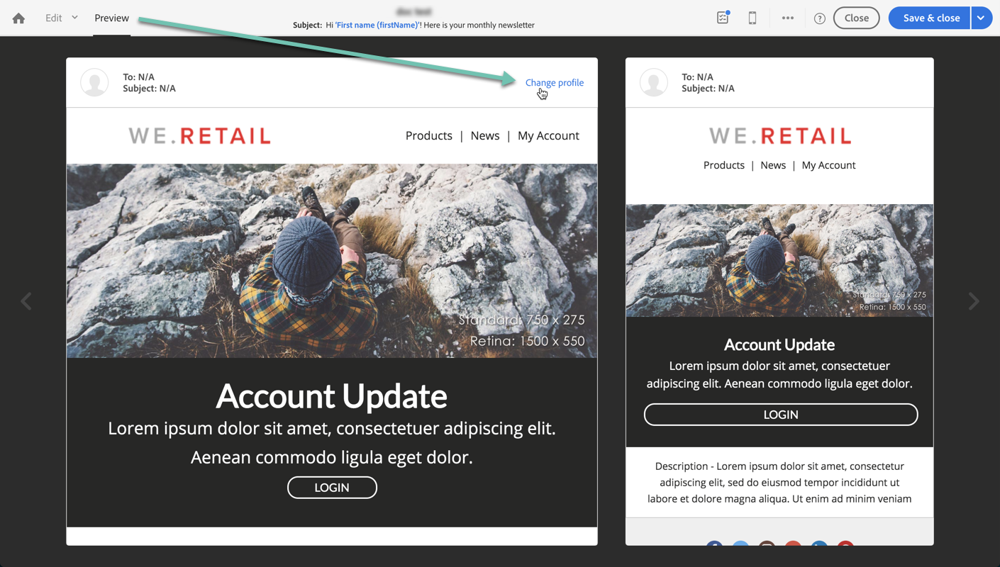

1. 「**[!UICONTROL Profile Substitution]**」タブをクリックして、テスト用に追加された代替プロファイルを表示します。

   プレビューに使用するプロファイルを選択し、**[!UICONTROL Select]**&#x200B;をクリックします。

   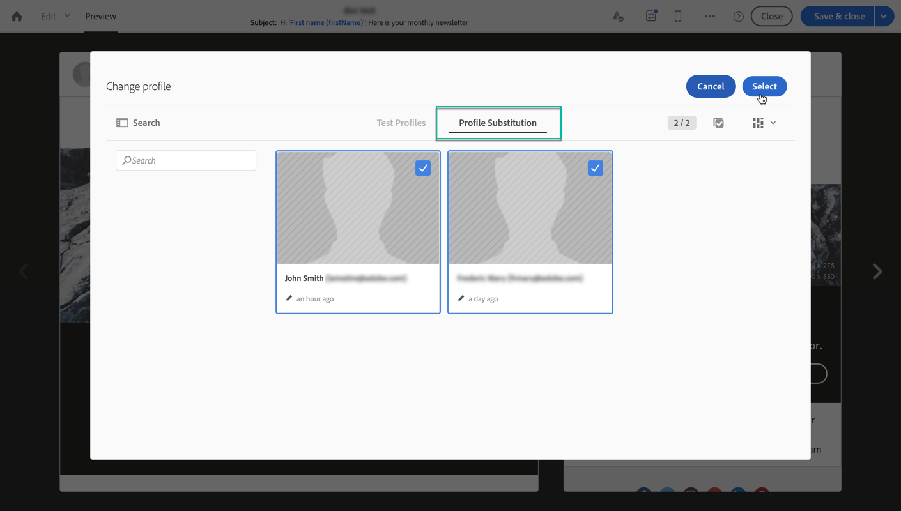

1. メッセージのプレビューが表示されます。 矢印を使用して、選択したプロファイル間を移動します。

   

## ユースケース {#use-case}

このユースケースでは、特定のプロファイルにパーソナライズされたメールニュースレターを送信します。 ニュースレターを送信する前に、ターゲットプロファイルの一部を使用してニュースレターをプレビューし、外部ファイルで定義された内部メールアドレスにプルーフを送信します。

このユースケースの主な手順は次のとおりです。

1. テストに使用するオーディエンスを作成します。
1. ターゲットプロファイルのワークフローを構築し、ニュースレターを送信する。
1. メッセージのプロファイル置換を設定します。
1. ターゲットプロファイルを使用してメッセージをプレビューします。
1. プルーフを送信する：

### 手順1：テストに使用するオーディエンスの作成

1. オーディエンスを作成するために読み込むファイルを準備します。 この場合、プルーフに使用する代替アドレスと、プルーフの件名に追加するプレフィックスを含める必要があります。

   この例では、「oliver.vaughan@internal.com」電子メールアドレスは、「john.doe@mail.com」電子メールアドレスを持つプロファイルをターゲットとするメッセージのプルーフを受け取ります。 「JD」というプレフィックスがプルーフの件名に追加されます。

   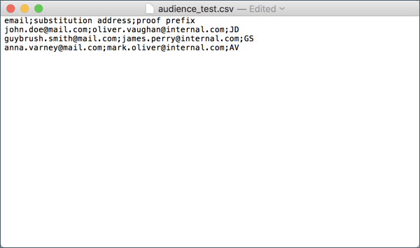

1. ファイルからオーディエンスを作成するワークフローを作成します。 これを行うには、次のアクティビティを追加して設定します。

   * **[!UICONTROL Load file]** アクティビティ：CSV ファイルをインポートします（このアクティビティについて詳しくは、[このセクション &#x200B;](../../automating/using/load-file.md)を参照してください）。
   * **[!UICONTROL Reconciliation]** アクティビティ：ファイルの情報をデータベースの情報にリンクします。 この例では、プロファイルの電子メールアドレスを紐付けフィールドとして使用します（このアクティビティについて詳しくは、[このセクション &#x200B;](../../automating/using/reconciliation.md)を参照してください）。
   * **[!UICONTROL Save audience]** アクティビティ：インポートされたファイルに基づいてオーディエンスを作成します（このアクティビティについて詳しくは、[このセクション &#x200B;](../../automating/using/save-audience.md)を参照してください）。

   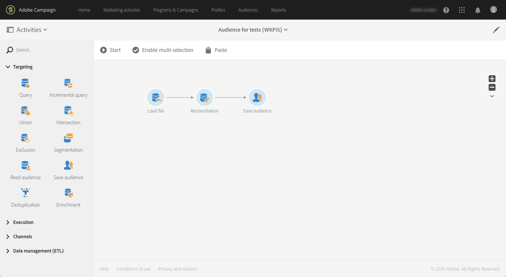

1. ワークフローを実行し、**[!UICONTROL Audiences]** タブに移動して、オーディエンスが目的の情報で作成されていることを確認します。

   この例では、オーディエンスは3つのプロファイルで構成されています。 それぞれに、プルーフを受け取る代替メールアドレスにリンクされ、プルーフの件名に使用する接頭辞が付いています。

   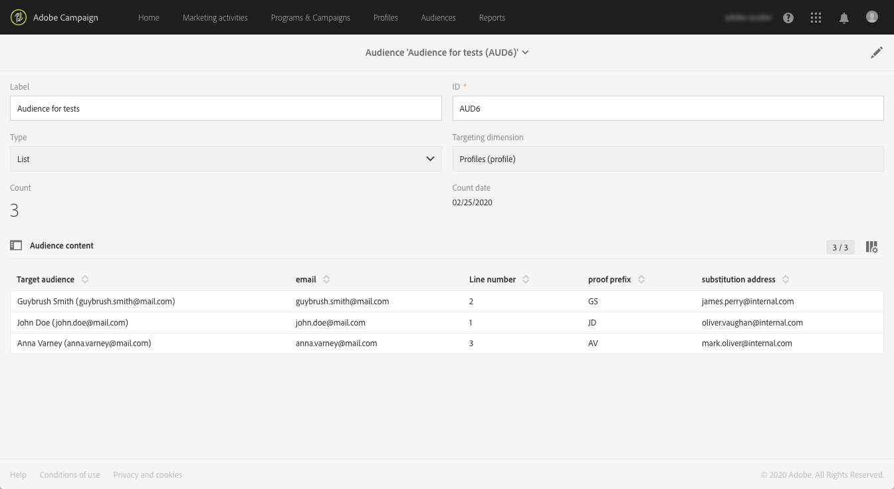

### 手順2：プロファイルのターゲットワークフローを構築し、ニュースレターを送信する

1. **[!UICONTROL Query]**&#x200B;と&#x200B;**[!UICONTROL Email delivery]**&#x200B;のアクティビティを追加し、必要に応じて設定します（[&#x200B; クエリ &#x200B;](../../automating/using/query.md)と[&#x200B; メール配信](../../automating/using/email-delivery.md)のセクションを参照）。

   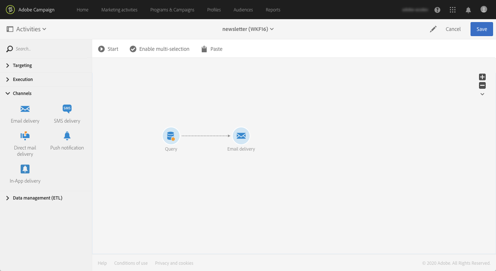

1. ワークフローを実行し、メッセージの準備が成功したことを確認します。

### 手順3: メッセージの「プロファイル置換」タブの設定

1. **[!UICONTROL Email delivery]** アクティビティを開きます。 メッセージダッシュボードで、**[!UICONTROL Audience]** ブロックをクリックします。

   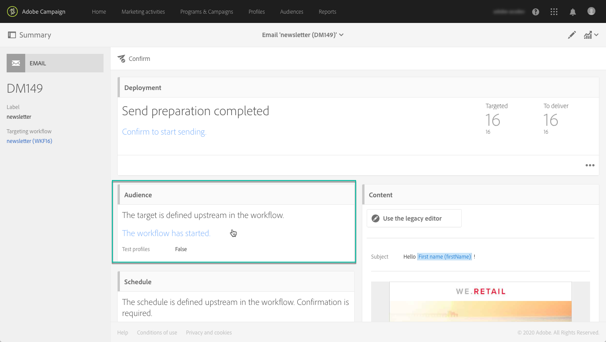

1. 「**[!UICONTROL Profile substitutions]**」タブを選択し、「**[!UICONTROL Import from an audience]**」をクリックします。

   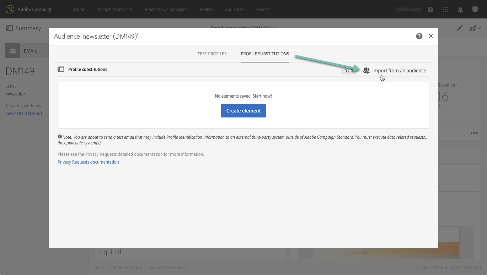

1. 「**[!UICONTROL Audience]**」フィールドで、ファイルから作成したオーディエンスを選択します。

   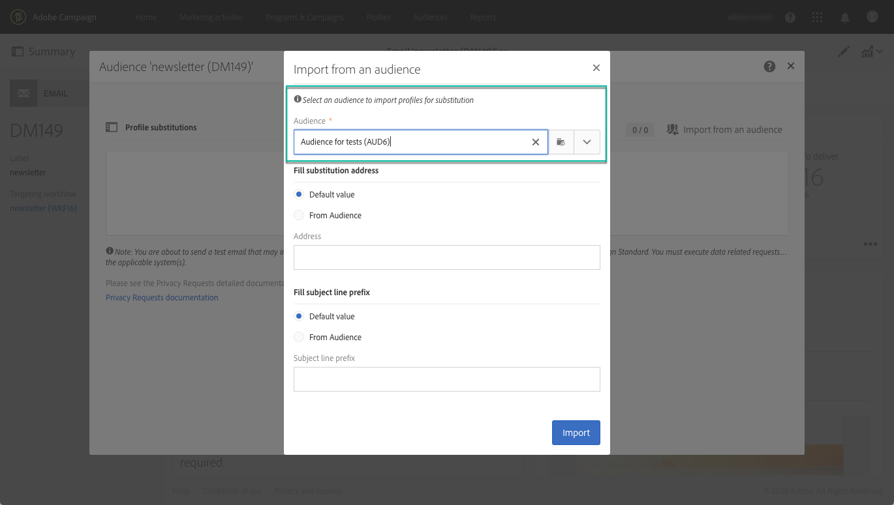

1. プルーフの送信時に使用する代替アドレスと件名のプレフィックスを定義します。

   これを行うには、**[!UICONTROL From audience]** オプションを選択し、情報を含むオーディエンスから列を選択します。

   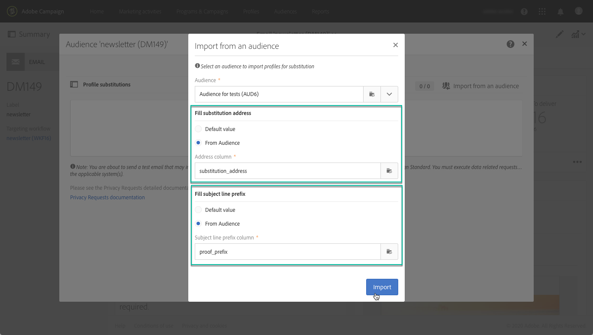

1. 「**[!UICONTROL Import]**」ボタンをクリックします。 オーディエンスのプロファイルが、関連する代替アドレスと件名の接頭辞とともにリストに追加されます。

   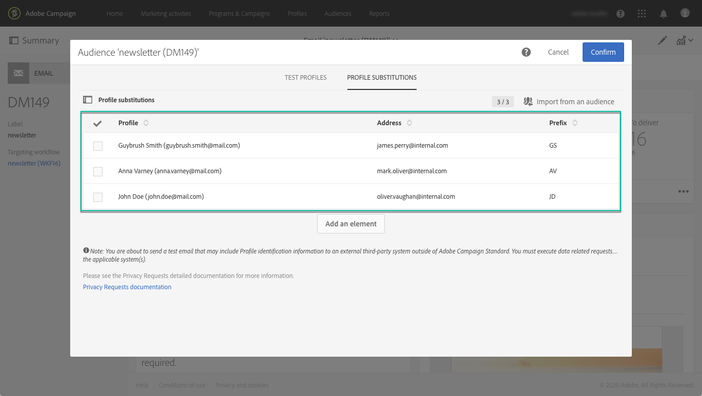

   >[!NOTE]
   >
   >この例では、オーディエンスのすべてのプロファイルが&#x200B;**[!UICONTROL Query]** アクティビティのターゲットになっています。 これらのプロファイルの1つがメッセージターゲットの一部でない場合、そのプロファイルはリストに追加されません。

### 手順4：ターゲットプロファイルを使用したメッセージのプレビュー

1. メッセージダッシュボードで、コンテンツスナップショットをクリックして、メールDesignerでメッセージを開きます。

   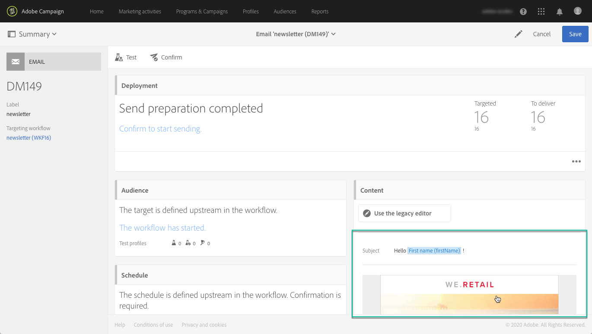

1. 「**[!UICONTROL Preview]**」タブを選択し、「**[!UICONTROL Change profile]**」をクリックします。

   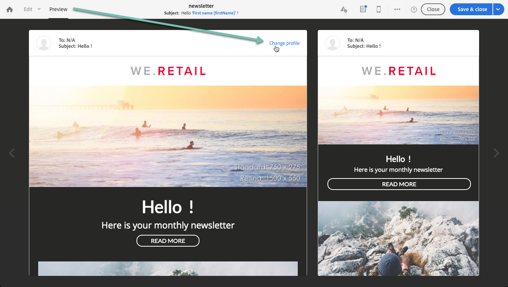

1. 「**[!UICONTROL Profile Substitution]**」タブをクリックして、以前に追加された代替プロファイルを表示します。

   プレビューに使用するプロファイルを選択し、**[!UICONTROL Select]**&#x200B;をクリックします。

   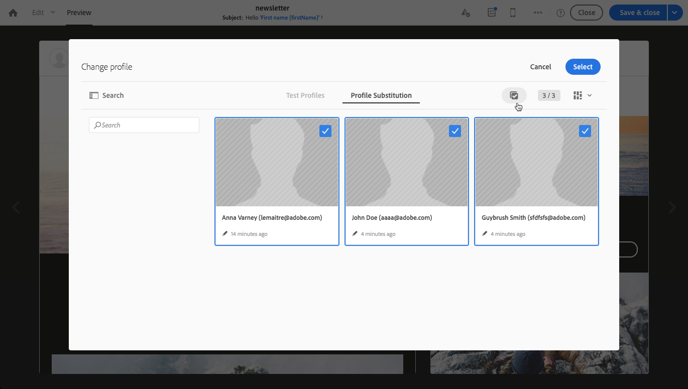

1. メッセージのプレビューが表示されます。 矢印を使用して、選択したプロファイル間を移動します。

   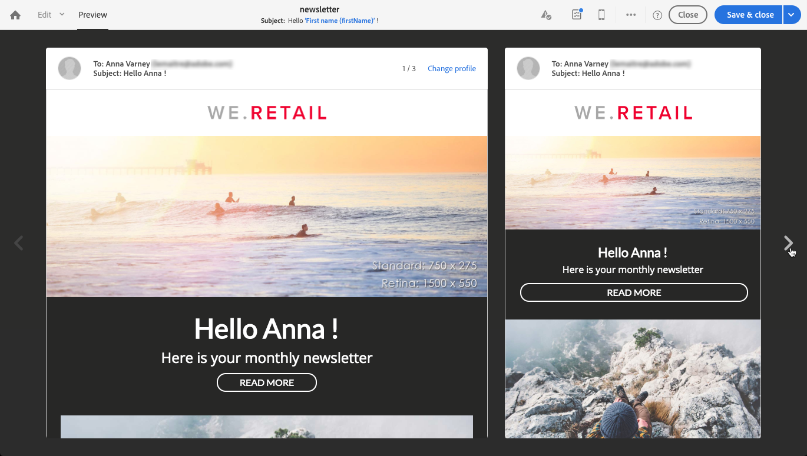

### 手順5：プルーフの送信

1. メッセージダッシュボードで、**[!UICONTROL Test]** ボタンをクリックしてから確認します。

   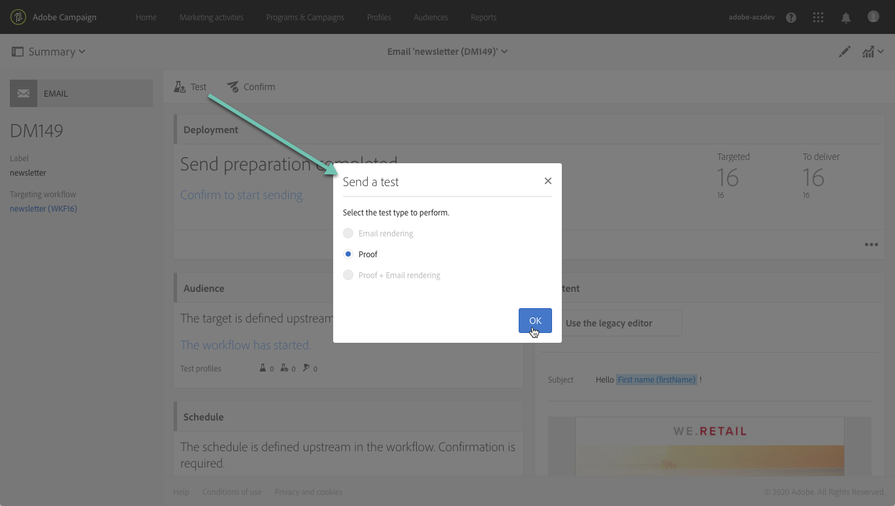

1. プルーフは、**[!UICONTROL Profile substitutions]** タブで設定された内容に従って送信されます。

   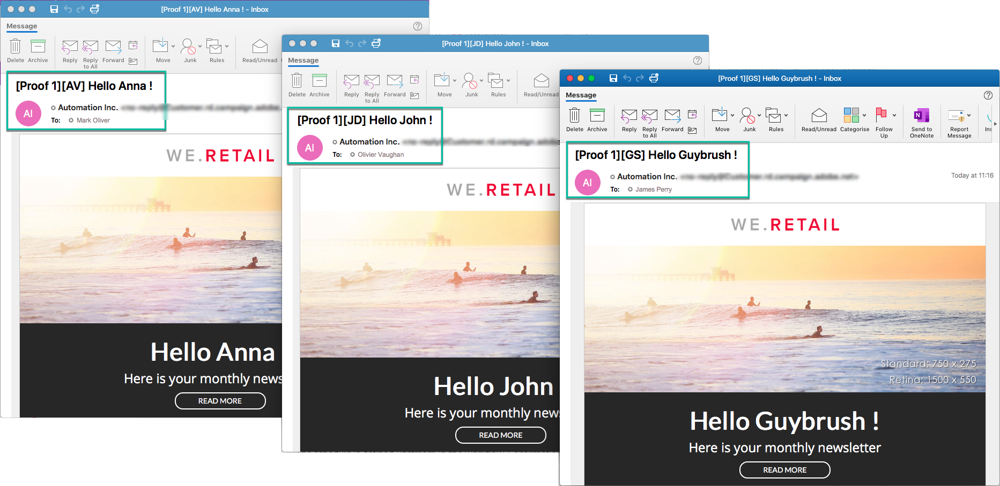

## チュートリアルビデオ {#video}

このビデオでは、プロファイル置換を使用してメールメッセージをテストする方法を示します。

>[!VIDEO](https://video.tv.adobe.com/v/32368?quality=12)

その他のCampaign Standardのハウツー動画は[こちら](https://experienceleague.adobe.com/docs/campaign-standard-learn/tutorials/overview.html?lang=ja)でご覧いただけます。
