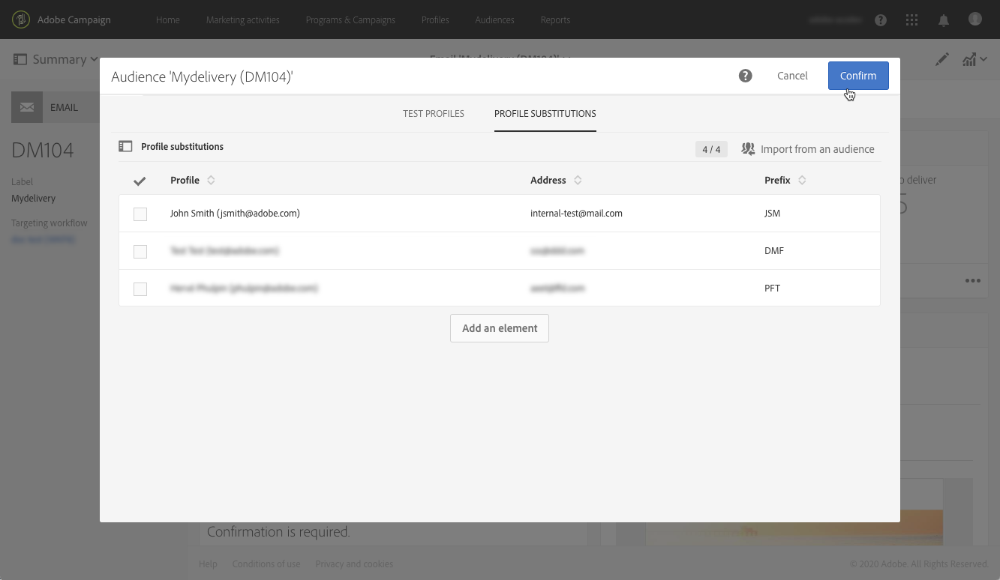

# ターゲットプロファイルを使用した E メールメッセージのテスト {#testing-message-profiles}

## 概要 {#overview}

また、 [プロファイルを](../../audiences/using/managing-test-profiles.md)テストする場合、対象プロファイルの1つの位置に自分を置いて、電子メールメッセージをテストできます。 これにより、プロファイルが受け取るメッセージ(カスタムフィールド、動的な情報、パーソナライズされた情報、ワークフローからの追加データなど)を正確に表示できます。

>[!NOTE]
>
> この機能は、電子メールメッセージでのみ使用できます。

主な手順は次のとおりです。

1. メッセージを設定し、 **準備** 段階を起動します。
1. **メッセージの対象となるプロファイルの中から** 1つまたは複数のプロファイルを選択します。
1. 各プロファイルに、配達確認の送信先となる **代替アドレス** を関連付けます。
1. （オプション）各プロファイルに対して、配達確認の件名行に追加する **プレフィックス** を定義します。
1. **プレビュー** （電子メールデザイナ内）で、プロファイルに対するメッセージの表示方法を指定します。
1. 配達確認を送信します。

グローバルプロセスの詳細については、 [ここで利用可能なチュートリアルビデオを参照してください](https://docs.adobe.com/content/help/ja-JP/campaign-standard-learn/tutorials/communication-channels/email/profile-substitution.html)。

>[!IMPORTANT]
>
>この機能を使用すると、プロファイルの個人情報を外部の E メールアドレスに送信できます。Campaign Standard でプライバシーリクエスト（GDPR および CCPA）を実行しても、リクエストは外部で実行されないことに注意してください。

## プロファイルと置換アドレスの選択 {#selecting-profiles}

ターゲットプロファイルをテストに使用するには、まず選択してから、配達確認を受け取る置換アドレスを定義する必要があります。 これを行うには、対象のプロファイルから特定のプロファイルを [選択するか](#selecting-individual-profiles) 、既存のオーディエンスからプロファイルを [読み込みます](#importing-from-audience)。

>[!NOTE]
>
>テストするプロファイルは最大100個まで選択できます。

### 個々のプロファイルの選択 {#selecting-individual-profiles}

1. メッセージダッシュボードで、メッセージの準備が成功したことを確認し、 **[!UICONTROL Audience]** ブロックをクリックします。

   

1. タブで、 **[!UICONTROL Profile substitutions]****[!UICONTROL Create element]** ボタンをクリックして、テストに使用するプロファイルを選択します。

   

1. プロファイル選択ボタンをクリックして、メッセージの対象となるプロファイルのリストを表示します。

   

1. テストに使用するプロファイルを選択し、フィールドに必要な置換先住所を入力して、 **[!UICONTROL Address]** をクリックし **[!UICONTROL Confirm]**&#x200B;ます。 プロファイルをターゲットにするすべての配達確認が、このプロファイルのデータベースで定義されているアドレスではなく、この電子メールアドレスに送信されます。

   配達確認の件名行に特定のプレフィックスを追加する場合は、 **[!UICONTROL Subject line prefix]** フィールドに入力します。

   >[!NOTE]
   >
   >件名行のプレフィックスは500文字まで含めることができます。

   

   プレフィックスは次のように表示されます。

   

1. プロファイルは、関連する置換アドレスとプレフィックスと共にリストに追加されます。 テストに使用するすべてのプロファイルに対して上記の手順を繰り返し、をクリックし **[!UICONTROL Confirm]**&#x200B;ます。

   

   同じプロファイルに対して複数の置換アドレスに配達確認を送信する場合は、このプロファイルを必要な回数だけ追加する必要があります。

   次の例では、プロファイルJohn Smithに基づく配達確認が、2つの異なる代替アドレスに送信されます。

   

1. すべてのプロファイルと置換アドレスが定義されたら、配達確認を送信してメッセージをテストできます。 これを行うには、 **[!UICONTROL Test]** ボタンをクリックし、実行するテストのタイプを選択します。

   メッセージターゲットにテストプロファイルが追加されていない場合は、 **[!UICONTROL Email rendering]** および **[!UICONTROL Proof + Email rendering]** オプションは使用できません。  For more information on proofs sending, refer to [this section](../../sending/using/sending-proofs.md).

   

>[!IMPORTANT]
>
>メッセージに変更を加えた場合は、必ずメッセージの準備を再度起動してください。 そうしないと、変更は配達確認に反映されません。

### オーディエンスからのプロファイルの読み込み {#importing-from-audience}

Campaign Standardを使用すると、テストに使用できるプロファイルのオーディエンスを読み込むことができます。 これにより、例えば、異なるプロファイルをターゲットとする一連のメッセージを一意の電子メールアドレスに送信できます。

また、オーディエンスに住所とプレフィックスの列が既に設定されている場合は、 **[!UICONTROL Profile substitutions]** タブでこれらの情報を読み込むことができます。 代替住所を含むオーディエンスインポートの例を [この節で詳しく説明します](#use-case)。

>[!NOTE]
>
>オーディエンスを読み込むと、メッセージターゲットに対応するプロファイルのみが選択され、 **[!UICONTROL Profile substitutions]** タブに追加されます。

オーディエンスからテストに使用するプロファイルを読み込むには、次の手順に従います。

1. メッセージダッシュボードで、メッセージの準備が成功したことを確認し、 **[!UICONTROL Audience]** ブロックをクリックします。

   

1. 「**[!UICONTROL Profile substitutions]**」タブで、「**[!UICONTROL Import from an audience]**」をクリックします。

   

1. 使用するオーディエンスを選択し、オーディエンスに送信する配達確認に使用する置換アドレスとプレフィックスを入力します。

   >[!NOTE]
   >
   >件名行のプレフィックスは500文字まで含めることができます。

   

   使用する置換アドレスや接頭辞が既にオーディエンスで定義されている場合は、この **[!UICONTROL From Audience]** オプションを選択し、これらの情報の取得に使用する列を指定します。

   

1. 「**[!UICONTROL Import]**」ボタンをクリックします。メッセージターゲットに対応するオーディエンスのプロファイルが **[!UICONTROL Profile substitution]** タブに追加され、関連する置換アドレスと接頭辞が追加されます。

>[!NOTE]
>
>同じオーディエンスを再度読み込むと、別の置換アドレスや接頭辞を持つプロファイルは、以前の読み込みのに加えてリストに追加されます。

## ターゲットプロファイルを含むメッセージのプレビュー

>[!NOTE]
>
>プレビューは、電子メールデザイナでのみ使用できます。

ターゲットプロファイルを使用してプレビューを行うには、これらのプロファイルを **[!UICONTROL Profile substitution]** リストに追加していることを確認します( [プロファイルおよび置換アドレスの定義を参照](#selecting-profiles))。

メッセージ内のパーソナライゼーションフィールドを使用する場合は、メッセージの準備を **開始する前に** 、メッセージを追加する必要があります。 そうしないと、プレビューでは考慮されません。 その結果、パーソナライゼーションフィールドに変更が加えられた場合は、必ずメッセージの準備を再度起動してください。

プロファイルの置換を使用してプレビュー・メッセージを作成するには、次の手順に従います。

1. メッセージダッシュボードで、コンテンツのスナップショットをクリックして、電子メールデザイナーでメッセージを開きます。

   

1. Select the **[!UICONTROL Preview]** tab, then click **[!UICONTROL Change profile]**.

   

1. タブをクリックし **[!UICONTROL Profile Substitution]** て、テスト用に追加された置換プロファイルを表示します。

   プレビューに使用するプロファイルを選択し、をクリックし **[!UICONTROL Select]**&#x200B;ます。

   

1. メッセージのプレビューが表示されます。 矢印を使用して、選択したプロファイル間を移動します。

   

## 使用例 {#use-case}

この使用事例では、特定のプロファイルに対してパーソナライズされた電子メールニュースレターを送信する必要があります。 ニュースレターを送信する前に、対象プロファイルの一部を使用してプレビューを行い、外部ファイルで定義された内部電子メールアドレスに配達確認を送信します。

この使用例の主な手順は次のとおりです。

1. テストに使用するオーディエンスを作成します。
1. ターゲットプロファイルにワークフローを構築し、ニュースレターを送信します。
1. メッセージの代替プロファイルを設定します。
1. ターゲットプロファイルを使用してプレビューを行います。
1. 配達確認の送信

### 手順1:テストに使用するオーディエンスの作成

1. 読み込むファイルを準備し、オーディエンスを作成します。 この場合、配達確認に使用する置換アドレスと、配達確認の件名行に追加するプレフィックスを含める必要があります。

   この例では、「oliver.vaughan@internal.com」電子メールアドレスに、「john.doe@mail.com」電子メールアドレスを持つプロファイルを対象とした配達確認が送信されます。 「JD」プレフィックスが配達確認の件名行に追加されます。

   

1. ワークフローを構築して、ファイルからオーディエンスを作成します。 これを行うには、次のアクティビティを追加して設定します。

   * **[!UICONTROL Load file]** アクティビティ:CSVファイルを読み込みます(このアクティビティの詳細については、 [この節を参照](../../automating/using/load-file.md))。
   * **[!UICONTROL Reconciliation]** アクティビティ:ファイルの情報をデータベースの情報にリンクします。 この例では、プロファイルの電子メールアドレスを「調整」フィールドとして使用します(このアクティビティの詳細については、 [この節を参照](../../automating/using/reconciliation.md))。
   * **[!UICONTROL Save audience]** アクティビティ:読み込んだファイルに基づいてオーディエンスを作成します(このアクティビティの詳細については、 [この節を参照](../../automating/using/save-audience.md))。

   

1. ワークフローを実行し、 **[!UICONTROL Audiences]** タブに移動して、オーディエンスが必要な情報と共に作成されたことを確認します。

   この例では、オーディエンスは3つのプロファイルで構成されています。 それぞれが、配達確認を受け取る置換電子メールアドレスにリンクされ、配達確認の件名行に使用するプレフィックスが付きます。

   

### 手順2:ターゲットプロファイルへのワークフローの構築とニュースレターの送信

1. 必要に応じ **[!UICONTROL Query]** て、お追加よび **[!UICONTROL Email delivery]** アクティビティを設定します(「 [クエリ](../../automating/using/query.md) 」および「 [電子メールの配信](../../automating/using/email-delivery.md) 」セクションを参照)。

   

1. ワークフローを実行し、メッセージの準備が成功したことを確認します。

### 手順3:メッセージのプロファイル置換タブの設定

1. Open the **[!UICONTROL Email delivery]** activity. In the message dashboard, click the **[!UICONTROL Audience]** block.

   

1. Select the **[!UICONTROL Profile substitutions]** tab, then click **[!UICONTROL Import from an audience]**.

   

1. フィールドで、ファイルから作成したオーディエンスを選択し **[!UICONTROL Audience]** ます。

   

1. 配達確認の送信時に使用する置換住所と件名の接頭辞を定義します。

   これを行うには、 **[!UICONTROL From audience]** オプションを選択し、情報を含むオーディエンスから列を選択します。

   

1. 「**[!UICONTROL Import]**」ボタンをクリックします。オーディエンスのプロファイルは、関連する置換アドレスと件名行プレフィックスと共にリストに追加されます。

   

   >[!NOTE]
   >
   >この場合、オーディエンスのすべてのプロファイルが **[!UICONTROL Query]** アクティビティのターゲットになります。 これらのプロファイルの1つがメッセージターゲットに含まれていない場合、リストに追加されません。

### 手順4:ターゲットプロファイルを使用したプレビュー

1. メッセージダッシュボードで、コンテンツのスナップショットをクリックして、電子メールデザイナーでメッセージを開きます。

   

1. Select the **[!UICONTROL Preview]** tab, then click **[!UICONTROL Change profile]**.

   

1. タブをクリックし **[!UICONTROL Profile Substitution]** て、前に追加した置換プロファイルを表示します。

   プレビューに使用するプロファイルを選択し、をクリックし **[!UICONTROL Select]**&#x200B;ます。

   

1. メッセージのプレビューが表示されます。 矢印を使用して、選択したプロファイル間を移動します。

   

### 手順5:配達確認の送信

1. In the message dashboard, click the **[!UICONTROL Test]** button, then confirm.

   

1. 配達確認は、 **[!UICONTROL Profile substitutions]** タブで設定した内容に従って送信されます。

   
