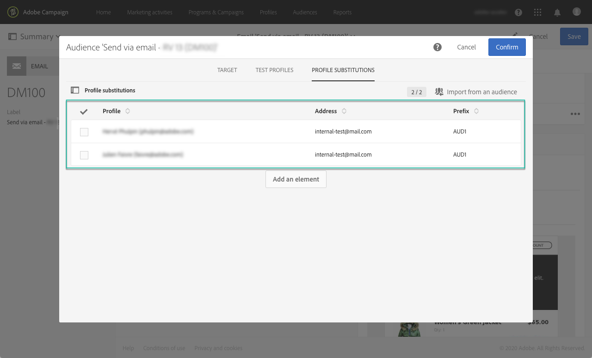

# ターゲットを設定したメッセージを使用した電子メールプロファイル {#testing-message-profiles}

## 概要 {#overview}

また、テ [ストプロファイル](../../audiences/using/managing-test-profiles.md)(Test Message)に加えて、自分自身をターゲットとするメッセージの1つの位置に置くことで、電子メールメッセージをテストできます。 これにより、プロファイルが受け取るメッセージ(カスタムフィールド、動的な情報、パーソナライズされた情報、ワークフローからの追加データなど)を正確に表示できます。

>[!NOTE]
>
> この機能は、電子メールメッセージでのみ使用できます。

主な手順は次のとおりです。

1. メッセージを設定し、準備段階を **開始** します。
1. **メッセージの対象となるプロファイル** 1つまたは複数のプロファイルを選択します。
1. 各プロファイルに、送 **信先の** 配達確認を関連付けます。
1. （オプション）各プロファイルに対して、 **配達確認の** 件名行に追加する接頭辞を定義します。
1. **プレビュー** （電子メールデザイナ内）。プロファイルのメッセージの表示方法。
1. 配達確認

グローバルプロセスについて詳しくは、こちらのチュートリアルビデオを参照して [ください](https://docs.adobe.com/content/help/en/campaign-standard-learn/tutorials/communication-channels/email/profile-substitution.html)。

>[!IMPORTANT]
>
>この機能を使用すると、プロファイルの個人情報を外部の電子メールアドレスに送信できます。 Campaign Standardでプライバシーリクエスト（GDPRおよびCCPA）を実行しても、そのリクエストは外部で実行されないことに注意してください。

## プロファイルと置換アドレスの選択 {#selecting-profiles}

ターゲットプロファイルをテストに使用するには、まず選択してから、選択を受け取る置換アドレスを定義する必要があります。配達確認 これを行うには、対象のプロファイルから [特定のプロファイルを選択する](#selecting-individual-profiles) か、既存のプロファイルから [オーディエンスを読み込みます](#importing-from-audience)。

>[!NOTE]
>
>テスト対象として選択できるプロファイルは100個までです。

### 個々のプロファイル {#selecting-individual-profiles}

1. メッセージダッシュボードで、メッセージの準備が正常に完了していることを確認し、ブロックをクリック **[!UICONTROL Audience]** します。

   

1. タブで、 **[!UICONTROL Profile substitutions]** ボタンをクリ **[!UICONTROL Create element]** ックして、テストに使用するプロファイルを選択します。

   

1. プロファイル選択ボタンをクリックして、メッセージの対象となるプロファイルのリストを表示します。

   

1. テストに使用するプロファイルを選択し、目的の置換住 **[!UICONTROL Address]** 所をフィールドに入力して、をクリックしま **[!UICONTROL Confirm]**&#x200B;す。 プロファイルをターゲットにするすべての配達確認は、このプロファイルのデータベースで定義されているアドレスではなく、この電子メールアドレスに送信されます。

   特定のプレフィックスを配達確認の件名行に追加する場合は、フィールドに入力し **[!UICONTROL Subject line prefix]** ます。

   

   プレフィックスは次のように表示されます。

   

1. プロファイルは、関連する置換アドレスとリストのプレフィックスと共に、メニューに追加されます。 テストに使用するすべてのプロファイルに対して上記の手順を繰り返し、をクリックしま **[!UICONTROL Confirm]**&#x200B;す。

   

   同じプロファイルの複数の置換アドレスに配達確認を送信する場合は、必要な回数だけこのプロファイルを追加する必要があります。

   次の例では、配達確認John Smithに基づくプロファイルが、2つの異なる置換アドレスに送信されます。

   

1. すべてのプロファイルと置換アドレスを定義したら、メッセージを送信して配達確認をテストできます。 これを行うには、ボタンをク **[!UICONTROL Test]** リックし、実行するテストのタイプを選択します。

   テストプロファイルがメッセージターゲットに追加されていない場合は、とのオ **[!UICONTROL Email rendering]** プショ **[!UICONTROL Proof + Email rendering]** ンは使用できません。  For more information on proofs sending, refer to [this section](../../sending/using/sending-proofs.md).

   

>[!IMPORTANT]
>
>メッセージに変更を加えた場合は、必ずメッセージの準備を再度起動してください。 そうしないと、変更は反映されません。配達確認

### プロファイルの読み込みオーディエンス {#importing-from-audience}

Campaign Standardを使用すると、テストに使用できるオーディエンスのプロファイルを読み込むことができます。 これにより、例えば、異なるメッセージをターゲットとする一連のメッセージを一意の電子メールアドレスに送信できます。プロファイル

また、オーディエンスが既に住所列とプレフィックス列を使用して設定されている場合は、タブでこれらの情報を読み込むことがで **[!UICONTROL Profile substitutions]** きます。 この節では、オーディエンスのインポートと置換アドレスの例 [を詳しく説明しま](#use-case)す。

>[!NOTE]
>
>オーディエンスを読み込むと、メッセージプロファイルに対応するターゲットのみが選択され、タブに追加さ **[!UICONTROL Profile substitutions]** れます。

テストに使用するプロファイルをオーディエンスから読み込むには、次の手順に従います。

1. メッセージダッシュボードで、メッセージの準備が正常に完了していることを確認し、ブロックをクリック **[!UICONTROL Audience]** します。

   

1. タブでをク **[!UICONTROL Profile substitutions]** リックしま **[!UICONTROL Import from an audience]**&#x200B;す。

   

1. 使用するオーディエンスを選択し、置換アドレスと、オーディエンスに送信する配達確認の接頭辞を入力します。

   

   使用する置換住所や接頭辞がオーディエンスで既に定義されている場合は、このオプションを選択し **[!UICONTROL From Audience]** 、これらの情報の取得に使用する列を指定します。

   

1. ボタンをクリッ **[!UICONTROL Import]** クします。 メッセージプロファイルに対応するオーディエンスのターゲットがタブに追加され、 **[!UICONTROL Profile substitution]** 関連する置換アドレスと接頭辞が追加されます。

>[!NOTE]
>
>同じオーディエンスを別の置換アドレスや接頭辞を使用して再度読み込むと、プロファイルは以前の読み込みのに加えてリストに追加されます。

## ターゲットを設定したメッセージのプレビュープロファイル

>[!NOTE]
>
>プレビューは、電子メールデザイナーでのみ使用できます。

ターゲットプロファイルを使用してプレビューを行うには、これらのプロファイルをリストに追加しておく必要があります( **[!UICONTROL Profile substitution]** プロファイルと置換 [アドレスの定義を参照](#selecting-profiles))。

メッセージ内でパーソナライゼーションフィールドを使用する場合は、メッセージの準備を開始する前に **** 、メッセージを追加する必要があります。 そうしないと、これらは考慮されません。プレビュー その結果、メッセージに変更が加えられた場合は、必ずメッセージの準備を再び起動してください。パーソナライゼーションフィールド

プレビューの置換を使用してプロファイル・メッセージを作成するには、次の手順に従います。

1. メッセージダッシュボードで、コンテンツのスナップショットをクリックして、電子メールデザイナーでメッセージを開きます。

   

1. タブを選択 **[!UICONTROL Preview]** し、をクリックしま **[!UICONTROL Change profile]**&#x200B;す。

   

1. タブをクリ **[!UICONTROL Profile Substitution]** ックし、テスト用に追加された代替プロファイルを表示します。

   プロファイルに使用するプレビューを選択し、をクリックしま **[!UICONTROL Select]**&#x200B;す。

   

1. メッセージのプレビューが表示されます。 矢印を使用して、選択したプロファイル間を移動

   

## 使用例 {#use-case}

この使用事例では、特定のプロファイルにパーソナライズされた電子メールニュースレターを送信します。 ニュースレターを送信する前に、対象のプロファイルの一部を使用してプレビューし、外部ファイルで定義された内部電子メールアドレスに配達確認を送信します。

この使用例の主な手順は次のとおりです。

1. テストに使用するオーディエンスを作成します。
1. ワークフローを作成してターゲットプロファイルに送信します。
1. メッセージの置換プロファイルを設定
1. プレビュー対象のメッセージを使用してプロファイルします。
1. 送信配達確認。

### 手順1:テストに使用するオーディエンスの作成

1. 読み込むファイルを準備し、オーディエンスを作成 この場合、配達確認に使用する置換アドレスと、配達確認の件名行に追加する接頭辞を含める必要があります。

   この例では、「oliver.vaughan@internal.com」電子メールアドレスに、「john.doe@mail.com」電子メールアドレスを持つプロファイルをターゲットにしたメッセージの配達確認が送信されます。 「JD」プレフィックスが配達確認の件名行に追加されます。

   

1. ワークフローを構築し、ファイルからオーディエンスを作成します。 これを行うには、以下のオプションを追加し、アクティビティを設定します。

   * **[!UICONTROL Load file]** アクティビティ:CSVファイルを読み込みます(このアクティビティの詳細については、この節 [を参照](../../automating/using/load-file.md))。
   * **[!UICONTROL Reconciliation]** アクティビティ:ファイルの情報をデータベースの情報にリンクします。 この例では、プロファイルの電子メールアドレスを調整フィールドとして使用します(このアクティビティの詳細については、この節を参 [照してください](../../automating/using/reconciliation.md))。
   * **[!UICONTROL Save audience]** アクティビティ:読み込んだオーディエンスに基づいてアクティビティを作成します(このオプションの詳細については、こ [の節を参照](../../automating/using/save-audience.md))。
   

1. ワークフローを実行し、タブに移動し **[!UICONTROL Audiences]** て、必要な情報でオーディエンスが作成されたことを確認します。

   この例では、オーディエンスは3つのプロファイルで構成されます。 それぞれが、配達確認を受け取る置換電子メールアドレスにリンクされ、配達確認の件名行に使用するプレフィックスが付きます。

   

### 手順2:ワークフローを作成してターゲットプロファイルに送信する

1. およ **[!UICONTROL Query]** び **[!UICONTROL Email delivery]** アクティビティを設定し、必要に応じて設定します(「 [クエリ](../../automating/using/query.md) 」と「電子メー [ル配信](../../automating/using/email-delivery.md) 」を参照)。

   

1. ワークフローを実行し、メッセージの準備が正常に完了していることを確認します。

### 手順3:メッセージの代替プロファイルタブの設定

1. Open the **[!UICONTROL Email delivery]** activity. メッセージダッシュボードで、ブロックをクリッ **[!UICONTROL Audience]** クします。

   

1. タブを選択 **[!UICONTROL Profile substitutions]** し、をクリックしま **[!UICONTROL Import from an audience]**&#x200B;す。

   

1. フィールド **[!UICONTROL Audience]** で、ファイルから作成したオーディエンスを選択します。

   

1. 配達確認の送信時に使用する置換住所と件名行の接頭辞を定義します。

   これを行うには、このオプションを **[!UICONTROL From audience]** 選択し、情報を含むオーディエンスの列を選択します。

   

1. ボタンをクリッ **[!UICONTROL Import]** クします。 プロファイルからのオーディエンスが、関連する置換アドレスと件名行プレフィックスと共にリストに追加されます。

   

   >[!NOTE]
   >
   >この例では、オーディエンスのすべてのプロファイルがアクティビティのターゲットにな **[!UICONTROL Query]** ります。 これらのプロファイルの1つがメッセージターゲットの一部でない場合、メッセージに追加されません。

### 手順4:プレビュー対象を指定したプロファイル

1. メッセージダッシュボードで、コンテンツのスナップショットをクリックして、電子メールデザイナーでメッセージを開きます。

   

1. タブを選択 **[!UICONTROL Preview]** し、をクリックしま **[!UICONTROL Change profile]**&#x200B;す。

   

1. タブをクリッ **[!UICONTROL Profile Substitution]** クして、以前に追加した代替プロファイルを表示します。

   プロファイルに使用するプレビューを選択し、をクリックしま **[!UICONTROL Select]**&#x200B;す。

   

1. メッセージのプレビューが表示されます。 矢印を使用して、選択したプロファイル間を移動

   

### 手順5:送信配達確認

1. メッセージダッシュボードで、ボタンをク **[!UICONTROL Test]** リックし、確認します。

   

1. 配達確認は、タブで設定された内容に従って送信され **[!UICONTROL Profile substitutions]** ます。

   
