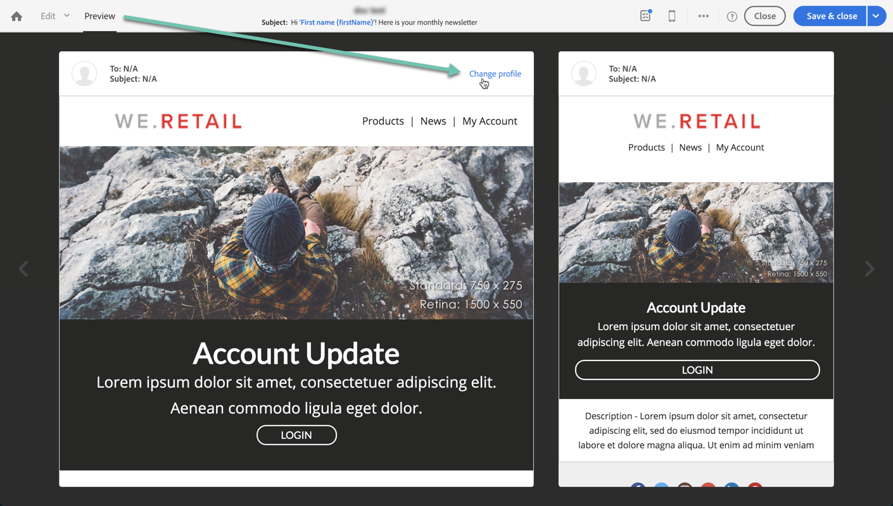

# ターゲットプロファイルを使用した E メールメッセージのテスト {#testing-message-profiles}

## 概要 {#overview}

[ テストプロファイル ](../../audiences/using/managing-test-profiles.md) に加えて、ターゲットプロファイルの 1 つの位置に自分を配置して、E メールメッセージをテストできます。 これにより、プロファイルが受け取るメッセージ ( カスタムフィールド、動的情報、パーソナライズされた情報（ワークフローからの追加データを含む）の正確な内容を取得できます。

>[!NOTE]
>
> この機能は、E メールメッセージでのみ使用できます。

主な手順は次のとおりです。

1. メッセージを設定し、**準備** フェーズを開始します。
1. **メッセージの対象となるプ** ロファイルの中から 1 つ以上のプロファイルを選択します。
1. 配達確認の送信先となる **代用アドレス** を各プロファイルに関連付けます。
1. （オプション）各プロファイルで、配達確認の件名行に追加する **プレフィックス** を定義します。
1. **** E メールデザイナーで、プロファイルに対するメッセージの表示方法をプレビューします。
1. 配達確認を送信します。

>[!IMPORTANT]
>
>この機能を使用すると、プロファイルの個人情報を外部の E メールアドレスに送信できます。Campaign Standard でプライバシーリクエスト（GDPR および CCPA）を実行しても、リクエストは外部で実行されないことに注意してください。

 [動画でこの機能を確認する](#video)

## プロファイルと代替アドレスの選択 {#selecting-profiles}

ターゲットプロファイルをテストに使用するには、まずターゲットプロファイルを選択してから、配達確認を受け取る代用アドレスを定義する必要があります。 これをおこなうには、ターゲットプロファイルの中から特定のプロファイル ](#selecting-individual-profiles) を [ 選択するか、既存のオーディエンスからプロファイルを [ インポートします。](#importing-from-audience)

>[!NOTE]
>
>テスト用に最大 100 個のプロファイルを選択できます。

### 個々のプロファイルの選択 {#selecting-individual-profiles}

1. メッセージダッシュボードで、メッセージの準備が成功したことを確認し、**[!UICONTROL Audience]** ブロックをクリックします。

   

1. 「**[!UICONTROL Profile substitutions]**」タブで、「**[!UICONTROL Create element]**」ボタンをクリックして、テストに使用するプロファイルを選択します。

   

1. 「プロファイルの選択」ボタンをクリックして、メッセージのターゲットとなるプロファイルのリストを表示します。

   

1. テストに使用するプロファイルを選択し、**[!UICONTROL Address]** フィールドに目的の置換アドレスを入力して、「**[!UICONTROL Confirm]**」をクリックします。 プロファイルをターゲットとするすべての配達確認は、このプロファイルのデータベースで定義された配達確認ではなく、この E メールアドレスに送信されます。

   配達確認の件名行に特定のプレフィックスを追加する場合は、「**[!UICONTROL Subject line prefix]**」フィールドに入力します。

   >[!NOTE]
   >
   >件名の行のプレフィックスは 500 文字までです。

   

   プレフィックスは次のように表示されます。

   

1. プロファイルがリストに追加され、関連する代替アドレスとプレフィックスが付けられます。 テストに使用するすべてのプロファイルに対して上記の手順を繰り返し、「**[!UICONTROL Confirm]**」をクリックします。

   

   同じプロファイルの複数の代用アドレスに配達確認を送信する場合は、このプロファイルを必要な回数だけ追加する必要があります。

   次の例では、John Smith プロファイルに基づく配達確認は、2 つの異なる置換アドレスに送信されます。

   

1. すべてのプロファイルと代用アドレスを定義したら、配達確認を送信してメッセージをテストできます。 それには、**[!UICONTROL Test]** ボタンをクリックし、実行するテストのタイプを選択します。

   メッセージのターゲットにテストプロファイルが追加されていない場合、 **[!UICONTROL Email rendering]** と **[!UICONTROL Proof + Email rendering]** のオプションは使用できません。  配達確認の送信について詳しくは、[ この節 ](../../sending/using/sending-proofs.md) を参照してください。

   

>[!IMPORTANT]
>
>メッセージに変更を加えた場合は、必ずメッセージの準備を再度開始してください。 そうしないと、変更は配達確認に反映されません。

### オーディエンスからのプロファイルのインポート {#importing-from-audience}

Campaign Standardを使用すると、テストに使用できるプロファイルのオーディエンスをインポートできます。 これにより、例えば、一意の E メールアドレスや、様々なプロファイルをターゲットとするメッセージ全体に送信できます。

さらに、オーディエンスに住所列とプレフィックス列が既に設定されている場合は、「**[!UICONTROL Profile substitutions]**」タブでこれらの情報をインポートできます。 置換アドレスを使用したオーディエンスインポートの例について詳しくは、[ この節 ](#use-case) を参照してください。

>[!NOTE]
>
>オーディエンスをインポートする場合、メッセージのターゲットに対応するプロファイルのみが選択され、「 **[!UICONTROL Profile substitutions]** 」タブに追加されます。

オーディエンスからのテストに使用するプロファイルをインポートするには、次の手順に従います。

1. メッセージダッシュボードで、メッセージの準備が正常に完了したことを確認し、**[!UICONTROL Audience]** ブロックをクリックします。

   

1. 「**[!UICONTROL Profile substitutions]**」タブで、「**[!UICONTROL Import from an audience]**」をクリックします。

   

1. 使用するオーディエンスを選択し、代用アドレスと、オーディエンスに送信する配達確認に使用するプレフィックスを入力します。

   >[!NOTE]
   >
   >件名の行のプレフィックスは 500 文字までです。

   

   使用する置換アドレスやプレフィックスがオーディエンスで既に定義されている場合は、**[!UICONTROL From Audience]** オプションを選択し、これらの情報を取得するために使用する列を指定します。

   

1. 「**[!UICONTROL Import]**」ボタンをクリックします。メッセージターゲットに対応するオーディエンスのプロファイルが「**[!UICONTROL Profile substitution]**」タブに追加され、関連する代替アドレスとプレフィックスが追加されます。

>[!NOTE]
>
>同じオーディエンスを再度インポートし、異なる置換アドレスやプレフィックスを付けると、前回のインポートのプロファイルに加えて、プロファイルがリストに追加されます。

## ターゲットプロファイルを使用したメッセージのプレビュー

>[!NOTE]
>
>プレビューは、E メールデザイナーでのみ使用できます。

ターゲットプロファイルを使用してメッセージをプレビューするには、これらのプロファイルを **[!UICONTROL Profile substitution]** リストに追加している必要があります（[ プロファイルと代替アドレスの定義 ](#selecting-profiles) を参照）。

メッセージ内でパーソナライゼーションフィールドを使用する場合は、メッセージの準備を開始する前に、パーソナライゼーションフィールドを **追加する必要があります。** そうしないと、プレビューで考慮されません。 その結果、パーソナライゼーションフィールドに変更が加えられた場合は、メッセージの準備を再度開始するようにしてください。

プロファイルの置き換えを使用してメッセージをプレビューするには、次の手順に従います。

1. メッセージダッシュボードで、コンテンツのスナップショットをクリックして、E メールデザイナーでメッセージを開きます。

   

1. 「**[!UICONTROL Preview]**」タブを選択し、「**[!UICONTROL Change profile]**」をクリックします。

   

1. 「 **[!UICONTROL Profile Substitution]** 」タブをクリックして、テスト用に追加された置換プロファイルを表示します。

   プレビューに使用するプロファイルを選択し、「**[!UICONTROL Select]**」をクリックします。

   

1. メッセージのプレビューが表示されます。 矢印を使用して、選択したプロファイル間を移動します。

   

## ユースケース {#use-case}

この使用例では、パーソナライズされた E メールニュースレターを一連の特定のプロファイルに送信します。 ニュースレターを送信する前に、ターゲットプロファイルの一部を使用してプレビューし、外部ファイルに定義されている内部 E メールアドレスに配達確認を送信します。

この使用例の主な手順を次に示します。

1. テストに使用するオーディエンスを作成します。
1. プロファイルをターゲットにするワークフローを作成し、ニュースレターを送信します。
1. メッセージのプロファイルの置換を設定します。
1. ターゲットプロファイルを使用してメッセージをプレビューします。
1. 配達確認の送信.

### 手順 1:テストに使用するオーディエンスの作成

1. オーディエンスを作成するために、読み込むファイルを準備します。 この場合、配達確認に使用する代替アドレスと、配達確認の件名行に追加するプレフィックスを含める必要があります。

   この例では、「oliver.vaughan@internal.com」E メールアドレスは、「john.doe@mail.com」E メールアドレスを持つプロファイルをターゲットとするメッセージの配達確認を受け取ります。 「JD」というプレフィックスが配達確認の件名行に追加されます。

   

1. ファイルからオーディエンスを作成するワークフローを構築します。 これをおこなうには、以下のアクティビティを追加して設定します。

   * **[!UICONTROL Load file]** アクティビティ：CSV ファイルをインポートします ( このアクティビティについて詳しくは、この [節を参照](../../automating/using/load-file.md))。
   * **[!UICONTROL Reconciliation]** アクティビティ：ファイルの情報をデータベースの情報にリンクします。この例では、プロファイルの E メールアドレスを紐付けフィールドとして使用します（このアクティビティについて詳しくは、[ この節 ](../../automating/using/reconciliation.md) を参照してください）。
   * **[!UICONTROL Save audience]** アクティビティ：インポートしたファイルに基づいてオーディエンスを作成します ( このアクティビティについて詳しくは、この [節を参照](../../automating/using/save-audience.md))。

   

1. ワークフローを実行し、「 **[!UICONTROL Audiences]** 」タブに移動して、目的の情報でオーディエンスが作成されたことを確認します。

   この例では、オーディエンスは 3 つのプロファイルで構成されています。 各配達確認は、配達確認を受け取る代替 E メールアドレスにリンクされ、配達確認の件名行に使用するプレフィックスが付きます。

   

### 手順 2:プロファイルをターゲットにしたワークフローの構築とニュースレターの送信

1. **[!UICONTROL Query]** と **[!UICONTROL Email delivery]** アクティビティを追加し、必要に応じて設定します（[ クエリ ](../../automating/using/query.md) と [E メール配信 ](../../automating/using/email-delivery.md) の節を参照）。

   

1. ワークフローを実行し、メッセージの準備が正常に完了していることを確認します。

### 手順 3:メッセージの「プロファイルの置き換え」タブの設定

1. **[!UICONTROL Email delivery]** アクティビティを開きます。 メッセージダッシュボードで、**[!UICONTROL Audience]** ブロックをクリックします。

   

1. 「**[!UICONTROL Profile substitutions]**」タブを選択し、「**[!UICONTROL Import from an audience]**」をクリックします。

   

1. 「 **[!UICONTROL Audience]** 」フィールドで、ファイルから作成したオーディエンスを選択します。

   

1. 配達確認の送信時に使用する代替アドレスと件名行のプレフィックスを定義します。

   これをおこなうには、**[!UICONTROL From audience]** オプションを選択し、情報を含むオーディエンスから列を選択します。

   

1. 「**[!UICONTROL Import]**」ボタンをクリックします。オーディエンスからのプロファイルが、関連する代替アドレスと件名行プレフィックスと共にリストに追加されます。

   

   >[!NOTE]
   >
   >この例では、オーディエンスからのすべてのプロファイルが **[!UICONTROL Query]** アクティビティのターゲットになります。 これらのプロファイルの 1 つがメッセージのターゲットに含まれていない場合、リストには追加されません。

### 手順 4:ターゲットプロファイルを使用したメッセージのプレビュー

1. メッセージダッシュボードで、コンテンツのスナップショットをクリックして、E メールデザイナーでメッセージを開きます。

   

1. 「**[!UICONTROL Preview]**」タブを選択し、「**[!UICONTROL Change profile]**」をクリックします。

   

1. 「 **[!UICONTROL Profile Substitution]** 」タブをクリックして、以前に追加した置換プロファイルを表示します。

   プレビューに使用するプロファイルを選択し、「**[!UICONTROL Select]**」をクリックします。

   

1. メッセージのプレビューが表示されます。 矢印を使用して、選択したプロファイル間を移動します。

   

### 手順 5:配達確認の送信

1. メッセージダッシュボードで、「**[!UICONTROL Test]**」ボタンをクリックし、確認します。

   

1. 配達確認は、「 **[!UICONTROL Profile substitutions]** 」タブで設定した内容に従って送信されます。

   

## チュートリアルビデオ {#video}

このビデオでは、プロファイルの置き換えを使用して E メールメッセージをテストする方法を説明します。

>[!VIDEO](https://video.tv.adobe.com/v/32368?quality=12)

追加のCampaign Standardハウツービデオは [ こちら ](https://experienceleague.adobe.com/docs/campaign-standard-learn/tutorials/overview.html?lang=ja) からご覧いただけます。
