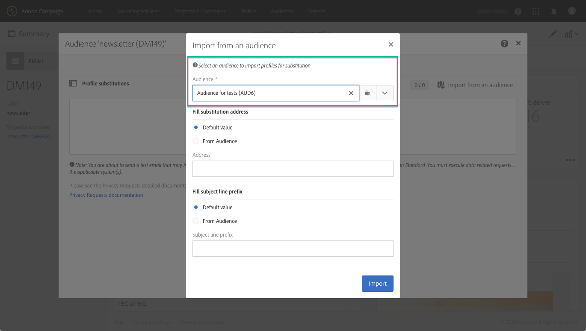

# ターゲットプロファイルを使用した電子メールメッセージのテスト {#testing-message-profiles}

## 概要 {#overview}

また、プロフ [ァイルをテストする](../../audiences/using/managing-test-profiles.md)、対象となるプロファイルの1つの位置に自分を置くことで、電子メールメッセージをテストできます。 これにより、プロファイルが受け取るメッセージ（カスタムフィールド、動的およびパーソナライズされた情報、ワークフローからの追加データなど）を正確に表示できます。

>[!NOTE]
>
> この機能は、電子メールメッセージでのみ使用できます。

主な手順は次のとおりです。

1. メッセージを設定し、準備段階を **開始** します。
1. **メッセージの対象となるプロファイルの中から** 、1つまたは複数のプロファイルを選択します。
1. 各プロファイルに、プルーフの送 **信先となる** 、代替アドレスを関連付けます。
1. （オプション）各プロファイルに対して、校正の **件名行に** 追加する接頭辞を定義します。
1. **電子メール** ・デザイナで、プロファイルに対するメッセージの表示方法をプレビューします。
1. 校正を送りなさい。

グローバルプロセスについて詳しくは、こちらのチュートリアルビデオを参照して [ください](https://docs.adobe.com/content/help/en/campaign-standard-learn/tutorials/communication-channels/email/profile-substitution.html)。

>[!IMPORTANT]
>
>この機能を使用すると、プロファイルの個人情報を外部の電子メールアドレスに送信できます。 Campaign Standardでプライバシーリクエスト（GDPRおよびCCPA）を実行しても、そのリクエストは外部で実行されないことに注意してください。

## プロファイルと置換アドレスの選択 {#selecting-profiles}

ターゲットプロファイルをテストに使用するには、まずプロファイルを選択してから、校正を受け取る置き換えアドレスを定義する必要があります。 これを行うには、対象となるプロファイルの中から [特定のプロファイルを選択する](#selecting-individual-profiles) か、既存のオーディエンスから [プロファイルを読み込むことができます](#importing-from-audience)。

>[!NOTE]
>
>最大100個のプロファイルをテスト用に選択できます。

### 個々のプロファイルの選択 {#selecting-individual-profiles}

1. メッセージダッシュボードで、メッセージの準備が正常に完了していることを確認し、ブロックをクリック **[!UICONTROL Audience]** します。

   

1. タブで、ボ **[!UICONTROL Profile substitutions]** タンをクリック **[!UICONTROL Create element]** して、テストに使用するプロファイルを選択します。

   

1. プロファイル選択ボタンをクリックして、メッセージの対象となるプロファイルのリストを表示します。

   

1. テストに使用するプロファイルを選択し、フィールドに必要な **[!UICONTROL Address]** 置換住所を入力して、をクリックしま **[!UICONTROL Confirm]**&#x200B;す。 プロファイルをターゲットにするすべての校正が、このプロファイルのデータベースで定義されているものではなく、この電子メールアドレスに送信されます。

   校正の件名行に特定の接頭辞を追加する場合は、フィールドに入力し **[!UICONTROL Subject line prefix]** ます。

   

   プレフィックスは次のように表示されます。

   

1. プロファイルがリストに追加され、関連する置換アドレスと接頭辞が追加されます。 テストに使用するすべてのプロファイルに対して上記の手順を繰り返し、をクリックしま **[!UICONTROL Confirm]**&#x200B;す。

   

   同じプロファイルの複数の置換アドレスに対して校正を送信する場合は、このプロファイルを必要な回数だけ追加する必要があります。

   次の例では、プロファイルJohn Smithに基づく証明が、2つの異なる置換アドレスに送信されます。

   

1. すべてのプロファイルと置き換えアドレスを定義したら、証明を送信してメッセージをテストできます。 これを行うには、ボタンをク **[!UICONTROL Test]** リックし、実行するテストのタイプを選択します。

   テストプロファイルがメッセージターゲットに追加されていない場合は、とのオプ **[!UICONTROL Email rendering]** ションは **[!UICONTROL Proof + Email rendering]** 使用できません。  For more information on proofs sending, refer to [this section](../../sending/using/sending-proofs.md).

   

>[!IMPORTANT]
>
>メッセージに変更を加えた場合は、必ずメッセージの準備を再度起動してください。 そうしないと、変更は校正に反映されません。

### オーディエンスからのプロファイルの読み込み {#importing-from-audience}

キャンペーン標準では、テストに使用できるプロファイルのオーディエンスをインポートできます。 これにより、例えば、異なるプロファイルをターゲットとする一連のメッセージを一意の電子メールアドレスに送信できます。

さらに、オーディエンスが既に住所列とプレフィックス列を使用して設定されている場合は、これらの情報をタブに読み込むことがで **[!UICONTROL Profile substitutions]** きます。 この節では、代替住所を含むオーディエンスのインポートの例につ [いて詳しく説明しま](#use-case)す。

>[!NOTE]
>
>オーディエンスを読み込むと、メッセージターゲットに対応するプロファイルのみが選択され、タブに追加さ **[!UICONTROL Profile substitutions]** れます。

オーディエンスからのテストに使用するプロファイルを読み込むには、次の手順に従います。

1. メッセージダッシュボードで、メッセージの準備が正常に完了していることを確認し、ブロックをクリック **[!UICONTROL Audience]** します。

   

1. タブでをク **[!UICONTROL Profile substitutions]** リックしま **[!UICONTROL Import from an audience]**&#x200B;す。

   

1. 使用するオーディエンスを選択し、代替アドレスと、オーディエンスに送信する校正に使用する接頭辞を入力します。

   

   使用する置換住所や接頭辞がオーディエンスで既に定義されている場合は、このオプションを選択し、これらの情報の取得に使 **[!UICONTROL From Audience]** 用する列を指定します。

   

1. ボタンをクリッ **[!UICONTROL Import]** クします。 メッセージターゲットに対応するオーディエンスのプロファイルが、タブに追加さ **[!UICONTROL Profile substitution]** れ、関連する置換アドレスと接頭辞も追加されます。

>[!NOTE]
>
>同じオーディエンスを別の置換アドレスや接頭辞を使用して再度読み込むと、以前の読み込みのプロファイルに加えて、プロファイルがリストに追加されます。

    

## ターゲットプロファイルを使用したメッセージのプレビュー

>[!NOTE]
>
>プレビューは、電子メールデザイナーでのみ使用できます。

ターゲットプロファイルを使用してメッセージをプレビューできるようにするには、これらのプロファイルがリストに追加されてい **[!UICONTROL Profile substitution]** ることを確認します(プ [ロファイルと置換アドレスの定義を参照](#selecting-profiles))。

メッセージ内でパーソナライゼーションフィールドを使用する場合は、メッセージの準備を開始する前に **** 、フィールドを追加する必要があります。 そうしないと、プレビューでは考慮されません。 その結果、パーソナライゼーションフィールドに変更が加えられた場合は、メッセージの準備を再度起動する必要があります。

プロファイルの置換を使用してメッセージをプレビューするには、次の手順に従います。

1. メッセージダッシュボードで、コンテンツのスナップショットをクリックして、電子メールデザイナーでメッセージを開きます。

   

1. タブを選択 **[!UICONTROL Preview]** し、をクリックしま **[!UICONTROL Change profile]**&#x200B;す。

   

1. タブをクリ **[!UICONTROL Profile Substitution]** ックして、テスト用に追加された置換プロファイルを表示します。

   プレビューに使用するプロファイルを選択し、をクリックしま **[!UICONTROL Select]**&#x200B;す。

   

1. メッセージのプレビューが表示されます。 矢印を使用して、選択したプロファイル間を移動します。

   

## 使用例 {#use-case}

この使用事例では、特定のプロファイルのセットにパーソナライズされた電子メールニュースレターを送信します。 ニュースレターを送信する前に、対象となるプロファイルの一部を使用してプレビューし、外部ファイルで定義された内部電子メールアドレスに校正を送信します。

この使用例の主な手順は次のとおりです。

1. テストに使用するオーディエンスを作成します。
1. プロファイルをターゲットにするワークフローを構築し、ニュースレターを送信します。
1. メッセージのプロファイルの置換を設定します。
1. ターゲットプロファイルを使用してメッセージをプレビューします。
1. 校正を送信します。

### 手順1:テストに使用するオーディエンスの作成

1. 読み込むファイルを準備し、オーディエンスを作成します。 この場合、校正に使用する置換アドレスと、校正の件名行に追加する接頭辞を含める必要があります。

   この例では、「oliver.vaughan@internal.com」電子メールアドレスに、「john.doe@mail.com」電子メールアドレスを持つプロファイルをターゲットとするメッセージの証明が送信されます。 校正の件名行に「JD」プレフィックスが追加されます。

   

1. ファイルからオーディエンスを作成するワークフローを構築します。 これを行うには、以下のアクティビティを追加し、設定します。

   * **[!UICONTROL Load file]** アクティビティ：CSVファイルを読み込みます(このアクティビティの詳細については、この節 [を参照](../../automating/using/load-file.md))。
   * **[!UICONTROL Reconciliation]** アクティビティ：ファイルの情報をデータベースの情報にリンクします。 この例では、プロファイルの電子メールアドレスを調整フィールドとして使用します(このアクティビティの詳細については、この節を参 [照してください](../../automating/using/reconciliation.md))。
   * **[!UICONTROL Save audience]** アクティビティ：読み込んだファイルに基づいてオーディエンスを作成します(このアクティビティについて詳しくは、この節 [を参照](../../automating/using/save-audience.md))。
   

1. ワークフローを実行し、タブに移動し **[!UICONTROL Audiences]** て、目的の情報でオーディエンスが作成されたことを確認します。

   この例では、オーディエンスは3つのプロファイルで構成されています。 それぞれが、配達確認を受け取る代替電子メールアドレスにリンクされ、配信確認の件名行に使用するプレフィックスが付けられます。

   

### 手順2:プロファイルをターゲットにするワークフローを構築し、ニュースレターを送信する

1. アクティビテ **[!UICONTROL Query]** ィを **[!UICONTROL Email delivery]** 追加し、必要に応じて設定します(「クエリ [」と「電子メー](../../automating/using/query.md) ル配信  」の項を参照)。

   

1. ワークフローを実行し、メッセージの準備が正常に完了していることを確認します。

### 手順3:メッセージの「プロファイルの置換」タブの設定

1. Open the **[!UICONTROL Email delivery]** activity. メッセージダッシュボードで、ブロックをクリッ **[!UICONTROL Audience]** クします。

   

1. タブを選択 **[!UICONTROL Profile substitutions]** し、をクリックしま **[!UICONTROL Import from an audience]**&#x200B;す。

   

1. フィールド **[!UICONTROL Audience]** で、ファイルから作成したオーディエンスを選択します。

   

1. 校正の送信時に使用する置換住所と件名行の接頭辞を定義します。

   これを行うには、このオプション **[!UICONTROL From audience]** を選択し、情報を含むオーディエンスの列を選択します。

   

1. ボタンをクリッ **[!UICONTROL Import]** クします。 オーディエンスのプロファイルが、関連する置換住所と件名行の接頭辞と共にリストに追加されます。

   

   >[!NOTE]
   >
   >この例では、オーディエンスのすべてのプロファイルがアクティビティのターゲットにな **[!UICONTROL Query]** ります。 これらのプロファイルの1つがメッセージターゲットの一部でない場合は、リストに追加されません。

### 手順4:ターゲットプロファイルを使用したメッセージのプレビュー

1. メッセージダッシュボードで、コンテンツのスナップショットをクリックして、電子メールデザイナーでメッセージを開きます。

   

1. タブを選択 **[!UICONTROL Preview]** し、をクリックしま **[!UICONTROL Change profile]**&#x200B;す。

   

1. タブをクリッ **[!UICONTROL Profile Substitution]** クして、以前に追加した置換プロファイルを表示します。

   プレビューに使用するプロファイルを選択し、をクリックしま **[!UICONTROL Select]**&#x200B;す。

   

1. メッセージのプレビューが表示されます。 矢印を使用して、選択したプロファイル間を移動します。

   

### 手順5:校正の送信

1. メッセージのダッシュボードで、ボタンをク **[!UICONTROL Test]** リックし、確認を行います。

   

1. 校正は、タブで設定した内容に従って送信され **[!UICONTROL Profile substitutions]** ます。

   
