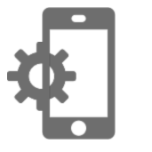
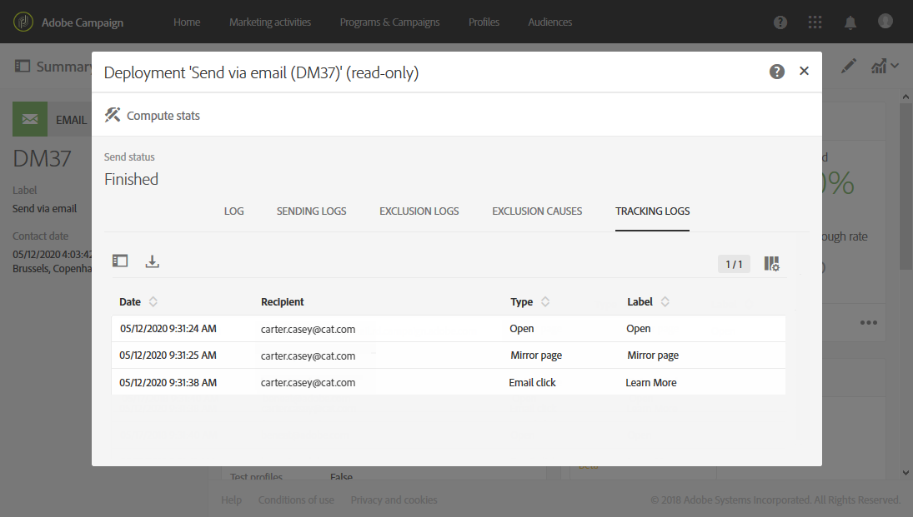

# メッセージのトラッキング{#tracking-messages}

## 追跡について{#about-tracking}

Adobe Campaignでは、トラッキング機能のおかげで、配信受信者の動作を追跡できます。 そのために、Adobe Campaign ではセッション Cookie および永続 Cookie を使用します。

認証リクエスト（ページ上など）を通じて、サイトにWebトラッキングツールが装備されていることをユーザーに通知し、cookieの使用を許可するチェックボックスを追加したり、最初のページの上部にバナーを追加したりできます。 ポップアップウィンドウはブラウザーでブロックされていることが多いので、避ける必要があります。

**[!UICONTROL integrated customer profiles]**&#x200B;へのデータベースの各連絡先について、トラッキング情報を利用できます。 詳しくは、[こちらの節](../../audiences/using/integrated-customer-profile.md)を参照してください。

Adobe Campaign は、次の 2 つのタイプの Cookie を使用します。

* セッション Cookie （nlid）：連絡先に送信される E メールの識別子（broadlogId）およびメッセージテンプレートの識別子（deliveryId）が含まれています。Adobe Campaign が送信した E メールに含まれている URL を連絡先のユーザーがクリックすると追加され、この連絡先での web 上の行動をトラッキングできるようになります。このセッション Cookie は、ブラウザーが閉じられると自動的に消去されます。連絡先のユーザーは、Cookie を拒否するようにブラウザーを設定できます。
* Adobe Experience Cloudソリューション間で共有されるcookie。 これにより、Web サイトの訪問時に Experience Cloud ソリューションとやり取りするユーザーを識別できます。この Cookie の説明については、[こちら](https://docs.adobe.com/content/help/ja-JP/core-services/interface/ec-cookies/cookies-mc.html)を参照してください。

Adobe Campaign Standardを使用した追跡では、次の機能にアクセスできます。

<table>
<tr>
    <td valign="top">
        
    </td>
    <td valign="top">
        
    </td>
    <td valign="top">
        
    </td>
        <td valign="top">
          
    </td>
    </td>
    <td valign="top">
          
</tr>
<tr>
<td>E メールトラッキング</td>
<td>プッシュ追跡</td>
<td>トラッキングされる URL</td>
<td>トラッキングログ</td>
<td>トラッキングレポート</td>
</tr>
</table>

## トラッキングログ {#tracking-logs}

**[!UICONTROL Tracking logs]**&#x200B;タブは、この配信のトラッキング履歴をリストします。 このタブには、Adobe Campaignが追跡しているすべてのURLなど、送信されたメッセージの追跡情報が表示されます。 このタブの追跡情報は、10分ごとに更新されます。

>[!NOTE]
>
>配信トラッキングが有効になっていない場合、このタブは表示されません。トラッキングログは、**電子メール**&#x200B;と&#x200B;**プッシュ通知**&#x200B;のチャネルでのみ使用できます。

上の例では、次の受信者があります。

* メッセージを開きました。
* ミラーページのリンクをクリックしました。
* 「詳細情報」カスタムリンクをクリック。

**[!UICONTROL Type]**&#x200B;列には、次の値を指定できます。

* **[!UICONTROL Email click]**:受信者がカスタムリンクをクリックした。
* **[!UICONTROL Mirror page]**:受信者がミラーページへのリンクをクリックしました。
* **[!UICONTROL Open]**:受信者が電子メールを開きました。
* **[!UICONTROL Opt-out]**:受信者が購読解除リンクをクリックしました。

>[!NOTE]
>
>**プッシュ通知**&#x200B;チャネルでは、モバイル通知のクリックのみが追跡されます。 この場合、値は&#x200B;**[!UICONTROL Click on mobile notification]**&#x200B;になります。

トラッキングリンクの挿入方法について詳しくは、[このページ](../../designing/using/links.md#inserting-a-link)を参照してください。

**[!UICONTROL Tracking indicators]**&#x200B;レポートには、電子メールメッセージの受信後の行動を追跡するための主要なインジケーターが含まれます。 詳しくは、この[ページ](../../reporting/using/tracking-indicators.md)を参照してください。

## トラッキングされる URL {#tracked-urls}

「**[!UICONTROL Tracked URLs]**」タブは、送信されたメッセージに含まれるURLを、そのURLタイプとソースURLを含めて再グループ化します。

リンクのトラッキングについて詳しくは、[このセクション](../../designing/using/links.md#about-tracked-urls)を参照してください。
