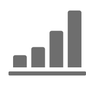
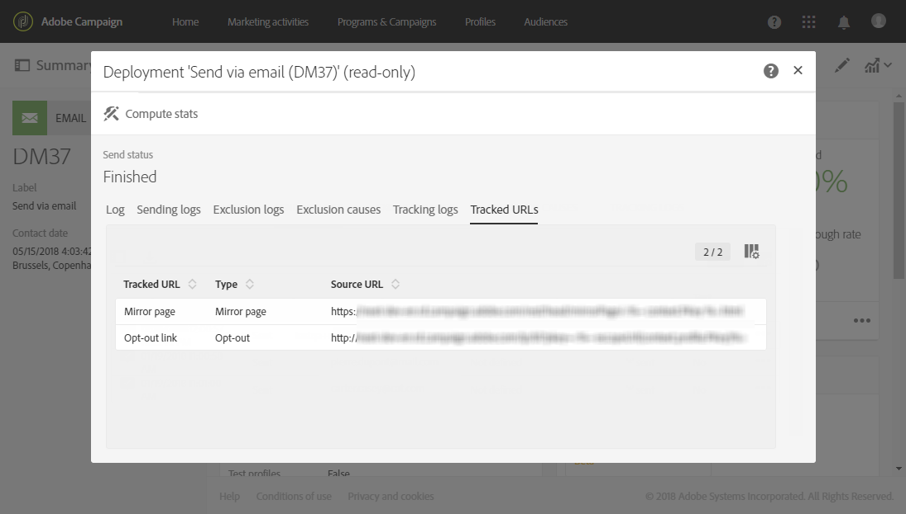

# メッセージのトラッキング{#tracking-messages}

## トラッキングについて {#about-tracking}

Adobe Campaignでは、追跡機能により、配信受信者の行動を追跡できます。 そのために、Adobe Campaign ではセッション Cookie および永続 Cookie を使用します。

Cookieの使用を許可するチェックボックスを備えた認証リクエスト（ページに表示されるなど）を介して、web トラッキングツールがサイトに搭載されていることをユーザーに通知したり、最初に表示されるページの上部にバナーを追加したりできます。ポップアップウィンドウはブラウザーによってブロックされることが多いため、使用を避ける必要があります。

トラッキング情報は、データベースの各担当者に対して&#x200B;**[!UICONTROL integrated customer profiles]**&#x200B;に利用できます。 詳しくは、[この節](../../audiences/using/integrated-customer-profile.md)を参照してください。

Adobe Campaign は、次の 2 つのタイプの Cookie を使用します。

* セッション Cookie （nlid）。 連絡先に送信されるメールの識別子（broadlogId）およびメッセージテンプレートの識別子（deliveryId）が含まれています。 Adobe Campaign が送信したメールに含まれている URL を連絡先のユーザーがクリックすると追加され、この連絡先での web 上の行動をトラッキングできるようになります。 このセッション Cookie は、ブラウザーが閉じられると自動的に消去されます。 連絡先のユーザーは、Cookie を拒否するようにブラウザーを設定できます。
* Adobe Experience Cloudソリューション間で共有されるCookie。 これにより、Web サイトの訪問時に Experience Cloud ソリューションとやり取りするユーザーを識別できます。 この Cookie の説明については、[こちら](https://experienceleague.adobe.com/docs/core-services/interface/ec-cookies/cookies-mc.html)を参照してください。

Adobe Campaign Standardを使用したトラッキングでは、次の機能にアクセスできます。

<table>
<tr>
    <td valign="top">
        
    </td>
    <td valign="top">
        
    </td>
    <td valign="top">
        
    </td>
        <td valign="top">
          
    </td>
    </td>
    <td valign="top">
          
</tr>
<tr>
<td>メールトラッキング</td>
<td>プッシュトラッキング</td>
<td>トラッキングする URL</td>
<td>トラッキングログ</td>
<td>トラッキングレポート</td>
</tr>
</table>

## トラッキングログ {#tracking-logs}

「**[!UICONTROL Tracking logs]**」タブには、この配信のトラッキング履歴が一覧表示されます。 このタブには、Adobe CampaignでトラッキングされたすべてのURLなど、送信されたメッセージのトラッキング情報が表示されます。 このタブのトラッキング情報は10分ごとに更新されます。

>[!NOTE]
>
>配信トラッキングが有効になっていない場合、このタブは表示されません。 トラッキングログは、**電子メール**&#x200B;および&#x200B;**プッシュ通知** チャネルでのみ利用できます。

上記の例では、受信者：

* メッセージを開きました。
* ミラーページのリンクをクリックしました。
* 「詳細」カスタムリンクをクリックしました。

**[!UICONTROL Type]**&#x200B;列で使用可能な値は次のとおりです。

* **[!UICONTROL Email click]**：受信者がカスタムリンクをクリックしました。
* **[!UICONTROL Mirror page]**：受信者がミラーページへのリンクをクリックしました。
* **[!UICONTROL Open]**：受信者が電子メールを開きました。
* **[!UICONTROL Opt-out]**：受信者が購読解除リンクをクリックしました。

>[!NOTE]
>
>**プッシュ通知** チャネルでは、モバイル通知のクリックのみが追跡されます。 この場合、値は&#x200B;**[!UICONTROL Click on mobile notification]**&#x200B;になります。

トラッキングリンクの挿入方法について詳しくは、[このページ &#x200B;](../../designing/using/links.md#inserting-a-link)を参照してください。

**[!UICONTROL Tracking indicators]** レポートには、電子メール メッセージを受信した後のトラッキング動作に関する主要指標が含まれています。 詳しくは、この[ページ](../../reporting/using/tracking-indicators.md)を参照してください。

## トラッキングする URL {#tracked-urls}

「**[!UICONTROL Tracked URLs]**」タブは、送信されたメッセージに含まれるURL （URL タイプとソース URLを含む）を再グループ化します。

トラッキングリンクについて詳しくは、[この節](../../designing/using/links.md#about-tracked-urls)を参照してください。
