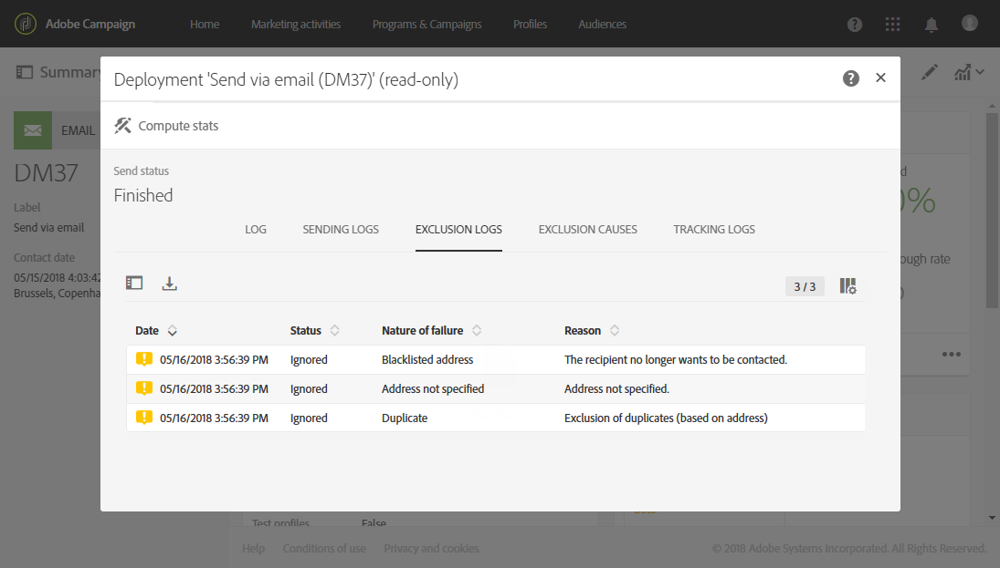
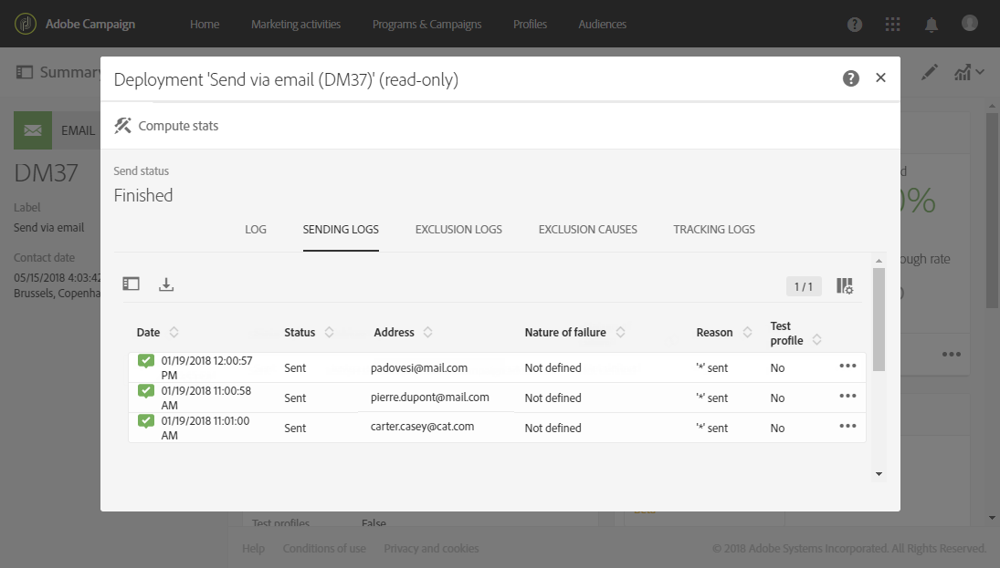
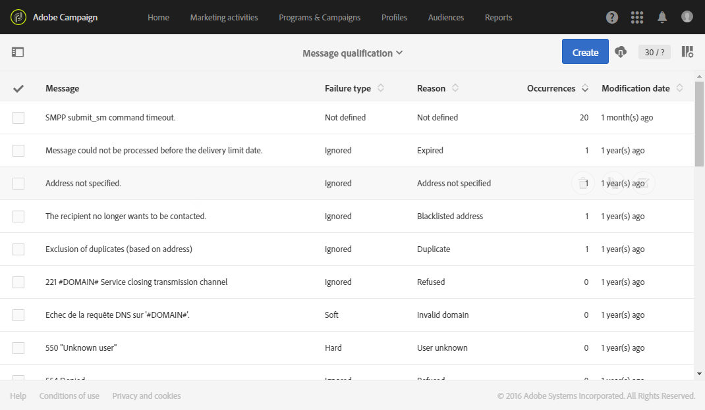

# 配信エラーについて{#understanding-delivery-failures}

## 配信エラーについて {#about-delivery-failures}

配信をプロファイルに送信できない場合、リモートサーバーは自動的にエラーメッセージを送信します。エラーメッセージは Adobe Campaign プラットフォームによってピックアップされ、そのメールアドレスまたは電話番号を評価して、強制隔離すべきかが判断されます。 [バウンスメールの選定](#bounce-mail-qualification)を参照してください。

>[!NOTE]
>
>**メール**&#x200B;エラーメッセージ（「バウンス」）は、Enhanced MTA（同期バウンス）または inMail プロセス（非同期バウンス）で評価されます。
>
>**SMS** エラーメッセージまたは SR（「ステータスレポート」の意味）は MTA プロセスによって評価されます。

アドレスが強制隔離されている場合や、プロファイルがメールブロックリストにある場合は、配信準備中にメッセージを除外することもできます。 除外されたメッセージは、配信ダッシュボードの「**[!UICONTROL Exclusion logs]**」タブに表示されます（[こちらの節](../../sending/using/monitoring-a-delivery.md#exclusion-logs)を参照）。

**関連トピック：**

* [強制隔離管理について](../../sending/using/understanding-quarantine-management.md)
* [Campaign のオプトインとオプトアウトについて](../../audiences/using/about-opt-in-and-opt-out-in-campaign.md)
* [バウンス](https://experienceleague.adobe.com/docs/deliverability-learn/deliverability-best-practice-guide/metrics-for-deliverability/bounces.html?lang=ja#metrics-for-deliverability)

## メッセージの配信エラーの特定 {#identifying-delivery-failures-for-a-message}

配信が送られると、「**[!UICONTROL Sending logs]**」タブ（[こちらの節](../../sending/using/monitoring-a-delivery.md#sending-logs)を参照）で、各プロファイルの配信ステータス、関連するエラーのタイプと理由（「[配信エラーのタイプと理由](#delivery-failure-types-and-reasons)」を参照）を確認できます。

既製の専用レポートも用意されています。 このレポートには、配信中に発生したハードエラーとソフトエラーの全般、およびバウンスの自動処理の詳細が記載されます。 詳しくは、[この節](../../reporting/using/bounce-summary.md)を参照してください。

## 配信エラーのタイプと理由 {#delivery-failure-types-and-reasons}

配信が失敗したときのエラーには次の 3 つのタイプがあります。

* **ハード**：「ハード」エラーは無効なアドレスの存在を示します。 このエラーは、アドレスが無効であることを明示的に示すエラーメッセージ（例：「不明なユーザー」）を伴います。
* **ソフト**：これは一時的なエラーか、「無効なドメイン」または「メールボックス容量超過」など、分類が不可能なエラーです。
* **無視**：これは、「外出中」など一時的であることがわかっているエラーまたは送信者タイプが「postmaster」である場合などの技術的エラーです。

配信エラーの理由として考えられるものを以下に示します。

| エラーラベル | エラータイプ | 説明 |
| ---------|----------|---------|
| **[!UICONTROL User unknown]** | ハード | アドレスが存在しません。 このプロファイルに対する配信はこれ以上試行されません。 |
| **[!UICONTROL Quarantined address]** | ハード | アドレスは強制隔離されました。 |
| **[!UICONTROL Unreachable]** | ソフト/ハード | メッセージ配信チェーンでエラーが発生しました（ドメインに一時的に到達できないなど）。 プロバイダーから返されるエラーに従い、アドレスは強制隔離に直接送られます。また配信は、強制隔離ステータスが妥当と判断されるエラーを Campaign が受け取るまで、またはエラー件数が 5 に達するまで試行されます。 |
| **[!UICONTROL Address empty]** | ハード | アドレスが定義されていません。 |
| **[!UICONTROL Mailbox full]** | ソフト | このユーザーのメールボックスはいっぱいになっていて、メッセージをこれ以上受け入れることができません。 このアドレスを強制隔離リストから削除して、再度試行できます。 30日後に自動的に削除されます。 強制隔離されたアドレスのリストからアドレスを自動的に削除するには、**[!UICONTROL Database cleanup]**&#x200B;テクニカルワークフローを開始する必要があります。 |
| **[!UICONTROL Refused]** | ソフト/ハード | アドレスは、スパムレポートであるというセキュリティフィードバックが原因で強制隔離されました。 プロバイダーから返されるエラーに従い、アドレスは強制隔離に直接送られます。また配信は、強制隔離ステータスが妥当と判断されるエラーを Campaign が受け取るまで、またはエラー件数が 5 に達するまで試行されます。 |
| **[!UICONTROL Duplicate]** | 無視 | アドレスはセグメント化で既に検出されています。 |
| **[!UICONTROL Not defined]** | ソフト | エラーがまだ増分されていないため、アドレスは選定されています。 このタイプのエラーは、サーバーが新しいエラーメッセージを送信すると発生します。単独のエラーである可能性もありますが、再度発生した場合はエラーカウンターがインクリメントされ、テクニカルチームに警告されます。 |
| **[!UICONTROL Error ignored]** | 無視 | アドレスは許可リストにあり、いずれにしてもメールが送信されます。 |
| **[!UICONTROL Address on denylist]** | ハード | 送信時にアドレスがブロックリストに追加されました。 |
| **[!UICONTROL Account disabled]** | ソフト/ハード | インターネットアクセスプロバイダー（IAP）が長い非アクティブ期間を検出すると、ユーザーのアカウントを閉じることができます。その場合、ユーザーのアドレスへの配信は不可能になります。 ソフト／ハードタイプは、受け取ったエラーの種類によって異なります。使用されていない期間が 6 ヶ月に達したのでアカウントが一時的に無効になっても、有効化できる場合は、「**[!UICONTROL Erroneous]**」ステータスが割り当てられ、配信が再試行されます。 アカウントが永続的に無効化されたことを、受信したエラーが示している場合、アカウントは強制隔離に直接送られます。 |
| **[!UICONTROL Not connected]** | 無視 | メッセージの送信時に、プロファイルの携帯電話の電源が切られているか、ネットワークに接続されていないか。 |
| **[!UICONTROL Invalid domain]** | ソフト | メールアドレスのドメインが正しくないか、存在しません。 このプロファイルは、エラーカウントが 5 にならない限り、再びターゲットになります。 その後、レコードは強制隔離ステータスに設定され、以降は再試行されなくなります。 |
| **[!UICONTROL Text too long]** | 無視 | SMS メッセージの文字数が制限を超えています。 詳しくは、[SMS のエンコーディング、長さ、表記変換](../../administration/using/configuring-sms-channel.md#sms-encoding--length-and-transliteration)を参照してください。 |
| **[!UICONTROL Character not supported by encoding]** | 無視 | SMS メッセージには、エンコーディングでサポートされていない1つ以上の文字が含まれています。 詳しくは、[文字の一覧 - GSM 標準](../../administration/using/configuring-sms-channel.md#table-of-characters---gsm-standard)を参照してください。 |

**関連トピック：**
* [ハードバウンス](https://experienceleague.adobe.com/docs/deliverability-learn/deliverability-best-practice-guide/metrics-for-deliverability/bounces.html?lang=ja#hard-bounces)
* [ソフトバウンス](https://experienceleague.adobe.com/docs/deliverability-learn/deliverability-best-practice-guide/metrics-for-deliverability/bounces.html?lang=ja#soft-bounces)

## 一時的な配信エラーの後の再試行 {#retries-after-a-delivery-temporary-failure}

一時的なエラーが原因でメッセージが失敗した場合、配信期間中に再試行が実行されます。 エラーのタイプについて詳しくは、[配信エラーのタイプと理由](#delivery-failure-types-and-reasons)を参照してください。

再試行の回数（送信が開始された後の日に実行する再試行の回数）と、再試行の間の最小遅延は、IPが特定のドメインで過去と現在の両方をどの程度実行しているかに基づいて<!--managed by the Adobe Campaign Enhanced MTA,-->になりました。 Campaign の&#x200B;**再試行**&#x200B;設定は無視されます。

<!--Please note that Adobe Campaign Enhanced MTA is not available for the Push channel.-->

配信の期間を変更するには、配信または配信テンプレートの詳細設定パラメーターに移動して、「[Validity period](../../administration/using/configuring-email-channel.md#validity-period-parameters)」セクションの「**[!UICONTROL Delivery duration]**」フィールドを編集します。

>[!IMPORTANT]
>
>**Campaign配信の&#x200B;**&#x200B;[!UICONTROL Delivery duration]&#x200B;**パラメーターは、3.5日以内に設定された場合にのみ使用されるようになりました。** 3.5 日を超える値を定義した場合、その値は考慮されません。

例えば、配信の再試行を1日後に停止する場合、配信期間を&#x200B;**1d**&#x200B;に設定すると、再試行キュー内のメッセージは1日後に削除されます。

>[!NOTE]
>
>メッセージが最大3.5日間再試行キューに入り、配信に失敗すると、メッセージはタイムアウトし、[配信ログ &#x200B;](../../sending/using/monitoring-a-delivery.md#delivery-logs)でステータスが<!--from **[!UICONTROL Sent]**-->から&#x200B;**[!UICONTROL Failed]**&#x200B;に更新されます。

<!--
MOVED TO configuring-email-channel.md > LEGACY SETTINGS
The default configuration allows five retries at one-hour intervals, followed by one retry per day for four days. The number of retries can be changed globally (contact your Adobe technical administrator) or for each delivery or delivery template (see [this section](../../administration/using/configuring-email-channel.md#sending-parameters)).
-->

## 同期エラーと非同期エラー {#synchronous-and-asynchronous-errors}

配信は、ただちにエラーになることも（同期エラー）、送信後しばらくしてエラーになることも（非同期エラー）あります。

* **同期エラー**：Adobe Campaign 配信サーバーからアクセスされたリモートサーバーが即座にエラーメッセージを返します。配信をプロファイルのサーバーに送ることは許可されません。
* **非同期エラー**：バウンスメールまたは SR が受信サーバーによって後で再送信された場合です。 非同期エラーは、配信の送信から 1 週間が経過するまで発生する可能性があります。

## バウンスメールの選定 {#bounce-mail-qualification}

同期配信エラーのエラーメッセージの場合、Adobe Campaign Enhanced MTA （Message Transfer Agent）はバウンスの種類と選定を判断し、その情報をCampaignに送り返します。

>[!NOTE]
>
>Campaign の&#x200B;**[!UICONTROL Message qualification]**&#x200B;テーブルでのバウンスの選定は使用されなくなりました。

非同期バウンスは、引き続き「**[!UICONTROL Inbound email]**」ルールを通じて、inMail プロセスで選定されます。 これらのルールにアクセスするには、左上の&#x200B;**Adobe** ロゴをクリックし、**[!UICONTROL Administration > Channels > Email > Email processing rules]**&#x200B;を選択して&#x200B;**[!UICONTROL Bounce mails]**&#x200B;を選択します。 このルールについて詳しくは、[このセクション &#x200B;](../../administration/using/configuring-email-channel.md#email-processing-rules)を参照してください。

バウンスとバウンスの種類について詳しくは、[この節](https://experienceleague.adobe.com/docs/deliverability-learn/deliverability-best-practice-guide/metrics-for-deliverability/bounces.html?lang=ja#metrics-for-deliverability)を参照してください。

<!--
MOVED TO configuring-email-channel.md > LEGACY SETTINGS

Bounces can have the following qualification statuses:

* **[!UICONTROL To qualify]**: the bounce mail needs to be qualified. Qualification must be done by the Deliverability team to ensure that the platform deliverability functions correctly. As long as it is not qualified, the bounce mail is not used to enrich the list of email processing rules.
* **[!UICONTROL Keep]**: the bounce mail was qualified and will be used by the **Update for deliverability** workflow to be compared to existing email processing rules and enrich the list.
* **[!UICONTROL Ignore]**: the bounce mail was qualified but will not be used by the **Update for deliverability** workflow. So it will not be sent to the client instances.

To list the various bounces and their associated error types et reasons, click the **Adobe** logo, in the top-left, then select **[!UICONTROL Administration > Channels > Quarantines > Message qualification]**.

-->

## ダブルオプトインメカニズムによるメール配信品質の最適化 {#optimizing-mail-deliverability-with-double-opt-in-mechanism}

ダブルオプトインは、メールを送信する際のベストプラクティスです。 不正なメールアアドレスや、無効なメールアドレス、スパムボットからプラットフォームを保護し、スパムの苦情が報告されないようにします。

原則として、訪問者の契約書を確認するための電子メールを送信してからCampaign データベースに「プロファイル」として保存します。訪問者はオンラインランディングページに入力してから電子メールを受信し、確認リンクをクリックしてサブスクリプションを確定します。

詳しくは、[この節](../../channels/using/setting-up-a-double-opt-in-process.md)を参照してください。
