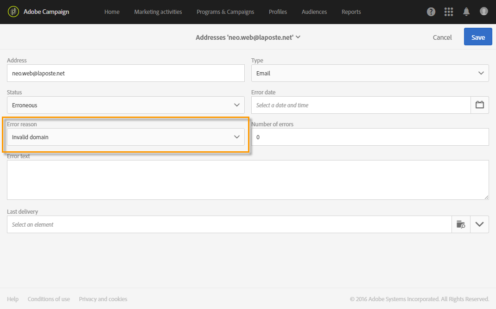

# 強制隔離管理について{#understanding-quarantine-management}

## 強制隔離について {#about-quarantines}

例えば、メールボックスの容量が超過している場合や、アドレスが存在しない場合などに、E メールアドレスや電話番号を強制隔離できます。

どのような場合でも、強制隔離手順は、この[節](#conditions-for-sending-an-address-to-quarantine)で説明する特定のルールに従います。

### 強制隔離による配信の最適化 {#optimizing-your-delivery-through-quarantines}

E メールアドレスまたは電話番号が強制隔離されているプロファイルは、メッセージ準備の際に自動的に除外されます（[配信用の強制隔離アドレスの識別](#identifying-quarantined-addresses-for-a-delivery)を参照）。これによって配信が迅速になります。エラー率は配信の速度に大きく影響するからです。

一部のインターネットアクセスプロバイダーは、無効なアドレスの割合が高すぎる場合、E メールを自動的にスパムと見なします。したがって、強制隔離を使用すると、これらのプロバイダーによってブロックリストに追加されるのを回避できます。

また、強制隔離は、誤りのある電話番号を配信から除外することで、SMS の送信コスト削減にも役立ちます。

配信を保護および最適化するベストプラクティスについて詳しくは、[このページ](../../sending/using/delivery-best-practices.md)を参照してください。

### 強制隔離とブロックリスト {#quarantine-vs-denylist}

強制隔離とブロックリストは、同じオブジェクトには適用されません。

* **** 強制隔離は、プロファ **イル自体ではなく、アドレス** （または電話番号など）にのみ適用されます。例えば、Eメールアドレスが強制隔離されているプロファイルは、プロファイルを更新して新しいアドレスを入力し、再び配信アクションのターゲットにすることができます。 同様に、2つのプロファイルの電話番号が同じ場合、その番号が強制隔離されると、両方のプロファイルが影響を受けます。

   強制隔離されたアドレスまたは電話番号は、（配信の）[除外ログ](#identifying-quarantined-addresses-for-a-delivery)または[強制隔離リスト](#identifying-quarantined-addresses-for-the-entire-platform)（プラットフォーム全体の）に表示されます。

* 一方、**ブロックリスト**&#x200B;上にいると、**プロファイル**&#x200B;は、特定のチャネルの購読解除（オプトアウト）後など、配信のターゲットにされなくなります。 例えば、Eメールチャネルの上のプブロックリストロファイルに2つのEメールアドレスがある場合、両方のアドレスが配信から除外されます。 プロブロックリストセスについて詳しくは、[Campaignのオプトインとオプトアウトについて](../../audiences/using/about-opt-in-and-opt-out-in-campaign.md)を参照してください。

   プロファイルの「**[!UICONTROL General]**」タブブロックリストの「**[!UICONTROL No longer contact (on denylist)]**」セクションで、1つ以上のチャネルのプロファイルがチャネルに存在するかどうかを確認できます。 詳しくは、[この節](../../audiences/using/managing-opt-in-and-opt-out-in-campaign.md#managing-opt-in-and-opt-out-from-a-profile)を参照してください。

>[!NOTE]
>
>強制隔離には、「ブロックリスト&#x200B;****」ステータスが含まれます。これは、受信者がメッセージをスパムとして報告した場合、または「STOP」などのキーワードを含むSMSメッセージに返信した場合に適用されます。 この場合、プロファイルに関係するアドレスまたは電話番号が強制隔離され、ステータスが&#x200B;**[!UICONTROL On denylist]**&#x200B;になります。 STOP SMSメッセージの管理について詳しくは、[この節](../../channels/using/managing-incoming-sms.md#managing-stop-sms)を参照してください。

<!--When a user replies to an SMS message with a keyword such as STOP in order to opt-out from SMS deliveries, his profile is not added to the denylist like in the email opt-out process. Instead, the profile's phone number is sent to quarantine with the **[!UICONTROL On denylist]** status. This status refers to the phone number only, meaning that the profile will continue receiving email messages.<!-- Also, if the profile has another phone number, he can still receive SMS messages on the other number. For more on this, refer to [this section](../../channels/using/managing-incoming-sms.md#managing-stop-sms).-->

## 強制隔離アドレスの識別 {#identifying-quarantined-addresses}

強制隔離されたアドレスは、特定の配信またはプラットフォーム全体に表示できます。

<!--
If you need to remove an address from quarantine, contact your technical administrator.
-->

### 配信の強制隔離アドレスの識別 {#identifying-quarantined-addresses-for-a-delivery}

特定の配信について強制隔離されたアドレスのリストは、配信準備フェーズの途中で、配信ダッシュボードの「**[!UICONTROL Exclusion logs]**」タブに記録されます（[この節](../../sending/using/monitoring-a-delivery.md#exclusion-logs)を参照）。配信準備について詳しくは、[この節](../../sending/using/preparing-the-send.md)を参照してください。

### プラットフォーム全体の強制隔離アドレスの識別 {#identifying-quarantined-addresses-for-the-entire-platform}

管理者は、**[!UICONTROL Administration > Channels > Quarantines > Addresses]**&#x200B;メニューから、プラットフォーム全体の強制隔離されたEメールアドレスの詳細なリストにアクセスできます。

<!--
This menu lists quarantined elements for **Email**, **SMS** and **Push notification** channels.
-->

>[!NOTE]
>
>強制隔離数の増加は、データベースの「老朽化」に関連する、正常な影響です。 例えば、E メールアドレスの寿命が 3 年と考えられ、受信者テーブルが毎年 50％増加する場合、強制隔離の増加は次のように計算できます。1 年目の終了時：(1*0.33)/(1+0.5)=22%、2 年目の終了時：((1.22*0.33)+0.33)/(1.5+0.75)=32.5%

リストの参照に役立つフィルターを使用できます。 アドレス、ステータスまたはチャネルに基づいてフィルタリングできます。

各エントリを編集または[削除](#removing-a-quarantined-address)し、新しいエントリを作成できます。

エントリを編集するには、対応する行をクリックし、必要に応じてフィールドを変更します。

新しいエントリを手動で追加するには、**[!UICONTROL Create]**&#x200B;ボタンを使用します。

アドレス（または電話番号など）を およびチャネルタイプ。 強制隔離リストに含まれるステータスとエラー理由を設定できます。 また、エラーが発生した日付、エラー数を指定し、エラーテキストを入力することもできます。 必要に応じて、アドレスに最後に送信された配信をドロップダウンリストから選択します。

### 強制隔離アドレスの削除 {#removing-a-quarantined-address}

必要に応じて、強制隔離リストから手動でアドレスを削除できます。これに加えて、特定の条件に一致するアドレスは、**[!UICONTROL Database cleanup]**&#x200B;ワークフローによって強制隔離リストから自動的に削除されます。 （テクニカルワークフローについて詳しくは、[この節](../../administration/using/technical-workflows.md#list-of-technical-workflows)を参照してください）。

強制隔離リストからアドレスを手動で削除するには、以下のいずれかの操作を実行します。

>[!IMPORTANT]
強制隔離からEメールアドレスを手動で削除すると、このアドレスへの配信が再び開始されます。 その結果、配信品質とIPのレピュテーションに重大な影響が及ぶ可能性があり、最終的にはIPアドレスや送信ドメインがブロックされる可能性があります。 強制隔離からのアドレスの削除を検討する場合は、追加の注意が必要です。 不明な点がある場合は、配信品質のエキスパートにお問い合わせください。

* **[!UICONTROL Administration > Channels > Quarantines > Addresses]**&#x200B;リストからアドレスを選択し、**[!UICONTROL Delete element]**&#x200B;を選択します。

   

* アドレスを選択し、**[!UICONTROL Status]**&#x200B;を&#x200B;**[!UICONTROL Valid]**&#x200B;に変更します。

   

   また、ステータスを&#x200B;**[!UICONTROL On allowlist]**&#x200B;に変更することもできます。 この場合、アドレスは強制隔離リストに残りますが、エラーが発生した場合でも、自動的にターゲットに設定されます。

次の場合、アドレスは強制隔離リストから自動的に削除されます。

* **[!UICONTROL Erroneous]**&#x200B;ステータスのアドレスは、配信が正常に完了すると、強制隔離リストから削除されます。
* 最後のソフトバウンスが10日以上前に発生した場合、**[!UICONTROL Erroneous]**&#x200B;ステータスのアドレスは強制隔離リストから削除されます。 ソフトエラー管理について詳しくは、[この節](#soft-error-management)を参照してください。
* ステータスが&#x200B;**[!UICONTROL Erroneous]**&#x200B;で、**[!UICONTROL Mailbox full]**&#x200B;エラーでバウンスしたアドレスは、30日後に強制隔離リストから削除されます。

その後、ステータスは&#x200B;**[!UICONTROL Valid]**&#x200B;に変わります。

>[!IMPORTANT]
アドレスのステータスが&#x200B;**[!UICONTROL Quarantine]**&#x200B;または&#x200B;**[!UICONTROL On denylist]**&#x200B;の受信者は、Eメールを受信した場合でも、自動的に削除されることはありません。

**[!UICONTROL Erroneous]**&#x200B;ステータスの場合に実行する再試行の最大数と、再試行間の最小遅延は、IPが特定のドメインでどの程度過去に実行され、現在どの程度の動作を実行しているかに基づいています。

## アドレスを強制隔離に送信するための条件 {#conditions-for-sending-an-address-to-quarantine}

Adobe Campaign は、エラーメッセージの選定時に割り当てられた配信エラーのタイプと理由に従って強制隔離を管理します（[配信エラーのタイプと理由](../../sending/using/understanding-delivery-failures.md#delivery-failure-types-and-reasons)および[バウンスメールの選定](../../sending/using/understanding-delivery-failures.md#bounce-mail-qualification)を参照）。

* **無視のエラー**：アドレスを強制隔離しません。
* **ハードエラー**：対応する E メールアドレスがただちに強制隔離されます。
* **ソフトエラー**：ただちにアドレスが強制隔離されることはありませんが、エラーカウンターがインクリメントされます。詳しくは、[ソフトエラー管理](#soft-error-management)を参照してください。

   <!--
  When the error counter reaches the limit threshold, the address goes into quarantine. In the default configuration, the threshold is set at five errors, where two errors are significant if they occur at least 24 hours apart. The address is placed in quarantine at the fifth error. The error counter threshold can be modified. For more on this, refer to this [page](../../administration/using/configuring-email-channel.md#email-channel-parameters).
  When a delivery is successful after a retry, the error counter of the address which was prior to that quarantined is reinitialized. The address status changes to **[!UICONTROL Valid]** and it is deleted from the list of quarantines after two days by the **[!UICONTROL Database cleanup]** workflow.
  -->

ユーザーが E メールをスパム（[フィードバックループ](https://experienceleague.adobe.com/docs/deliverability-learn/deliverability-best-practice-guide/transition-process/infrastructure.html?lang=ja#feedback-loops)）と見なした場合、メッセージは、アドビが管理するテクニカルメールボックスに自動的にリダイレクトされます。さらに、その E メールアドレスは自動的に強制隔離され、ステータスが「**[!UICONTROL On denylist]**」となります。このステータスはアドレスのみを表し、プロファイルは上になブロックリストいので、ユーザーは引き続きSMSメッセージやプッシュ通知を受信します。

>[!NOTE]
Adobe Campaign の強制隔離では、大文字と小文字が区別されます。後から再度ターゲットされることのないよう、E メールアドレスは必ず小文字でインポートしてください。

隔離されたアドレスのリスト（[プラットフォーム全体の強制隔離されたアドレスの識別](#identifying-quarantined-addresses-for-the-entire-platform)を参照）の「**[!UICONTROL Error reason]**」フィールドは、選択したアドレスが強制隔離された理由を示します。

### ソフトエラー管理 {#soft-error-management}

ハードエラーとは異なり、ソフトエラーでただちにアドレスが強制隔離されることはありませんが、エラーカウンターがインクリメントされます。

再試行は、配信期間中に実行されます。 エラーカウンターが制限しきい値に達すると、アドレスが強制隔離されます。詳しくは、[一時的な配信エラーの後の再試行](understanding-delivery-failures.md#retries-after-a-delivery-temporary-failure)を参照してください。

<!--In the default configuration, the threshold is set at five errors, where two errors are significant if they occur at least 24 hours apart. The address is placed in quarantine at the fifth error.
The error counter threshold can be modified.-->

最後に重大なエラーが発生したのが 10 日以上前の場合、エラーカウンターが再初期化されます。アドレスのステータスが「**有効**」に変わり、**データベースクリーンアップ**&#x200B;ワークフローが強制隔離のリストからアドレスを削除します。（テクニカルワークフローについて詳しくは、[この節](../../administration/using/technical-workflows.md#list-of-technical-workflows)を参照してください）。
