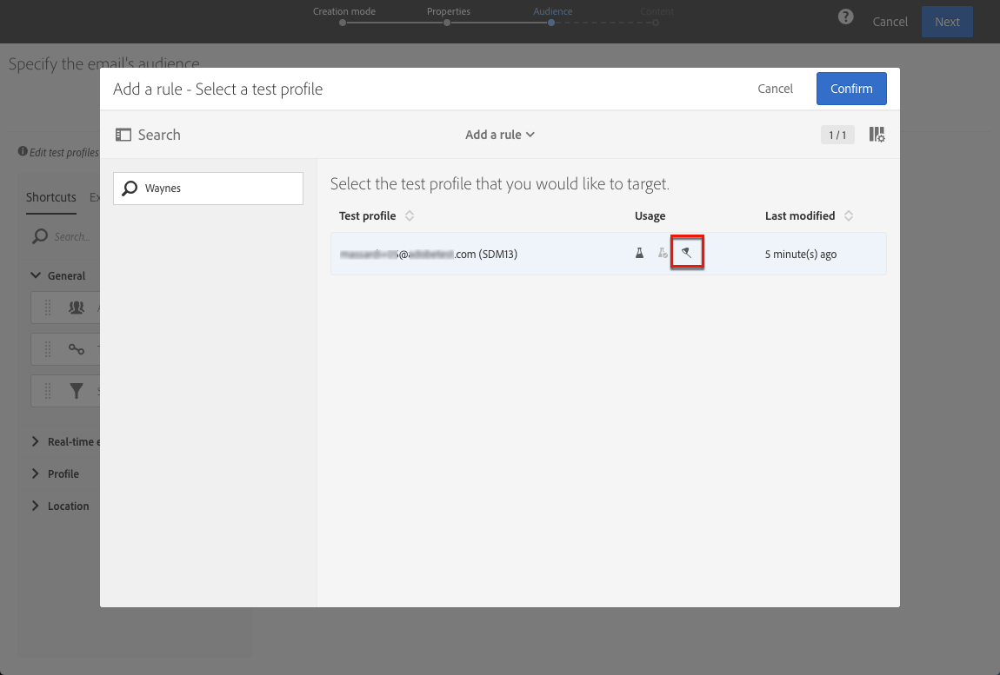
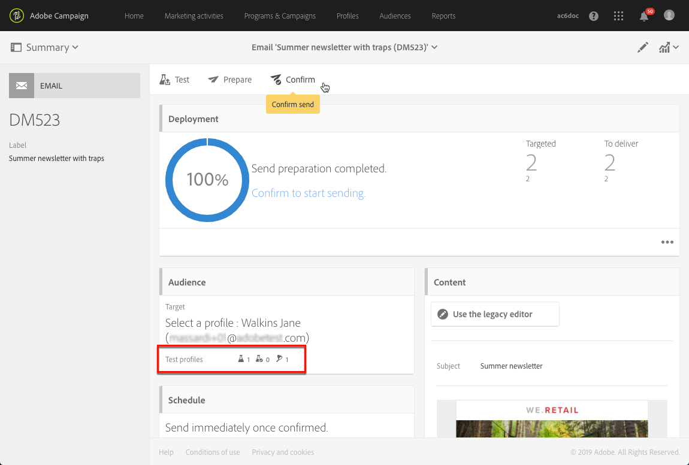

# トラップの使用 {#using-traps}

トラップを使用する場合は、クライアントファイルが不正使用されているかどうかを識別するための手段として、メッセージがメインターゲットに送信されるのと同じように[&#x200B; テストプロファイル &#x200B;](../../audiences/using/managing-test-profiles.md)に送信されます。

トラップはもともとダイレクトメール配信用に設計されたものです。 それらのツールを使用すると、次のことが可能になります。

* ダイレクトメールプロバイダーが実際に通信を送信していることを確認します。
* お客様と同じ条件で同時にメールを受信します。
* 送信されたメールの正確なコピーを保持します。
* クライアントリストがダイレクトメールプロバイダーによって悪用されていないことを確認してください。 実際、テストプロファイルのアドレスに他の通信が送信された場合、クライアントファイルは知らなくても使用された可能性があります。 そのため、テストプロファイルのアドレスは、この目的にのみ使用する必要があります。

ダイレクトメールのオーディエンスへのトラップの追加について詳しくは、[&#x200B; テストプロファイルとトラッププロファイルの追加](../../channels/using/defining-the-direct-mail-audience.md#adding-test-and-trap-profiles)を参照してください。

その他の通信チャネルの場合は、次の操作を行うために、トラップ テスト プロファイルをメイン ターゲットに追加できます。

* メッセージが正常に送信されたことを確認します。
* メッセージの正確なコピーを取得し、保持します。
* いつ送受信したかを追跡できます。

テストプロファイルをトラップとして使用するには、そのプロファイルをメッセージのオーディエンスに含める必要があります。

>[!NOTE]
>
>[&#x200B; プルーフ &#x200B;](../../sending/using/sending-proofs.md)または[電子メールレンダリング &#x200B;](../../sending/using/email-rendering.md)に使用されるテストプロファイルとは異なり、メッセージは同時にメインターゲットおよびトラップとして使用されるテストプロファイルに送信されます。

メッセージのオーディエンスを定義する場合：

1. 「**[!UICONTROL Test profiles]**」タブから、テストプロファイルを選択します。 **[!UICONTROL Trap]**&#x200B;が意図した用途にあることを確認してください。

   

1. メッセージコンテンツの準備ができたら、**[!UICONTROL Prepare]** ボタンをクリックします。 [送信準備](../../sending/using/preparing-the-send.md)を参照してください。
   >[!NOTE]
   >
   >メインターゲットを選択したことを確認します。 それ以外の場合は、メッセージを送信できません。

1. 「**[!UICONTROL Confirm]**」ボタンをクリックします。 [送信の確認](../../sending/using/confirming-the-send.md)を参照してください。

   

メッセージはメインターゲットとテストプロファイルに送信されます。

トランザクションメッセージの送信時にトラップを使用できます。 この場合、テストプロファイルは、イベント設定ごとに1つのメッセージを受け取ります。 トランザクションメッセージについて詳しくは、この[&#x200B; セクション &#x200B;](../../channels/using/getting-started-with-transactional-msg.md)を参照してください。

>[!NOTE]
>
>テストプロファイルをトラップとして使用する場合、メッセージ内のエンリッチメントされたフィールドには、実際のターゲットプロファイルから対応する追加データがランダムに選択され、トラップテストプロファイルに割り当てられます。 ただし、最初のメッセージ準備中にタイポロジルールが適用されたために実際のターゲットプロファイルが除外された場合、配信の準備は失敗します。 このエラーは、エンリッチフィールド値をトラッププロファイルに置き換えることができないため発生します。 その結果、除外タイポロジルールが実際の受信者に正しく適用されないことがあります。
>
>この状況を防ぐには、トランザクションタイポロジでフィルターまたは疲労ルールと同時にトラップテストプロファイルを使用しないでください。 エンリッチメントの詳細。 エンリッチメントについて詳しくは、[この例](../../automating/using/enriching-profile-data-file.md)を参照してください。
