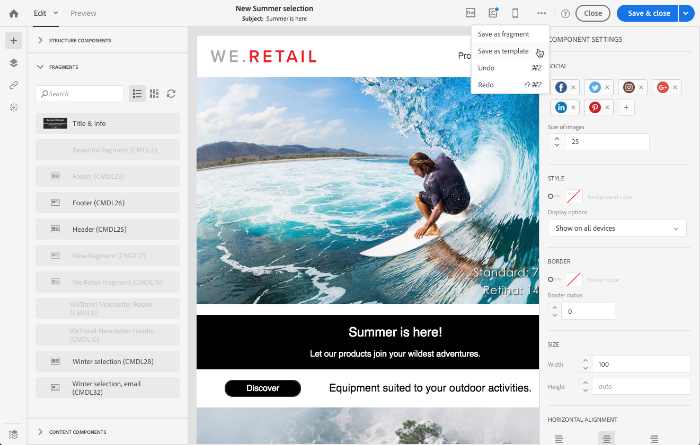

# テンプレートについて{#about-templates}

## マーケティング活動テンプレート {#marketing-activity-templates}

新しいマーケティング活動を作成すると、ウィザードの最初の画面に、タイプまたはテンプレートの選択が求められます。テンプレートを使用すると、必要に応じて特定のパラメータを事前に構成できます。テンプレートには、マーケティング活動の完全または一部の構成が含まれている場合があります。テンプレート管理は、機能管理者によって実行されます。

エンドユーザにはシンプルなインターフェイスがあります。新しいマーケティング活動を作成するときは、使用するテンプレートを選択するだけです。技術的な構成について心配する必要はありません。これは、テンプレートの機能管理者によって既に事前構成されています。

たとえば、電子メールテンプレートの場合は、HTMLコンテンツ、視聴者、および配信のその他のパラメータを事前に入力できます。スケジュール、テストプロファイル、配信の全般的なプロパティ、高度なパラメータなど。これにより、新しいアクティビティを作成するときに時間を節約できます。

マーケティング活動のタイプごとに、1つまたは複数のすぐに使用できるテンプレートを最小構成で使用できます。これらの既定のテンプレートは変更または削除できません。

テンプレートは、次のマーケティング活動で使用できます。

* プログラム
* キャンペーン
* 電子メール配信
* SMS配信
* プッシュ通知
* ランディング・ページ
* ワークフロー
* サービス
* インポート
* トランザクションメッセージ

これらのテンプレートは、&gt; **[!UICONTROL Resources]****[!UICONTROL Templates]** 画面から管理されます。

>[!NOTE]
>
>ブランド構成は、電子メールまたはランディング・ページ・テンプレートで事前に構成できます。詳細については [、「ブランディング](../../administration/using/branding.md) 」セクションを参照してください。

## コンテンツテンプレート {#content-templates}

HTMLコンテンツテンプレートには、[詳細設定]メニューの **[!UICONTROL Resources]** [&gt; **[!UICONTROL Content templates & fragments]** ]画面からアクセス できます。そこから、ランディングページのコンテンツテンプレート、電子メールのコンテンツテンプレート、フラグメントを管理できます。

既定のコンテンツテンプレートは読み取り専用です。1つを編集するには、最初にそれを複製する必要があります。

新しいテンプレートまたはフラグメントを作成し、独自のコンテンツを定義できます。詳細については、「 [コンテンツテンプレートの作成](../../start/using/about-templates.md#creating-a-content-template) とコンテンツフラグメント [の作成」を](../../designing/using/defining-the-email-structure.md#creating-a-content-fragment)参照してください。

電子メールデザイナでコンテンツを編集する場合は、コンテンツをフラグメントまたはテンプレートとして保存することで、コンテンツテンプレートを作成することもできます。詳細については、「コンテンツ [をテンプレートとして保存する」](../../start/using/about-templates.md#saving-content-as-template) および「コンテンツ [をフラグメントとして保存する」を](../../designing/using/defining-the-email-structure.md#saving-content-as-a-fragment)参照してください。

### すぐに使える電子メールコンテンツテンプレート {#email-content-templates}

電子 **[!UICONTROL Templates]**[メールデザイナー](../../designing/using/about-email-content-design.md#about-the-email-designer) のホームページのタブで提供されるHTMLコンテンツを管理できます。

最新の電子メールコンテンツテンプレートには、モバイル最適化された18のレイアウトと、Behanceアーティストが設計した4つのクラス最高の応答性テンプレートが含まれています。これらは、お客様のウェルカムメッセージ、ニュースレター、リエンゲージメントのEメールなどの最新の用途に対応しています。ブランドのコンテンツで簡単にカスタマイズできるため、メールのデザインプロセスを簡単に実行できます。

**関連トピック:**

* このビデオでコンテンツテンプレート [をカスタマイズする方法について](https://helpx.adobe.com/campaign/kt/acs/using/acs-email_content_templates-feature-video-use.html)説明します。
* コンテンツの編集の詳細については、「電子メールコンテンツのデザイン [について」を](../../designing/using/about-email-content-design.md)参照してください。

### コンテンツテンプレートの作成 {#creating-a-content-template}

独自のコンテンツテンプレートを作成して、必要に応じて何度でも使用できます。

電子メールコンテンツテンプレートを作成する方法を次の例に示します。

1. **[!UICONTROL Resources]** &gt;に **[!UICONTROL Content templates & fragments]** 移動し、をクリック **[!UICONTROL Create]**&#x200B;します。
1. 電子メール・ラベルをクリックして、電子メール・デザイナの **[!UICONTROL Properties]** タブにアクセスします。
1. 認識可能なラベルを指定し、次のパラメータを選択して、このテンプレートを電子メールで使用できるようにします。

   * ドロップ **[!UICONTROL Shared]****[!UICONTROL Delivery]** ダウンリスト **[!UICONTROL Content type]** を選択します。
   * ドロップ **[!UICONTROL Template]****[!UICONTROL HTML type]** ダウンリストから選択します。
   

1. 必要に応じて、テンプレートのサムネイルとして使用するイメージを設定できます。テンプレートプロパティの **[!UICONTROL Thumbnail]** タブから選択します。

   

   このサムネイルは、電子 **[!UICONTROL Templates]**[メールデザイナ](../../designing/using/about-email-content-design.md#about-the-email-designer) のホームページのタブに表示されます。

1. **[!UICONTROL Properties]** タブを閉じて、メインワークスペースに戻ります。
1. 必要に応じてカスタマイズできる構造コンポーネントおよびコンテンツコンポーネントを追加します。
   >[!NOTE]
   >
   > コンテンツテンプレート内にパーソナル化フィールドや条件付きコンテンツを挿入することはできません。
1. 編集したら、テンプレートを保存します。

このテンプレートは、電子メールデザイナで構築された電子メールで使用できるようになりました。**[!UICONTROL Templates]**[電子メールデザイナ](../../designing/using/about-email-content-design.md#about-the-email-designer) のホームページのタブから選択します。

### コンテンツをテンプレートとして保存 {#saving-content-as-template}

電子メールデザイナで電子メールを編集する場合は、その電子メールの内容をテンプレートとして直接保存できます。

<!--[!CAUTION]
>
>You cannot save as template a structure containing personalization fields or dynamic content.-->

1. 電子メールデザイナのメインツールバー **[!UICONTROL Save as template]** から選択します。

   

1. 必要に応じてラベルと説明を追加し、をクリック **[!UICONTROL Save]**&#x200B;します。

   

1. 作成したテンプレートを検索するには **[!UICONTROL Resources]** &gt; **[!UICONTROL Content templates & fragments]**&#x200B;に進みます。

1. 新しいテンプレートを使用するには、電子 **[!UICONTROL Templates]**[メールデザイナー](../../designing/using/about-email-content-design.md#about-the-email-designer) のホームページのタブから新しいテンプレートを選択します。

   

