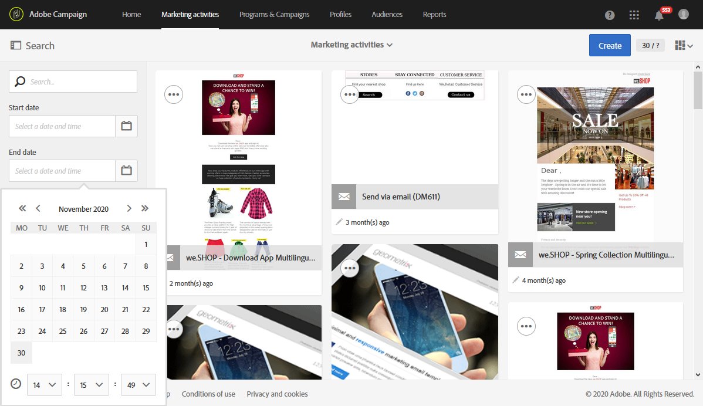

# Adobe Campaign Standard でのアクセシビリティ {#accessibility-acs}

Adobe Campaign Standard Workspace でのアクセシビリティのサポートについて説明します。

アクセシビリティとは、視覚、聴覚、認知、運動などの障害を持つユーザーに対して、製品を使用できるようにすることです。ソフトウェア製品のアクセシビリティ機能の例としては、意味的に構造化されたコンテンツ、スクリーンリーダーへの対応、グラフィックを表すテキスト、キーボードショートカットなどがあります。

Adobe Campaign Standard には、コントラスト、ラベル、構造化されたコンテンツ、キーボードナビゲーション、コンテキストヘルプなど、利用上のアクセシビリティを向上させる機能が用意されています。

## アクセシビリティ機能 {#accessibility-features}

### コントラストとカラー {#contrast}

Adobe Campaign Standard のユーザーインターフェイスは、アプリケーションのコントラストを十分な水準に高め、視力や色覚に障がいのあるユーザーに対して、アクセスしやすい視聴エクスペリエンスを提供します。

* 大きなテキストと見出しのコントラスト比が 3:1 を満たすよう改善されました。

  

* アプリケーション内のヘルプコンテンツと本文のテキストのコントラスト比が 4.5:1 を満たすよう更新されました。

* ワークフローの一時停止アイコンとキャンセルアイコンが更新され、背景色と前景色のコントラストが改善されました。

  

* アプリケーション内の情報や階層は、色、形状、表示場所以外の方法でも示されている場合があります。

### ユーザーインターフェイス {#user-interface}

Adobe Campaign Standard のユーザーインターフェイスは、視覚的要素に代替テキストを追加し、意味的構造を使用して視覚的およびプログラム的に情報を伝えることで、すべてのユーザーがコンテンツを簡単に操作できます。

* ユーザーが必須の ID フィールドを空白のままにすると、エラーのあるフィールドがエラーメッセージテキストとともに視覚的に示され、スクリーンリーダーなどの支援技術を利用するユーザーにも同じ情報がプログラム的に伝達されます。

  

* カーソルを合わせたときやフォーカスしたときに表示されるコンテンツは、ユーザーが閉じることができます。また、他のコンテンツがこれにより隠れることはありません。

  

* 画像の代替テキストとボタンのアクセシビリティ機能用の名前が追加され、要素を識別する視覚的な手掛かりに頼るだけでなく、支援技術を使用して読み上げることができます。

<!--
### Create responsive resize for multiple devices {#resize-devices}

When designing for multiple devices and platforms, it's important to create a seamless experience for screen sizes across mobile and desktop resolutions.

Adobe Campaign Standard allows you to design and test emails and push notifications on different devices such as: iPhone, Android devices, iPad, Android tablet and desktop.

-->

## コンテキストヘルプ {#contextual-help}

コンテキストヘルプは、様々な入力必須フィールドや使用可能な機能をより深く理解するのに役立ちます。また、製品ドキュメントの情報の中から、選択した機能に関する詳細情報を確認できます。

メールをデザインする際に、機能の説明と製品ドキュメントへのリンクを示すツールチップにアクセスできます。

## 支援技術のサポート {#screen-magnifiers}

改変されたキーボード、画面拡大ソフトウエア、スクリーンリーダー、音声認識ソフトウエアおよびその他の支援機器を含む様々な支援技術により、Adobe Campaign Standard アプリケーションを可能な限り利用できるように努めています。

## 設定言語での作業 {#languages}

Adobe Campaign Standard は、英語、フランス語、ドイツ語の各言語で使用できます。

言語はインストール時に設定され、後で変更することはできません。

## キーボードショートカット {#shortcuts}

### ホームページ {#homepage-shortcuts}

| アクション | ショートカット |
| --- | --- |
| ユーザーインターフェイスの個々の要素間を移動する | タブ |
| 選択した項目をアクティブにする | Enter またはスペースバー |

### E メールデザイナー {#email-designer-shortcuts}

| アクション | Windows ショートカット | macOS ショートカット |
| --- | --- | --- |
| 取り消し | Ctrl + Z | Command + Z |
| やり直し | Ctrl + Y | Shift + Command + Z |

### 動的レポート {#report-shortcuts}

| アクション | Windows ショートカット | macOS ショートカット |
| --- | --- | --- |
| プロジェクトを開く | Ctrl + O | Command + O |
| 保存 | Ctrl + S | Command + S |
| 名前を付けて保存 | Shift + Ctrl + S | Shift + Command + S |
| プロジェクトを更新 | Alt + R | Command + R |
| CSV ファイルのダウンロード | Shift + Ctrl + V | Shift + Command + V |
| 印刷 | Alt + P | Command + P |
| 取り消し | Ctrl + Z | Command + Z |
| やり直し | Ctrl + Y | Shift + Command + Z |
| 新しい空のパネル | Alt + B | Option + B |
| 新しいフリーフォーム | Alt + A | Option + A |
| 新しいフリーフォームテーブル | Alt + 1 | Option + 1 |
| 新しい行 | Alt + 2 | Option + 2 |
| 新しいバー | Alt + 3 | Option + 3 |
| 今すぐレポートを送信 | Alt + S | Option + S |
| スケジュールに従ってレポートを送信 | Shift + Alt + S | Shift + Option + S |
| 予定レポート | Shift + Alt + L | <!-- Should be 'Shift + Option + L ' but does not work on Mac --> |

## 参考資料 {#further-reading}

Adobe Campaign Standard では、誰でも使いやすくなるように、アクセシビリティの改善を進めています。

[アドビのアクセシビリティフィードバックフォーム](https://www.adobe.com/accessibility/feedback.html)を使用して、改善の提案とアクセシビリティに関する問題についてご意見をお寄せください。

また、[Adobe Campaign Standard のリリースノート](https://experienceleague.adobe.com/docs/campaign-standard/using/release-notes/release-notes.html?lang=ja#release-notes)を参照して、最新の改善点と機能をチェックしてください。
