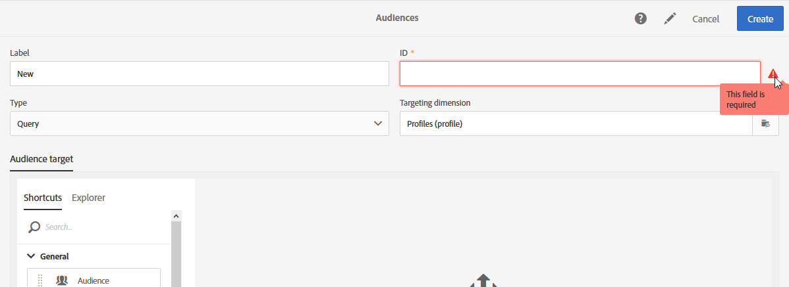

# Adobe Campaign Standard{#accessibility-acs}でのアクセシビリティ

Adobe Campaign Standardワークスペースでのアクセシビリティのサポートについて説明します。

アクセシビリティとは、視覚、聴覚、認知、モーターなどの障害を持つユーザーに対して、製品を使用できるようにすることです。 ソフトウェア製品のアクセシビリティ機能の例としては、スクリーンリーダーのサポート、グラフィックの代替テキスト、キーボードショートカット、表示色のコントラストの大きさの変更などがあります。

Adobe Campaign Standardには、コントラスト、キーボードナビゲーション、コンテキストヘルプ、レスポンシブサイズ変更など、使用しやすいツールがいくつか用意されています。

## アクセシビリティ機能{#accessibility-features}

### コントラスト{#contrast}

Adobe Campaign Standardのユーザーインターフェイスは、アプリケーションのコントラストを十分に抑え、視覚や色の不足が少ないユーザーに対して、アクセスしやすい表示体験を提供します。

* ワークフローの一時停止アイコンとキャンセルアイコンが更新され、背景と前景のコントラストが改善されました。

   

* 配信に成功した場合に表示されるテキストには、背景と前景のコントラストが不十分な大きな緑のテキストが含まれていました。 コントラストが3:1の最小比で更新されました。

   

* Adobe Campaign Standardでは、色、形状、位置が、情報や階層の伝達に使用される唯一の方法ではないことを確認します。

### ユーザーインターフェイス {#user-interface}

Adobe Campaign Standardユーザーインターフェイスを使用すると、前景と背景の分離、別のテキストの様々なボタンへの追加など、コンテンツの表示や視聴が容易になります。

* ユーザーが必須IDフィールドを空白のままにした場合、エラーメッセージテキストが表示され、エラーのあるフィールドが視覚的に示されます。

   

* カーソルを合わせたときやフォーカスしたときに表示されるコンテンツは、ユーザーによって閉じられる可能性があり、他のコンテンツを隠すことはできません。

   

* 画像ボタンの代替テキストが追加され、図を表示する代わりに読むことができます。

   

* リストを使用する場合、テーブルの隅にあるデータテーブルヘッダーのセルを空にすることはできません。

### 複数のデバイス向けにレスポンシブなサイズ変更を作成する{#resize-devices}

複数のデバイスやプラットフォーム向けにデザインする場合、モバイルとデスクトップの解像度での画面サイズにシームレスなエクスペリエンスを作成することが重要です。

Adobe Campaign Standardでは、次のような様々なデバイス上で電子メールやプッシュ通知を設計およびテストできます。iPhone、Androidデバイス、iPad、Androidタブレットおよびデスクトップ。

## コンテキストヘルプ{#contextual-help}

コンテキストヘルプは、要求された様々なフィールドや機能をより深く理解するのに役立ちます。 また、製品ドキュメントに関する情報もガイドし、選択した機能に関する詳細情報を確認できます。

電子メールをデザインする際に、情報ボタンの上にカーソルを置くことができます。 機能の説明と製品ドキュメントへのリンクを示すツールチップが表示されます。

## スクリーン拡大鏡のサポート{#screen-magnifiers}

スクリーンリーダーは、コンピューターの画面に表示されるテキストを読み上げます。 また、アクセシビリティタグや属性で指定された、アプリケーション内のボタンラベルや画像の説明など、テキスト以外の情報も読み上げます。

Adobe Campaign Standardでは、ユーザがテキスト間隔プロパティを上書きした場合でも、コンテンツと機能は引き続き利用できます。

## お使いの言語で作業{#languages}

Adobe Campaign Standardは様々な言語で提供されています。英語、フランス語、ドイツ語。

言語はインストール時に設定され、後で変更することはできません。

## キーボードショートカット{#shortcuts}

### ホームページ{#homepage-shortcuts}

| ショートカット | アクション |
|:-:|:-:|
| タブ | ユーザーインターフェイスの個々の要素間を移動する |
| EnterまたはSpace | 選択したアイテムをアクティブにする |

### 電子メールデザイナー{#email-designer-shortcuts}

| ショートカット | アクション |
|:-:|:-:|
| CTRL + Z | 取り消し |
| CTRL + Y | やり直し |

### 動的レポート{#report-shortcuts}

| ショートカット | アクション |
|:-:|:-:|
| CTRL + O | プロジェクトを開く |
| CTRL + S | 保存 |
| Shift + Ctrl + S | 名前を付けて保存 |
| Alt + R | プロジェクトの更新 |
| Shift + Ctrl + V | CSV をダウンロード |
| Alt + P | 印刷 |
| CTRL + Z | 取り消し |
| Ctrl + Shift + Z | やり直し |
| Alt + B | 新しい空のパネル |
| Alt + A | 新しいフリーフォーム |
| Alt + 1 | 新しいフリーフォームテーブル |
| Alt + 2 | 改行 |
| Alt + 3 | 新しいバー |
| Alt + S | レポートを今すぐ送信 |
| Shift + Alt + S | レポートをスケジュールに従って送信 |
| Shift = Alt + L | 予定レポート |

## {#further-reading}を読む

Adobe Campaign Standardは、増え続けるアクセシビリティの提供に取り組み、誰でも使いやすい製品です。

[Adobeのアクセシビリティフィードバックフォーム](https://www.adobe.com/accessibility/feedback.html)を使用して、改善の提案とアクセシビリティに関する問題をお送りすることをお勧めします。

また、[Adobe Campaign Standardのリリースノート](https://experienceleague.adobe.com/docs/campaign-standard/using/release-notes/release-notes.html?lang=en#release-notes)を参照して、最新の改善点と機能に従ってください。