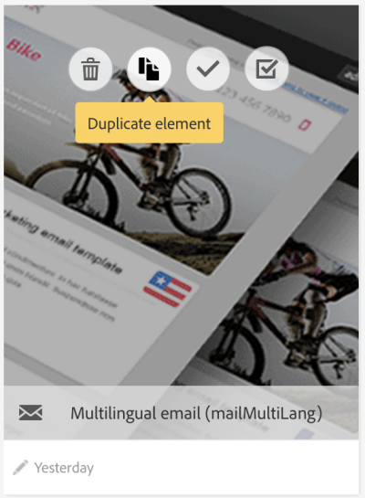

# Creating a multilingual template{#creating-a-multilingual-template}

多言語テンプレートは、多言語メッセージを管理するための特定テンプレートです。

This kind of template is available for **Email and SMS messages** and useable in standalone mode, within a workflow or in a recurring delivery.

多言語機能テンプレートでは、言語管理はバリアントに基づいています。**各バリアントは1つの言語を表します。**

Adobe Campaign Standardでは、最大40個のバリアントを設定できます。

Adobe Campaignには、ENに設定されているデフォルトの言語が付属しています。デフォルトの言語は別のバリアントに変更できますが、削除しないでください。

テンプレートの作成時に、メッセージに必要な言語の数に対応するバリアントの数を追加できます。

SMSまたは電子メールテンプレートを作成するには、次の手順に従います。

1. 既存の多言語テンプレート（SMSまたは電子メール）を複製します。

   

   >[!NOTE]
   >
   >You can also modify an existing standard template in a multilingual template by clicking on the **[!UICONTROL Initialize content variant]** button in the template properties.

1. ラベル、トラッキングなどをカスタマイズするプロパティを変更します。
1. バリアントタイルをクリックして、目的のバリアントの数を変更します。バリアントウィンドウが表示されます

   

   バリアントを追加または削除できます。To add a variant, complete the **[!UICONTROL New content variant]** window.

   

   >[!NOTE]
   >
   >"default"バリアントは、プロファイルに送信されたバリアントではなく、プロファイルに送信されないようにしてください。

1. 必要に応じてラベルバリアントをカスタマイズし、確認をクリックします。
1. また、各バリアントのコンテンツを直接追加することもできます。

これで、この多言語テンプレートに基づいて電子メールまたはSMSメッセージを作成する準備が整いました。

**関連トピック:**

* [多言語電子メールの作成](../../channels/using/creating-a-multilingual-email.md)
* [プロファイルの作成](../../audiences/using/creating-profiles.md)

