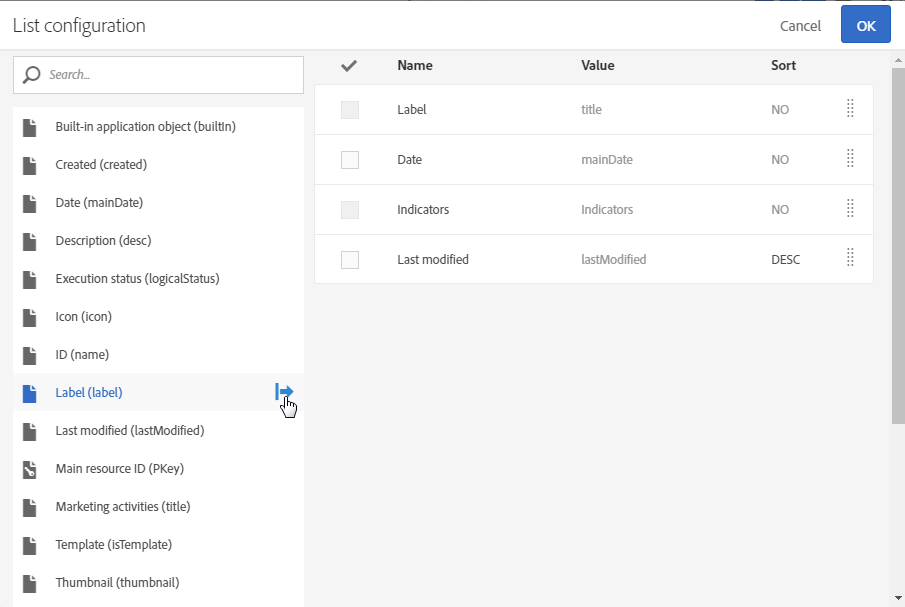

# リストのカスタマイズ{#customizing-lists}

**リスト**&#x200B;の画面では、1つまたは複数の特定のリソースの要素を表示できます。

Adobe Campaignには、次の2種類のリストがあります。

* 単一タイプのリソースを含む&#x200B;**homogeneous** リスト。 例えば、プロファイルリストにはプロファイルのみが含まれます。
* 複数のタイプのリソースが含まれている場合の&#x200B;**異種** リスト。 たとえば、マーケティング活動のリストには、ランディングページ、ワークフロー、電子メール、SMSなどが含まれます。

リストは複数の列で表示されます。 各列は、昇順または降順に1つずつ並べ替えることができます。

リスト内の要素には、選択できるチェックボックスがあります。 1つまたは複数の要素を選択すると、これらの要素の編集、複製、削除など、いくつかのアクションを実行できます。

リスト内の要素にカーソルを合わせると、**クイックアクション**。 これらのアクションを使用すると、ユーザーはカーソルを合わせた要素に対して、編集、選択、削除、詳細の表示など、様々なアクションを実行できます。

リスト内の列を表示するかどうかを設定することもできます。 列を追加または削除するには：

1. 画面が&#x200B;**リスト** モードであることを確認してください。

   

1. アクションバーの ボタンを選択して、リスト設定ウィンドウに移動します。

   

1. リストに含める列を追加します。 これを行うには、ウィンドウの左側から列を選択し、アクションバーの ボタンを使用して列を追加します。

   選択可能な列は、リストリソースに対応します。

   追加された各列について、デフォルトで並べ替えを適用するかどうかを指定します。

   * **[!UICONTROL NO]**：列にソートがありません
   * **[!UICONTROL ASC]**：列に昇順（上昇）ソートを適用します
   * **[!UICONTROL DESC]**：列に降順（辞退）の並べ替えを適用します。

1. 削除する列に対応するチェックボックスをオンにして、表示しない列を削除します。 次に、アクションバーの「」ボタンを使用して、削除を確認します。
1. リストに正しい列が含まれたら、移動する列を確認して、リストに表示される順序を変更できます。 次に、との矢印を使用します。
1. **[!UICONTROL OK]**&#x200B;を選択して、リストの設定を確認します。

これで、設定したリストが表示されます。
