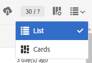

# リストのカスタマイズ{#customizing-lists}

**** リスト画面では、1つまたは複数のリソースの要素を表示できます。

Adobe Campaignには次の2種類のリストがあります。

* **同質**&#x200B;リスト。単一のタイプのリソースが含まれる場合です。 例えば、プロファイルリストにはプロファイルのみが含まれます。
* **異種**&#x200B;リスト。複数のタイプのリソースが含まれる場合です。 例えば、マーケティングアクティビティのリストには、ランディングページ、ワークフロー、Eメール、SMSなどが含まれます。

リストが列に表示されます。 各列は、昇順または降順で並べ替えることができます。

リスト内の要素には、選択できるチェックボックスがあります。 1つまたは複数の要素を選択することで、これらの要素の編集、複製、削除など、複数のアクションを実行できます。

リスト内の要素の上にマウスポインターを置くと、**クイックアクション**&#x200B;が表示されます。 これらのアクションを使用すると、編集、選択、削除、詳細の表示など、マウスポインターを置いた要素に対する様々なアクションを実行できます。

また、リスト内の列を表示するかどうかを設定できます。 列を追加または削除するには：

1. 画面が&#x200B;**リスト**&#x200B;モードであることを確認します。

   

1. リスト設定ウィンドウに移動するには、アクションバーの「」ボタンを選択します。

   

1. リストに含める列を追加します。 これをおこなうには、ウィンドウの左側から列を選択し、アクションバーのボタンを使用して列を追加します。

   選択可能な列は、リストリソースに対応します。

   追加された各列に対して、デフォルトで並べ替えを適用するかどうかを指定します。

   * **[!UICONTROL NO]**:列の並べ替えなし
   * **[!UICONTROL ASC]**:昇順（昇順）の並べ替えを列に適用します
   * **[!UICONTROL DESC]**:列に降順（降順）並べ替えを適用します。

1. 削除する列に対応するボックスをオンにして、表示しない列を削除します。 次に、アクションバーのボタンを使用して、削除を確定します。
1. リストに正しい列が含まれたら、移動する列をチェックして、リストに表示される列の順序を変更できます。 次に、と矢印を使用します。
1. 「**[!UICONTROL OK]**」を選択して、リストの設定を確認します。

これで、リストは設定どおりに表示されます。
