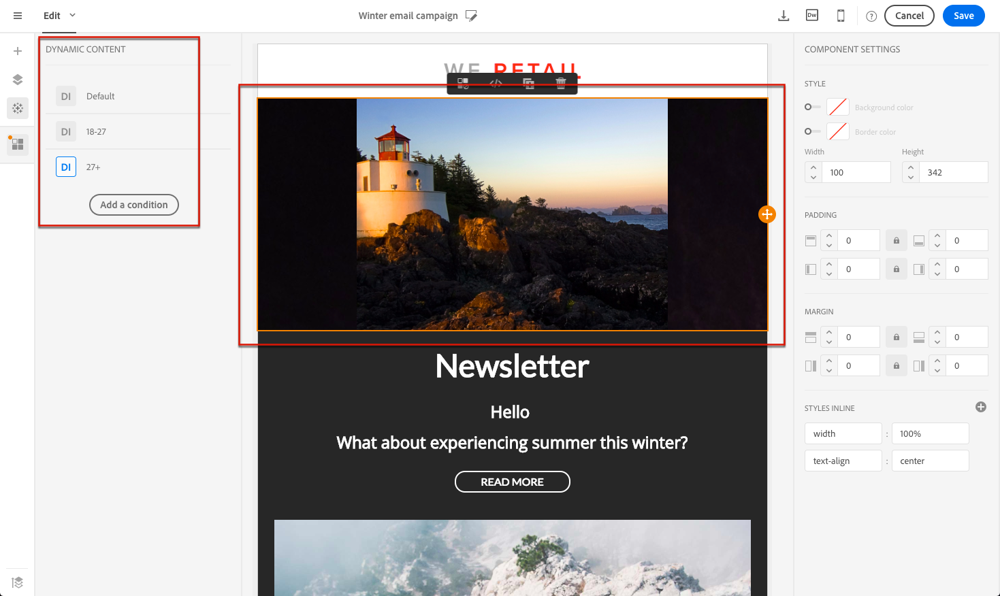
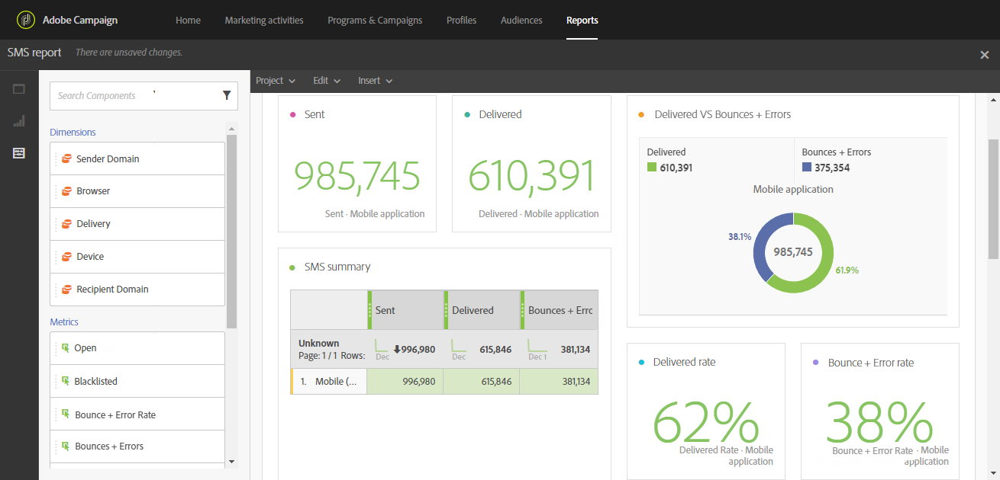

# メッセージのデザインと送信

<table>
<tr>
    <td valign="top">
        
    </td>
    <td valign="top">
        
    </td>
    <td valign="top">
        
    </td>
    <td valign="top">
        
    </td>
    <td valign="top">
        
    </td>
</tr>
<tr>
<td>配信のデザイン</td>
<td>配信の作成</td>
<td>パーソナライズとダイナミックな配信体験</td>
<td>配信の追跡と監視</td>
<td>レポートの設定</td>
</tr>
</table>

## 配信のデザイン

Lorem ipsum dolor sit amet, consectetur adipiscing elit. Vestibulum placerat mauris libero, non congue sapien rhoncus id. 整数luctus blandit ligula. Nulla quis vehicle augue, a lacinia risus. Nunc pharetra fringilla enim eu suscipit. Mauris consectetur maximus euismod. 車の運行状況。 Aenean tellus quam, tristique quis risus consectetur, pulvinar elementum dui.

**詳細情報**

* xxxx
* xxxx

## 配信の作成

Lorem ipsum dolor sit amet, consectetur adipiscing elit. Vestibulum placerat mauris libero, non congue sapien rhoncus id. 整数luctus blandit ligula. Nulla quis vehicle augue, a lacinia risus. Nunc pharetra fringilla enim eu suscipit. Mauris consectetur maximus euismod. 車の運行状況。 Aenean tellus quam, tristique quis risus consectetur, pulvinar elementum dui.

**詳細情報**

* xxxx
* xxxx

## パーソナライズとダイナミックな配信体験

顧客のプロファイル、好み、アクティビティに応じてパーソナライズされたコンテンツやヘッダーを活用することで、顧客の関心を惹きつけ、応答率を向上させることができます。 あらゆるクライアント情報がAdobe Campaignに一元管理され、様々なチャネルを通じて、適切なコンテンツを含むメッセージを提供できます。

パーソナライズされたメッセージは、関連性の高いコンテンツを配信し、パーソナライズされた体験を提供し、開封率とコンバージョン率を向上させる鍵となります。 Adobe Campaignが配信するクロスチャネルメッセージは、様々な方法でパーソナライズできます。 プロファイルに応じた基準と組み合わせることができます。 以下を行うことができます。

* メッセージに[動的パーソナライゼーションフィールド &#x200B;](../../designing/using/personalization.md#inserting-a-personalization-field)を挿入します
* [定義済みのパーソナライゼーションブロックを挿入](../../designing/using/personalization.md#adding-a-content-block)
* [電子メールまたはSMSの送信者](../../designing/using/subject-line.md)をパーソナライズする
* [電子メールの件名をパーソナライズ &#x200B;](../../designing/using/subject-line.md)
* ランディングページ [&#128279;](../../channels/using/designing-a-landing-page.md#defining-dynamic-content-in-a-landing-page)の電子メール [&#128279;](../../designing/using/personalization.md#defining-dynamic-content-in-an-email)またはに条件付きコンテンツを作成
* SMS メッセージまたはプッシュ通知に[動的テキスト &#x200B;](../../channels/using/defining-dynamic-text.md)を挿入する

**詳細情報**

* [&#x200B; エンドツーエンドのサンプル &#x200B;](../../designing/using/personalization.md#example-email-personalization)を通じて、メールのパーソナライゼーションを確認します
* [URLのパーソナライズ](../../designing/using/personalization.md#personalizing-urls)
* [画像のパーソナライゼーションの設定](../../designing/using/personalization.md#personalizing-an-image-source)

## 配信の追跡と監視

Adobe Campaign では、すぐに使える強力なレポートテンプレートに加えて、配信、キャンペーン、ユーザー、セグメントのいずれかのレベルでカスタムレポートを作成できます。 メッセージを追跡し、プロファイルデータを段階的に充実させることで、顧客の行動を把握できます。 レポートおよび分析ツールを使用して、新しいキャンペーンを最大限に活用し、マーケティング活動をより適切にターゲティングして、その影響と投資回収率を最適化できます。

グラフィカルインターフェイスでは、主要な指標と配信統計に素早く簡単にアクセスできます。

キャンペーンレポートのユーザーインターフェイスにより、動的レポートの作成が容易になります。 ドラッグ＆ドロップ変数を使用して、レポートをカスタマイズしたり、キャンペーンが成功するかどうかを分析したりできます。 クエリや計算の複雑さに応じて、データをリスト表示に集計したり、マーケティング分析レポートを簡単に生成できる形式でデータにアクセスしたりできます。

Adobe Campaignでは、個々の配信を監視および追跡できます。 メッセージダッシュボードには、フォローアッププロセス、ルール、考えられるエラーや警告の特定に専用のログが表示されます。

**詳細情報**

* [レポートへのアクセス](../../reporting/using/about-dynamic-reports.md)
* [配信の監視](../../sending/using/monitoring-a-delivery.md)
* [メッセージのトラッキング](../../sending/using/tracking-messages.md)

## レポートの設定

Lorem ipsum dolor sit amet, consectetur adipiscing elit. Vestibulum placerat mauris libero, non congue sapien rhoncus id. 整数luctus blandit ligula. Nulla quis vehicle augue, a lacinia risus. Nunc pharetra fringilla enim eu suscipit. Mauris consectetur maximus euismod. 車の運行状況。 Aenean tellus quam, tristique quis risus consectetur, pulvinar elementum dui.

**詳細情報**

* xxxx
* xxxx
