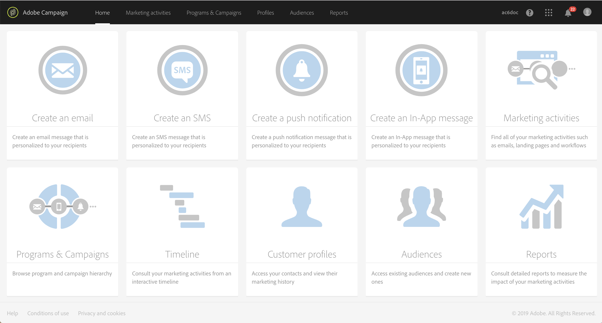
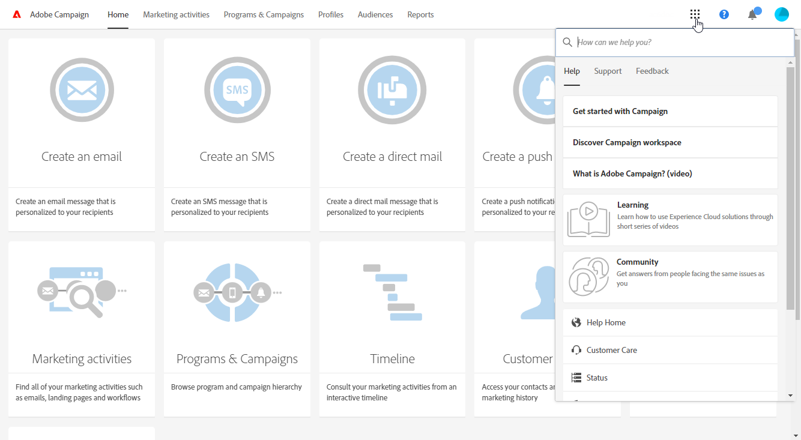
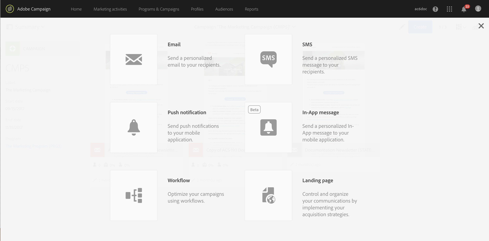
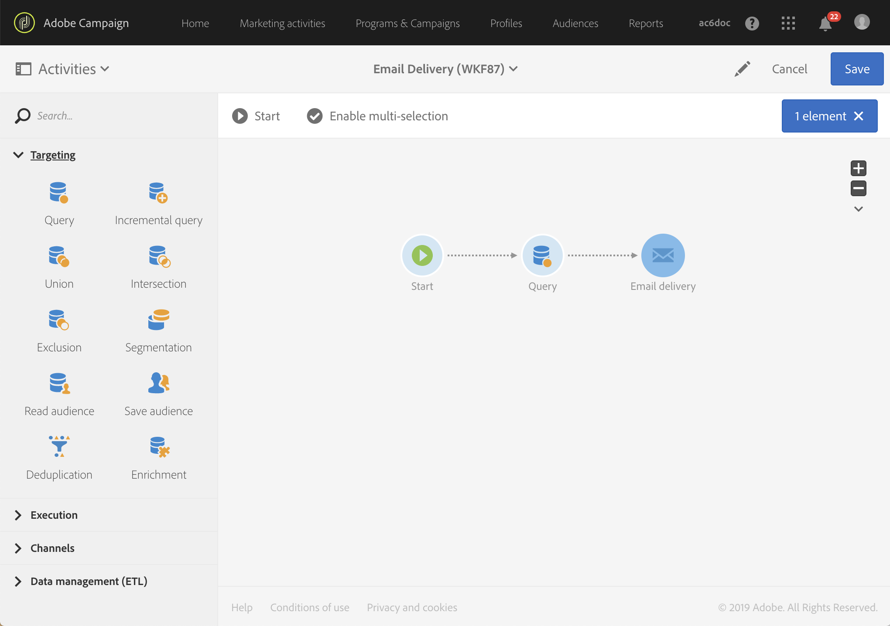
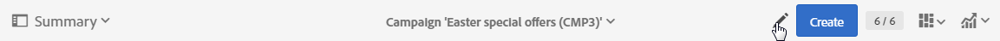

# インターフェイスの説明{#interface-description}

Adobe Campaign を使用すると、様々なメニューや画面を移動してキャンペーンを管理できます。

すべての Adobe Campaign 画面は、以下の要素で構成されています。

* ナビゲーション用の上部バー
* 特定の機能と設定にアクセスするための高度なメニュー
* 特定の要素を操作する中央ゾーン
* 表示された要素内のフィルタリングや検索をおこなうための、コンテキストに応じた画面左のパネル

## ホームページ {#home-page}

Campaign ホームページは、主な Adobe Campaign 機能にすばやくアクセスできるカードのセットで構成されています。 表示される内容は、権限と組織に設定されているオプションによって異なります。

* 「**[!UICONTROL Create an email]**」カードを選択すると、メール作成アシスタントが表示されます。 このアシスタントでは、メールのタイプの選択、メッセージ受信者の選択、コンテンツの定義をおこなうことができます。 [メールの作成](../../channels/using/creating-an-email.md)の節を参照してください。
* 「**[!UICONTROL Create an SMS]**」カードを選択すると、SMS 作成アシスタントが表示されます。 このアシスタントでは、SMS のタイプの選択、メッセージ受信者の選択、コンテンツの定義をおこなうことができます。 [SMS の作成](../../channels/using/creating-an-sms-message.md)の節を参照してください。
* 「**[!UICONTROL Create a Direct mail]**」カードを選択すると、ダイレクトメール作成アシスタントが表示されます。 [ダイレクトメールの作成](../../channels/using/creating-the-direct-mail.md)を参照してください。
* 「**[!UICONTROL Create a push notification]**」カードを選択すると、通知作成アシスタントが表示されます。 このアシスタントではプッシュ通知のタイプの選択、メッセージ受信者の選択、コンテンツの定義をおこなうことができます。 [プッシュ通知の作成](../../channels/using/preparing-and-sending-a-push-notification.md)を参照してください。
* **[!UICONTROL Create an In-App message]** カードを使用すると、アプリ内作成アシスタントに移動します。 このアシスタントを使用すると、作成するアプリ内メッセージのタイプを選択し、プロパティ、オーディエンス、コンテンツを定義できます。 「[ アプリ内メッセージの作成](../../channels/using/about-in-app-messaging.md)」セクションを参照してください。
* 「**[!UICONTROL Marketing activities]**」カードを選択すると、すべてのアクティビティ、プログラムおよびキャンペーン、特にメール、SMS、ワークフロー、ランディングページの一覧が表示されます。 ここから、名前、日付、ステータスまたはアクティビティタイプで検索して、要素をフィルタリングできます。 詳しくは、[マーケティングアクティビティリスト](../../start/using/marketing-activities.md#about-marketing-activities)の節を参照してください。
* 「**[!UICONTROL Programs & campaigns]**」カードを選択すると、キャンペーンを作成、管理できるプログラムのリストに移動します。 [プログラムリスト](../../start/using/programs-and-campaigns.md#about-plans--programs-and-campaigns)を参照してください。
* 「**[!UICONTROL Timeline]**」カードを使用すると、マーケティングアクティビティのインタラクティブなタイムラインに直接移動し、進行中のプログラムとそのコンテンツを参照することができます。 [タイムライン](../../start/using/timeline.md)を参照してください。
* 「**[!UICONTROL Customer profiles]**」カードを選択すると、プロファイルのリストに直接移動します。 ここから、リスト内の各プロファイルに関するイベントを参照できます。 [プロファイルの管理](../../audiences/using/about-profiles.md)を参照してください。
* 「**[!UICONTROL Audiences]**」カードを選択すると、オーディエンスのリストに直接移動します。 ここから、既存のオーディエンスにアクセスしたり、新しいオーディエンスを作成したりできます。 [オーディエンスの管理](../../audiences/using/about-audiences.md)を参照してください。

## 上部バー {#top-bar}

上部のバーは、すべての画面に表示され、Adobe Campaignの機能を操作したり、接続されたAdobe プロファイル、通知、Adobe Experience Cloud ソリューション、Campaign ドキュメントにアクセスしたりできます。

ナビゲーションは原則として次のとおりです。

* ページの左上隅にある&#x200B;**Adobe** ロゴを使用すると、高度な機能と設定にアクセスできます。 表示されるメニューは、プロファイルと権限に応じて異なります。

  詳細設定メニューについては、[詳細設定メニュー](#advanced-menu)の節を参照してください。

* 「**[!UICONTROL Home]**」リンクをクリックすると、Adobe Campaign ホームページが表示されます。
* 「**[!UICONTROL Marketing activities]**」、「**[!UICONTROL Programs & Campaigns]**」、「**[!UICONTROL Profiles]**」、「**[!UICONTROL Audiences]**」、「**[!UICONTROL Reports]**」の各リンクをクリックすると、これらの機能にリンクされた画面にアクセスできます。
* **ソリューションスイッチャー** アイコンを使用すると、組織を切り替えたり、別のアプリケーションに切り替えたりできます。
* **[!UICONTROL Help]** アイコンについては、[以下](#help)で説明しています。
* **通知**&#x200B;アイコンには、最新のアラートまたは情報が表示されます。
* **ユーザー**&#x200B;アイコンをクリックすると、ユーザープロファイルにリンクされた情報を表示できます。 **[!UICONTROL Sign out]**&#x200B;が必要な場合は、このアイコンを使用します。

### ヘルプ {#help}

右上隅の&#x200B;**Help** アイコンは、Adobe Experience Leagueを製品に取り込みます。

**[!UICONTROL Search]** フィールドを使用してガイダンスを見つけます。 検索結果には、ドキュメントやヘルプ記事、コミュニティフォーラムの結果、ビデオコンテンツなどが含まれており、より多くのコンテンツに簡単にアクセスして、アプリケーションを最大限に活用することができます。

3つのタブでヘルプと支援を見つけることができます。

1. 「**[!UICONTROL Help]**」タブには次が含まれます。
   * コンテキストリンク付きのAdobe Campaign Standardドキュメントにすばやくアクセスできます。
   * Adobe Campaign コースライブラリにアクセスできる&#x200B;**[!UICONTROL Learning]** リンク。
   * campaignの質問に特化したフォーラムにアクセスするための&#x200B;**[!UICONTROL Community]** リンク。
   * ヘルプセンター、カスタマーケア、Experience Cloud製品ステータス、デベロッパーとの連携、リリースノート、リリースプランニング、および&#x200B;**[!UICONTROL About]**&#x200B;画面への直接アクセス。
1. 「**[!UICONTROL Support]**」タブでは、サポートケースを開き、電話またはX （旧Twitter）でお問い合わせください。
1. 「**[!UICONTROL Feedback]**」タブを使用すると、問題の報告やアイデアの共有が簡単になります。

## 詳細設定メニュー {#advanced-menu}

各画面の左上隅にある&#x200B;**Adobe Campaign** アイコンをクリックすると、詳細メニューが表示されます。 詳細設定メニューは、契約内容やユーザー権限によって異なる場合があります。

このメニューを使用すると、特定の機能や設定に移動できます。

### マーケティングプラン {#marketing-plans}

**[!UICONTROL Marketing plans]**&#x200B;アイコンをクリックすると、次の機能にアクセスできます。

* **[!UICONTROL Marketing activities]**：詳しくは、[マーケティングアクティビティリスト](../../start/using/marketing-activities.md#about-marketing-activities)の節を参照してください。
* **[!UICONTROL Programs & Campaigns]**：詳しくは、[プログラムリスト](../../start/using/programs-and-campaigns.md#about-plans--programs-and-campaigns)の節を参照してください。
* **[!UICONTROL Timeline]**：詳しくは、[タイムライン](../../start/using/timeline.md)の節を参照してください。
* **[!UICONTROL Transactional messages]**（サブメニュー&#x200B;**[!UICONTROL Deliveries]**&#x200B;および&#x200B;**[!UICONTROL Event configuration]**&#x200B;を含む）：詳しくは、[トランザクションメッセージ](../../channels/using/getting-started-with-transactional-msg.md)の節を参照してください。

### プロファイルとオーディエンス {#profiles-e-audiences}

**[!UICONTROL Profiles & audiences]**&#x200B;アイコンを使用すると、次の機能にアクセスできます。

* **[!UICONTROL Profiles]**：詳しくは、[プロファイルの管理](../../audiences/using/about-profiles.md)の節を参照してください。
* **[!UICONTROL Test profiles]**：詳しくは、[テストプロファイルの管理](../../audiences/using/managing-test-profiles.md)の節を参照してください。
* **[!UICONTROL Audiences]**：詳しくは、[オーディエンスの管理](../../audiences/using/about-audiences.md)の節を参照してください。
* **[!UICONTROL Services]**&#x200B;詳しくは、[サービスの作成](../../audiences/using/creating-a-service.md)の節を参照してください。

### リソース {#resources}

**[!UICONTROL Resources]**&#x200B;アイコンを使用すると、次の機能にアクセスできます。

* **[!UICONTROL Templates]**（テンプレートタイプ別のサブメニューを含む）：詳しくは、[テンプレートの管理](../../start/using/marketing-activity-templates.md)の節を参照してください。
* **[!UICONTROL Content blocks]**：詳しくは、[コンテンツブロックの追加](../../designing/using/personalization.md#adding-a-content-block)の節を参照してください。
* **[!UICONTROL Content templates & fragments]**：詳しくは、[コンテンツテンプレート](../../designing/using/using-reusable-content.md#content-templates)の節を参照してください。

### 管理 {#administration}

**[!UICONTROL Administration]**&#x200B;アイコンを使用すると、機能管理者のみが実行できる高度な機能にアクセスできます。 詳しくは、[管理](../../administration/using/get-started-campaign-administration.md)の節を参照してください。

## セントラルゾーン {#central-zone}

ユーザーインターフェイスの中央には、要素のリストやカードのセットなどを含んだ動的ゾーンがあります。 既存の要素を編集したり、リソースを作成したりできます。

中央ゾーンのコンテンツと表示形式は次のように異なる場合があります。

* プログラム、キャンペーン、プロファイルなどのさまざまな要素を表示する&#x200B;**リスト**。これらの要素は、**[!UICONTROL Card]**&#x200B;または&#x200B;**[!UICONTROL List]** モードで表示できます。 モード切り替えボタンで切り替えます。 各要素には、インジケーターが表示されます。

  

  カウンターを使用すると、要素の数を把握できます。 この数が 30 を超える場合は、カウンターをクリックして合計数を確認する必要があります。

* **ダッシュボード**：アクティビティにリンクされているすべてのパラメーターの概要が表示されます。 この画面には、異なる概念を分けて個別に設定できるインタラクティブゾーンが含まれています。

  

* 要素の作成時に複数のオファーが可能な場合は、追加する要素のタイプ（キャンペーン、配信）を&#x200B;**選択画面**&#x200B;で選択できます。 この選択画面は、レポートへのアクセスにも使用できます。

  

* ワークフローとクエリエディターについては、パレットを含んだ&#x200B;**ワークスペース**&#x200B;でオブジェクトをデザインできます。

  パレットから要素をワークスペースにドラッグ＆ドロップして設定します。

  

## アクションバー {#action-bar}

表示された画面のタイプに応じて、画面にリンクされたアクションを含んだバーが上部に表示されます。

このバーには、検索やフィルターなどの一般的な操作だけでなく、表示される画面に関する操作も含まれています。

* **ワークスペース**&#x200B;タイプの画面に関連するアクションについては、ワークフローの[アクションバー](../../automating/using/workflow-interface.md#action-bar)の節を参照してください。
* **ダッシュボード**&#x200B;画面に関連するアクションについて詳しくは、[メッセージダッシュボード](../../channels/using/message-dashboard.md)の節を参照してください。
* **リスト**&#x200B;タイプの画面に関するアクションについては、以下の[リストのカスタマイズ](../../start/using/customizing-lists.md)の節を参照してください。
