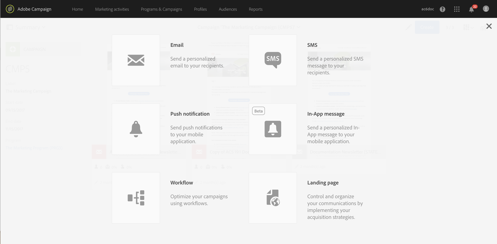

# インターフェイスの説明{#interface-description}

Adobe Campaignでは、様々なメニューや画面を移動してキャンペーンを管理できます。

Adobe Campaignのすべての画面は、次の要素で構成されています。

* ナビゲーション用のトップバー
* 特定の機能と設定にアクセスするための詳細メニュー
* 特定の要素で動作する中央ゾーン
* 表示された要素内でフィルタリングや検索を行う、コンテキストに応じた横置きパネル。

## ホームページ {#home-page}

ホームページは、Adobe Campaignの主要な機能にすばやくアクセスできるカードのセットで構成されています。 キャンペーンのホームページに表示される容量のリストは、貴社の権限と組織に設定されているオプションによって異なります。

* このカ **[!UICONTROL Create an email]** ードを使用すると、電子メール作成アシスタントに移動します。 このアシスタントでは、電子メールの種類の選択、メッセージの受信者の選択、コンテンツの定義を行うことができます。 「電子メールの作 [成」の節を参照](../../channels/using/creating-an-email.md) 。
* このカ **[!UICONTROL Create an SMS]** ードにSMS作成アシスタントが表示されます。 このアシスタントでは、SMSの種類の選択、メッセージの受信者の選択、コンテンツの定義を行うことができます。 「SMSの作成」の節 [を参照してください](../../channels/using/creating-an-sms-message.md) 。
* カード **[!UICONTROL Create a Direct mail]** を使用すると、ダイレクトメール作成アシスタントが表示されます。 「ダイレクトメ [ールの作成](../../channels/using/creating-the-direct-mail.md) 」を参照。
* カード **[!UICONTROL Create a push notification]** を使用すると、通知作成アシスタントが表示されます。 このアシスタントでは、プッシュ通知の種類を選択し、メッセージの受信者を選択して、コンテンツを定義できます。 プッシュ通知の作 [成の節を参照してください](../../channels/using/preparing-and-sending-a-push-notification.md) 。
* このカ **[!UICONTROL Create an InApp message]** ードにInApp作成アシスタントが表示されます。 このアシスタントでは、作成するInAppメッセージの種類を選択し、そのプロパティ、オーディエンスおよびコンテンツを定義できます。 InAppメッセージの作 [成の節を参照してください](../../channels/using/about-in-app-messaging.md) 。
* このカ **[!UICONTROL Marketing activities]** ードでは、すべてのアクティビティ、プログラム、キャンペーン、特に電子メール、SMS、ワークフロー、ランディングページの完全なリストが表示されます。 ここから、名前、日付、ステータスまたはアクティビティタイプで検索し、要素をフィルタリングできます。 詳しくは、「マーケティングアクティビティリスト」の節 [を参照してくださ](../../start/using/marketing-activities.md#about-marketing-activities) い。
* このカ **[!UICONTROL Programs & campaigns]** ードを使用すると、キャンペーンを作成および管理できるプログラムのリストが表示されます。 「プログラム」リ [ストを参照](../../start/using/programs-and-campaigns.md#about-plans--programs-and-campaigns)。
* このカ **[!UICONTROL Timeline]** ードを使用すると、マーケティング活動のインタラクティブなタイムラインに直接移動し、進行中のプログラムとそのコンテンツを参照できます。 タイムラインを参 [照してくださ](../../start/using/timeline.md)い。
* カード **[!UICONTROL Customer profiles]** を使用すると、プロファイルの一覧が直接表示されます。 ここから、リスト内の各プロファイルに関するイベントを参照できます。 詳しくは、プロファ [イルの管理を参照](../../audiences/using/about-profiles.md)。
* カード **[!UICONTROL Audiences]** を使用すると、オーディエンスのリストに直接移動します。 ここから、既存のオーディエンスにアクセスし、新しいオーディエンスを作成できます。 オーディエンスの管 [理を参照してくださ](../../audiences/using/about-audiences.md)い。

## トップバー {#top-bar}

上部バーはすべての画面に表示され、Adobe Campaignの機能内を移動したり、接続されたAdobeプロファイル、通知、その他のAdobe Experience Cloudのサービスとソリューション、ドキュメントにアクセスしたりできます。

ナビゲーションの原則は次のとおりです。

* ペー **[!UICONTROL Adobe Campaign]** ジの左上隅にあるロゴを使用すると、高度な機能と設定にアクセスできます。 メニューは、プロファイルと権限によって異なります。

   詳細メニューは、[詳細]メニューのセクショ [ンに表示され](#advanced-menu) ます。

* このリ **[!UICONTROL Home]** ンクを使用すると、Adobe Campaignのホームページを表示できます。
* 、、およ **[!UICONTROL Marketing activities]**&#x200B;びリン **[!UICONTROL Programs & Campaigns]**&#x200B;クを使 **[!UICONTROL Profiles]**&#x200B;用して、これらの機能にリン **[!UICONTROL Audiences]****[!UICONTROL Reports]** クされたビューにアクセスできます。
* このボ **[!UICONTROL Help]** タンを使用すると、製品のドキュメントやコンテキストヘルプ、リリースノート、バージョン番号、法律上の注意、Adobe Experience Cloudコミュニティおよびカスタマーケアへのリンクにアクセスできます。
* 組織ボタン
* ソリュー **ション切り替え** アイコンを使用すると、別のAdobe Experience Cloudソリューションに切り替えることができ、また、プロファイル設定に切り替えることができます。
* 通知アイ **コンに** 、最新のアラートまたは情報が表示されます。
* ユーザ **ー** アイコンを使用すると、プロファイルにリンクされた情報を表示できます。 ボタンにアクセスで **[!UICONTROL Sign out]** きます。

### ヘルプ {#help}

* **[!UICONTROL Search]** ドキュメント、記事、ビデオを取得し、ソリューション別にコンテンツをフィルターできます。

* **[!UICONTROL Help]** タブ
   * リンクを使用すると、参照しているページに関連する記事、ドキュメント、ビデオにすばやくアクセスできます。
   * **[!UICONTROL Learning]** このリンクをクリックすると、エクスペリエンスリーグにアクセスできます。
   * **[!UICONTROL Community]** このリンクを使用すると、ACSに関する質問専用のフォーラムにアクセスできます。

* **[!UICONTROL Support]** タブを使用すると、サポートチケットを作成し、電話またはTwitterでお問い合わせいただけます。

* **[!UICONTROL Feedback ]** タブでは、ソリューションに関する問題やアイデアを共有できます。

   

## 詳細メニュー {#advanced-menu}

各画面の左上隅にある **Adobe Campaign** アイコンをクリックして、詳細メニューを表示します。 詳細メニューは、契約やユーザー権限によって異なる場合があります。

このメニューを使用すると、特定の機能と設定に移動できます。

### マーケティングプラン{#marketing-plans}

このア **[!UICONTROL Marketing plans]** イコンを使用すると、次の機能にアクセスできます。

* **[!UICONTROL Marketing activities]**  — 詳しくは、「マーケティングアクティビティリスト」の節 [を参照してください](../../start/using/marketing-activities.md#about-marketing-activities) 。
* **[!UICONTROL Programs & Campaigns]**  — 詳細は、「プログラムリスト」を参照 [してください](../../start/using/programs-and-campaigns.md#about-plans--programs-and-campaigns) 。
* **[!UICONTROL Timeline]**  — 詳しくは、「タイムライン」の節を参照し [てください](../../start/using/timeline.md) 。
* **[!UICONTROL Transactional messages]**（サブメニューとを含む）を参照し **[!UICONTROL Deliveries]** てく **[!UICONTROL Event configuration]** ださい。詳しくは、「トランザクションメッセージング  」の節を参照してください。

### プロファイルとオーディエンス {#profiles-e-audiences}

このア **[!UICONTROL Profiles & audiences]** イコンを使用すると、次の機能にアクセスできます。

* **[!UICONTROL Profiles]**  — 詳細は、「プロファイルの管理」の節を参照 [してください](../../audiences/using/about-profiles.md) 。
* **[!UICONTROL Test profiles]**  — 詳しくは、「テストプロファイルの管理」の節 [を参照してください](../../audiences/using/managing-test-profiles.md) 。
* **[!UICONTROL Audiences]**  — 詳しくは、「オーディエンスの管理」の節を参 [照してください](../../audiences/using/about-audiences.md) 。
* **[!UICONTROL Services]**  — 詳しくは、「サービスの作成」の節を [参照してください](../../audiences/using/creating-a-service.md) 。

### リソース {#resources}

このア **[!UICONTROL Resources]** イコンを使用すると、次の機能にアクセスできます。

* **[!UICONTROL Templates]**&#x200B;各タイプのテンプレートのサブメニューが含まれています。詳しくは、「テンプレートの管理」の節を参照 [してください](../../start/using/marketing-activity-templates.md) 。
* **[!UICONTROL Content blocks]**  — 詳しくは、「コンテンツブロックの追加」 [の節を参照してください](../../designing/using/personalization.md#adding-a-content-block) 。
* **[!UICONTROL Content templates & fragments]**  — 詳しくは、「コンテンツテンプレート」の節を参 [照してください](../../designing/using/using-reusable-content.md#content-templates) 。

### 管理 {#administration}

このア **[!UICONTROL Administration]** イコンを使用すると、機能管理者のみが実行できる高度な機能にアクセスできます。 For more on this, refer to the [Administration](../../administration/using/about-administrating-adobe-campaign.md) section.

## 中心領域 {#central-zone}

ユーザーインターフェイスの中央ゾーンは、例えば、要素のリストやカードのセットを含む動的ゾーンです。 既存の要素を編集し、リソースを作成できます。

中央ゾーンのコンテンツと表示形式は、次のように異なる場合があります。

* プログ **ラム** 、キャンペーン、プロファイルなど、様々な要素を示すリスト。 これらの要素は、またはモードで表 **[!UICONTROL Card]** 示で **[!UICONTROL List]** きます。 切り替えモードボタンを使用して、切り替えを行います。 各要素にはインジケータが表示されます。

   

   カウンターを使用すると、要素の数を把握できます。 この数が30を超える場合は、このカウンタをクリックして合計数を取得する必要があります。

* アクティビティ **にリンクされた** 、すべてのパラメーターの概要を示すダッシュボード。 この画面には、異なる概念を個別に分離し、設定できるインタラクティブゾーンが含まれています。

   

* 要素の作成時に複数のオファーが可能な場合は、 **選択画面で** 、追加する要素のタイプ（キャンペーン、配信）を選択できます。 この選択画面は、レポートにアクセスするためのものです。

   

* ワークフローとクエリーエディターでは **** 、パレットを含むワークスペースを使用してオブジェクトを設計できます。

   パレットから要素をワークスペースにドラッグ&amp;ドロップして、問題の要素を設定できます。

   

## アクションバー {#action-bar}

表示された画面の種類に応じて、画面にリンクされたアクションを含むバーが上部に表示されます。

このバーには、検索やフィルターなどの一般的なアクションだけでなく、表示される画面に関するアクションも含まれます。

* ワークスペースタイプの画 **面に関連するアクションについては** 、ワークフローの「アクショ [ンバー](../../automating/using/workflow-interface.md#action-bar) 」セクションを参照してください。
* ダッシュボード画面に関連 **するアクションについて** 、詳しくは「メッセージダッ [シュボード](../../channels/using/message-dashboard.md) 」の節を参照してください。
* リストタイプ画面に関連す **るアクションについて** 、下の「リストのカスタマ [イズ](../../start/using/customizing-lists.md) 」の節を参照してください。
