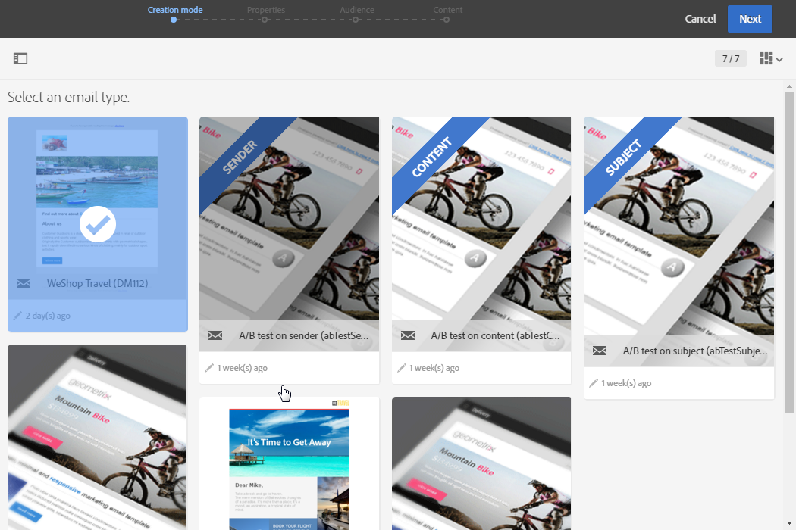
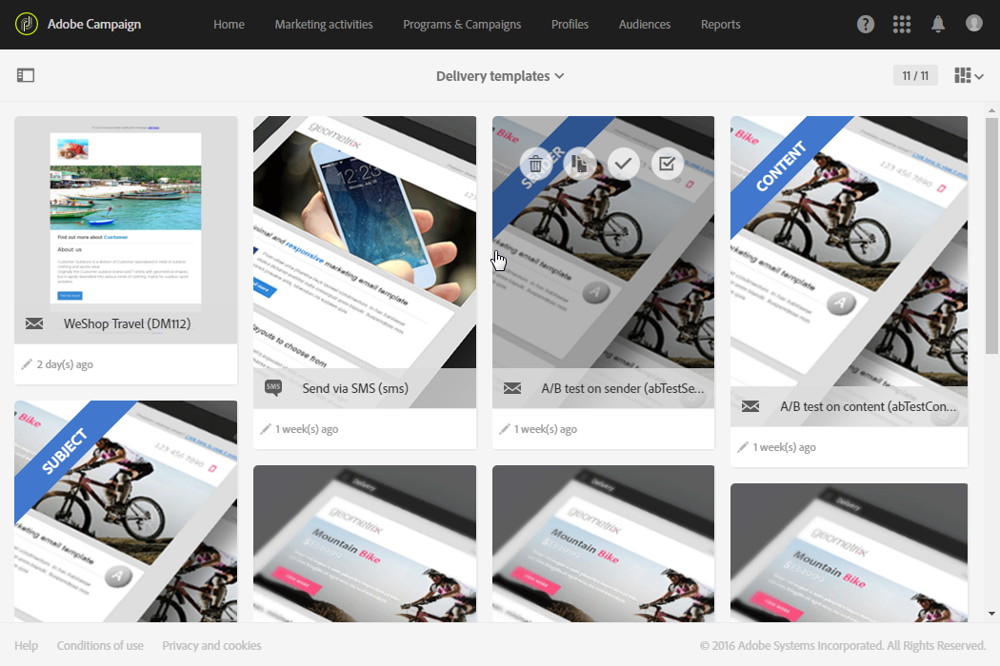
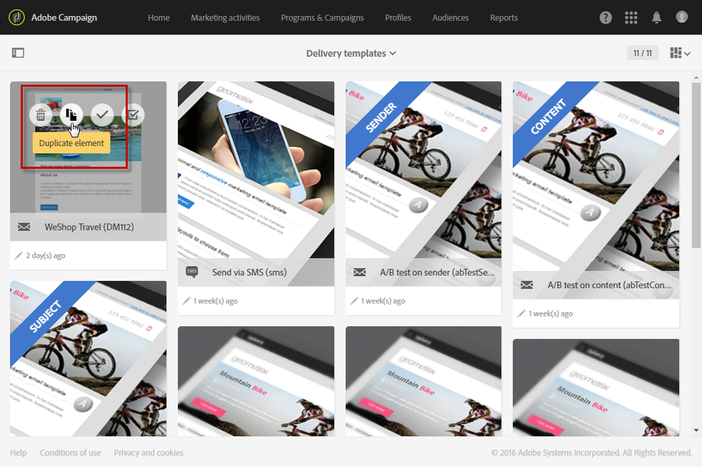
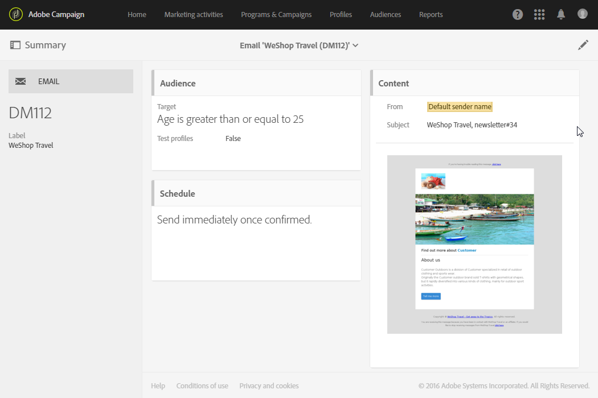
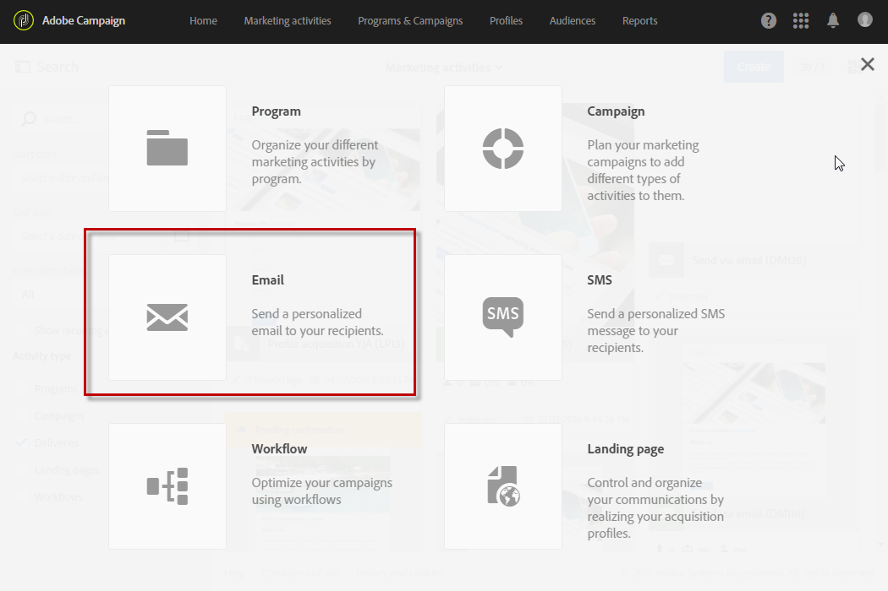
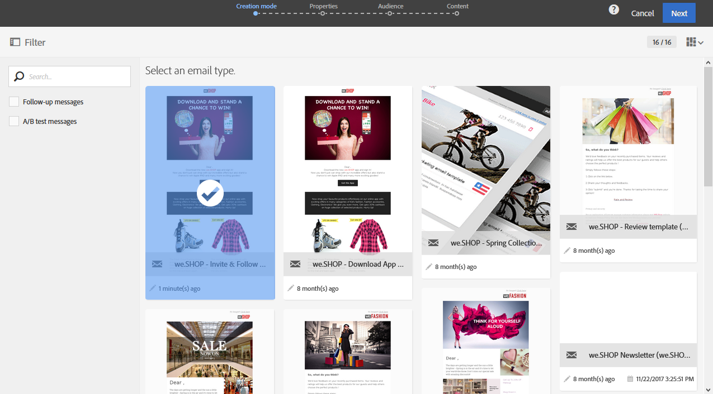
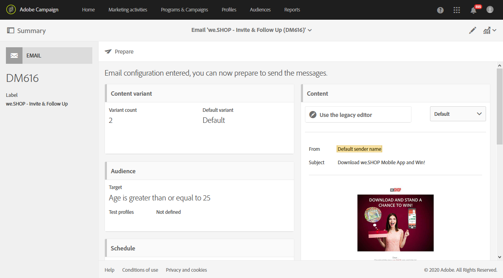

# マーケティングアクティビティテンプレート {#marketing-activity-templates}

## テンプレートについて {#about-templates}

新しいマーケティングアクティビティを作成する場合、ウィザードの最初の画面で、タイプまたはテンプレートを選択するように求められます。 テンプレートを使用すると、必要に応じて特定のパラメーターを事前設定できます。 テンプレートにはマーケティングアクティビティの完全な設定を保存したり、部分的な設定のみ保存したりできます。 テンプレート管理は、機能管理者が実行します。

エンドユーザーのインターフェイスは、シンプルなデザインになっています。 使用するテンプレートを選択するだけでマーケティングアクティビティを新規作成できるため、 技術的な設定について心配する必要はありません。 機能管理者によってテンプレートの事前設定が既に完了しています。

例えば、メールテンプレートの場合、HTML コンテンツ、オーディエンス、および配信のその他のパラメーター（スケジュール、テストプロファイル、配信の一般的なプロパティ、高度なパラメーターなど）を事前に入力できます。これにより、新しいアクティビティを作成する際の時間を節約できます。

マーケティングアクティビティのタイプごとに、最小限の設定が適用されている 1 つまたは複数の標準テンプレートが用意されています。 これらの標準テンプレートは、変更または削除できません。

テンプレートは、次のマーケティングアクティビティで使用できます。

* プログラム
* キャンペーン
* メール配信
* SMS 配信
* プッシュ通知
* ランディングページ
* ワークフロー
* サービス
* インポート
* トランザクションメッセージ

## 新しいテンプレートの作成 {#creating-a-new-template}

メッセージテンプレートは、プラットフォームの機能管理者が **[!UICONTROL Resources > Templates]** メニューで管理できます。 標準テンプレートは、変更または削除できません。 新しいテンプレートを作成するには、既存のテンプレートを複製する必要があります。

1. 既存のテンプレートを選択します。 この例では、**[!UICONTROL Delivery template]** を選択しています。

   

1. 該当するテンプレートにカーソルを合わせて、「**[!UICONTROL Duplicate element]**」オプションを選択します。

   

1. [新しいマーケティングアクティビティを一から作成](../../start/using/marketing-activities.md#creating-a-marketing-activity)する場合と同様に、任意の設定をおこないます。

   

作成したテンプレートは、マーケティングアクティビティの作成時に、ウィザードの最初の画面で標準ユーザーが選択できます。

## テンプレートの使用 {#using-a-template}

ここでは、前の節で作成したテンプレートの使用方法について説明します。

>[!NOTE]
>
>テンプレートに基づくマーケティングアクティビティの作成は、通常、標準タイプのプロファイルが設定されているユーザーが実行します。

1. 新しいマーケティングアクティビティを作成します。

   

1. ウィザードの最初の画面で、使用するテンプレートを選択します。

   

   マーケティングアクティビティは、テンプレートで定義されたパラメーターで事前設定されます。

   
