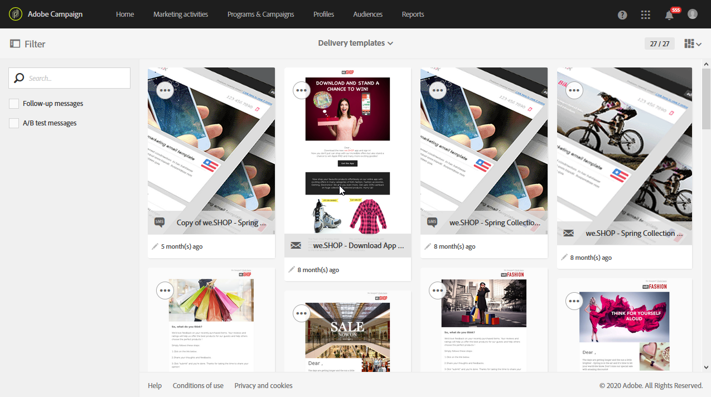

# マーケティング活動テンプレート {#marketing-activity-templates}

## テンプレートについて {#about-templates}

新しいマーケティングアクティビティを作成すると、ウィザードの最初の画面で、タイプまたはテンプレートを選択するよう求められます。 テンプレートを使用すると、ニーズに応じて特定のパラメーターを事前設定できます。 テンプレートには、マーケティングアクティビティの完全な設定または部分的な設定を含めることができます。 テンプレート管理は、機能管理者が実行します。

エンドユーザーのインターフェイスがシンプルになりました。 新しいマーケティングアクティビティを作成する場合は、使用するテンプレートを選択するだけで済みます。 技術的な設定について心配する必要はありません。 これは、テンプレートの機能管理者によって事前に設定されています。

例えば、電子メールテンプレートの場合、HTMLコンテンツ、オーディエンス、および配信のその他のパラメーターに事前入力できます。スケジュール、テストプロファイル、配信の一般的なプロパティ、高度なパラメーターなど これにより、新しいアクティビティを作成する際の時間を節約できます。

マーケティングアクティビティのタイプごとに、あらかじめ用意されている1つまたは複数のテンプレートを最小限の設定で使用できます。 これらの標準テンプレートは変更または削除できません。

テンプレートは、次のマーケティング活動で使用できます。

* プログラム
* キャンペーン
* E メール配信
* SMS配信
* プッシュ通知
* ランディングページ
* ワークフロー
* サービス
* インポート
* トランザクションメッセージ

## 新しいテンプレートの作成 {#creating-a-new-template}

メッセージテンプレートは、プラットフォームの機能管理者がメニューの下で管理で **[!UICONTROL Resources > Templates]**きます。 そのまま使用できるテンプレートは、変更または削除できません。 新しいテンプレートを作成するには、既存のテンプレートを複製する必要があります。

1. 既存のテンプレートを選択します。 この例では、を選択しました **[!UICONTROL Delivery template]**。

   

1. マウスでマウスポインターを置き、オプションを選択 **[!UICONTROL Duplicate element]**します。

   

1. 新しいマーケティングアクティビティを最初から作成する場合と同 [様に、必要な設定を行います](../../start/using/marketing-activities.md#creating-a-marketing-activity) 。

   

作成したテンプレートは、マーケティングアクティビティの作成時に、ウィザードの最初の画面で標準ユーザーが選択できます。

## テンプレートの使用 {#using-a-template}

ここでは、前の節で作成したテンプレートの使用方法について説明します。

>[!NOTE]
>
>テンプレートに基づくマーケティングアクティビティの作成は、通常、標準のユーザータイププロファイルによって実行されます。

1. 新しいマーケティングアクティビティを作成します。

   

1. ウィザードの最初の画面で、使用するテンプレートを選択します。

   

   マーケティングアクティビティは、テンプレートで定義されたパラメーターを使用して事前設定されます。

   
