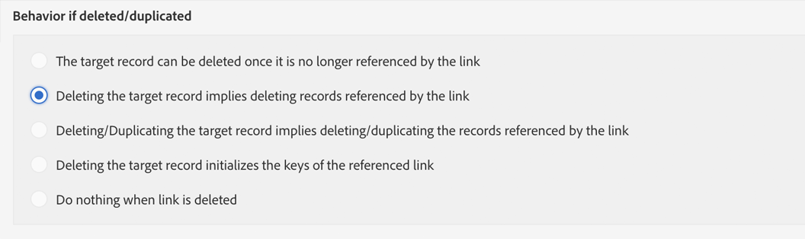

# プライバシーリクエストの管理 {#privacy-requests}

プライバシー管理に関する一般的なプレゼンテーションについては、[この節](../../start/using/privacy-management.md)を参照してください。

この情報は、GDPR、CCPA、PDPA、LGPD に適用されます。これらの規制について詳しくは、[こちら](../../start/using/privacy-management.md#privacy-management-regulations)を参照してください。

個人情報の販売のオプトアウト（CCPA に特有）については、[この節](#sale-of-personal-information-ccpa)を参照してください。

>[!IMPORTANT]
>
>19.4 以降、アクセス要求および削除要求に対する Campaign API およびインターフェイスの使用は廃止されます。GDPR、CCPA、PDPA、または LGPD のアクセス要求と削除要求に対しては、[Privacy Core Service](#create-privacy-request) 統合方法を使用する必要があります。

## プライバシーリクエストについて {#about-privacy-requests}

プライバシーの準備を容易にするために、Adobe Campaign でアクセス要求と削除要求の処理が可能になりました。**アクセス権利**&#x200B;と&#x200B;**忘れられる権利**（削除要求）については、[この節](../../start/using/privacy-management.md#right-access-forgotten)で説明しています。

これらの要求を実行するには、**Privacy Core Service** 統合を使用する必要があります。 Privacy Core Service からすべての Experience Cloud ソリューションにプッシュされたプライバシーリクエストは、専用のワークフローで Campaign によって自動的に処理されます。

### 前提条件 {#prerequesites}

Adobe Campaign には、Adobe Campaign に保存されているデータに対するプライバシーリクエストの作成と処理をおこなうためのデータ管理者用ツールが用意されています。ただし、データ主体とのやり取り（E メール、カスタマーサポート、Web ポータル）はデータ管理者がおこなう必要があります。

また、要求者であるデータ主体の身元の確認、および要求者に返されるデータがデータ主体に関するものであることの確認は、データ管理者がおこないます。

>[!NOTE]
>
>個人データおよびデータを管理する様々なエンティティ（データ管理者、データ処理者、データ主体）について詳しくは、[個人データとペルソナ](../../start/using/privacy.md#personal-data)を参照してください。

### 名前空間 {#namesspaces}

プライバシーリクエストを作成する前に、使用する名前空間を定義する必要があります。名前空間は、Adobe Campaign データベースでデータ主体を識別するために使用するキーです。標準では、E メールと携帯電話の 2 つの名前空間を使用できます。別の名前空間（例えば、プロファイルのカスタムフィールド）が必要な場合は、次の手順に従います。

名前空間の作成方法については、この[チュートリアル](https://experienceleague.adobe.com/docs/campaign-standard-learn/tutorials/privacy/namespaces-for-privacy-requests.html?lang=ja#privacy)も参照してください。

>[!NOTE]
>
>いくつかの名前空間を使用する場合、名前空間ごとに 1 つのプライバシーリクエストを作成する必要があります。

1. 左上隅の Adobe Campaign ロゴをクリックし、**[!UICONTROL Administration]** > **[!UICONTROL Namespaces]** を選択します。

   

1. 名前空間のリストで、「**[!UICONTROL Create]**」をクリックします。

   

1. **[!UICONTROL Label]** を入力します。

   

1. 既存の ID サービス名前空間を使用する場合は、「**[!UICONTROL Map from Identity Namespace Service]**」を選択し、**[!UICONTROL Identity Service Namespaces]** リストから名前空間を選択します。

   

   **[!UICONTROL Identity Service]** で新しい名前空間を作成し、Campaign でマッピングする場合 は、「**[!UICONTROL Create new]**」を選択して、「**[!UICONTROL Identity namespace name]**」フィールドに名前を入力します。

   

   ID 名前空間について詳しくは、[Experience Platform](https://experienceleague.adobe.com/docs/experience-platform/identity/namespaces.html?lang=ja) ドキュメントを参照してください。

1. ID サービスの 1 つの名前空間が Campaign の 1 つの名前空間にマッピングされます。Campaign での名前空間の紐付け方法を指定する必要があります。

   ターゲットマッピング（**[!UICONTROL Recipients]**、**[!UICONTROL Real-time event]** または **[!UICONTROL Subscriptions to an application]**）を選択します。 複数のターゲットマッピングを使用する場合は、ターゲットマッピングごとに 1 つの名前空間を作成する必要があります。

   

1. **[!UICONTROL Reconciliation key]** を選択します。 これは、Adobe Campaign データベースでデータ主体を識別するために使用されるフィールドです。

   

1. 「**[!UICONTROL Create]**」をクリックします。これで、新しい名前空間に基づいてプライバシーリクエストを作成できます。いくつかの名前空間を使用する場合、名前空間ごとに 1 つのプライバシーリクエストを作成する必要があります。

### プライバシーリクエストの作成 {#create-privacy-request}

>[!IMPORTANT]
>
>すべてのアクセス要求および削除要求に対して、**Privacy Core Service** 統合を使用する必要があります。
>
>19.4 以降、アクセス要求および削除要求に対する Campaign API およびインターフェイスの使用は廃止されます。GDPR、CCPA、PDPA または LGPD のアクセス要求および削除要求に対して、コア Privacy Service を使用します。 

Privacy Core Service 統合を使用すると、単一の JSON API の呼び出しで、複数のソリューションのコンテキストでプライバシーリクエストを自動化できます。Privacy Core Service からすべての Experience Cloud ソリューションにプッシュされたプライバシーリクエストは、専用のワークフローで Campaign によって自動的に処理されます。

Privacy Core Service からプライバシーリクエストを作成する方法については、[Experience Platform Privacy Service](https://experienceleague.adobe.com/docs/experience-platform/privacy/home.html?lang=ja) のドキュメントを参照してください。

Privacy Core Service の各ジョブは、使用されている名前空間の数に基づいて、Campaign の複数のプライバシーリクエストに分割されます。1 つの要求が 1 つの名前空間に対応します。また、1 つのジョブを複数のインスタンスで実行できます。 したがって、1 つのジョブに対して複数のファイルが作成されます。 例えば、リクエストに 2 つの名前空間があり、3 つのインスタンスで実行されている場合、合計 6 つのファイルが送信されます。 名前空間およびインスタンスごとに 1 つのファイル。

ファイル名のパターンは次のとおりです。`<InstanceName>-<NamespaceId>-<ReconciliationKey>.xml`

* **InstanceName**：Campaign インスタンス名
* **NamespaceId**：使用する名前空間の ID サービス名前空間 ID
* **紐付けキー**：エンコードされた紐付けキー

### リソースのリスト {#list-of-resources}

プライバシーリクエストに関連する削除またはアクセス要求の実行時に、プロファイルリソース（独自タイプ）にリンクされたすべてのリソースの&#x200B;**紐付け**&#x200B;値に基づいて、データ主体のすべてのデータを検索します。

以下に、プライバシーリクエストの実行時に考慮される標準のリソースのリストを示します。

* プロファイル（受信者）
* プロファイル配信ログ（broadLogRcp）
* プロファイルトラッキングログ（trackingLogRcp）
* 配信ログ（アプリケーションの購読）（broadLogAppSubRcp）
* トラッキングログ（アプリケーションの購読）（trackingLogAppSubRcp）
* アプリケーションの購読（appSubscriptionRcp）
* プロファイルの購読履歴（subHistoRcp）
* プロファイル購読（subscriptionRcp）
* 訪問者（visitor）

プロファイルリソース（独自タイプ）にリンクされるカスタムリソースを作成した場合は、そのリソースも考慮されます。例えば、プロファイルリソースにリンクしているトランザクションリソースと、そのトランザクションリソースにリンクしているトランザクション詳細リソースがある場合、両方のリソースが考慮されます。

また、カスタムリソースの修正方法に関する[このチュートリアル](https://experienceleague.adobe.com/docs/campaign-standard-learn/tutorials/privacy/custom-resources-for-privacy-requests.html?lang=ja#privacy)も参照してください。

これを機能させるには、カスタムリソースで「**[!UICONTROL Deleting the target record implies deleting records referenced by the link]**」オプションを選択する必要があります。

1. 左上隅の Adobe Campaign ロゴをクリックし、**[!UICONTROL Administration]** > **[!UICONTROL Development]** > **[!UICONTROL Custom resources]**&#x200B;を選択します。

1. プロファイルリソース（独自タイプ）にリンクされるカスタムリソースを選択します。

1. 「**[!UICONTROL Links]**」セクションをクリックします。

1. リンクごとに、鉛筆アイコン（**[!UICONTROL Edit properties]**）をクリックします。

1. 「**[!UICONTROL Behavior if deleted/duplicated]**」セクションで、「**[!UICONTROL Deleting the target record implies deleting records referenced by the link]**」オプションを選択します。

   

### プライバシーリクエストのステータス {#privacy-request-statuses}

プライバシーリクエストには、次のようなステータスがあります。

* **[!UICONTROL New]** / **[!UICONTROL Retry pending]**：ワークフローは進行中で、リクエストの処理は完了していません。
* **[!UICONTROL Processing]** / **[!UICONTROL Retry in progress]**：ワークフローはリクエストを処理しています。
* **[!UICONTROL Delete pending]**：ワークフローにおいて、削除対象のすべての受信者データが特定済みです。
* **[!UICONTROL Delete in progress]**：ワークフローは削除を処理しています。
   <!--**[!UICONTROL Delete Confirmation Pending]** (Delete request in 2-steps process mode): the workflow has processed the Access request. Manual confirmation is requested to perform the deletion. The button is available for 15 days.-->
* **[!UICONTROL Complete]**：リクエストの処理が完了しました。エラーは発生していません。
* **[!UICONTROL Error]**：ワークフローにおいて、エラーが発生しました。理由は、「**[!UICONTROL Request status]**」列の「プライバシーリクエスト」リストに表示されます。 例えば、**[!UICONTROL Error data not found]** は、データ主体の&#x200B;**[!UICONTROL Reconciliation value]** に一致する受信者データがデータベース内に見つからないことを意味します。

### 2 段階プロセスの無効化 {#disabling-two-step-process}

Core Privacy Service は、2 段階プロセスをサポートしていません。

>[!IMPORTANT]
>
>Core Privacy Service 統合を使用してプライバシーリクエストを管理する前に、Campaign Standard インターフェイスから削除要求の 2 段階プロセスを無効にする必要があります。

このオプションを無効にしないと、Privacy Core Service で管理されるすべての削除要求は保留状態のままとなり、完了しません。

デフォルトでは、2 段階プロセスが有効になっています。

このモードを変更するには、**[!UICONTROL Edit properties]**」をクリックし、 **[!UICONTROL Privacy Requests]** 画面の右上隅にある「**[!UICONTROL Activate the 2-step process]**」オプションの選択を解除します。

## 個人情報の販売のオプトアウト（CCPA）{#sale-of-personal-information-ccpa}

**カリフォルニア州消費者プライバシー法**（CCPA）は、カリフォルニア州民に個人情報に関する新しい権利を提供し、カリフォルニア州でビジネスをおこなう特定の事業者に対してデータ保護の責任を課します。

アクセスリクエストおよび削除リクエストの設定および使用方法は、GDPR と CCPA で共通です。この節では、CCPA に固有の個人データ販売のオプトアウトについて説明します。

Adobe Campaign が提供する[同意管理](../../start/using/privacy-management.md#consent-management)ツールに加えて、消費者が個人情報の販売をオプトアウトしたかどうかをトラッキングすることもできます。

消費者は、システムを通じて自分の個人情報が第三者に販売されることを許可しないことを決定します。Adobe Campaign では、この情報を保存してトラックできます。

>[!NOTE]
>
>Campaign インターフェイスおよび API を介して個人情報の販売のオプトアウトを活用できます。 Privacy Core Service を通じて使用することはできません。

>[!IMPORTANT]
>
>データ主体のリクエストを受け取り、CCPA のリクエスト日を追跡するのは、データ管理者の責任です。 アドビはテクノロジープロバイダーとして、オプトアウトの方法を提供するだけです。 データ管理者としての役割について詳しくは、[個人データとペルソナ](../../start/using/privacy.md#personal-data)を参照してください。

### カスタムテーブルの前提条件 {#ccpa-prerequisite}

19.4 以降、Campaign インターフェイスおよび API で、「**[!UICONTROL CCPA Opt-Out]**」フィールドが標準で提供されます。デフォルトでは、このフィールドは標準の **[!UICONTROL Profile]** リソースで使用できます。

カスタムプロファイルリソースを使用する場合は、リソースを拡張し、フィールドを追加する必要があります。次のように、あらかじめ用意されているフィールドとは別の名前を使用することをお勧めします。例：**[!UICONTROL Opt-Out for CCPA]**（optoutccpa）。新しいフィールドが作成されると、Campaign API によって自動的にサポートされます。

プロファイルリソースを拡張する方法について詳しくは、[この節](../../developing/using/extending-the-profile-resource-with-a-new-field.md)を参照してください。

>[!NOTE]
>
>リソースの変更は機密性の高い操作です。この操作は、エキスパートユーザーのみが実行する必要があります。

1. **[!UICONTROL Administration]** > **[!UICONTROL Development]** > **[!UICONTROL Custom Resources]**&#x200B;に移動してください。カスタムプロファイルリソースをクリックします。リソースの拡張について詳しくは、[この節](../../developing/using/creating-or-extending-the-resource.md)を参照してください。

   

1. 「**[!UICONTROL Add field]**」または「**[!UICONTROL Create Element]**」をクリックし、ラベルと ID を追加して、**[!UICONTROL Boolean]** タイプを選択します。 名前には、「**CCPA のオプトアウト**」を使用します。ID には、次を使用します。**optOutCcpa**。

   

1. 「**[!UICONTROL Screen definition]**」タブの「**[!UICONTROL Detail screen configuration]**」で、フィールドを追加して **[!UICONTROL Input field]** を選択します。 これにより、プロファイルリストおよび詳細でフィールドが使用可能になります。画面定義の設定について詳しくは、[この節](../../developing/using/configuring-the-screen-definition.md)を参照してください。

   

1. **[!UICONTROL Administration]** > **[!UICONTROL Development]** > **[!UICONTROL Publishing]** に移動し、パブリッシュを準備して変更を公開します。 リソースの公開について詳しくは、[この節](../../developing/using/updating-the-database-structure.md)を参照してください。

   

1. フィールドがプロファイルの詳細で使用可能なことを確認します。 詳しくは、[この節](#usage)を参照してください。

### 使用状況 {#usage}

フィールドの値を入力し、データ販売に関する CCPA ガイドラインおよびルールに従うことは、データ管理者の責務です。

値はいくつかの方法で入力できます。

* 受信者の詳細を編集することによる Campaign のインターフェイスの使用（以下を参照）
* Campaign プライバシー API の使用（[API ドキュメント](../../api/using/managing-ccpa-opt-out.md)を参照）
* データインポートワークフローの使用

次に、オプトアウトしたプロファイルの個人情報を第三者に販売しないようにする必要があります。

1. Campaign のインターフェイスで、プロファイルを編集してオプトアウトステータスを変更します。

   

1. フィールドの値が **[!UICONTROL True]** の場合、情報はプロファイルの詳細に表示されます。

   

1. プロファイルリストを設定して、「オプトアウト」列を表示できます。 リストの設定方法については、[この節](../../start/using/customizing-lists.md)を参照してください。

   

1. 列をクリックすると、オプトアウト情報に従って受信者を並べ替えることができます。

   
