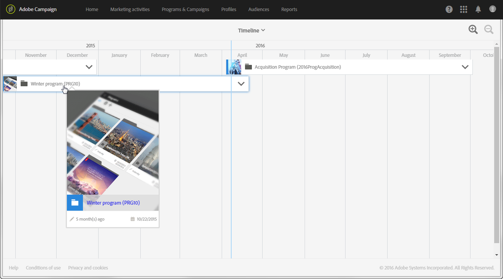
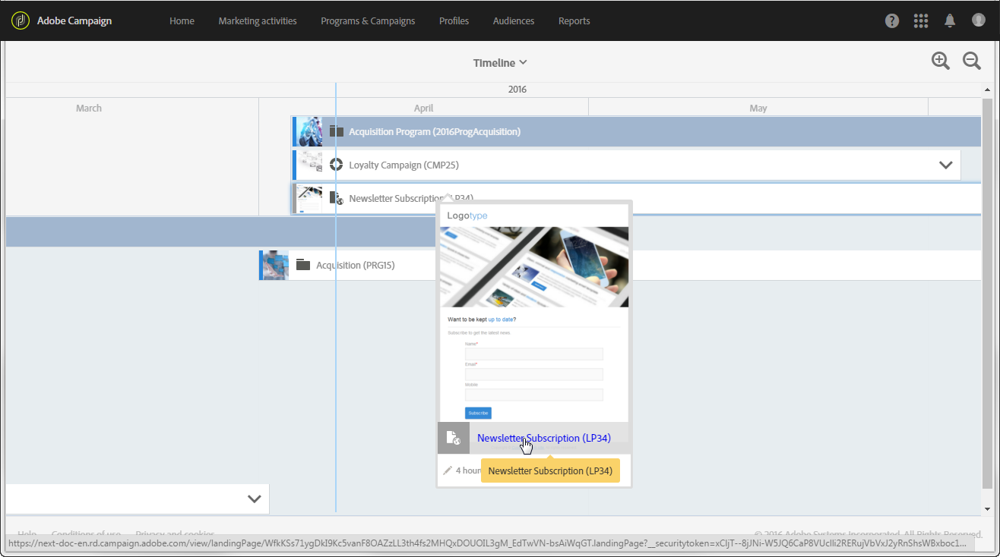

# タイムライン{#timeline}

**[!UICONTROL Timeline]**&#x200B;により、進行中のプログラムとそのコンテンツを視覚化できます。

タイムラインにアクセスするには、ホームページで対応するカードをクリックします。

デフォルトの場合、タイムラインには単にプログラムの詳細が表示され、定義された開始日から終了日までの間の時系列が示されます。

各プログラムは、それぞれ対応するサムネールとラベルがが表示されたボックスで表されます。 表示する画面のサイズと要素の数に応じて、このラベルをプログラム ID に変更することも可能です。

青い縦線は、現在の日付を示す時系列マーカーです。 デフォルトでは、画面の中央に置かれます。 画面上で左右にスクロールすると、表示期間を変更することができます。

アイコンを使用して、以下を行います。

* 日が表示されるまで、より限られた期間で周囲を減らすか、詳細レベルを上げます
* は周囲を増やすか、より大きな時間枠を表示します

各プログラム名の右にある矢印をクリックして、対応するコンテンツを表示します。 プログラムには、サブプログラム、キャンペーン、ランディングページを含めることができます。 キャンペーンは、プログラムと同じ方法でデプロイされ、内部にメール、SMS、ランディングページを組み込むことができます。

>[!NOTE]
>
>ワークフローには日付に関する特定の概念がないため、タイムラインには表示されません。

プログラムやキャンペーンのコンテンツが表示されている場合、対応するボックスが青に変わり、右側の矢印が逆になります。 矢印を再度クリックすると、コンテンツが非表示になります。

各要素には、それぞれのタイプに対応するアイコンがあります。

*  プログラム
*  キャンペーン
*  ランディングページ
* 通のメール
*  SMS
*  プッシュ通知

各ボックスの左の境界線にある色付きの線は、関連する要素のステータスを示しています。

* 要素がまだ開始されていない場合、線はグレーになります。
* 要素が進行中の場合、線は青色で表示されます。
* 要素が完了すると、線が緑色に変わります。

プログラム、または表示されたその他の要素をクリックすると、対応するカードが表示されます。 次にそのカードをクリックすると、選択された要素のコンテンツに直接アクセスし、変更することができます。

画面内の任意の場所をクリックすると、カードが非表示になります。
